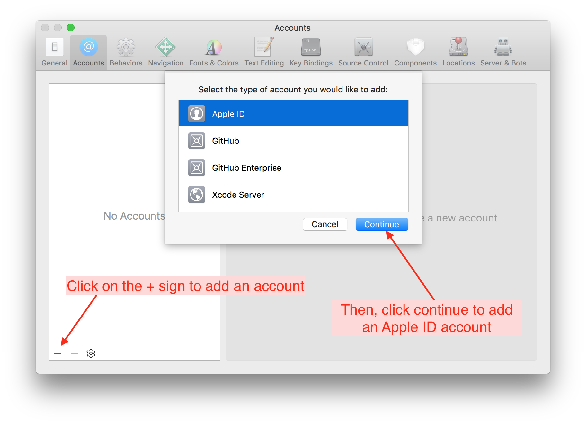

## Xcode Settings

!!! info "Time Estimate"
    - about 10-15 minutes to install the Command Line Tools
    - 5 minutes to add your Apple ID, assuming you remember your password

!!! abstract "Summary"
    - Verify that Command Line Tools are installed: Xcode-> Settings -> choose Locations tab.
    - Add your Apple ID:  Xcode-> Settings -> choose Accounts tab.

!!! question "FAQs"
    - **"I still only see an account with `(personal team)` beside it even though I enrolled in the paid Developer Account program...what should I do?"** You should check your spam email box in case Apple sent you an email there. Make sure you've waited the 48 hours that Apple says it may take to get your account approved. If it's been 48 hours and you still don't see anything in your email, contact Apple support and ask them about the status of your enrollment. It may be held up by something on their end.

## Xcode Version

Open Xcode from your Applications folder. If it offers to start a new project with you, just close that window.

Click on the Xcode->About Xcode menu item. The version number is displayed.

## Privacy Settings

This is not typical, but it does happen.

Some people have their macOS privacy settings configured so that *Xcode* does not have permission to access their `~/Downloads` folder. This will cause a lot of grief when trying to use the Build Select Script to build an app with *Xcode*. This will be mentioned on the build errors page, but this is a good time to check. The graphic below has steps labeled 1 through 4 to guide you to the setting that must be enabled for you to build the app with *Xcode*.

{width="750"}
{align="center"}

## watchOS Simulators

Yes, watchOS simulators are required to build Loop. If Xcode asks if you want to download them - say yes. It's slow but you cannot build Loop without the simulator.

*   Refer to [New with Xcode 14](../build/build-errors.md#new-with-xcode-14){: target="_blank" } for more information

## Command Line Tools

The very first time you open Xcode it may install a package of command line tools. Wait patiently until it finishes.  The command line tools may have installed without asking.

* Check that your Command Line Tools installed correctly.
    - First, open Xcode Settings
        * Click on the word **`Xcode`** in the top menu bar (just to the right of the Apple icon in the upper-left corner) and select `Settings` in the dropdown menu
    - Then select the `Locations` tab in the Settings window to see the dropdown menu for Command Line Tools.  Make sure the Xcode version listed matches what you just installed (not the version in this graphic)
* If it's blank, use the blue arrows to the right of the Command Line Tools row to select it

{width="750"}
{align="center"}

## Add Apple ID

Go to the Xcode Settings window from above, click on the `Accounts` tab and then press the &plus; in the lower-left corner to add an Apple ID account.

{width="750"}
{align="center"}

### Xcode Accounts Tab

The Xcode Accounts Tab, shown in the graphic (from Xcode 13) below allows you to have more than one account available to choose from when you sign your targets (another new term that is explained later).  Normally, you would only have one.

In the graphic, whichever item is selected on the left side (highlighted by Xcode in blue) shows up with more details on the right side of the display. If the Free account had been selected, the information shown in the red inset would have been displayed.

!!! info "Free and Paid"
    The graphic below shows examples for a paid account and a free account. You will only see one.

### Free Developer Account

If you want to use a free developer account, you will simply enter your Apple ID in this section and Xcode will automatically enroll your Apple ID in the free developer program. It will show up with the `(Personal Team)` and `User` indication.

### Paid Developer Account

If you enrolled in the paid account already and have confirmation that your account is active, enter the Apple ID of the paid developer account. It will show up with just your name and the `Admin` indication. If you have enrolled and are waiting, the `(Personal Team)` and `User` indication shows up until the paid account is confirmed by Apple.

!!! note "Description"
    The description line is initially empty. You can add your own description or just leave the line blank. Text added to the decription line shows up in two places: To the left, just above the email address and to the right once that Apple ID is selected.

{width="750"}
{align="center"}

You are now done setting up Xcode.  Great job!  You will not need to redo the account setup steps on any subsequent builds or updates of your Loop app.  Xcode will remember these settings.

## Next Step: Build Loop

Now you are ready to [Build the *Loop* App](build-app.md).
