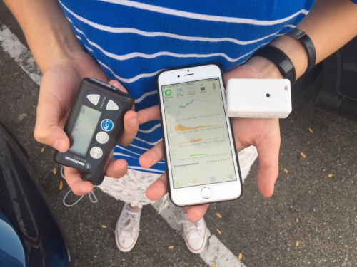

# General Loop FAQs

## What is Loop?

Click on the image below to watch a short [Introduction to Loop video](https://youtu.be/qw_u1lqboCs).

!!! warning "Old Video"
    * This video was created before the Omnipod version of Loop was released in April 2019 - so yes you can definitely use Omnipod Eros pumps
    * The menus have been rearranged slightly but the overall concept of how to use Loop is demonstrated in this video
    * The workout target shown in the video has been completely reworked as Overrides

[{width="600"}](https://youtu.be/qw_u1lqboCs)

## What do I need to Loop?

Loop has both hardware and software requirements. In general, to use Loop you need to have seven components.

- Compatible insulin pump: [Medtronic or Omnipod](../build/step3.md)
- [Compatible CGM](../build/step4.md)
- [RileyLink Compatible Device](../build/step5.md)
- [Compatible iPhone/iPod Touch](../build/step2.md)
- [Apple computer, typically Catalina macOS or newer](../build/step1.md#macos)
- [Xcode (a free Apple application)](../build/step8.md)
- [Apple Developer Membership](../build/step6.md)

{width="500"}
{align="center"}

## Can I download Loop from the App store?

No. Loop is not available for download. You must build your own Loop app. Loop app will not be available in the Apple App store because that would be distribution of a medical device, and we are not in that "business".  You can build yourself, but we are not distributors.

Each step needed to successfully build your Loop app is found in these docs. The harder part will be having the patience to read all the documents before you start. New Loop users are so excited to get started that they skip reading all the great info that these docs contain. So, as you begin the build...please include time to read the documents that follow what happens **after** you successfully build your Loop app.

If you have any questions, use the [Search](../index.md#how-to-use-these-docs) feature to find topics in LoopDocs.

## Can I use an android phone or iPad for Loop?

No, this is purely iPhone or iPod touch. The iPad does not support Apple Health which is required for Loop.

## Do I have to be "tech-smart" to build Loop?

No. You do not need any experience in code or computers to build Loop. If you have already owned an Apple computer and iPhone, you already have the required level of experience. Beyond that, simply read the directions slowly and diligently...all the information you will need are in these documents.

Often times the non-tech people do better than the tech people in building Loop. Why? Because the non-tech people take the time to read slowly and look at the screenshots in the directions. The tech people often skim read and miss sentences...which then leads to build errors that have to be retraced and fixed.

## Is there a cheat sheet for a school nurse to use?

Sure, you can give this one a try. [School nurse's cheat sheet download](https://github.com/Kdisimone/images/raw/master/school_nurse.pdf)

## How long does it take to build Loop?

The answer is varied, but a few hours from start to finish, depending on where you are starting and how comfortable you are with your computer.

If you'd rather break it up into several shorter bits of effort, the [`Build App`](../build/overview.md) section is divided into convenient stopping points with Time Estimates for each step. You can do one or more steps depending on what kind of time you have available.

## Does Loop cost money?

Yes, there are some costs, beyond the obvious costs of owning a pump and CGM.

There are several options for the [RileyLink Compatible Devices](../build/step5.md#rileylink-compatible-devices) at this time.  They typically cost around $150. This is a one-time cost and the devices should last for years (unless it goes swimming, goes through the wash, gets run over by a car, etc.). It's fine to buy one device and make sure you want to Loop, but if you can afford it, go on and get two or get two different kinds. Once you Loop, you'll want a backup. Because some of the newer versions have features some people prefer, you may find posts on [The Looped Facebook Group](https://www.facebook.com/groups/TheLoopedGroup) offering to sell their RileyLink for a reduced cost.

The Apple Developer License can be done for free, however, you will have to rebuild your Loop app every 7 days. That could get very tedious. The $99 annual Apple Developer program enrollment is an excellent investment.

There are no other costs, ongoing or initial, to use Loop beyond what you already pay for your CGM, pump supplies and insulin.

## Do I need to own my own Apple computer?

You don't have to own your own Apple computer, but you do need to at least borrow one. It would be really good to have longer term ability to borrow that computer again for [updating Loop](../build/updating.md#when-to-update) later, when needed.

If you are borrowing an Apple computer, look at the required minimum settings associated with your iPhone [Compatible Computer](../build/step1.md#macos) and [Xcode Version](../build/step8.md#how-do-all-the-minimum-versions-relate-to-each-other)

## Can I use a PC or Windows computer to build?

Yes, you can...sort of. There is a hacked way of installing macOS on a Windows computer called "Virtual Machine". [This link](https://macosvmware.tech.blog/) provides some helpful information. This Virtual Machine method will not work on PCs that have AMD processors either, so double check your computer before to confirm you don't have an AMD processor. If you want to try this, there are mentors on [The Looped Facebook Group](https://www.facebook.com/groups/TheLoopedGroup) who can assist.

## How often do I need to get on the computer for Loop?

The short answer is (1) when you first build and (2) once per year minimum after that. (If you decide to use a free Apple Developer Account, you will need to get on the computer every 7 days.)

The longer answer is that Loop code is updated periodically to include new features and bug fixes. When those updates are released, you'll need access to an Apple computer again to update your Loop app.  Loop updates are not available through the iPhone's app store...instead you do the app update yourself with [update instructions here](../build/updating.md). In general, probably a few times a year there are updates to Loop released that you'd want to take the time to install.

## Will I need to build a new Loop if I switch between Medtronic and Omnipod?

No. Loop will have the option to move between different pump types from within the same Loop app. You'll simply use the "Switch from Omnipods" or "Delete Pump" options to move to the other kind of pump.

## Can I use my Apple Developer account to build for others?

If there is more than one Looper in the family, you only need to have one Apple Developer ID and only one annual payment. The adult who builds can use their Apple Dev ID to put the app on the Looper's phone.  The limit is 99 devices (phone and watch both count).  Unless it's a very large family, you should have no problem supporting everyone in your family. Building Loop on the second phone is much faster than the first one. It's a good idea to let someone else in the family know how to build and have access to your Apple password in case you're out of town. It's also a good idea to build Loop on a backup phone especially for travel. The Apple Developer ID and the Apple ID are two different things. PLEASE read this: [Loopers Need Their Own Apple ID](../../build/step6/#loopers-need-their-own-apple-id).

If you are helping a Looper in your local diabetes group get an update on their phone, make sure you can text each other. They need to realize the Loop app on the phone is different if the build uses a different Apple Developer ID from the one currently on their phone. So they will have to on-board the new app, enter all the settings again and delete the old app. Because of the limit on the number of devices per Developer ID, be sure to limit the number of people you help.

## Can I use someone else's Apple Developer account for my Loop build?

It's best that you build your own app using your own Apple Developer ID.

One developer account can only be "linked" to a limited number of devices. So one person "loaning out" their developer license to a lot of people will quickly exceed the number of allowed devices. In those cases, that person will be told they need to revoke the certificates on some devices (essentially dropping old ones to make room for new ones). If they revoke your device certificate (and they can do that without you knowing through their developer portal), your Loop app will immediately stop working and not even open.

Your Loop app will also die immediately if their developer account is not renewed or expires.

Moral of the story, out of all the ways to save money...borrowing someone's developer account is not a good place to save money. You could find yourself unexpectedly without a Loop app without notice.

## How can I find a compatible pump? supplies?

There is a [whole page with detailed information about Medtronic pumps](../build/step3.md#check-pump-version); how to find them, how to find supplies, and assessing whether your Medtronic pump is compatible. Please check out that page for more info.

You can also use Omnipod Eros (not Dash). You do not need the Omnipod Personal Diabetes Manager (PDM), just the pod supplies. Your insurance or pharmacy coverage may cover some of the cost.

## Can I pay someone else to do this?

NOOOO...you really need to figure this out yourself. This is an automated insulin delivery system and you really need to know how to build and operate this yourself.

## What if I lose my RileyLink Compatible Device?

For Medtronic users, you simply go back to old school pump use until you get a new RileyLink compatible device. You can either let your temp basal finish by itself (30 minutes or less) or cancel the temp basal on the pump's menu. For bolusing, you'd go back to using the pump's bolus commands. When you get a device (either finding your old one or getting your backup device out) and Loop running again, you'll want to do one thing. Enter in any carbs to Loop that you may have eaten in the recent past that could still be affecting blood glucose. While Loop will read whatever insulin deliveries had happened while the RileyLink compatible device was missing, it will not read any carbs you entered into the pump...so make sure to add those to Loop and backdate them to the time they were eaten. That will help make the transition smoother to Looping again.

For Pod users, your Pod will finish any currently running temporary basal rate (maximum of 30 minutes) and then revert back to your scheduled basal rate. Without a RileyLink compatible device, you will be receiving normal basals, but will need to pull out pens/syringe for bolus. If you have a backup device, you can simply connect to the new device on the same Loop app and it will work with the existing pod session. If you don't have a backup device, you'll have to remove the pod and start a new pod paired with your PDM until you get a new device.

## What if I lose or get a new iPhone?

When you get a new iPhone, Loop will need to be built onto that new iPhone in the same way that you built on your old iPhone. Loop will not restore from any iCloud or iTunes backups, but all the settings are transferred from the backup, including the pod information if the backup is recent enough. So once the Loop app is built on the new phone, it should just keep going.  Be prepared to start a new pod and enter all your settings if the transfer doesn't work.

## What about other pumps? When will they Loop?

Hey now...let's be grateful for what we have first. The ability to use Loop is the result of tremendous amounts of effort, time, and sacrifice by volunteers. Cracking the pumps for Loop use is a large undertaking. If and when another set of people spend a large amount of time figuring out other pumps, then they could conceivably be added to Loop. But, you don't need to let us know that you'd love to see more pumps compatible with Loop. So would we. There is just an awful lot of work that needs to happen and it is not easy nor quick.

Tandem pumps are not Loop compatible.
DASH pods are not Loop compatible.
Newer Medtronic pumps are not Loop compatible.

## Can I have more than one Loop app on a phone?

Yes, technically possible. You can have multiple Loop apps built onto the same iPhone. However, having multiple Loop apps on a single phone may lead to unexpected conflicts that can negatively affect your Loop's ability to stay green (keep looping). Additionally, your Pod will only work on one Loop app at a time anyways. So for smooth looping, just keep one Loop app on any phone for looping use.

## Will I be able to Loop on a plane? Or in the mountains?

Yes. Loop does not require internet or cell coverage to work. So long as the Loop user has Bluetooth turned on on the iPhone (or iPod touch), then the Dexcom and RileyLink will still be able to do their work with Loop and your pump/Pod.
