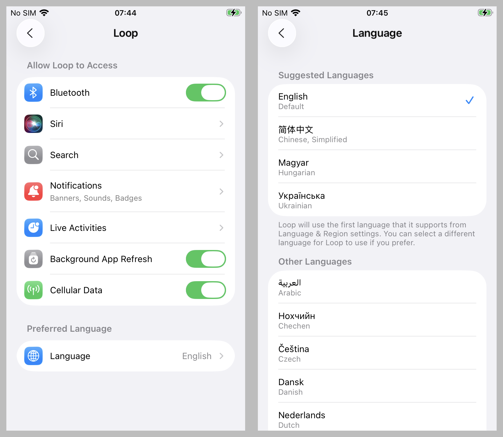

## Overview

* If you want to view translated pages of `LoopDocs`, please click on [Translation](../translate.md).

* If you want to view your app on your phone in a different language, instructions are found at [Translated App on the Phone](#translated-app-on-the-phone).

* If you want to help provide translations for everyone to use on their phones, please click on [Code Translation](#code-translation).

## Translated App on the Phone

You can select the language you want displayed for any given app in your phone settings.

If you have only one language on your phone, you will not see choices under the app settings. Click on the first link (for Apple instructions) to add language options to your phone.

* [Add more than one language to your phone](https://support.apple.com/en-us/109358)

Once your phone is configured to have more than one language, then the steps below should work.

* Tap on phone Settings
* Scroll down and tap on Apps
* Choose your app, e.g., `Loop`
* Scroll down to Preferred Language
* Choose the language you prefer

{width="600"}
{align="center"}

If a given phrase in the app does not have a translation string in what is called the String Catalog, then the app displays English. If you see an English phrase and you want to help yourself, and others, you can become a translator.

For the *Loop* app and the submodules (Pumps, CGM and Services) associated with the *Loop* app, the [*lokalise*](https://app.lokalise.com/projects) website is used. You must be signed up with the *Loop* project to be able to see *Loop* translations at that site.

## Code Translation

Localization (strings translated to the selected language in the app) makes use of volunteers who input translations in a special web app. Their work is then dowloaded and imported into the code used by the *Loop* app and its submodules (repositories on *GitHub*).

If you notice *Loop* app messages in English even though you selected a specific language, and you can help translate it, please volunteer.

Translations for Loop are performed by volunteers at [*lokalise*](https://app.lokalise.com/projects).

To volunteer, join [Loop zulipchat](https://loop.zulipchat.com/) and send a direct message to Marion Barker with your email address and the language(s) you can translate.

> If you are using the *Trio* or *iAPS* app instead of the *Loop* app, you can still assist with pump, CGM and Tidepool module localization through *Loop* *lokalise*. Some repositories from *Loop* are used by [*Trio* and *iAPS*](#what-about-other-ios-apps).

### Initial Screen on *lokalise*

When you log in to *lokalise*, you will see a screen similar to the screenshot below where the *Loop* icon is highlighted with a red rectangle. Tap on that icon to start translating.

{width="600"}
{align="center"}

After tapping on the *Loop* icon, you see the general translation tasks. (Your screen may look slightly different - some items may require more permissions that are standard.)

{width="600"}
{align="center"}

### How to Find Strings to Translate

Typically you would search for strings that are not translated.

### Untransalated

### How to Select a Submodule

Suppose you know that you want to modify translations for the OmniBLE submodule (anything to do with the DASH pump). You can choose context as a translator in *lokalise*. The example screenshot is configured for someone translating simplified Chinese for the DanaKit pump.

{width="900"}
{align="center"}

## What About Other iOS Apps

The *Trio* and the *iAPS* apps use code for CGM, pumps and services originally developed for the *Loop* app.

* The shared code originally developed for the *Loop* app resides in the *GitHub* *LoopKit* organization and is under the control of the *LoopKit* owners
* The *Trio* app has always used forks for these repositories so get their localizations for the CGM, pumps and services modules from *lokalise*
* The *iAPS* app initially used copies of the code - not connected to the *LoopKit* repositories - configured their own crowdin site for *iAPS* localization
    * However, as improvements to the submodules evolved at *LoopKit*, the updates needed to be hand-edited and added to the *iAPS* copies
    * In late 2025, *iAPS* started the transition to using forks from *LoopKit* instead of copies
    * Some of the *iAPS* translations were imported into *lokalise*

The bottom line is

* Submodule translations are handled at [*lokalise*](https://app.lokalise.com/)
* *Trio* translations are handled at [crowdin for Trio]

* The *Trio* app and the *iAPS* apps each have their own translation sites
    * Both of those apps have a crowdin site configured
    * Initially *iAPS* used copies of some of the 

You can use the *Trio* or *iAPS* discord server to volunteer by sending a direct message to Marion if you are not a member of zulipchat.
