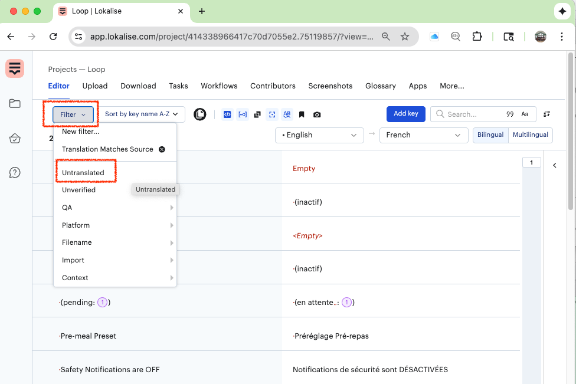

## Overview

* If you want to view translated pages of `LoopDocs`, please click on [Translation](../translate.md).

* If you want to view your app on your phone in a different language, instructions are found at [Translated App on the Phone](#translated-app-on-the-phone).

* If you want to help provide translations for everyone to use on their phone with their app (*Loop*, *Trio*, or *iAPS*), please click on [Code Translation](#code-translation).

## Translated App on the Phone

You can select the language you want displayed for any given app in your phone settings.

If you have only one language on your phone, you will not see choices under the app settings. Click on the link below (for Apple instructions) to add language options to your phone.

* [Add more than one language to your phone](https://support.apple.com/en-us/109358)

Once your phone is configured to have more than one language, then the steps below should work.

* Tap on phone Settings
* Scroll down and tap on Apps
* Choose your app, e.g., `Loop`
* Scroll down to Preferred Language
* Choose the language you prefer

{width="600"}
{align="center"}

If a given phrase in the app does not have a translation string in what is called the String Catalog, then the app displays English. If you see an English phrase and you want to help yourself, and others, you can become a translator.

For the *Loop* app and the submodules (Pumps, CGM and Services) associated with the *Loop* app, the [*lokalise*](https://app.lokalise.com/projects) website is used. You must be signed up with the *Loop* project to be able to see *Loop* translations at that site.

!!! note "Want to Sign Up to Translate?"
    To volunteer to translate, join [Loop zulipchat](https://loop.zulipchat.com/) and send a direct message to Marion Barker with your email address and the language(s) you can translate.

## Code Translation

Localization (strings translated to the selected language in the app) makes use of volunteers who input translations in a special web app. Their work is then dowloaded and imported into the code used by the *Loop* app and its submodules (repositories on *GitHub*).

If you notice *Loop* app messages in English even though you selected a specific language, and you can help translate it, please volunteer.

Translations for Loop are performed by volunteers at [*lokalise*](https://app.lokalise.com/projects).

To volunteer, join [Loop zulipchat](https://loop.zulipchat.com/) and send a direct message to Marion Barker with your email address and the language(s) you can translate. You will get an invitation to join the project. You do not need to start a new project, start a free trial or sign up for anything special; just join the project you are invited to.

> If you are using the *Trio* or *iAPS* app instead of the *Loop* app, you can still assist with Pump, CGM and Tidepool module localization through *Loop* *lokalise*. Some repositories from *Loop* are used by [*Trio* and *iAPS*](#what-about-other-ios-apps).

### Initial Screen on *lokalise*

When you log in to *lokalise*, you will see a screen similar to the screenshot below. Tap on the *Loop* icon, highlighted in the graphic with a red rectangle, to start translating.

{width="600"}
{align="center"}

After tapping on the *Loop* icon, you see the general translation tasks. (Your screen may look different.)

On the left are `keys` with the English language showing. On the right is the translation for that `key` in the language you selected. Each `key` has one or more words. The statistics list the total number of keys and the total number of words.

{width="600"}
{align="center"}

### How to Find Strings to Translate

You can search for:

* strings that are [not translated](#not-translated), which show up as Empty
* strings in a particular [submodule](#select-a-submodule) (for example - the Pump or CGM that you use)
* strings where the [English version was copied](#matches-source) to the translated field
* strings where you disagree with the translation
    * some strings may have been automatically translated
    * some translations may have a typographical error

### Not Translated

Strings that have not been translated can be selected by tapping on Filter and choosing Untranslated. An example graphic is shown before choosing untranslated keys. First tap on Filter than tap on Untranslated.

{width="900"}
{align="center"}

### Enter a Translation

After tapping on an item that is empty or you want to modify, type your translation into the box on the right, where you see the words "enter translation here" in the graphic below.

{width="900"}
{align="center"}

Notice the filename where that key is stored is indicated when you examine the details of a key. In the graphic above, the file `Loop/Loop/Localizable.xcstrings` is indicated.

The area under the key has a comment. This is something added in the code to explain the use of the key.

If a `key` does not have a translation in a given language, then when running the app, the English version is automatically provided. Do **not** tap on `Insert source`. 

> The only reason to use `Insert source` would be if that `key` should always be identical to the English version and you want to avoid having that `key` show up when looking for untranslated keys.

### Select a Submodule

Suppose you know that you want to modify translations for a particular submodule (CGM, Pump or Service module). You can choose context in *lokalise*.

* Tap on Filter
* Tap on Context
* Choose the submodule file
    * some submodules have multiple string catalogs (*.xcstrings)
    * some items are old enough to have a few of the older string format (*.strings)
* You can ignore any file that includes "Info.plist"
    * those strings do not need to be translated and the keys should be configured to be hidden from translators

The screenshot below is configured for someone translating simplified Chinese for the DanaKit pump.

{width="1024"}
{align="center"}

#### Submodule Table for Multiple Apps

These submodules are used by the *Loop*, *Trio* and *iAPS* apps.

| Type |  

 Name | Files |
|:-:|:--|:--|
| CGM | `CGMBLEKit` | CGMBLEKit/CGMBLEKit/Localizable.xcstrings CGMBLEKit/CGMBLEKitUI/Localizable.xcstrings |
| CGM | `G7SensorKit` | G7SensorKit/G7SensorKit/Localizable.xcstrings G7SensorKit/G7SensorKitUI/Localizable.xcstrings |
| CGM | `LibreTransmitter` | LibreTransmitter/LibreTransmitter/Localizable.xcstrings LibreTransmitter/LibreTransmitterUI/Localizable.xcstrings |
| CGM | `Dexcom Share` | dexcom-share-client-swift/ShareClient/Localizable.xcstrings dexcom-share-client-swift/ShareClientUI/Localizable.xcstrings |
| CGM | `NightscoutRemoteCGM` | NightscoutRemoteCGM/NightscoutRemoteCGM/Localizable.xcstrings | 
| Pump | `DanaKit` | DanaKit/Localization/Localizable.xcstrings |
| Pump | `MedtrumKit` | MedtrumKit/Localization/Localizable.xcstrings | 
| Pump | `OmniBLE` | OmniBLE/Localizable.xcstrings OmniBLE/OmniBLE/Localizable.xcstrings |
| Pump | `RileyLinkKit` | RileyLinkKit/RileyLink/Localizable.xcstrings RileyLinkKit/RileyLink/LoopKit.xcstrings RileyLinkKit/RileyLinkBLEKit/Localizable.xcstrings RileyLinkKit/RileyLinkKitUI/Localizable.xcstrings |
| Pump | `MinimedKit` | MinimedKit/MinimedKit/Resources/Localizable.xcstrings MinimedKit/MinimedKitUI/Resources/Localizable.xcstrings MinimedKit/MinimedKitUI/Resources/mul.lproj/MinimedPumpManager.xcstrings|
| Pump | `OmniKit` | OmniKit/Localizable.xcstrings OmniKit/OmniKit/Resources/Localizable.xcstrings OmniKit/OmniKitUI/Resources/Localizable.xcstrings |
| Misc | `LoopKit` | LoopKit/LoopKit/Resources/Localizable.xcstrings LoopKit/LoopKitUI/Resources/Localizable.xcstrings LoopKit/LoopKitUI/Resources/mul.lproj/InsulinKit.xcstrings LoopKit/LoopKitUI/Resources/mul.lproj/LegacyInsulinDeliveryTableViewController.xcstrings LoopKit/MockKit/Resources/Localizable.xcstrings LoopKit/MockKitUI/Resources/Localizable.xcstrings |
| Service | `TidepoolService` | TidepoolService/TidepoolServiceKit/Localizable.xcstrings TidepoolService/TidepoolServiceKitUI/Localizable.xcstrings |

### Matches Source

Some of the String Catalogs have had the English version inserted in the translation field. This was done inadvertently. To find these instances in the language you are translating, set up a custom filter.

First click on Filter, then Customize (see red highlights in graphic below)

{width="900"}
{align="center"}

The next screen allows you to choose `Translation` in one drop-down and then `matches source` in the adjacent drop-down.

{width="900"}
{align="center"}

You can hit Apply or Save and Apply and give it a name so you can select the Name next time.

The screenshot below is after creating and naming a custom filter called `Translation Matches Source`.

{width="900"}
{align="center"}

### Find a String

If you observe a string you want to modify, you can type it in directly. The text you type in the search box can be all or part of a string, and in English or the language you are translating.

{width="900"}
{align="center"}

- - -

## What About Other iOS Apps

The *Trio* and the *iAPS* apps use submodules for CGM, Pump and Service features originally developed for the *Loop* app. New CGM and Pump modules are coming soon or already available. These are being configured for use with all these iOS apps.

* The shared code originally developed for the *Loop* app resides in the *GitHub* *LoopKit* organization and is under the control of the *LoopKit* owners
* The *Trio* app has always used forks for these repositories so get their localizations for the CGM, Pump and Service modules from *lokalise*
* The *iAPS* app initially used copies of the code - not connected to the *LoopKit* repositories - and configured their own crowdin site for *iAPS* localization
    * However, as improvements to the submodules evolved at *LoopKit*, the updates needed to be hand-edited and added to the *iAPS* copies
    * In late 2025, *iAPS* started the transition to using forks from *LoopKit* instead of copies
    * Some of the *iAPS* translations for CGM, Pump and Service submodules were imported into *lokalise* at this time

The bottom line is

* Submodule translations are handled at [*lokalise*](https://app.lokalise.com/)
* *Trio* translations are handled at [crowdin for *Trio*](https://crowdin.com/project/trio/invite/public?h=48e1a77abd1611860f475c1ce17540112591650&show_welcome)
* *iAPS* translations are handled at [crowdin for *iAPS*](https://crowdin.com/project/iaps)

You can use the *Trio* or *iAPS* discord server to volunteer to translate using *lokalise* by sending a direct message to Marion Barker if you are not a member of zulipchat.

- - -

## Adding Languages

We can add languages if a translator commits to take on that task.

At lokalise, the language must be added first before translators have access to that language. Send a DM to Marion Barker with your request for a new language.

