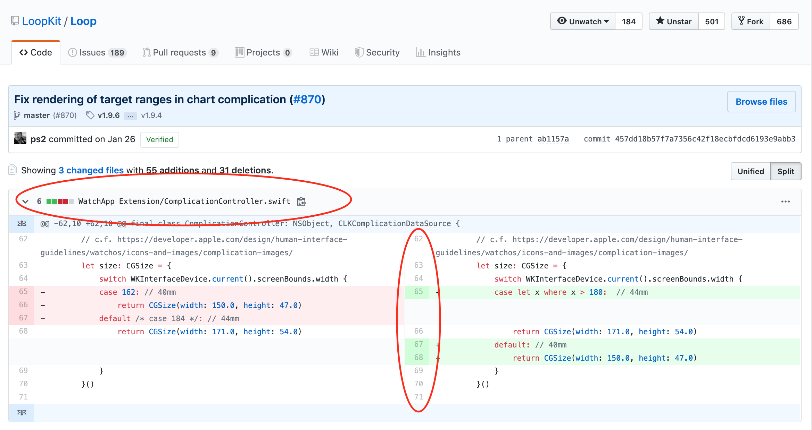

# Loop Development

The next version of Loop is developed under a separate branch, independent of the released Loop version. Typically, the dev branch is used by the developers to push out changes for experienced users to test.  It is not for new loopers. You should only test a development branch if you are willing to be an active participation with the developers to provide feedback and build frequently to obtain the latest feature or bug-fix that is being tested. If you are an experienced looper and willing to help out - this is the way the next release of Loop is improved.

Because the Omnipod DASH is actively being testing in the dev branch, there is probably a lot more interest in being a "tester" now than if it was just a minor tweak.  In addition to the DASH work, however, Loop itself has undergone a major architecture upgrade.  There is a formal onboarding process, more safety features and a different menu layout. Updated interface documentation is a work-in-progress located under the [Loop 3](../loop-3/loop-3-overview.md) tab of LoopDocs.

Please read this entire page before using any version of Loop other than the released code.

## What are branches?

There is a lot of discussion about "branches" with Loop but the concept is simple. Basically, they are all slightly different versions of Loop...kind of like different edits of the same book.

To really understand what branches are, we should probably explain a little more about Loop's code and how development works.  You can watch a 30-minute long, classic Katie DiSimone [video explanation about branches](https://www.youtube.com/watch?v=cWqvYs4Azt0&t=4s) created when Loop Version 2.0 was newly released. The information in this video is still generally useful with the last-half focused on automatic-bolus - the automatic-bolus dosing strategy has now been incorporated into Loop master branch. Loop has moved on to using only one stable branch (master), with dev recommended for developer/testers.

### Loop GitHub Information

Loop developers own an account in GitHub called [LoopKit](https://github.com/LoopKit).  Within that account, the developers have several "repositories" that support Loop in particular. A repository is like a book...let's think of it like a cookbook for now. Within the LoopKit account, there are repositories for Loop itself, LoopDocs, and various other supporting "frameworks" that are helper repositories for Loop to build correctly. For example, Loop's repo has a lot of the info about the app itself; the outward facing things that you interact with. How information is put to you and taken in from you...that's in Loop repository code. But, there's more than just a user interface for Loop. Loop has to do a lot of complex work like Bluetooth communications, algorithm math, pump communications, etc. The Loop app has help from frameworks to do those other parts. CGMBLEkit for some of the transmitter parts of Loop, RileyLink_ios for the pump managers (talking to the pumps and decoding their information), LoopKit for the algorithm about carbs and insulin curves, etc.

When you build Loop, in the background, Loop pulls those other frameworks (7 in total) into the build process using "Carthage".  Carthage is like a personal shopper. You give it a shopping list (the cartfile in Loop code is that shopping list) and it goes and fetches that for you during the build process. Sometimes your computer has an old shopping list...and that can cause build errors. Hence the "carthage update" fix in the Build Errors page...that command updates the shopping list to get the right versions of those frameworks.

{width="650"}
{align="center"}

Anyways...so now you know about the general structure of Loop and LoopKit in Github. Now we can discuss Loop itself a little deeper.

So let's imagine Loop as a cookbook. The developers are the authors/chefs of the recipes (code) in the cookbook. The authors spend countless hours testing new recipes, taste testing, documenting improvements. They send the drafts to the editor, who makes suggestions and eventually the cookbook is finalized. There are no grammar issues, no typos, the photos are beautiful and the recipes are yummy. They publish the book and you see a gorgeous final product on the shelves. That is called a "release" and it is the master branch. This book has been well-tested and is super stable. Every time you cook with those recipes, you know exactly what you're getting and lots of people have had a chance before you to make sure that it all tastes good. Master branch is stable and tested.

But then...the chefs/developers go on a trip. They are inspired by new cuisine and want to add new recipes to the old cookbook. (Things like omnipod support and overrides are new "recipes" that were developed since the last master release, for example.) But, the process for developing a recipe is arduous. Lots of trial and error involved. Lots of tweaking ingredients (code). The editors try out the new recipes and offer feedback (similar to the [Issues List in GitHub](https://github.com/LoopKit/Loop/issues)). While the recipes are being developed, they have a version of the old cookbook that gets marked up...edited in pencil a lot. Scribbles and notes in the side. Revisions happen frequently, because that's what testing new recipes is all about. These marked-up versions of the cookbook are called "dev" branch. Short for "development" branch. Like the name sounds...this is where new developments are happening, new recipes and tweaks.

After much testing and tweaking, eventually the recipes get the flavors right (bugs in code are squashed) and enough people have provided feedback and careful observations of results...that the book goes to the publishing house for the next printing. The cookbook is republished with an updated edition number and new recipes are highlighted. When this happens in Loop, Loop's master branch is updated with the new features coming from dev (aka, "dev branch is merged into master branch"). When that happens, master branch gets another "release" version. For that moment, dev and master are exactly the same. They stay the same until the Loop developers start working on the next batch of improvements, could be the next hour even or days later, but the process begins again. The developers will start editing the code again and dropping those edits in dev branch for further development.

## What's going on in the dev branch?

The dev branch, currently v2.3.0, is where the next version of Loop is being developed and tested.

If you choose to come into a dev branch build, you need to be aware that dev may update code frequently and unannounced in the traditional sense that most users in Looped group or Instagram would see. Developers are not helped by people being in a dev branch if those users are mistakenly thinking of it as a stable master branch with lots of detailed docs to go with it. People should only use a dev branch build if they EDUCATE themselves on the expectations and how to properly manage dev information and updates. People using dev branch should also have regular access to a computer to be able to rebuild quickly if a new bug/fix is identified.

If you choose to use a dev build, you can stay abreast of developments in a number of ways...but they will all require you to do some legwork and keep yourself informed. This is not a situation where you should expect a fancy Loopdocs page updated regularly with current "dev updates"...that's just not the way dev branch works.

### Subscribe to the Zulipchat channels

Use [Zulipchat](https://loop.zulipchat.com) forums for Loop. This forum has several "streams" of conversations depending on interest. I highly recommend following all the streams so you do not miss conversations.  You can select by stream and by topic within a stream to focus on a given conversation. If you are using dev branch, you must be in the #development stream.  If you want to know when LoopDocs gets updated, follow the #documentation stream. Code changes are called "commits" in GitHub. The #github stream will have an automated post whenever a new commit is made and it will give a brief line description of the commit.

{width="650"}
{align="center"}

You can also go directly to the commit history for each of the branches if you'd like.

[Loop master branch commit history](https://github.com/LoopKit/Loop/commits/master)

[Loop dev branch commit history](https://github.com/LoopKit/Loop/commits/dev)

If you click on the commit, you can see exactly what changes to the code were made. It's an interesting learning experience. In red are the code that is old, in green is the updated code. The line numbers and file names of the edited code are also there to help.

{width="550"}
{align="center"}

I don't expect many of you would understand exactly what the edits mean, or how the new code might function...but I bring up the topic of commit history so that you can use that to realize just how often dev is updated. Go ahead and look at the number and frequency of commits in that dev branch...that is why there is no way someone is going to keep a "loopdocs" of dev changes. It's just too much a moving target.

### Watch the Loop Repo and Issues list

Subscribe to the Loop repo's Issues list by "watching" the [Loop repo](https://github.com/LoopKit/Loop). You can choose to watch the repo so that you get emails when new Issues are reported. This is a good way to find out if there's other people reporting odd behavior that you are wondering about. If you use dev and wonder about something you are seeing in Loop, you can check [Issues list](https://github.com/LoopKit/Loop/issues) to see if others are noticing the same. If so, you can help by capturing information and reporting it. Not super helpful to just say "yeah, me too..." but better if you can attach screenshots, Issue Reports from Loop settings, and a thorough description of the problem you are seeing. Be a part of the solution by thoughtfully providing information to help debug.

{width="650"}
{align="center"}

### Keep checking Looped group

Keep watching [The Looped Facebook Group](https://www.facebook.com/groups/TheLoopedGroup). Major concerns/issues are brought up there...so no harm in scrolling through and seeing what's going on there.

### Become familiar with your data sources

Another useful thing if you'll be on dev branches undergoing a lot of active change...know how Loop works and where to look for additional information about what you are seeing. For example, if you see an IOB value that looks odd, you should know to look at the insulin deliveries are stored in Health app.

### Generate an Issue Report

Know how to generate an Issue Report when you see a problem so you can provide that if asked. An Issue Report is a log file generated by the Loop app that has a lot of information the developers can parse to figure out what Loop was doing when you were having a problem.

* Loop v2.2.8 and earlier: Loop Settings -> Issue Report
* Loop dev: Loop Settings -> Support -> Issue Report

Do not confuse this with reporting an issue with Loop.  That is done by logging into GitHub and going to the [Issue page](https://github.com/LoopKit/Loop/issues) to report a new issue.  You can read about existing issues without logging in, but to report a new one, you must log in to GitHub.

### Create a Debug Report

This 6-minute long, classic Katie DiSimone video shows how to [capture debugging logs](https://youtu.be/Ac4MguvUO7M). If you are testing a new branch, this is a valuable skill to assist developers in identifying problems. In addition to showing you how to generate and save the debug text information, the video explains a method in which you create a gist of the debug information using your GitHub account and file an official Issue on the Loop GitHub repository. This may be required in some cases.  But start by chatting directly on [zulipchat](https://loop.zulipchat.com) with the developer. What you are experiencing may already be known. If the developers need a new Issue opened, they will say so on zulipchat.

## LoopDashboard.org

You can always check out the [LoopDashboard](https://www.loopdashboard.org) which summarize all the GitHub activities in Loops 7 different repositories for dev and master branches. Here you can always see the latest "news" and  the history of Loop.

On the first page of loopdashboard you can see all the activities in one list, but you can also go to other pages (click on the < or > at bottom of the page) to see more details about commits, issues and pull requests. There are also stats about who is doing the pull requests and commits.

The dashboard is automatically updated every 12 hours.

{width="550"}
{align="center"}

## What is expected in the future?

The dev branch is where a lot of user interface and setting safety work has been developed with some cross-talk with the open source modifications available from [Tidepool Loop](https://www.tidepool.org/automated-insulin-dosing).

There has been some reorganization of code to make it easier to drop in new pump and CGM modules.  These may not be obvious to the user, but are important for moving forward.

And, of course, the integration of Omnipod DASH. The RileyLink Compatible devices are no longer required with DASH.
