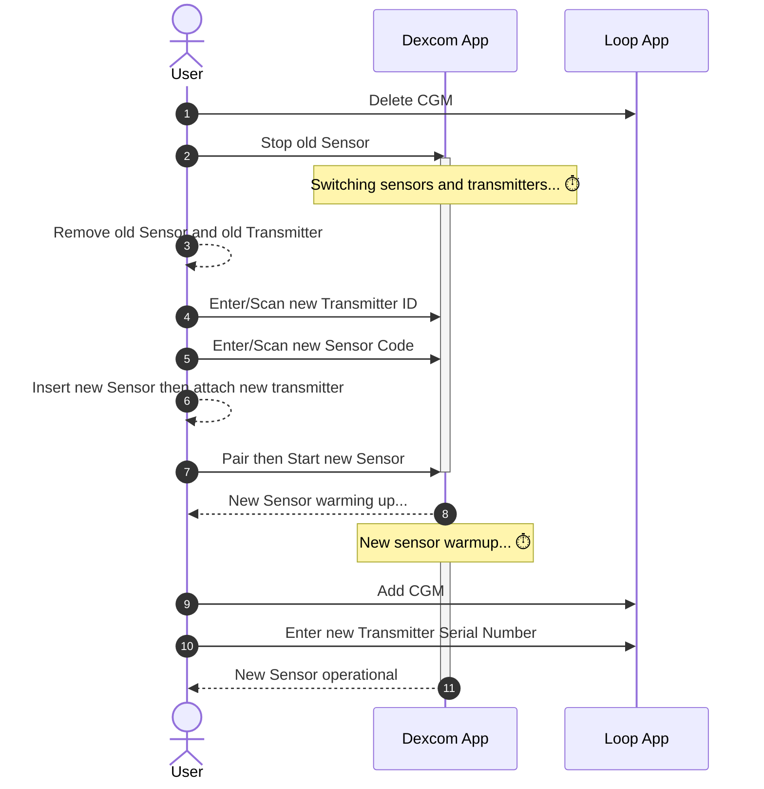

## What CGMs can I use with Loop?

The following CGM are supported by some or all versions of Loop:

* All Dexcom CGM (Loop 3 and later)
* Some Libre CGM (Loop 3.4 and later)
* Medtronic Enlite CGM when used with a compatible pump
* Remote CGM (requires internet access
    * Dexcom Share
    * Nightscout as CGM (Loop 3 and later)

See also: [Compatible CGM](../build/cgm.md) page.

## Dexcom FAQ

### Do I need wait for a new Dexcom sensor session to start Loop?

No. There's no need to do anything special with regards to your CGM session when starting or ending use with Loop.

### What do I do when Dexcom sensor is in warm-up?

Loop will stop automatically adjusting insulin when the most recent glucose value is older than 15 minutes.  This is indicated by seeing three dashes in place of the glucose reading on the HUD.

With no recent glucose readings, your pump returns to the scheduled basal delivery (within 30 min or less).

Loop continues to accept manual bolus commands. 

Loop 3 only:

* a HUD status row message of `No Recent Glucose` is displayed, making it easier to add the fingerstick value directly in Loop, which also saves it in Apple Health
* [Manual Temp Basal](../loop-3/omnipod.md#manual-temp-basal) can be commanded during warmup if desired

### What do I do when I switch Dexcom transmitters?

When you change transmitters (prior to Dexcom G7), you will need to update the transmitter ID in your Loop settings. The instructions for Dexcom are provided below:

* In Loop, select the `Delete CGM` button at the very bottom of the CGM info page
    * You cannot just edit the line with your old transmitter ID
* It's a good idea to go into your phone Bluetooth settings and delete the old Dexcom transmitter
    * The transmitter starts with Dexcom and ends with the last 2 characters of your old transmitter ID
    * Tap on the (i) next to `Not Connected` and select `Forget This Device`
* Follow the Dexcom instructions for pairing the new transmitter
* After pairing completes with Dexcom:
    * In Loop, add CGM and select the Dexcom system again
    * Enter the new transmitter ID
    * If you're unsure where to find your transmitter ID, see [Where to get the Transmitter ID for Dexcom G6?](../loop-3/add-cgm.md#where-to-get-the-transmitter-id-for-dexcom-g6)

{width="400"}
{align="center"}

If you don't update your transmitter ID when you change active transmitters, and you included your Dexcom share credentials, then Loop uses your Dexcom Share server to get your CGM data and will not work without cell or wifi connection. When Loop is using data from Dexcom Share servers, a small cloud will appear above the BG reading in Loop and should tip you off that maybe you forgot to update your transmitter ID. It's best not to enter Share Credentials. This makes it really obvious that you need to update the CGM settings in Loop at transmitter change time.

### Dexcom G7

With Dexcom G7, Loop automatically picks up the active sensor/transmitter pair from the Dexcom G7 app on the phone. Once Dexcom G7 is added to Loop as the CGM, the Looper does not need to do anything to Loop after selecting the new sensor/transmitter pair in the Dexcom G7 app.

### Dexcom G5, G6 and ONE

The diagram below illustrates the steps needed to **switch transmitters on Dexcom G5, G6, and ONE**. This typically needs to be done every three months when a new transmitter is started.

## Libre CGM

### Can I use Libre sensors with a reader like Miao Miao?

Loop 3.4.0 and later allows any Libre sensor supported by [LibreTransmitter](https://github.com/dabear/LibreTransmitter#libretransmitter-for-loop).

See [What CGMs does Loop work with?](#what-cgms-does-loop-work-with).

## Can Loop read CGM data from Nightscout?

Loop 3.0.0 and later can read CGM data from Nightscout. This requires an active internet or cellular connection. After 15 minutes with no connection, the glucose data is marked as stale.

## Can I use Eversense?

Eversense does not write to Apple Health. The BT communications protocol been not been reverse engineered as was done with Dexcom. There is a method to upload Eversense to Nightscout using an Android phone.

Loop 3 supports Nightscout as a Remote CGM to Loop with Eversense, but that requires internet access.
