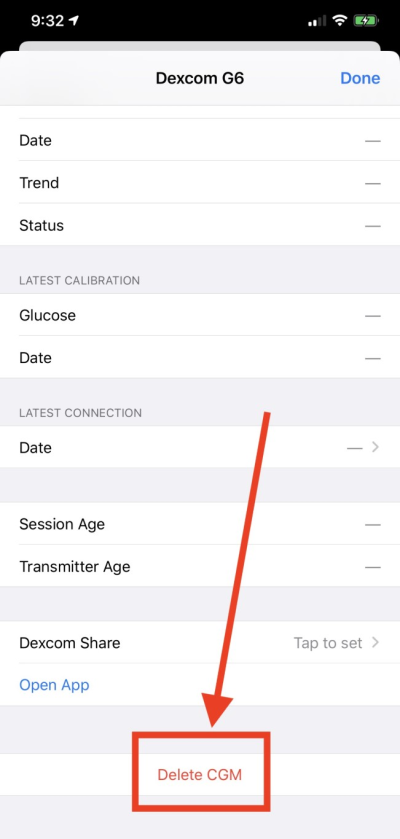
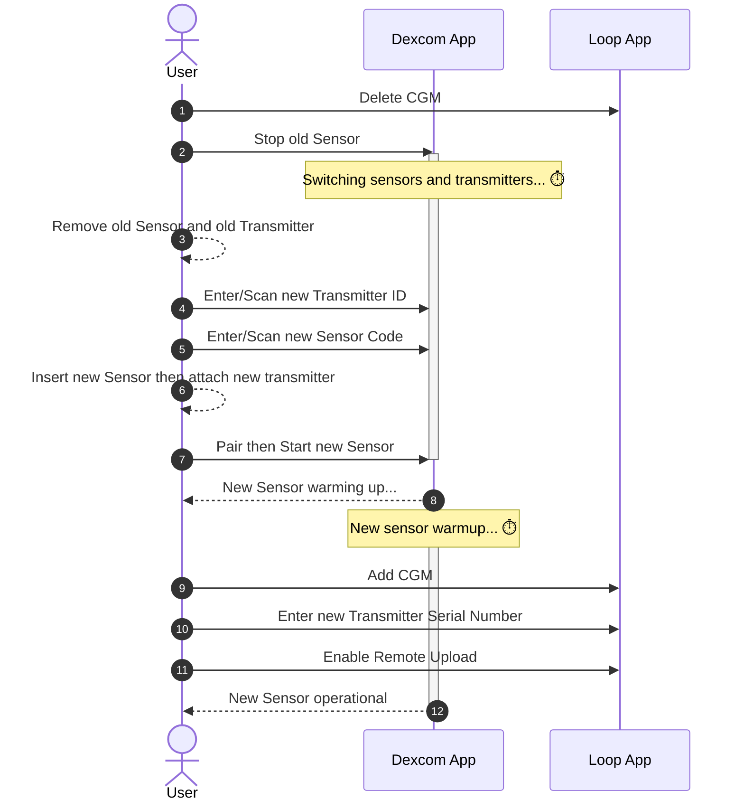

## Which CGMs are supported by the *Loop* app?

The following CGM are supported by some or all versions of Loop:

* All *Dexcom* CGM (Loop 3 and later)
* Some *Libre* CGM (Loop 3.4 and later)
* Medtronic Enlite CGM when used with a compatible pump
* Remote CGM (requires internet access
    * *Dexcom* Share
    * Nightscout as CGM (Loop 3 and later)

See also: [Compatible CGM](../build/cgm.md){: target="_blank" } and [CGM Customization](#cgm-customization)

## *Dexcom* FAQ

### Do I need wait for a new *Dexcom* sensor session to start Loop?

No, you can start Looping mid-sensor session. There's no need to do anything special with regards to your CGM session when starting or ending the *Loop* app.

### What do I do when *Dexcom* sensor is in warm-up?

The *Loop* app will stop automatically adjusting insulin when the most recent glucose value is older than 15 minutes.  This is indicated by seeing three dashes in place of the glucose reading on the HUD.

* A HUD status row message of `No Recent Glucose` is displayed, making it easier to add the fingerstick value directly in Loop, which also saves it in Apple Health

With no recent glucose readings, your pump returns to the scheduled basal delivery (within 30 min or less).

Loop continues to accept carb entries and manual bolus commands. [Manual Temp Basal](../loop-3/omnipod.md#manual-temp-basal) can also be commanded.

### *Dexcom* G7 Warmup

The *Dexcom* G7 (and ONE+) begins warming up as soon as you insert the device and completes in less than half an hour. Many Loopers use the combination of this warmup upon insertion and the 12-hour grace period offered by the G7 to have continuous CGM readings with no gap.

* During the 12-hour grace period, start the next sensor but do not connect it to your G7 app on your Looping phone
* After waiting for the sensor to settle, stop the old sensor and connect to the new sensor
    * The G7 app will show both traces as shown in the graphic below with about 9 hours of settle time
        * The new sensor data is added to the graph along with old sensor readings
        * You cannot see the new sensor until you transition to using it

    {width="400"}
    {align="center"}

    * By looking at the trace overlap, you can decide how much you trust the new sensor

## What do I do when I switch *Dexcom* transmitters?

When you change transmitters (prior to *Dexcom* G7), you will need to update the transmitter ID in your *Loop*settings. The instructions for *Dexcom* are provided below:

* In Loop, select the `Delete CGM` button at the very bottom of the CGM info page
    * You cannot just edit the line with your old transmitter ID
* It's a good idea to go into your phone Bluetooth settings and delete the old *Dexcom* transmitter
    * The transmitter starts with *Dexcom* and ends with the last 2 characters of your old transmitter ID
    * Tap on the (i) next to `Not Connected` and select `Forget This Device`
* Follow the *Dexcom* instructions for pairing the new transmitter
* After pairing completes with *Dexcom*:
    * In Loop, add CGM and select the *Dexcom* system again
    * Enter the new transmitter ID
    * If you're unsure where to find your transmitter ID, see [Where to get the Transmitter ID for *Dexcom* G6?](../loop-3/add-cgm.md#where-to-get-the-transmitter-id-for-dexcom-g6)

{width="400"}
{align="center"}

If you don't update your transmitter ID when you change active transmitters, and you included your *Dexcom* share credentials, then the *Loop* app uses your *Dexcom* Share server to get your CGM data and will not work without cell or wifi connection. When the *Loop* app is using data from *Dexcom* Share servers, a small cloud will appear above the BG reading in the *Loop* app and should tip you off that maybe you forgot to update your transmitter ID. It's best not to enter Share Credentials. This makes it really obvious that you need to update the CGM settings in the *Loop* app at transmitter change time.

### *Dexcom* G7

With *Dexcom* G7, the *Loop* app automatically picks up the active sensor/transmitter pair from the *Dexcom* G7 app on the phone. Once *Dexcom* G7 is added to the *Loop* app as the CGM, the Looper does not need to do anything to the *Loop* app after selecting the new sensor/transmitter pair in the *Dexcom* G7 app.

### *Dexcom* G5, G6 and ONE

The diagram below illustrates the steps needed to **switch transmitters on *Dexcom* G5, G6, and ONE** (for the version of ONE based on G6). This typically needs to be done every three months when a new transmitter is started.

## *Libre* CGM

### Troubleshoot Connections

The "normal" *Libre* 2 sensors have a firmware configuration that makes them slow to reconnect when they lose the connection to iOS (both iOS and the sensors are to blame for this). What usually helps is to make sure your app is open and in the foreground and that your phone is unlocked. iOS seems to be better at reconnecting Bluetooth devices under such conditions (i.e. it gives more Bluetooth priority to the foreground app). If you need to modify how quickly your phone locks, this is found under iOS settings, Display & Brightness, Auto-Lock.

If you try to pair a sensor in the app multiple times in a short period (let's say within a couple of minutes), you may need to just stop and wait.

* A "pairing" sends a lot more (16 times the normal amount) of data between the app and sensor than a normal NFC scan to retrieve glucose data
* Multiple pairing attempts may make the sensor temporarily unable to function
* If this matches your use case, shut off your phone and let it stay shut down for up to five minutes

Optionally: you can use miaomiao or bubble third-party transmitters attached on top of your normal *Libre* 2 sensors. Although the setup is a bit more bulky, it works and does not have connection problems. LibreTransmitter supports bubble and miaomiao on top of *Libre* 1 sensors, but it also works with *Libre* 2 sensors.

### Can I use *Libre* sensors with a reader like Miao Miao?

Loop 3.4.x and later enables the use of those *Libre* sensors supported by [LibreTransmitter](https://github.com/LoopKit/LibreTransmitter#libretransmitter-for-loop){: target="_blank" }.

### What about other *Libre* sensors?

There are a number of *Libre* sensors in which the only option for digital access to the CGM readings is to use the app provided by the vendor: [*LibreLinkUp*](https://librelinkup.com/). This enables you to upload your data to the *LibreLinkUp* servers and then access the data from there.

**The use of *LibreLinkUp* requires internet access via WiFi or Cell service.**

If this is your only option for CGM, evaluate whether you want to add xDrip4iOS as a CGM option. Instructions for this customization are found at [Loop and Learn: Add CGM to Loop](https://www.loopandlearn.org/custom-code-add-cgm-pump/). The reason to recommend this option is that xDrip4iOS can sense when the *Libre* transmits glucose readings to your phone, although it cannot read the glucose value. Shortly thereafter, it will request the CGM reading from *LibreLinkUp*.

If you prefer not to customize Loop, then you can configure [Nightscout](https://nightscout.github.io/uploader/uploaders/#abbott-freestyle-*Libre*) to access data from *LibreLinkUp* and then use Nightscout as a CGM.

* If you choose this option, your CGM will not act as a heartbeat to wake the app when the phone is locked or in the background
* You probably have a pump that serves this role, but if your pump is not actively waking your app and you use *LibreLinkUp*, consider [CGM Customization](#cgm-customization).

## Can I use Eversense?

There is a method to upload Eversense to Nightscout using an Android phone, but there is no method to read an Eversense directly with an iPhone at this time.

You can use Nightscout as a CGM with Eversense, but that requires internet access.

## Can the *Loop* app read CGM data from Nightscout?

Yes.

## CGM Customization

If you can connect your CGM directly to *Loop* that is preferred. You can customize the *Loop* app to interface with the *xDrip4iOS* DIY CGM app if you prefer.  You can use *xDrip4iOS* as a follower instead of a client to get some features from *xDrip4iOS* without any need to customize the *Loop* app.

If possible, it is recommended that *Libre* users take advantage of [LibreTransmitter](https://github.com/LoopKit/LibreTransmitter/blob/main/readme.md) which is incorporated into the *Loop* app for version 3.4 and later. However, some *Libre* sensors have encryption that limits ability to get data through open-source code and instead requires using the *LibreLinkUp* server.

You can add *xDrip4iOS* as a CGM option to the *Loop* app by applying a [code customization](https://www.loopandlearn.org/custom-code-add-cgm-pump/). This uses the shared AppGroup feature to transfer data from the CGM app to Loop. This is not the preferred approach if you have another choice. For *Libre* users with a sensor that is not handled by LibreTransmitter, this is your only option for closed-loop.

* xDrip4iOS can sense when the *Libre* is providing updates over Bluetooth but cannot interpret the readings because of the encryption for some sensor models
* xDrip4iOS waits a few seconds after the new reading and then queries *LibreLinkUp* using your login credentials
* Be aware this makes your ability for closed-loop dependent on having internet access

Please read the docs for [xDrip4iOS](https://xdrip4ios.readthedocs.io/en/latest/). You must build these apps yourself so they have the same developer ID as your *Loop* app; you cannot use the TestFlight pre-built versions. And you must configure the app as explained in those docs.
