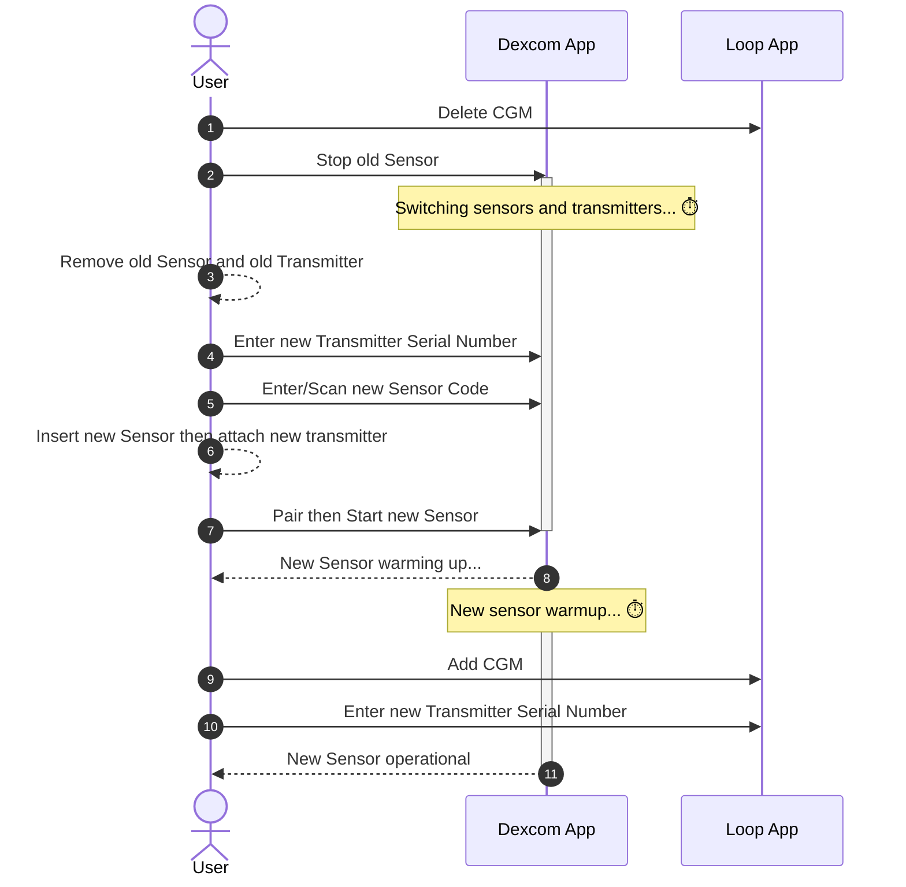

## What CGMs does Loop work with?

Loop 3 supports G5, G6, G7, Dexcom ONE, Dexcom Share, Nightscout and the Medtronic CGM systems compatible with Looping pumps. [Loop and Learn: Loop Customization](https://www.loopandlearn.org/github-lnl-patches) can be used which adds support for some Libre sensors.

Loop 2.2.x supports Dexcom G4 with share, G5, G6, Dexcom ONE, Dexcom Share and the Medtronic CGM systems compatible with Looping pumps.

There are more details on the [Compatible CGM](../build/step4.md) page.

## Do I need wait for a new sensor session to start Loop?

No, you can start Looping mid-sensor session. There's no need to do anything special with regards to your CGM session when starting or ending Loop use.

## What do I do when sensor is in warm-up?

Loop will stop automatically adjusting insulin when the most recent glucose value is older than 15 minutes.  This is indicated by seeing three dashes in place of the glucose reading on the HUD.

* With Loop 2.2.x or Loop 3, enter a fingerstick glucose value in Apple Health to enable Loop to provide updated projections and loop briefly

* With Loop 3, a HUD status row message of `No Recent Glucose` is displayed, making it easier to add the fingerstick value directly in Loop, which also saves it in Apple Health

With no recent glucose readings, your pump returns to the scheduled basal delivery (within 30 min or less).

Loop continues to accept manual bolus commands. With Loop 3 only, [Manual Temp Basal](../loop-3/omnipod.md#manual-temp-basal) can also be commanded.

## What do I do when I switch Dexcom transmitters?

When you change transmitters (prior to Dexcom G7), you will need to update the transmitter ID in your Loop settings. The instructions for Dexcom are provided below:

* In Loop, select the `Delete CGM` button at the very bottom of the CGM info page
    * You cannot just edit the line with your old transmitter ID
* It's a good idea to go into your phone Bluetooth settings and delete the old Dexcom transmitter
    * The transmitter starts with Dexcom and ends with the last 2 characters of your old transmitter ID
    * Tap on the (i) next to `Not Connected` and select `Forget This Device`
* Follow the Dexcom instructions for pairing the new transmitter
* After pairing completes with Dexcom:
    * In Loop, add CGM and select the Dexcom system again
    * Enter the new transmitter ID

{width="400"}
{align="center"}

If you don't update your transmitter ID when you change active transmitters, and you included your Dexcom share credentials, then Loop uses your Dexcom Share server to get your CGM data and will not work without cell or wifi connection. When Loop is using data from Dexcom Share servers, a small cloud will appear above the BG reading in Loop and should tip you off that maybe you forgot to update your transmitter ID. It's best not to enter Share Credentials. This makes it really obvious that you need to update the CGM settings in Loop at transmitter change time.

With G7, Loop automatically picks up the active sensor/transmitter pair from the Dexcom G7 app on the phone.

The below diagram illustrates **how to switch transmitters on Dexcom G5, G6, and ONE** (not G7).

## Can I use Libre sensors with a reader like Miao Miao?

If you want to use a Libre sensor you will need to modify Loop to accomplish that use. Loop code does not natively support that sensor, nor readers.

With Loop 3, a customization can be used to support some Libre sensor CGM.

Please refer to [Loop and Learn: Loop 3 with Customization](https://www.loopandlearn.org/github-lnl-patches/)

## Can I use Eversense?

Eversense does not write to Apple Health. The BT communications protocol been not been reverse engineered as was done with Dexcom. There is a method to upload Eversense to Nightscout using an Android phone.

With Loop 3, you can use Nightscout as a CGM to Loop with Eversense, but that requires internet access.

## Can Loop read CGM data from Nightscout?

The released version of Loop can read CGM data from Nightscout.

The older Loop 2.2.x does not read CGM data from Nightscout.

## What other CGM apps can be used to Loop?

Please read the docs for [xDrip4iOS](https://xdrip4ios.readthedocs.io/en/latest/) and [Glucose Direct](https://github.com/creepymonster/GlucoseDirect#readme). You must build these apps yourself to Loop; you cannot use the TestFlight pre-built versions.

These can be used after applying a code customization to Loop 3. These customizations are available as part of the [Build Select Script](https://www.loopandlearn.org/build-select).