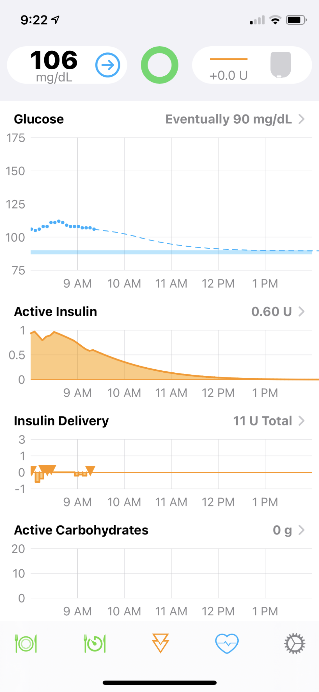
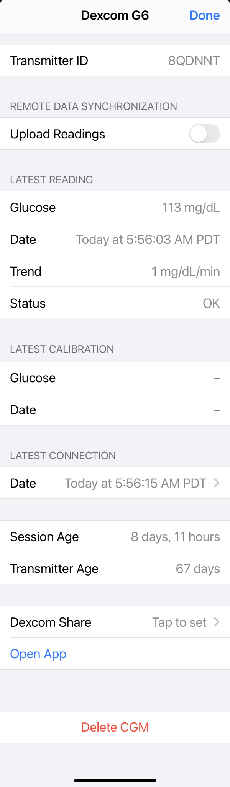
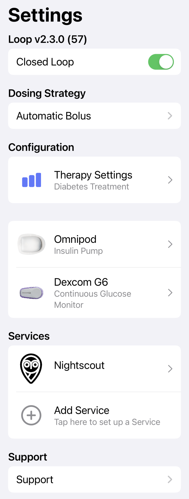
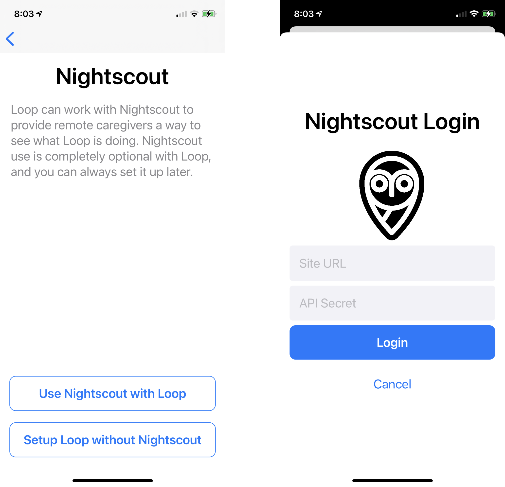
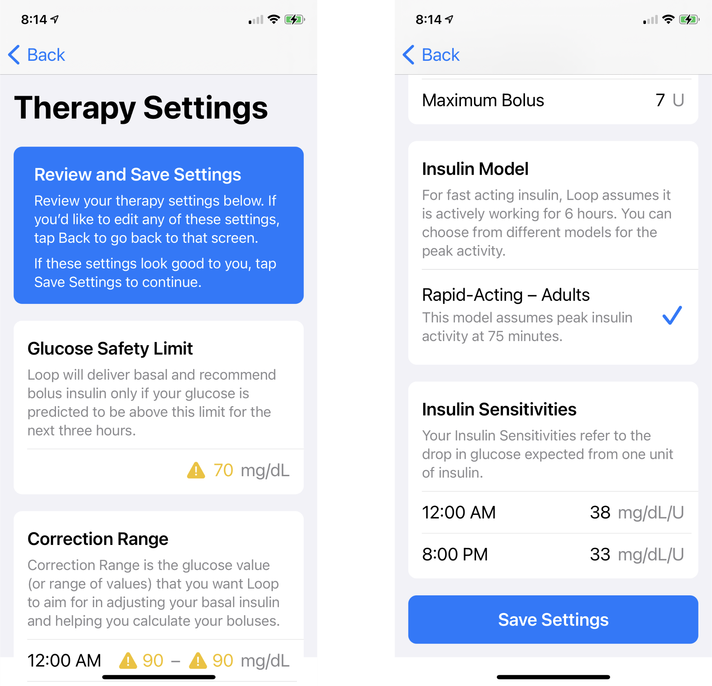
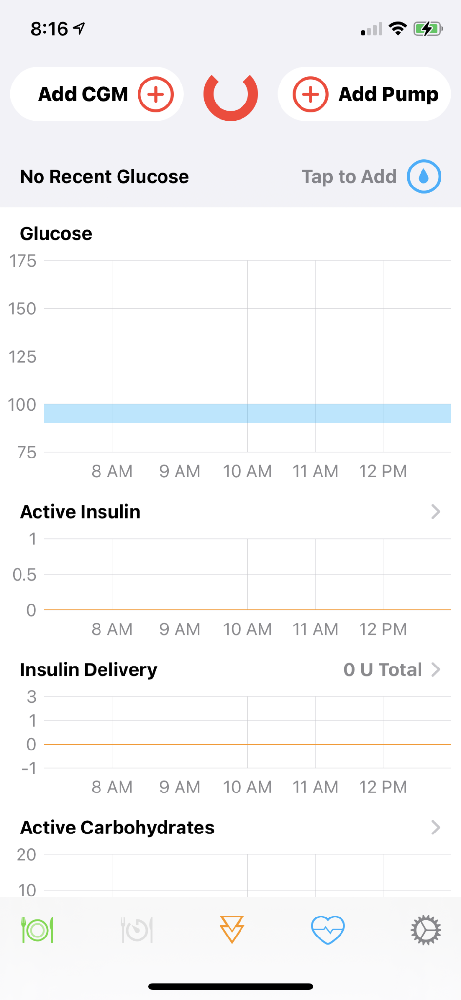
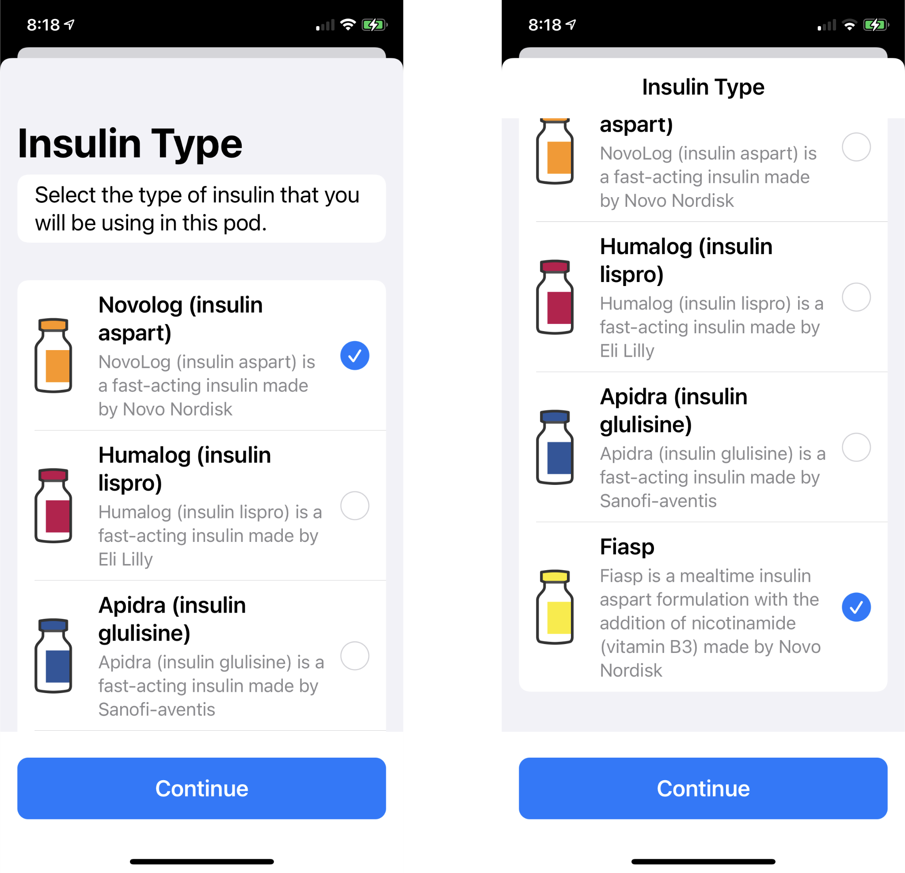

# Loop dev Preview

Loop users are directed to select a released version of Loop to download during the build process. The next version of Loop is developed under the dev branch and, when ready for testing, the developers ask for volunteers to assist in testing the new code. Please read [What's going on in the dev branch?](branch-faqs.md#whats-going-on-in-the-dev-branch) before deciding to test the dev branch. If you decide to build the dev branch, instructions are found the [Advanced Users Only](../build/step13.md#advanced-users-only) section of Build Step 13.

The Loop dev branch is in a state where there is active testing going on by experienced Loopers.  To assist those Loopers, this preliminary documentation has been prepared. With Loop dev branch (Aug 2021), the app screens have an updated appearance and organization.  People familiar with the layout of features in Loop v2.2.x may need to reorient slightly to find particular settings; but for the most part, the layout will be natural to current Loop users.

!!! danger "The most common question"

    - How do I enter the type of insulin I use?
        * Therapy Settings -> Insulin Model is used to distinguish between adults and children
        * Pump Settings -> Insulin Type is used to select the specific brand of insulin, e.g., Novolog, Humalog, Apidra, Fiasp

If you build the LoopWorkspace dev branch over an existing Loop build on your phone, the [onboarding](#onboarding) remembers the settings you have.  You are presented with an information screen describing the setting (with a continue button) followed by your current settings, which you must confirm to keep - or can modify and then confirm to change. Depending on the device you are using, you may need to scroll down to see the Continue or Save buttons for each setting. Once you have been walked through all the Therapy Settings, there is a final review and confirm all Therapy Settings screen.

If you are building on a phone that does not have an existing Loop app, then you must add settings (click on + to add) as you are taken through each screen.

The order of Therapy Setting Screens is:

* Glucose Safety Limit
    * Similar to suspend threshold, but with a 3-hour time window
* Correction Range
* Pre-Meal Range
* Workout Range
* Basal Rates
* Delivery Limits
* Insulin Model
    * This offers Adult or Child rapid acting
    * The insulin type, such as Novolog or Fiasp, is selected during Add Pump
* Carb Ratios
* Insulin Sensitivities

## Loop is Running

The following graphics are taken from an instance of Loop that has been configured and is operating.

### Main Loop Screen

The main Loop screen is similar to earlier versions with a Heads-Up Display at the top (when in portrait mode) with various graphs in the middle and a toolbar at the bottom of the screen. The graphs and the toolbar act similarly to earlier versions, e.g., v2.2.x.  The Settings display shown when tapping on the settings (gear icon) is quite different as described [below](#settings-screen).

{width="300"}

### Heads-Up Display

The Heads-Up Display (HUD) for Loop dev branch has been simplified.  There are only 3 icons (instead of the 5 used up through Loop Versions 2.2.x.). The left icon shows the CGM value, the middle icon indicates Loop status and the right icon show pump status.

#### CGM Icon

Tapping on the CGM icon shows more information about the last CGM reading. The same screen is obtained by tapping on Loop Settings->CGM.  This display includes the time of the last reading to the nearest second, along with other information about that sensor and transmitter. It also has an option to go to the Dexcom app on the same phone.

{width="250"}

### Loop Status Icon

Tapping on the Loop Status Icon provides information about Loop Status.

Examples of Green and Yellow Loop Status are shown in the graphic below. The Red Status says over 15 minutes.  After 20 minutes and every 20 minutes thereafter that Loop stays Red, you will also get a notification (if you enabled notifications).

{width="500"}

#### Pump Icon

Tapping on the pump icon leads to the [Pump Menu](../operation/loop-settings/pump-commands.md).  These screens have the same information as Loop version 2.2.x, although the order may be slightly different.

For Omnipod users who have selected Automatic Bolus Dosing Strategy, you may want to turn on Confirmation Beeps. In earlier Loop versions, the beep happened for all boluses; with the dev branch, only manually entered boluses beep at you, automated boluses are silent.

### Settings Screen

* Most of the Settings you may be familiar with are reached from Settings by tapping on Therapy Settings
* Nightscout can be added from Settings by tapping on Add Service (if you did not add it as part of onboarding)
* Issue Report is reached from Settings by tapping on Support
    * The Expiration Date for the Loop app is now included in the Issue Report for dev

{width="250"}

### Loop Widget on Lock Screen

Loop has a widget which can be added to the lock screen. The example graphic below shows the Dexcom G6 widget above the Loop dev widget.

{width="250"}

&nbsp;

## Onboarding

Some of the onboarding screens are shown below. Depending on your phone resolution, you may need to scroll down to see the entire screen. Only the top portion of any given screen is shown in these graphics.

If you are building over an existing Loop build on your phone, the onboarding remembers the settings you have, you can simply confirm them as you move through onboarding.

&nbsp;

### Welcome Screens:

{width="500"}

&nbsp;

### Nightscout Selection:

{width="500"}

&nbsp;

### Therapy Settings:

Next are the therapy settings in order (a few graphics are shown, not all screens) and for taller screens, such as the Correction Range screen, you'll need to scroll down to read the entire screen and reveal the Continue button:

* Glucose Safety Limit
* Correction Range

{width="500"}

* Pre-Meal Range
* Workout Range
* Basal Rates
* Delivery Limits
* Insulin Model (note - Adult or Child, actual type is associated with pump)
* Carb Ratios
* Insulin Sensitivities

&nbsp;

### Therapy Settings Review:

Once these are all entered, then the Therapy Settings screen is shown for your review. You must scroll down to see all settings and reveal the Save Settings button.  Only the top and bottom portions are shown, the other settings were not captured for this graphic.

{width="500"}

&nbsp;

### Notifications and Bluetooth:

Once you save settings, Loop asks to send notifications and use Bluetooth

{width="500"}

&nbsp;

### Add CGM and Add Pump:

Loop shows the following screen indicating you can Add CGM and Add Pump. If you are building over an existing Loop app, the CGM and Pump are remembered so you will not see this screen.

{width="250"}

The CGM and Pump entry screens are similar to those in the Setup App screens for Loop v2.2.x.  The one exception is when adding the pump, the specific type of insulin is requested.

### Select Insulin type

The default is Novolog.  Depending on your screen, you may have to scroll down to see the Fiasp icon.

{width="500"}
