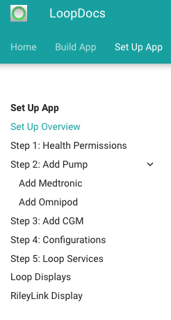
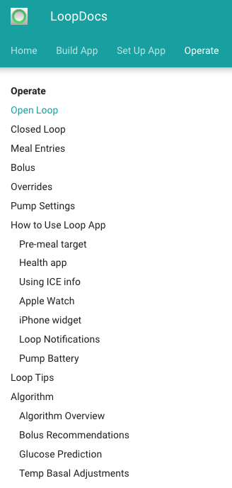

# Using This Site FAQs

This website is a guide on how to build, set up and use your Loop app.

It is totally understandable to be intimidated and worried by the thought of building your own app, that this will be too technical. Please realize that once you have your hardware, building the app requires reading, copying a few lines and clicking a few buttons.

A quick overview of LoopDocs contents is shown below. If you are new to Loop or trying to figure out if you want to Loop, please start at the Overview of LoopDocs and read sequentially.

* [Overview of Loop](../index.md)
    * Introduction to Loop
    * Disclaimer
    * Development History
    * [Finding Help](../index.md#finding-help)
* [Detailed Build Directions](../build/overview.md)
    * There is an overview with suggestions for getting started
    * A step-by-step guide - follow along at your own pace
    * What to do in case of build errors
    * How to update your app
* After you build, [Set up App](../operation/overview.md)
* After you build and setup the app, [How to Operate](../operation/loop/open-loop.md)
* And a lot of useful information on operating Loop including adjusting settings can be found both within the LoopDocs website and the companion website [LoopTips](https://loopkit.github.io/looptips/)

### Website Short Cuts

!!! info "URL and Domain Name"
    Uniform Resource Locator or URL is nothing more than the address of a given unique resource on the Web.
    
    A domain name refers to the website address. It can be used to redirect from one address to another.

You may notice the URL for LoopDocs and LoopTips is kind of long and hard to remember. One of our awesome Loop volunteers captured the domain names of `loopdocs.org` and `looptips.org` and those addresses redirect to the official LoopDocs and LoopTips sites. That means all you need to remember to type is `loopdocs` or `looptips` followed by `.org` to get to these valuable websites.

## This looks so hard. I don't know if I can do it!

Building the Loop app is straightforward. There are a lot of steps because they are laid out into short segments so that you can take breaks if you want. If you are not a Mac user, the hardest thing may be learning the menu items and short cuts that are different on the Mac than on a PC.

* Each step is designed to end at a natural stopping or resting point, in case you get interrupted or want to take a break.
* Some of the steps only take 5 minutes to finish...so don't be intimidated by the number of steps.
* The steps are listed in the order that you'd do each task. So start at step 1 and proceed forward.
* Each step ends with a "next step" link or hit the `n` key to move to the next page.
* You choose whether to keep going onto the next step or take a break and come back later.

## What if I get stuck?

If you get stuck, there are several things that can help:

* Scroll back up in the directions and see if you maybe missed a step accidentally. Might even be that you missed a paragraph.
* Check and compare your screen's display with what the screenshots are highlighting. Does your screen seem similar? Or does yours have an error message? If you have an error message, see if it helps guide you to the problem.
* If you just get stumped, post in [Looped Group (Facebook)](https://www.facebook.com/groups/TheLoopedGroup/)or [Zulipchat](https://loop.zulipchat.com/) and ask for help. Lots of people standing by to help each other. If you have a **screenshot** of where you are stuck and what part of the directions you are on, that will help a lot.
* Note the word screenshot - please use your computer or phone to take a screenshot.  Photos of screens are typically out of focus and not high enough resolution. Search for "How to take a screenshot" in your favorite search engine.

## So, I build the app and then I'm done?

Nope...we wouldn't just leave you dangling like that. There's also an important walk-thru for how to set up your app for the first time. The new displays and settings are all explained in the ["Set up App"](../operation/overview.md) section of this website. Check it out and follow along with each page step-by-step, just like you did for building. This way you'll learn valuable tips along the way too. 

{width="250"}
{align="center"}

Once you have the app set up, continue with the ["Operate"](../operation/loop/open-loop.md) section of these docs. Good idea to at least skim all the pages here, but focus on that Open Loop page.

Once you are familiar with the interface and have your settings adjusted for Loop, then keep going through this section in detail. Those pages are very helpful for understanding how you will use the app to enter meals, edit entries, bolus, etc.

{width="300"}
{align="center"}

Finally, there is a [Troubleshoot](../troubleshooting/overview.md) section. Most of the time, you won't need this, but when you do, you'll be glad of all the loopers before you who helped make this section available.

