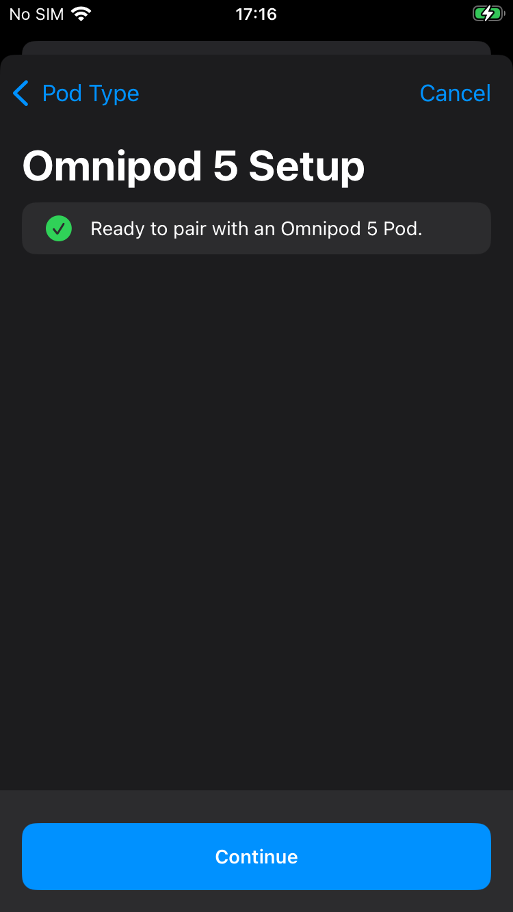
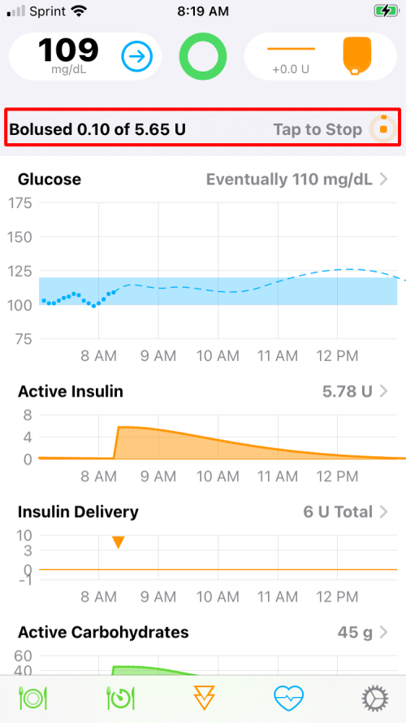
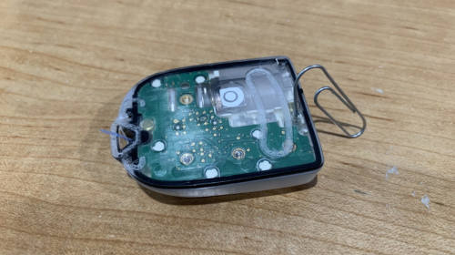
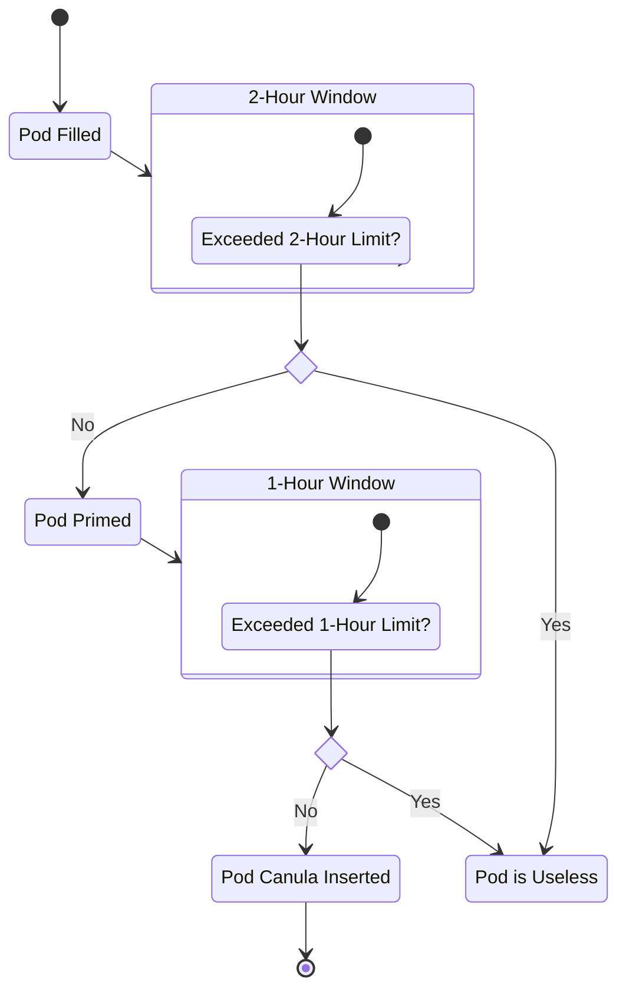

## Is Omnipod 5 available for open-beta testing?

Yes it is.

### Should I switch to Omnipod 5 now?

1. Don't be in a rush
1. This is new code that has been tested by a dozen developers in closed-beta testing
1. Consider waiting a few weeks and letting experienced people do the testing
1. There are a few known issues but we expect more will be revealed when we get a bigger group of testers
    * The current implementation for Omnipod 5 requires you to [use a CGM with a heartbeat](#what-are-the-known-issues)
    * If you are using something like Nightscout as a CGM, your app goes to sleep and does not wake up if it is not in the foreground with the phone unlocked

### How can I switch to Omnipod 5?

!!! important "You need to be comfortable building a development branch, updating frequently, and reporting problems."

#### Build the correct version of code

To get access to Omnipod 5, build the `dev` branch for Loop.

* Please read: [Updates in dev](../version/development.md#updates-in-dev)
* Please follow along in zulipchat at [Loop-dev status](https://loop.zulipchat.com/#narrow/channel/144182-development/topic/Loop-dev.20Status/with/606368226)

#### Perform a one-time step to support Omnipod 5

There is a one-time step to get a certificate needed for you to use an Omnipod 5 Pod. This is pretty automatic, but this is new code so be prepared to handle issues if they happen. 

This step requires you to have **internet access**. After this step is done, you can pair an Omnipod 5 Pod with this phone and this app with no need for internet access.

!!! important "Do not fill your first Omnipod 5 Pod before you reach the Pair O5 Pod screen"

**First Omnipod 5 Pod Only**

When you deactivate a Pod, you can cancel out of the Pair Pod screen, scroll to the bottom and choose to switch [Pod Types](../loop-3/omnipod.md#switch-pod-types){: target="_blank" } and choose Omnipod 5. As soon as you confirm Omnipod 5 as your selection, you are automatically routed to a service that provides you with the certificate you need. You will see several progress screens finishing in this final screen.

{width="300"}
{align="center"}

At this point, you can tap Continue and will be taken to the Pair O5 Pod screen. It is now safe to fill your O5 Pod with insulin and pair it.

Because of the extra exchanges required to handle the security added to Omnipod 5 Pods, the pairing and some of the insulin dosing commands may seem slow compared to a DASH Pod. This is normal.

### What are the known issues

#### No Pump Heartbeat

* The current implementation for Omnipod 5 requires you to [use a CGM with a heartbeat](#what-are-the-known-issues)
* If you are using something like Nightscout as a CGM, your app goes to sleep and does not wake up if it is not in the foreground with the phone unlocked

#### More frequent pod not connected messages

The private-beta testers noticed more frequent notifications that the pod is not connected. But the app continues to work. There are more periods when the spacing between automatic adjustments is 10 minutes instead of 5 minutes, but the majority of the time, every CGM reading triggers an automatic calculation.

### Will I still get 203 errors?

The increased frequency of faults noticed with DASH Atlas Pods has not been observed in the Ominpod 5 Pods tested to date.  Considering just the Pods that are not expired, there is a 3% failure rate with the failure being an occlusion (105) fault. There were testers in the private beta group using DASH instead of Omnipod 5. They had a 20% failure rate on a small sample of DASH Pods, all 203 faults near the 72 hours time frame.

## Which Pods work with the *Loop* app?

You can use Omnipod 5 (under test), DASH and Eros Pods with the *Loop* app.

* The Omnipod 5 is only available in the development branches while in open beta testing

You do not need the Omnipod Personal Diabetes Manager (PDM), just the pod supplies. Your insurance or pharmacy coverage may cover some of the cost. The PDM may be needed in some countries to get replacements for failed Pods.

!!! info "Alternative Names for Omnipod Pods"

    All three types of Pods can be packaged five to a box, don't let the 5-pack indication confuse you. 

    * **Eros** Pods are also known as **Classic** or **UST400**
        * The Reference number on the boxes should be similar to POD-ZXP425
        * They have a clear needle cap
        * Pharmacy sites sometimes may refer to the **Eros Pods** as **Gen 3** but they are the same Pods

    * **DASH** Pods have DASH in the name
        * The Reference number on the box should be similar to POD-BLE-P1-525
        * They have a blue needle cap

    * **Omnipod 5** Pods have 5 in the name
        * The Reference number on the box should be similar to POD-OMNI-I1-6720
        * They have a clear needle cap

DASH and Omnipod 5 pumps communicate with the phone via Bluetooth so they do not require a RileyLink compatible device.
You may find the Omnipod 5 a little slower than the DASH because of the extra layer of security added to these Pods.

!!! tip "To date, no iPhone model specific issues have been found with Omnipod 5 Pods"
    * O5 Pod code is experimental and does not provide a heartbeat
    * This means you rely on your CGM to wake up the app when it is in the background or the phone is locked

### Increase in DASH Faults

There have been a number of lots of Atlas DASH Pods that exhibit an increase in the frequency of certain DASH Faults when used with iOS Open-Source Automated Insulin Delivery Systems (OS-AID). This is different from the Bluetooth connection issues for some iPhone models: see [Keep Alive: Atlas or InPlay DASH Pods](#keep-alive-atlas-or-inplay-dash-pods).

To the best of our knowledge this is not something that we (as OS-AID developers and users) can control. People who have boxes that fail early find most Pods in that box fail early.

* The 203 fault is the most common one to exhibit an increase in frequency; occuring on the third day of Pod life
* The 016 fault also exhibits an increased frequency and this one happens early in Pod life
* You may be able to get Insulet to replace these, but there is no guarantee

We have looked at the analytics reported from Loop users who [share their data](../loop-3/onboarding.md#usage-data-sharing){: target="_blank" }. The increase in fault rate appears to go along with the increased used of Atlas Pods. Reports from users that their Pods failed early started in November/December of 2025 and continues to increase through at least May 2026. Note that 203 and 016 faults have been around for a long time. The increased fault rate (almost 20 times more likely for 203 and 4 times more likely for 016) is associated with the Atlas DASH Pods which use a different internal card with different firmware.

### Keep Alive: Atlas or InPlay DASH Pods

!!! warning "iPhone 16 (all models) and 17e model with Omnipod DASH"
    **iPhone 16 all models** and **iPhone 17e model only** can be slow to reconnect to Atlas versions of DASH Pods. This can cause delays to automatic and manual insulin dosing.

    **Other phones, including iPhone 17 models other than 17e, do not have the reconnection problems with InPlay DASH Pods** - but see [Increase in DASH Faults](#increase-in-dash-faults) which affects all phone models and seems to be box specific.

Beginning in 2025, some of the DASH Pods are produced with a newer version of chips and firmware. The only way to tell the difference before use is to examine the paper cover over the Pods inside the box for the word `Atlas` (newer) or `SAW` (older) as shown in the graphic below. It is anticipated that `Atlas` Pods, which report electronically as `InPlay BLE`, will become more common.

**If you do not already own an iPhone 16 or a 17e, it is strongly suggested you choose an older (iPhone 15 or SE or older) or newer (iPhone 17 that is not the 17e) phone.**

* The left images show the SAW marking for `TWI Board` DASH Pods
* The right images show the Atlas marking for `InPlay BLE` DASH Pods
* The exact location of the marking varies according to manufacture location and date but the `SAW` or `Atlas` notation indicates the internal BLE configuration for that pod

{width="750"}
{align="center"}

#### Characteristics of Atlas with iPhone 16 or 17e

* The Atlas DASH Pods, which advertise a Bluetooth Device name of `InPlay BLE` and indicate `-Atlas` in small print on the paper pod cover are fully compatible with all iPhone models except iPhone 16 and iPhone 17e
* Although `InPlay` Pods do work with the iPhone 16 and 17e you may notice some communication issues
    * It can take many attempts to get the pod to initially connect when pairing; just keep hitting retry
    * Once the pod disconnects itself from the phone Bluetooth, the phone is slow to reconnect the pod to the *Loop* app
        * Pod firmware initiates the disconnect 3 minutes after the last message exchange
        * With other models, the reconnect happens in about 1 sec
        * With iPhone 16 or 17e, this can take many seconds and sometimes a few minutes
    * When the pod is not connected, neither automatic nor manual commands can be sent to the pod to modify insulin delivery
    * No solution to this issue is known
    * There is a work-around to keep these Pods more connected by issuing a keep-alive message before the 3-minute BLE disconnect; but it uses extra battery for the phone. 
        * Although it does increase the number of messages to the pod slightly, this is not thought to be a big issue. Pods with marginal batteries are as likely to fault without this feature as with the feature.
        * If you are forced to use an iPhone 16 or 17e with InPlay Pods, please read the [Pod Keep Alive Feature](../loop-3/omnipod.md#pod-keep-alive-feature){: target="_blank" } section. This used to be found only in a feature branch but as of v3.14.0 is part of the released Loop code

> DASH Pods that advertise a Bluetooth Device name of `TWI Board` and indicate `-SAW` in small print on the paper pod cover are fully compatible with all phones including the iPhone 16 and 17e.

> The earliest `Atlas` DASH Pods noticed by the OS-AID community were manufactured in Feb 2025. Some TWI DASH Pods were manufactured in May 2025. Later in 2025, `Atlas` DASH Pods with July 2025 and later manufacture dates were seen. 

We have no insight into the deployment plans from Insulet. Just pay attention if you have an iPhone 16 or iPhone 17e. Otherwise, you won't notice a difference.

- - -

## What about *Tidepool Loop*?

*Tidepool Loop* was approved by the FDA in Jan 2023. In 2025, the [Sequel twiist pump](https://www.twiist.com/) became available with *Tidepool Loop*. Check their site to see if it available in your area.

There is no arrangement for using an FDA cleared version of the Loop app with Omnipod. You must still build it yourself to use Omnipod Eros or DASH Pods.

- - -

## Do I still need a PDM with Omnipod Loop?

You don't need a PDM to use Pods with your OS-AID system but you are likely to need a PDM serial number registered to your Insulet account to get replacements for failed Pods.

Pods are monogamous little creatures. They will pair with only one device at a time for safety reasons...so a pod is either paired with a PDM or your *Loop* app on your iPhone. In other words, your PDM can stay in the diabetes closet while you are Looping. You cannot use the PDM for a pod that has been activated with the *Loop* app. That doesn't mean you should get rid of your PDM if you have one. Instead, keep it for backup situations if you lose your phone. See below for what to do if you lose your phone or RileyLink.

- - -

## Can I cancel a bolus?

Yes, you can cancel a bolus in progress. In fact, because it is very easy to cancel, make sure your phone is locked prior to being put away to avoid inadvertently cancelling a bolus. (This behavior is very similar to the Insulet PDM - which also needs to be locked once a bolus has started.)

As soon as a bolus is initiated, look at your phone in portrait orientation.  You will see a bolus message indicating the progress of the bolus. This message is highlighted with a red rectangle in the graphic below. If you tap on this part of the display, the bolus is immediately cancelled.

* The displayed amount `Bolused` is based on the time since the bolus was started
* The *Loop* app will present that graphic for the entire time the bolus is in progress with the delivery amount updated based on time
* Once the bolus completes, the *Loop* app updates the actual delivery amount based on communication with the pod (taking into account any interruption of that bolus from the user or a pod error)

{width="300"}
{align="center"}

- - -

## Can I cancel a temp basal?

### Cancel Temp Basal with the *Loop* app

With *Loop* 3, disabling the setting for Closed-Loop immediately restores the basal rate on the pump to the scheduled basal rate, which effectively cancels the temp basal.

You can tap on disable Closed-Loop and then immediately tap on enable Closed-Loop if all you want to do is cancel the current temp basal. If you do restore Closed-Loop, then *Loop* will resume automatic insulin delivery adjustments within 5 minutes.

!!! tip "Bolus in progress"
    Even if a bolus is in progress, you can still switch to Open-Loop and restore scheduled basal. The current bolus continues unless you separately cancel the bolus.

- - -

## Can I set my own temp basal on Loop?

With version 3, the *Loop* app provides a [Manual Temp Basal](../loop-3/omnipod.md#manual-temp-basal) feature.

- - -

## How much insulin is left when Pod reservoir say zero or 0 U?

When the Pod reports 0 U in the reservoir, there can be up to 4 U more delivered.

* You will not see a report of these units on the reservoir icon or on the Pod screen
* The pod keeps track of how many units are delivered after it reports 0 U in the reservoir and it will stop when it delivers 4 more units
* The pod also keeps track of whether insulin is being delivered and it will start to scream when there is not any more

Do **not** count on those 4 U, but be aware that they might be available.

The Event Log for dose delivery keeps track of what was actually delivered. The Insulin on Board (IOB) for the app updates if a bolus is interrupted because the pod runs out of insulin or hits the 4 U below zero limit.

- - -

## What if I lose my phone or RileyLink?

Most users are now on DASH and no longer need a RileyLink, but you might still walk away from your phone - we just hope you didn't lose it.

For pod users, your pod will finish any currently running temporary basal rate and then revert back to your scheduled basal rate. Without a phone (or RileyLink with Eros pod), however, you will not be able to affect any pod use; no basal change, suspend, cancel, or bolus. To do anything other than let basals continue, you will need to take action depending on the situation.

* Lost RileyLink only: You can replace your missing RileyLink with one from your backup supplies. No problem to [switch out to a different Rileylink mid-pod session](rileylink-faqs.md#adding-or-changing-rileylink). If you don't have a backup RileyLink to use, then you will need to remove the pod and put on a new pod paired with your PDM until you can get a new RileyLink. In the interim, you are still getting basal from the pod. If you are taking bolus insulin via injection, just add it to Apple Health under insulin. The *Loop* app will read it and keep making predictions for you. Once you inject, then add the carbs that go with that injection into Loop.

* Lost iPhone only: You will need to remove the pod and put on a new pod paired with your PDM or a backup phone (with a copy of the *Loop* app on it). You cannot use the old pod with a new device. In the interim, the pod will continue to deliver your scheduled basal until the pod reaches 80 hours. See [New Phone](new-phone.md) for more information.

* Lost both RileyLink and phone: You're having a really bad day. You'll need a hug and to follow the same directions as if you lost the phone as shown in the bullet above.

- - -

## Is there an increase in pod failures on Loop?

This section used to be accurate. But there is an issue with some Atlas DASH pods that we don't understand, but we have statistics indicating a big increase in frequency of faults (Pods starting to scream). See [Increase in DASH Faults](#increase-in-dash-faults).

There is more communication between the pod and the controller (your *Loop* phone) than is typical with the PDM (Insulet provided controller). This increases the load on the pod battery. Most people have no increase in pod failures, but there are steps to take to limit "extra pod battery use". Every time the *Loop* app requests an update of the pod state or issues a command (bolus, basal schedule, temp basal), messages are exchanged with the pod.

* Set your correction range to be 10 to 20 mg/dL (0.5 to 1.1 mmol/L) instead of a single number
    * The number of commands will be reduced
* The pod state is updated every 3 minutes for DASH and every 5 minutes for Eros
* If uncertain communications are detected such that the *Loop* app cannot determine if a dosing command sent to the pod was actually received, the app will try once a minute to get a response
    * The combination of Eros Pods with a RileyLink device with poor signal leading to uncertain comms may cause excessive battery use and contribute to pod faults

- - -

## What do I do if a pod fails to pair?

If you get a pod that is failing to pair, please see [this page](../troubleshooting/pod-pairing.md){: target="_blank" } for steps on how to fix the problem. Follow these steps before filling and trying another pod. If the pod is not screaming, you can probably recover it.

- - -

## What do you do to stop a screaming pod?

Screaming pods indicate the pod is out of insulin or out of time (80 hours) or there has been a critical pod fault.  In all these cases, there is no more delivery of insulin.

The first step is to use your phone to `Deactivate` the pod. You may need to go to the pod settings and tap on the Replace Pod row or the app may take you to the screen with a Deactivate button directly. This only works if the app is able to communicate with the pod.  Sometimes this is not possible. After you attempt to deactivate two times, the app will "discard" the pod as active if communication fails and enable you to pair a new pod. But you still need to make that noise go away.

If you are **not** successful at deactivating a pod and you've tried the steps at [Reset-Loop-to-Pump-Communications](../troubleshooting/red-loop.md#reset-loop-to-pump-communications), make sure the old pod is removed from the area before trying to connect a new pod. (Placing it in a microwave temporarily prevents the phone from detecting that pod.) The paperclip trick (next paragraph) only breaks the sound connection, the pod electronics is still active.

Once you have removed the screaming pod, it can be silenced using a paperclip. Simply put the paperclip in the small hole that is on the bottom (the side opposite where the cannula is) of the pod as shown. Push the paperclip in until you hear a little click, that click is breaking the circuit that connects the speaker to the electronics.

{width="500"}
{align="center"}

- - -

## What Are the Pod Priming and Start Delays?

- You have 2 hours after you fill the Pod with insulin to do a successful prime (this happens when you tap on `Pair Pod` on the Omnipod screen)
- You have 1 hour after the prime completes to insert the cannula

If you exceed these time limits, the pod becomes useless.  

!!! info "Omnipod User Manual on Pod Start Delay"
    
     page 85:  
    > **Note**: After filling the Pod, continue to the next step immediately.  
    > If two hours pass before activating the filled Pod, the Pod becomes unusable.
    
     page 86:  
    > **Note**: After activating, the Pod beeps every 5 minutes until you apply it.  
    > If you do not apply it and do not begin insulin delivery within 60 minutes after activating, the Pod becomes unusable.  

Window                      | Delay
---                         | ---
Filling to Priming          | 2 Hours
Priming to Canula Insertion | 1 Hour

Below is a *state diagram* that will give you a more **visual** representation.

```mermaid
stateDiagram-v2
    state 2h_timeout_reached <<choice>>
    state 1h_timeout_reached <<choice>>
    filled: Pod Filled
    primed: Pod Primed
    inserted: Pod Canula Inserted
    2h_window: 2-Hour Window
    2h_timeout: Exceeded 2-Hour Limit?
    1h_window: 1-Hour Window
    1h_timeout: Exceeded 1-Hour Limit?
    pod_useless: Pod is Useless

    [*]    --> filled
    filled --> 2h_window
    state 2h_window {
      [*] --> 2h_timeout
    }
    2h_window --> 2h_timeout
    2h_timeout --> 2h_timeout_reached
    2h_timeout_reached  --> pod_useless: Yes
    2h_timeout_reached  --> primed: No

    primed --> 1h_window
    state 1h_window {
        [*] --> 1h_timeout
    }
    1h_timeout --> 1h_timeout_reached
    1h_timeout_reached  --> pod_useless: Yes
    1h_timeout_reached  --> inserted: No

    inserted --> [*]
```

!!! tip "What to do if the Pod becomes useless?"
    - Be sure to [break the sound card connection](#what-do-you-do-to-stop-a-screaming-pod) before discarding the Pod - it will scream after 80 hours, if not sooner.  
    - Be sure to move the old Pod far away before attempting to pair a new Pod.
        - You can put the old Pod in the microwave to shield it while pairing the new one - be sure to take it out before you start the microwave
        - Breaking the connection to the sound card does **not** deactivate the Pod communications - it only stops the noise
