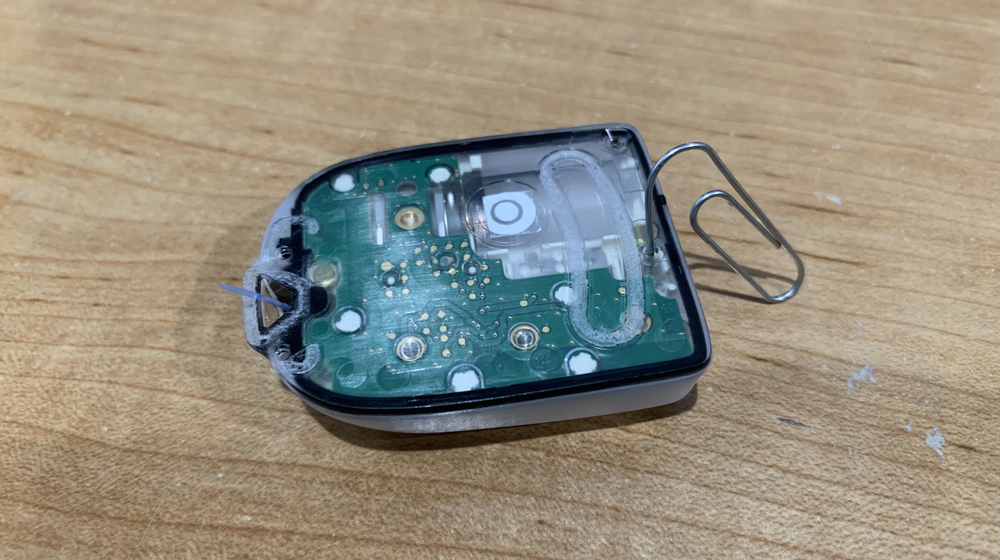

## Which pods work with the *Loop* app?

You can use DASH and Eros Omnipod pods with the *Loop* app. You cannot use Omnipod 5 pods.

You do not need the Omnipod Personal Diabetes Manager (PDM), just the pod supplies. Your insurance or pharmacy coverage may cover some of the cost.

!!! info "Alternative Names for Omnipod Pods"

    All three types of pods can be packaged five to a box, don't let the 5-pack indication confuse you. 

    * **Eros** pods are also known as **Classic** or **UST400**
        * The Reference number on the boxes should be similar to POD-ZXP425
        * They have a clear needle cap
        * Pharmacy sites sometimes may refer to the **Eros pods** as **Gen 3** but they are the same exact pods

    * DASH pods have DASH in the name
        * The Reference number on the box should be similar to POD-BLE-P1-525 (note the **P**)
        * They have a blue needle cap

    * Omnipod 5 pods have 5 in the name
        * The Reference number on the box should be similar to POD-BLE-H1-525 (note the **H**)
        * They have a clear needle cap

DASH pumps communicate with the phone via Bluetooth so they do not require a RileyLink compatible device.

## What about *Tidepool Loop*?

*Tidepool Loop* was approved by the FDA in Jan 2023, but at the current time, there are no announced pump or CGM partners. What does this mean?

*Tidepool Loop*, cleared by the FDA, is the first:

* App that provides automated insulin dosing **and** is configured to be fully interoperable with pump and CGM partners
* App that originated as a patient-led initiative

With this approval, there is now an FDA-approved pathway for independent selection of an app, a pump, and a CGM. Stay tuned for updates at [https://tidepool.org/tidepool-loop](https://tidepool.org/tidepool-loop){: target="_blank" }.

## Do I still need a PDM with Omnipod Loop?

No, pods are monogamous little creatures. They will pair with only one device at a time for safety reasons...so a pod is either paired with a PDM or your *Loop* app on your iPhone. In other words, your PDM can stay in the diabetes closet while you are Looping. You cannot use the PDM for a pod that has been activated with the *Loop* app. That doesn't mean you should get rid of your PDM if you have one. Instead, keep it for backup situations if you lose your phone. See below for what to do if you lose your phone or RileyLink.

## Can I cancel a bolus?

Yes, you can cancel a bolus in progress. In fact, because it is very easy to cancel, make sure your phone is locked prior to being put away to avoid inadvertently cancelling a bolus. (This behavior is very similar to the Insulet PDM - which also needs to be locked once a bolus has started.)

As soon as a bolus is initiated, look at your phone in portrait orientation.  You will see a bolus message indicating the progress of the bolus. This message is highlighted with a red rectangle in the graphic below. If you tap on this part of the display, the bolus is immediately cancelled.

* The displayed amount `Bolused` is based on the time since the bolus was started
* The *Loop* app will present that graphic for the entire time the bolus is in progress with the delivery amount updated based on time
* Once the bolus completes, the *Loop* app updates the actual delivery amount based on communication with the pod (taking into account any interruption of that bolus from the user or a pod error)

{width="300"}
{align="center"}

## Can I cancel a temp basal?

### Cancel Temp Basal with the *Loop* app

With *Loop* 3, disabling the setting for Closed-Loop immediately restores the basal rate on the pump to the scheduled basal rate, which effectively cancels the temp basal.

You can tap on disable Closed-Loop and then immediately tap on enable Closed-Loop if all you want to do is cancel the current temp basal. If you do restore Closed-Loop, then *Loop* will resume automatic insulin delivery adjustments within 5 minutes.

!!! tip "Bolus in progress"
    Even if a bolus is in progress, you can still switch to Open-Loop and restore scheduled basal. The current bolus continues unless you separately cancel the bolus.

### Cancel Temp Basal with *Loop* v2.2.x

If you are running *Loop* v2.2.x, the method for canceling a temp basal is to [suspend the pump and then resume delivery](../operation/loop-settings/pump-commands.md#suspend-delivery). This also interrupts any bolus that might be in progress.

Be sure to follow the suspend with the resume command. Otherwise, all insulin delivery is stopped and remains stopped until the user either clicks on the "Tap to Resume" command from the main screen or the "resume delivery" command accessed in the pump settings display. The resume insulin delivery command returns insulin delivery to your scheduled basal rate.

If a bolus was interrupted, the bolus will not resume.

As long as you are in closed-loop mode, the *Loop* app will resume automatic insulin delivery adjustments within 5 minutes.

## Can I set my own temp basal on Loop?

With version 3, the *Loop* app provides a [Manual Temp Basal](../loop-3/omnipod.md#manual-temp-basal) feature.

## What if I lose my phone or RileyLink?

For pod users, your pod will finish any currently running temporary basal rate and then revert back to your scheduled basal rate. Without a phone or RileyLink, however, you will not be able to affect any pod use; no basal change, suspend, cancel, or bolus. To do anything other than let basals continue, you will need to take action depending on the situation.

* Lost RileyLink only: You can replace your missing RileyLink with one from your backup supplies. No problem to [switch out to a different Rileylink mid-pod session](rileylink-faqs.md#adding-or-changing-rileylink). If you don't have a backup RileyLink to use, then you will need to remove the pod and put on a new pod paired with your PDM until you can get a new RileyLink. In the interim, you are still getting basal from the pod. If you are taking bolus insulin via injection, just add it to Apple Health under insulin. The *Loop* app will read it and keep making predictions for you. Once you inject, then add the carbs that go with that injection into Loop.

* Lost iPhone only: You will need to remove the pod and put on a new pod paired with your PDM or a backup phone (with a copy of the *Loop* app on it). You cannot use the old pod with a new device. In the interim, the pod will continue to deliver your scheduled basal until the pod reaches 80 hours. See [New Phone](new-phone.md) for more information.

* Lost both RileyLink and phone: You're having a really bad day. You'll need a hug and to follow the same directions as if you lost the phone as shown in the bullet above.

## Is there an increase in pod failures on Loop?

There is more communication between the pod and the controller (your *Loop* phone) than is typical with the PDM (Insulet provided controller). This increases the load on the pod battery. Most people have no increase in pod failures, but there are steps to take to limit "extra pod battery use". Every time the *Loop* app requests an update of the pod state or issues a command (bolus, basal schedule, temp basal), messages are exchanged with the pod.

* Set your correction range to be 10 to 20 mg/dL (0.5 to 1.1 mmol/L) instead of a single number
    * The number of commands will be reduced
* Keep your *Loop* app in the background or your phone locked when possible
    * This protects against accidentally issuing a command
    * When phone is unlocked and the *Loop* app is in the foreground:
        * An earlier release of *Loop*, version 3.0.0, pinged the pods more frequently to refresh status more quickly, but that was changed with 3.2.x. The pod state is now updated every 3 minutes for DASH and every 5 minutes for Eros whether in the foreground or background
    * If uncertain communications are detected at a time when the *Loop* app cannot determine if a dosing command sent to the pod was actually received, the app will try once a minute to get a response
            * The combination of Eros pods with a RileyLink device with poor signal may cause excessive battery use and contribute to pod faults

## What do I do if a pod fails to pair?

If you get a pod that is failing to pair, please see [this page](../troubleshooting/pod-pairing.md){: target="_blank" } for steps on how to fix the problem. Follow these steps before filling and trying another pod. If the pod is not screaming, you can probably recover it.

## What do you do to stop a screaming pod?

Screaming pods indicate the pod is out of insulin or out of time (80 hours) or there has been a critical pod fault.  In all these cases, there is no more delivery of insulin.

The first step is to use your phone to `Deactivate` the pod. You may need to go to the pod settings and tap on the Replace Pod row or the app may take you to the screen with a Deactivate button directly. This only works if the app is able to communicate with the pod.  Sometimes this is not possible. After you attempt to deactivate two times, the app will "discard" the pod as active if communication fails and enable you to pair a new pod. But you still need to make that noise go away.

If you are **not** successful at deactivating a pod and you've tried the steps at [Reset-Loop-to-Pump-Communications](../troubleshooting/red-loop.md#reset-loop-to-pump-communications), make sure the old pod is removed from the area before trying to connect a new pod. (Placing it in a microwave temporarily prevents the phone from detecting that pod.) The paperclip trick (next paragraph) only breaks the sound connection, the pod electronics is still active.

Once you have removed the screaming pod, it can be silenced using a paperclip. Simply put the paperclip in the small hole that is on the bottom (the side opposite where the cannula is) of the pod as shown. Push the paperclip in until you hear a little click, that click is breaking the circuit that connects the speaker to the electronics.

{width="500"}
{align="center"}
