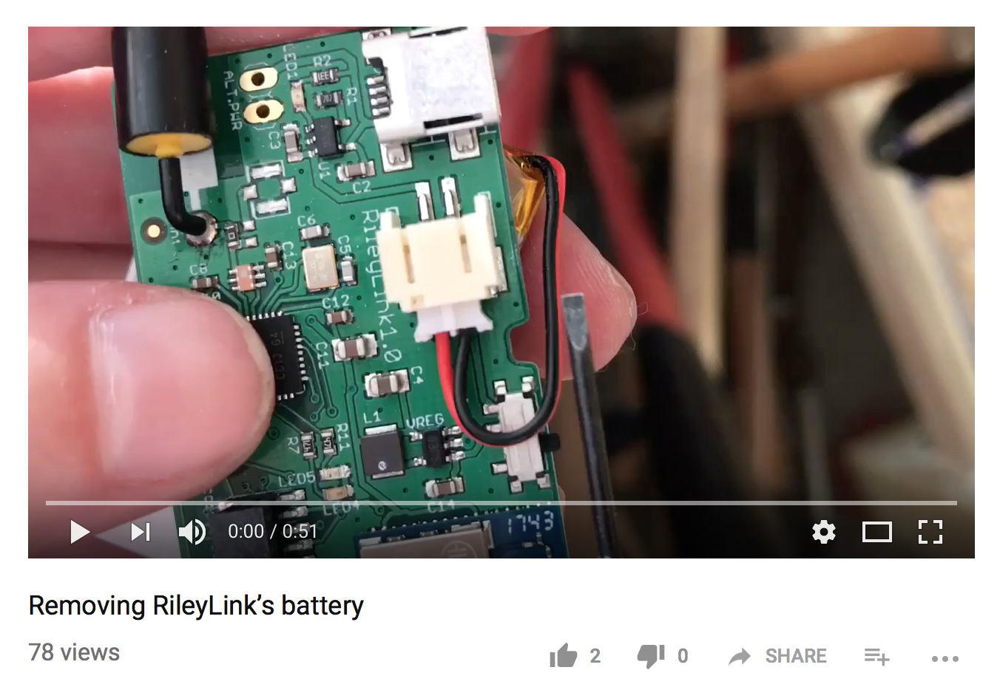

## RileyLink Compatible Device FAQs

A RileyLink compatible device is required to use the *Loop* app with Medtronic pumps or Omnipod Eros pods.

**A rileylink is not required with DASH pods.**

The device uses the RileyLink protocol to communicate information to/from your pump by radio communications and to/from your iPhone using Bluetooth. You will need the device within range of your phone and pump so that these communications can happen. Put it in a purse, pocket, SPIbelt. Clip it to a backpack, belt, or bra...but please do bring it with you..

Purchase information for these devices is found in [RileyLink Compatible Devices](../build/rileylink.md#rileylink-compatible-devices)

## Adding or Changing RileyLink

You can add or change the RileyLink compatible device in use without affecting the pump that is connected to the Loop app.  You can even have [more than one connected](#using-more-than-one-device), although only one will be used at a time.

If you are connecting to a new Medtronic pump or switching between Medtronic and Omnipod, please follow the [Change Pump Type](../loop-3/add-pump.md#change-pump-type) instructions under Set up App.

Change Connected Devices:

  * Open the Pump Menu for your connected pump
    * [OmniPod Eros](../loop-3/omnipod.md#devices){: target="_blank" }
    * [Medtronic](../loop-3/medtronic.md#devices){: target="_blank" }
  * Scroll down to the DEVICES section
  * There should already be at least one device listed
  * Power on your new device and look for a new device to appear in the list
  * If this device has never been connected before, it might appear as a blank line with a slider beside it - if so, slide the slider to turn it green and then the device name should appear
  * You can now turn sliders on or off to select which device you want to use with your connected pump
  * Refer to the [RileyLink Menu](../loop-3/rileylink.md) for instructions on personalizing your device name

{width="300"}
  {align="center"}

## Using More Than One Device

You can have more than one RileyLink compatible device turned on and connected. Loop only uses one device at a time. Remember - if you do have two devices in use, make sure they are both charged (or have batteries).

Example of using more than one device:

* One device is kept in the bedroom and another in the kitchen
* Loop will automatically switch to the device that is within Bluetooth range at the next cycle (Loop stays green)
* Caveats:
    * The phone needs to be close enough to get the CGM update
    * Do NOT forget to pick up one RileyLink device and take it with you when you leave the house

## Communications

All the RileyLink compatible devices communicate with the pump through radio frequency communications and with the phone through Bluetooth.

!!! warning "Bluetooth (BT) Troubleshooting"

    If your iPhone has BT issues, your Loop will have failures. There have been reports of BT audio devices (such as BT pairings in your car or home audio BT speakers) interfering with the Loop. If you are finding Loop failures frequently happening at a particular location, you may try to troubleshoot if there are BT problems in the area.

Your BT signal strength can be seen in the Loop settings, Pump settings, Device menu, on the `Signal Strength` line. As you move closer and further away from your phone, you can watch that number dynamically change. This line is **not** displaying the signal strength of your pump RF communications, just BT between the RileyLink compatible device and the phone.

You will notice the Signal Strength is a negative number and in units of dB. Remember that number line from elementary school?  A signal strength of -50&nbsp;dB is a stronger signal than  -80&nbsp;dB.  

{width="400"}
{align="center"}

## Range

The range at which RileyLink compatible devices will function is dependent on the environment that you are in and the specific device design. Both the OrangeLink and some sizes of the EmaLink have reported longer ranges than RileyLink (typically 10 to 20 ft) - but they still need to be "near enough".

What influences this distance for a given device? The biggest external influences are (1) body-blocking and (2) "noisy" environments. The human body is a lot of water, and water is an excellent blocker of wireless communication. So, sleeping on a pod and smothering it entirely with your body can decrease the ability of the device to communicate with the pod. Environments with a high concentration of wireless signals can also interfere with device communications and make closer proximity a benefit. Where might those kinds of situations happen? Concerts, conferences, and sporting arenas are pretty prone to interference.

Many people keep their device on the same side of their body as their pump during the day. They use a pocket, carabiner, lanyard, SPIbelt - the options are endless. What you don't want to do is put it in a blocking bag that has RFID blocking (some travel fanny packs have that).  

## What happens if Loop loses communication?

While you are out of the communication range for your RileyLink compatible device(s), any running temp basal will keep going until it finishes (the longest temp basal that Loop sets are for 30 minutes duration...so within 30 minutes or less your pump would go back to your regularly scheduled basal). When you come back into range of your device, Loop will pick back up within 5-10 minutes without you needing to do anything.

## Are these devices waterproof?

The electronics are not waterproof but there are waterproof cases available and some have wireless charging available. Check with the manufacturer.

[RileyLink Compatible Device Information](../build/rileylink.md#rileylink-compatible-devices)

## Firmware version

In Loop settings, tap on your pump, find your device (RileyLink or other) and tap on that menu. The figure below shows firmware specific to the RileyLink. If you have another type of device, the firmware value reported will be different. (Note - the displays for Ema, Orange and Riley have been updated to include device-specific features as shown in the [RileyLink Display](../loop-3/rileylink.md) page.  The graphic below shows the original RileyLink display.)

{width="350"}
{align="center"}

With RileyLink, the firmware displayed should match or be a higher version number than what is shown in the figure above, e.g., `subg_rfspy 2.2/ble_rfspy 2.0`. (If you are running with a very old RileyLink from pre-Aug 2018, it might be a lower number.) Check it when the device is working well and make a note of what it says. If you're having Red Loops, you might want to check firmware and connected state. Make sure, after power cycling your device, that the correct firmware is displayed AND that there are two items shown.  

* In the example above:
    * `subg_rfspy 2.2` is the sub-gigahertz radio frequency firmware that talks to the insulin pump (if this does not show up, the device will talk to the phone but not the pump)
    * `ble_rfspy 2.0` is the Bluetooth firmware that talks to the phone (if this is not working, you will not even see the device in the list)

HINT: You might need to quit the Loop app.  (Don't just close it, actually quit.) Then do the power cycle on the RileyLink compatible device to attempt to have both sets of firmware boot up.  When you restart the Loop app, it may show the correct firmware. Don't give up after one failure, try several times.

If several power cycles do not make the correct firmware show up, contact the manufacturer for assistance.

## OrangeLink Firmware

The OrangeLink devices allow the user to update the firmware on the device using an app on the phone itself (available for iPhone 7 and later devices).

* [OrangeLink Firmware Update](https://getrileylink.org/orangelink-firmware)

A number of OrangeLink Pro devices were shipped with FW2.6 and for people who already had OrangeLink devices, a version of FW2.6 was offered for download. However, this firmware did not work well with Loop (or AndroidAPS).  

* If you are having communication issues, update to the latest firmware FW3.2 using the link above
* If you are not having communication issues, the update is optional
    * For OrangeLink (not Pro, HW version 1.0), FW2.5 or FW3.2 are OK
    * For OrangeLink Pro (HW version 1.1), FW1.0 or FW3.2 are OK
    * See link above to check if versions newer than FW3.2 have been released, LoopDocs might not have the latest information

!!! warning "Firmware/Hardware Labeling"
    Earlier versions of the OrangeLink firmware did not put the hardware (HW) version and the firmware version (FW) in the "correct" location to hand off to Loop for interpretation. Do not worry if you are running on any FW version 1.x or 2.x and your HW version number doesn't say 1.0 or 1.1. This has been fixed for FW versions 3.x.

    Loop 3 is compatible with the OrangeLink.

## RileyLink Information

Since the RileyLink version of the communication link device has been around the longest, some additional information about that device has been added to LoopDocs throughout the years. The rest of this page is specific just to the RileyLink device.

## RileyLink Assembly

Your RileyLink will come with the Lithium-ion Polymer (LiPo) battery disconnected and the parts not already inside the case. It will be up to you to put the RileyLink in the case and attach the battery.

Make sure the LiPo battery is well-plugged into the connection. Line up the little ridge appropriately, and push fairly firmly to get the connection tight. Poor battery cable connection can make the Loop communications fail. See photos below, for example.

!!! warning "Common new user errors"

    The most common two errors for new RileyLink owners are (1) not fully pushing in the LiPo battery cable connection and (2) failing to charge the RileyLink. Compare your LiPo battery cable with the photos; it takes a bit of oomph to push that plug fully in like the photos shown below. Remember to charge your RileyLink each night.

{width="400"}
{align="center"}

Loose battery cable on left. Proper battery cable on right

Finally, the board and the battery fit into the slim case fairly tightly as well. Click on the image below to watch a helpful [assembly video](https://www.youtube.com/watch?v=-GHxxEJMCZc&feature=youtu.be).

## RileyLink Lights

The RileyLink has several lights that you may notice from time to time. There is no 'power' light. If you suspect that your RileyLink is not being powered, try turning it off and on using the small sliding switch. You should see lights in the middle of the board flash when you do this. If they flash, that means the board has power.

* Red light: Charging light. The red light will remain on while RileyLink is charging, and it will turn off when charging is complete. You may notice the red light turn on periodically even after charging is complete...it's just "topping off".

* Green light: Bluetooth connection light. The green light will remain on while you have a BT connection with your iPhone. If that green light fails to stay on, you should troubleshoot your BT connections. Try restarting BT on your iPhone and/or turning the RileyLink off/on by its power switch.

* Blue light: Pump communications. If you have an older firmware on your RileyLink, some of the blue lights will flash periodically as it communicates with the pump. It's just letting you know that it is busy talking and collecting info. You will also see increased blue flashes if you have "Enabled Diagnostic LEDs" for Medtronic users that have the RileyLinks with updated firmware (shipping since late August 2018).

A solid blue light that consistently remains lit on the board could mean one of two things:

* A temporary issue that can be resolved by rebooting the RileyLink physically (turning the switch off/on), or

* An electrical short or damage to the board. Sweat and moisture are most likely culprits, so try to keep case free from those environments. Don't keep RileyLink in sports bras or waistband next to skin, for example, while exercising.

If your blue light remains on despite trying a restart, it is time to pull out your backup RileyLink.

## RileyLink Charging

The battery that comes with RileyLink is not charged completely when it is shipped, so be sure to charge it up before initial use. RileyLink takes about 2 hours to fully charge (the red light will turn off when fully charged, read note above about red light patterns) and should easily last at least a full day of constant Loop use. Typically, it can go into the 30-hour range without any problems. Most people charge their RileyLink each night when they are sleeping. You don't have to worry about leaving the RileyLink plugged in "too long" for charging. It will automatically stop charging the battery when it is fully charged.

Since the best practice is to charge your RileyLink overnight while you sleep, and the battery lasts safely over 24 hours, there is no battery level indicator for the RileyLink. The RileyLink's charge level is not viewable on Nightscout, nor within the Loop app. If you forget to charge your RileyLink overnight, you can recharge it with a portable USB battery in a pinch. A [short mini-USB cable](https://www.adafruit.com/product/899) could be a good addition to a small gear bag.

### What are the differences between the RileyLink Medtronic and Omnipod Antennas?

There are two types of antennas for RileyLinks; each antenna is optimized for the pump you are using. Otherwise they are identical. See [RileyLink Compatible Devices](../build/rileylink.md#rileylink-compatible-devices) for other devices.  The OrangeLink has both antennas included in its design and can talk to either Medtronic or Omnipod.  The EmaLink requires selection for type of pump.

!!! note ""
    The color of the RileyLink circuit board in the photos below is irrelevant.

{width="650"}
{align="center"}

### What will happen if your RileyLink has the wrong antenna?

You can *technically* use that RileyLink with either pump on Loop. But, you will have significant frustrations and probably a lot of red loops. With mismatched antenna/pump, the device needs to be very close (think inches) and in clear line-of-sight to pump/pod. This makes everyday living (and sleeping) a bit hard. If you use the appropriate-antenna-for-your-pump device, the distances the pump/pod and RileyLink can tolerate from each other is much more "real world" friendly and stable. The OrangeLink contains both antennas so will work with either pump. This may be a good choice if you like to switch between Medtronic and Omnipod.

In a pinch, if you have a RileyLink that you used with a Medtronic pump and have switched to Omnipod, it might work as a backup, but you won't love it.

## How long will my RileyLink go between charging?

RileyLinks can go about 30-36 hours on a single charge. There is no way to see the remaining charge level, so most people just get into the habit of charging overnight while they sleep. The actual time to fully recharge is about 1 or 2 hours; you'll know it is fully charged when the red light turns off. After a full charge, the red light will turn off and then periodically turn on for short times while it "tops off" while still on a charger.

### How can I tell how much charge my RileyLink has?

You can't. There is no charge level indicator. Just charge it nightly, and you won't have a problem. Full battery charge should last about 30-36 hours depending on battery health. Charging takes less than 2 hours.

## How long will my RileyLink battery last?

Eventually, Lithium-ion Polymer (LiPo) batteries will lose charging capacity. You would want to replace if you notice the battery not lasting the full day. Many people report using their battery for more than 2 years without issue.

Be aware that if a battery is failing, it may swell. If you notice that the RileyLink battery is swollen, remove the swollen battery from your home and place in a fire-safe area and recycle it properly.  Either order a new battery or pull out your spare.

After a year of use (and a year of being dropped), the antenna may no longer be securely soldered. If you are getting a lot of red loops, it might be a poor antenna connection instead of a failing battery. Check the solder joint at the antenna. The solder should be shiny and the antenna base should be firmly attached to the board.

### RileyLink Battery

Keep your RileyLink and its Lithium-ion Polymer (LiPo) battery protected from damage. LiPo batteries are unsafe when damaged or punctured, so the case is an important part of safe Looping. If your battery is damaged in some way, please disconnect it immediately, and dispose of it (it should be recycled). You can order new RileyLink batteries on the [GetRileyLink website](https://getrileylink.org/)

## RileyLink Battery Removal

To remove the LiPo battery from the RileyLink, please do so slowly and patiently. Work the battery connection side to side slowly to loosen it from the plug. Some people have reported success using small, curved needle-nose pliers such as hemostats. Others have used small flathead screwdrivers as shown in [this video](https://youtu.be/s2qNPLpfwww).

