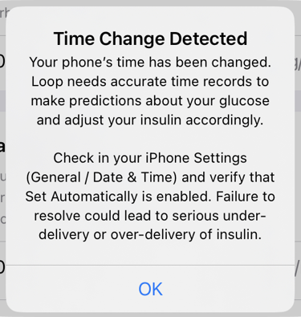

## The *Loop* Phone Must be on Automatic Time

!!! danger "The *Loop* Phone is a Medical Device"
    There have been several instances where a Looper disabled automatic time to change the time on their *Loop* phone.

    As of January 2023, this change in time is detected and the *Loop* app stops all automatic dosing of insulin other than your scheduled basal rates and begins to aggressively warn the user.

    One scenario should be enough to convince you not to do this:

    * Glucose is 180 mg/dL (10 mmol/L) when you set time one day ahead (for a game)
    * Later you return time to automatic and think nothing of it
    * As soon as automatic time is restored, the *Loop* app thinks your eventual glucose will be the future value (in this example 180 mg/dL) and attempts to bring you to your correction range
        * If you are running a very old version of the *Loop* app, dosing could continue based on that incorrect future glucose value

### Force Automatic Time

You can configure the iPhone to only allow automatic time.

* Under iOS Settings, select Screen Time
* Scroll down to the Lock Screen Time Settings row
    * Enter a passcode

The ability to use anything other than automatic time is disabled as long as that iOS setting has a passcode. Parents can use this for children. Adults can use this too in case they need a reminder not to change the time - you must first disable the passcode.

This does not affect automatic time zone changes, those are handled by the phone without need for interaction.

### Remove Future Glucose

If you have future glucose from a manual time change or just entering something into Apple Health with the wrong timestamp:

* You **MUST** go into Apple Health and remove any glucose values in the future
* The *Loop* app detects the future glucose and stops looping
    * It might not be completely obvious why Loop stopped, but you will get a red loop within 15 minutes and Loop is not Looping notifications starting at 20 minutes
    * If you tap on the bolus icon, Loop informs you it detected invalid future glucose
    * If you tap on the glucose icon - it takes you to your CGM which probably has a very different number from that shown on the main Loop screen
* If you also use Nightscout **and** have the upload CGM readings enabled in Loop, those future glucose values will appear in Nightscout
    * To fix this problem (after you fix Apple Health), use the [Admin Tools in Nightscout](https://nightscout.github.io/nightscout/admin_tools/){: target="_blank" } to remove future treatments and future entries

The *Loop* app is very aggressive at warning you if you make this mistake. you will get a notification - even when you are in a different app. The graphic below shows the alert when you next view the *Loop* app after turning off automatic time and changing the time. Even if you respond right away, you may have at least one glucose reading in the future when you see this alert. Please [Remove Future Glucose](#remove-future-glucose).

{width="350"}
{align="center"}

The rest of this page is about changing time zones.

This is safe because the *Loop* app keeps track of records internally using UTC.

## Time Zones, Daylight Savings Time, Summer Time

The *Loop* app operates across time zones and time changes. The phone that is running the *Loop* app will automatically update the time, but you choose when to modify the time zone for "pump time".

What Therapy Settings are set by "pump time"?

* Basal Rate Schedule
* CR and ISF Schedule
* Correction Range Schedule

Time Change comments:

* The Pump Settings screen is used to modify time zones
    * Tap on Pump Status Icon from the HUD
    * or Loop->Settings->Pump
* Travel
    * There is no urgency to update the pump time to match the wall-clocks when traveling
    * For short trips, many Loopers just leave the pump time alone
* Time Change (Daylight Savings Time or Summer Time)
    * Most people want to update their pump time immediately after the clocks change
* A Clock Icon is seen in the HUD Pump Status display when pump time differs from phone [Time Zone](../loop-3/displays-v3.md#time-zone){: target="_blank" }

!!! warning "Medtronic Users"

    **Do not use the Medtronic pump menus to change your pump's time when Looping.**

## iPhone

The *Loop* app will warn you if your phone does not have time configured to automatically update. The configuration is under iOS Settings -> General -> Time & Date.

**Do not** ever adjust the time manually on your Looping phone to "defeat" time-based rules for a game. Your phone with the *Loop* app is now a critical medical device - make sure anyone who uses your phone understands this.

## Minimed Pump and CGM

The Minimed pump doesn't expose a universal clock, instead it exposes the components of a date (YMDHIS). It has no concept of political time zones, and just continues to increment its components on schedule. Therefore, the *Loop* app assumes that the pump's date, until changed, remains at a fixed offset from UTC.

That offset is stored by the *Loop* app the first time the pump ID is changed, and every time the pump's time is changed using the "Change Time Zone" command.

## Dexcom CGM

No particular input is needed on your part for the *Loop* app to work with Dexcom CGM data. All times use UTC.  However for Dexcom receiver users, at time changes you may want to manually change your receiver's time setting just so the time visually appears correct when you are viewing the screen.

## Airports

RileyLinks, pumps and CGM have no problem going through any of the airport security systems. You can carry it with you in the airplane cabin and it can go through the x-ray scanner that your carry-on bags go through.

## Airplane Mode

Nothing wrong with airplane mode, but many people forget about it at the time they travel. So, you can do this simple preparation step now:

Turn airplane mode on. Then make sure your Bluetooth is still slid “on”. If Bluetooth isn’t on, then go slide it on again. Now go ahead and turn airplane mode off again.

Why did we just do that? Because in older versions of iOS, airplane mode turned off Bluetooth the first time you ever use it. New iOS don't do that, but worth checking.

But, if you remember to turn Bluetooth back on while in airplane mode, two things happen (1) your CGM and the *Loop* app will work while in airplane and (2) airplane mode will “remember” the next time that you like Bluetooth left on in airplane mode and will not turn it off the next time you slide airplane mode on. So now you’ve just prevented yourself from forgetting to turn Bluetooth on the next time you fly and are in a hurry to meet your lovely seat mate and stow your luggage. You can safely follow cabin instructions and put phone in airplane mode without losing access to the *Loop* app or CGM.

