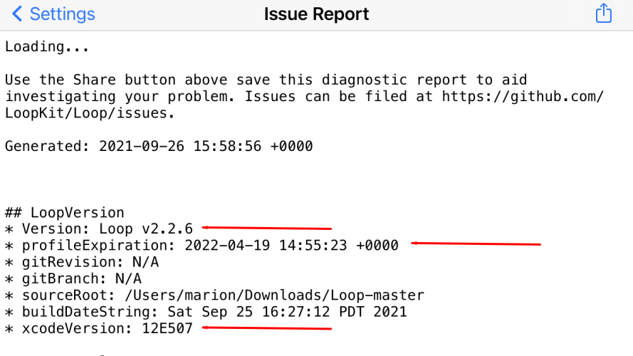

## Updating/Rebuilding Loop FAQs

First, please take a minute to understand what the words mean.

* "Updating Loop" is the process of downloading a new version of Loop code 

* "Rebuilding Loop" is the process of building the same version of Loop code

In both cases, you build the code to install over an existing app on your phone or onto a new device.

!!! important "Check *Apple* Developer Account"
    If you have an updated agreement, be sure to accept it before you update or rebuild.

    * [<code>Apple Program License Agreement</code>](https://support.pushpay.com/s/article/Accepting-the-Apple-Program-License-Agreement)

* If you use the Mac-Xcode build method:
    * First make sure your Mac operating system and Xcode version are compatible with your iPhone version, and then
    * Easiest method is to use the [Build Select Script](../build/step14.md#build-select-script) which automatically downloads the latest released version of the code every time
    * See note below if your internet speed or your Mac is very slow
* If you use the GitHub Browser build method:
    * Follow the steps on [GitHub Update](../gh-actions/gh-update.md)
    * Within an hour that new build should be available via TestFlight to install on your phone

??? tip "Slow Internet / Slow Mac? (click to open/close)"
    If you have a very slow download speed or if you do a lot of customizations, it may be worth your time to decide if you need a new download.

    * Use Finder to check the date of your last download by looking in the Downloads/BuildLoop folder
    * Check the date of the last Loop release at [GitHub LoopKit/Loop release page](https://github.com/LoopKit/Loop/releases)
    * If the date in Finder is after the release date, follow [Find my Downloaded Loop Code](../build/code_customization.md#find-my-downloaded-loop-code)
        * Double click on the Loop.xcworkspace file in that folder
        * This opens Xcode and you can just plug in your phone and build with your existing download

## When Should I Update?

* **Best Practice**
    * Build if a serious bug-fix is reported
    * Build, two to four times a year so that it becomes easier and you are ready in case of an emergency
    * Each time you build, the app expiration date is bumped out a full year for Mac-Xcode build method and 90-days for GitHub Browser build
* **Required**
    * When your expiration date forces you
    * Do not wait until the app expires - it will stop working; see [Loop is No Longer Available](../build/updating.md#loop-is-no-longer-available)
    * Hint - start a few weeks early and take your time
* **Optional**
    * A new version of Loop is released and you want to install it
    * You want to try a different branch or fork of Loop

### Steps to Update

Updating Loop is the same idea as what happens to your other apps on your iPhone when you update them from the App Store on the phone. A refreshed version of the same app appears on the phone, simply updating-in-place the same Loop you were using with an updated version.

* Do **NOT** delete your current app from your phone - even if it says "Loop is No Longer Available"
* There are files stored on your phone that will be read in as soon as the new Loop app is installed
* If you deleted your app, then you have to enter all your settings again
    * This is a good time to configure your phone to avoid accidental deletion
    * Do an internet search like this: "iOS 15.4 prevent app deletion" where you use your current phone iOS version number and follow the instructions

#### Typical *Apple* Update Schedule:

* Each September, *Apple* releases a major iOS version which typically works with the current macOS but requires a new Xcode version
* Each September, *Apple* releases a major macOS version (but doesn't require you to update your Mac, yet)
* Each March, you must update to the current macOS (major version) to continue building applications

## Where should I start when I want to update my Loop?

### Check your Developer Account

Regardless of build method, always check your *Apple* Developer Account status.

*Apple* updates its License Agreement for the Developer Program frequently. You need to login to your [developer account](https://developer.apple.com/account/) to manually check if there is a new agreeement to accept.  If you see a big red or orange banner across the top of your Developer Account announcing a new license agreement like shown below...please read and accept it before building Loop.

#### Updates with the GitHub Browser build method:

Go to [GitHub Update](../gh-actions/gh-update.md) and follow the instructions.

#### Updates with the Mac-Xcode build method:

**ALWAYS start with the [Update Loop page](../build/updating.md) before any new Mac-Xcode build that you'd be doing.** That page is important because it will offer information on the updates you may need for your Mac and Xcode before building.

Do not simply build with your old downloaded folder from months ago. There is a high likelihood that your original code from awhile ago is outdated and might not build with the current phone iOS. Grab new code and you will get the compatible version that has all the latest and greatest features and bug fixes.

## Will I have to delete my old Loop app?

No. Do not delete your old Loop. In fact, that is a bad idea as you will lose your currently paired pod and/or settings if you do that. So, don't delete.

**The exception to the rule is if you build Loop 3 on your phone and want to return to Loop 2.2.x or any FreeAPS fork.**

* Refer to [What if I change the branch or fork?](#what-if-i-change-the-branch-or-fork)

## Does updating make a separate, second Loop app?

No. Loop is simply updated in-place, written right over the old version.

The only exception to this is if you update/build using a different developer signing team than your current Loop app.

* The app's identity on your phone is defined by the developer ID.
* If you change that unique ID, your phone interprets that as a unique app as well...giving you two Loop apps on the phone.
    * Therefore, if changing developer accounts...you will get a new Loop app, and you would need a new Pod.
    * You'll need to transfer your settings manually to the new app and delete your old app.

## Will my settings be saved when I update?

Yes. That's why we don't delete the app. Your settings will be saved so long as you use the same developer ID.

## Will my pod still work when I update?

Yes. So long as you use the same developer ID as you originally built the app with before.

## How can I confirm what version was installed?

The Loop version is given at the top of the Loop settings page.

There is more detailed information about how the Loop app was built at the top of the Issue Report (Loop -> Settings -> Issue Report) as shown in the graphic in the next section.

## How can I confirm Xcode version I used?

The information in the graphic below includes the Xcode version number used for the build. In this case, the major version for Xcode is 12 and the minor version is 5 (E is the 5th letter of the English alphabet).  The main thing to notice for this example is the Loop app was built with Xcode version 12.5. If this phone was subsequently upgraded to iOS 15, the Loop app would continue to work.

**DO NOT INSTALL iOS 15 if the Xcode version on your Loop build is 12D or earlier - the Loop app will immediately stop working and you will have to rebuild Loop.**

{width="500"}

!!! info "Profile Expiration"

    * The profile expiration will not be shown for Loop v2.2.4 or earlier.
    * For this example, the profile expires much sooner than 12 months after the Loop app was built
        * [Updating: Delete Provisioning Profiles](../build/updating.md#delete-provisioning-profiles) provides instructions to delete your old provisioning profile when building your Loop app - this gives you a full year after you build

## What if I change the branch or fork?

Does not matter. Changing the branch and even the fork is an "updating Loop" action. Nothing about the information above changes with the following exception.

**The exception to the rule is if you build Loop 3 on your phone and want to return to Loop 2.2.x or any FreeAPS fork.**

* In this case, the database storage is different between Loop 3 and Loop 2.2.x
* Loop 3 can read the data stored by Loop 2.2.x, but the reverse is not true
* If you are downgrading from Loop 3 to FreeAPS, you need to first record settings, delete the old app and then build the desired app, enter your settings and add your pump (new pod required for Omnipod)

## What if I'm changing phones?

Changing phones is a little different than just [updating](../build/updating.md).

* When you change phones, *Apple* will force you to the latest iOS version for your new phone
* Update your old phone to the latest iOS the hardware supports - this simplifies the automatic transfer process *Apple* provides to move all your data and apps from your old phone to your new phone

!!! abstract "New Phone Checklist for *Mac-Xcode Build*"
    * Make sure your Mac and Xcode versions are compatible with that iOS version
    * If your old phone cannot support the latest iOS version, then build Loop to a simulator that matches the expected iOS for your new phone
    * If your Mac will not support the correct version of Xcode needed by your new phone, consider using [Browser Build](../gh-actions/gh-overview.md)

!!! abstract "New Phone Checklist for *Browser Build*"
    * The Loop app will install from TestFlight onto the most recent iOS
    * If a new version of Loop is available, updating before transfer to a new phone is preferred but not required

!!! abstract "Transfer to the New Phone"
    * You can use the old phone as your looping phone until you get the new one ready
        * When turning the old phone in for a rebate, you typically have a week or two before you have to turn it in
        * When you transfer information from your old phone to your new phone, all the Loop settings files get copied to the new device including information about the pod (if one is running)
        * Install Loop on the new phone (all your settings should be there)
            * Install via *Mac-Xcode Build* or from *TestFlight* for *Browser Build*
        * It's a good idea to do this at pod change time, just in case, and to record (or screenshot) all your settings
    * Once the transfer is completed check [all your settings and all your permissions](../loop-3/settings.md) on the new phone

You can find more detailed instruction in [Loop and Learn: New Phone](https://www.loopandlearn.org/new-device). That article includes Dexcom instructions for the new phone.

## How long does it take?

Assuming your macOS and Xcode updates are done, then plan on about 30 minutes.
