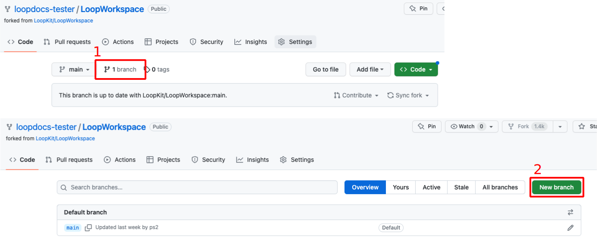
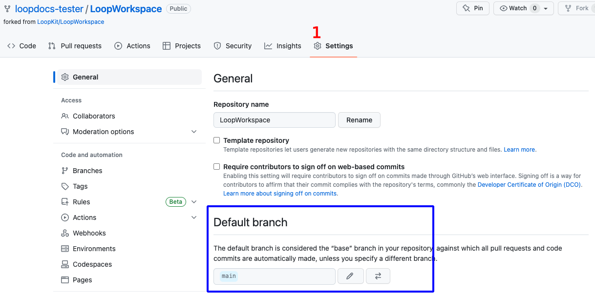
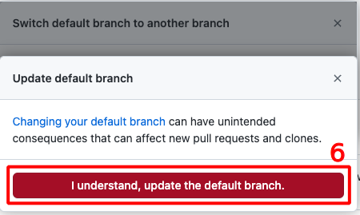

## Overview

**This page is only relevant when building the `dev` branch with a browser.**

**For *Mac*, please see: [Build Loop `dev` with *Mac*](../build/build-dev-mac.md)**

**No matter the method used to build Loop-dev, you are testing development code. Please read this link now before continuing.**

* **[What's going on in the `dev` branch](../version/development.md#whats-going-on-in-the-dev-branch)**

## Build Development Version

!!! warning "For Experienced Builders"
    Building the development (`dev` branch) is not typically used for your first attempt at building the *Loop* app.

    The instructions on this page assume you are familiar with building the *Loop* app using a browser as detailed on [Configure to use Browser](gh-first-time.md)

    * You should be following along with zulipchat when using the `dev branch`
    * Summary build updates can be found under the [One-Time Changes](#one-time-changes) section

You can build any desired branch (available at LoopKit/LoopWorkspace) using the *GitHub* Browser build method. This section is suitable if you have already built either `dev` or main branch using the [GitHub First-Time](gh-first-time.md) instructions.

The graphics on this page show the `dev` branch. If you want a different branch, just substitute that branch name for `dev`.

!!! tip "Overview of what you will do"
    1. Your `LoopWorkspace fork` must have the `branch` you want
        * You will either add it or make sure it is up to date
        * You cannot just rename your existing branch to `dev` - you must get the `dev` branch from LoopKit
    1. When you select the action `4. Build Loop` and then click on the `Run Workflow` dropdown, you must select `dev` there before clicking the green `Run workflow` button - see [Build `Branch`](#build-branch)

### Check Current `Branch`

Your `LoopWorkspace fork` is at `https://github.com/username/LoopWorkspace` where you substitute your actual *GitHub* `username`. You need to be logged into *GitHub*. Review the graphic below as you go through the steps.

1. Click on the `branch` icon to display the `branches` as shown in the lower half of the graphic below:
    * If the `branch` you want is not listed, then continue with Step 2
    * Otherwise, skip ahead to [Update `Branch`](#update-branch)
1. Click on the `New branch` button and follow the [Add `Branch`](#add-branch) steps

{width="700"}
{align="center"}

### Add `Branch`

Each step in the list below matches with the number in the graphic. In the top half of the graphic, the left side shows the initial display and the right side shows the display after making the indicated selections:

1. Click on the drop down menu labeled 1 in the graphic and choose LoopKit/LoopWorkspace as show in the top right graphic
2. Click on the drop down menu labeled 2 in the graphic and choose `dev`
3. Click on the `Branch` name box labeled 3 in the graphic and type `dev`
    * The branch name in your `fork` should always match the branch name you are adding; check that you type it correctly
4. Review the dialog items to make sure everything is correct and then tap on Create branch

{width="700"}
{align="center"}

### Update `Branch`

Tap the `Code` button (upper left) and ensure this branch in your `fork` is up to date.

* Select the desired branch in the dropdown menu (this graphic shows `dev` branch)
* If the message indicates this branch is "behind", tap on the sync `fork` button and then the Update branch button

{width="700"}
{align="center"}

### One-Time Changes

Look in this section for one-time changes for building `dev` with a browser that require special, one-time actions. 

If you have already completed the One-Time Changes, skip ahead to [Build `Branch`](#build-branch).

#### Transition to `dev`

When updating from&nbsp;_Loop_&nbsp;3.2.x to `dev`, you will need to take some extra steps. 

You have a choice:

* You can change your default branch to `dev`, see [Change Default `Branch`](#change-default-branch) and then your&nbsp;_Loop_&nbsp;app will be automatically updated and automatically built at least once a month
    * Be sure to review the [Modify Automatic Building](automatic.md#modify-automatic-building) section
* You can leave your default branch at main, but no automated updates will happen
    * Running each action below requires you to select the `dev` branch in the drop-down menu

Here is a summary of the extra steps; each step has an associated link. This assumes you have already updated your `fork` and are at the correct branch.

1. Confirm the status of your &nbsp;*GitHub* Personal Access Token
    * It should be configured with permission scope of `repo, workflow` and to never expire
    * You can check this using directions at [*GitHub* Token](gh-update.md#github-token)
1. Next, follow along in this section to perform these steps before you build
    * Add and Update `New Indentifier`
    * `Create Certificates`

#### Automatic Creation of `alive branch`

!!! warning "What about the `alive branch`"
    * Sometimes you get an error about the `alive branch`
    * It should be created for you automatically if you are building with the `dev branch` **and** you have `workflow` permission added to the `scope` for your *GitHub* `Personal Access Token`
    * If necessary, delete the `alive branch` and run the `Create Certificates` again

#### Add and Update New `Identifier`

The `bundle ID` for the "`widget`" changed from "`SmallStatusWidget`" to the more descriptive "`LoopWidgetExtension`".

* You need to run Add Identifier - be sure that you run this for the `dev branch`
* Wait for it to succeed
* Add the `App Group` to this one new Identifier

All other identifiers should be already set up. If they are not, please go through the steps on the [Configure to Use Browser](gh-first-time.md) page to figure out what you are missing.

| `NAME` | `IDENTIFIER` |
|-------|------------|
| `Loop Widget Extension` | `com.TEAMID.loopkit.Loop.LoopWidgetExtension` |

* Open the [Certificates, Identifiers & Profiles: Identifiers List](https://developer.apple.com/account/resources/identifiers/list){: target="_blank" } page.
* Click on the "`LoopWidgetExtension`" identifier
* Edit the App Group to include `group.com.TEAMID.loopkit.LoopGroup` where you use your `TEAMID`

#### Create Certificates and Build

You must create certificates again to cover the new Identifier name and to provide support for the addition of the Libre sensors. (This step is required whether you use Libre or not - Loop needs permission to have that capability). Once the certificate action succeeds, then run the action to build Loop.

1. Run the Action for Create Certificates - be sure that you run this for the `dev branch`
1. Run the Action for `Build Loop` (see [Build `Branch`](#build-branch))

### Build `Branch`

If you want a branch to be the one you build all the time, you may choose to [Change Default `Branch`](#change-default-branch). This is not necessary except for special cases.

If you have one branch as default, for example main, and choose to build a different branch, there is an extra step when you `Build Loop`. Refer to step 4 in the graphic below. Use the branch dropdown menu to select the branch you want before hitting the green Run workflow button.

{width="700"}
{align="center"}

!!! 

## Change Default `Branch`

There can be several reasons why you would change your default branch.

* It can be convenient to have the branch you build most be configured as the default branch
* The branch you want to build has a different workflow than your default branch (not typical)
    * In this case, you **must** modify the default branch
    * Check the zulipchat conversation about the branch you are testing to see if it is necessary to make it default

These are the steps to modify the default branch.

For this example, we show how to change from a default branch of `main` to a default branch of `dev`. Note - only the owner of the repository can take this action and they must be logged in. Otherwise the Settings tab does not appear.

For the numbered steps below, refer to the graphic found under each group of steps.

1. Click on the Settings Icon near the top right of your LoopWorkspace
    * You may need to scroll down to see the `Default Branch` as shown in the graphic
    * Do not tap on the Branches tab to the left under Code and Automation, that is not the correct menu

    {width="700"}
    {align="center"}

1. To the right of the default branch name there is a pencil and a left-right arrow icon
    * Tap on the left-right arrow icon to bring up the `Switch default branch to another branch` dialog
1. Click on the dropdown next to the current default branch, in this example, `main`
1. Select the desired default branch, in this example, `dev`
1. Click on the `Update` button

    {width="700"}
    {align="center"}

1. You will be presented with an are-you-sure question.
    * Click on the red `I understand, update the default branch.` button

    {width="400"}
    {align="center"}

Your default branch has been changed.

## Automatic Update & Build

The automatic update and build features of the development branch are only available if you set the `dev` branch as your default branch. Be sure to read the [Automatic Update & Build](automatic.md) if you did this.