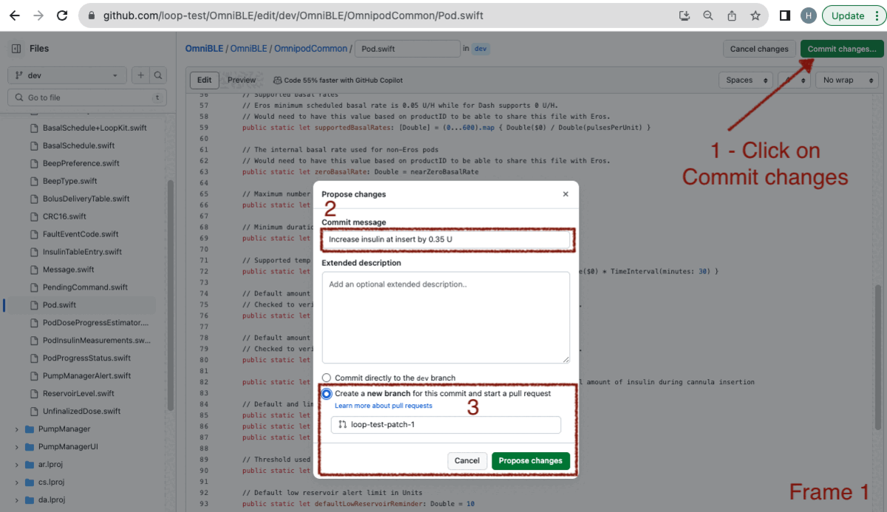

## Hot Topics

!!! tip "Pro Tip"
    The method on this page allows you to create a set of personalized customizations that you can use in addition to the [Loop and Learn: Prepared Customizations](https://www.loopandlearn.org/custom-code#prepared-custom-list). You can use (and re-use) your customizations with either Browser Build or Mac-Xcode builds so you don't have to repeat the customization with every update.

    * If you are building with Mac-Xcode method, you can use the same lines prepared for Build with Browser method and simply paste them in your terminal at the&nbsp;<span translate="no">LoopWorkspace</span>&nbsp;folder to customize your code
    * You can often use the same customization for several releases
    * If a customization that you prepared for an older release says "does not apply" when you use it, you'll need to prepare a new one


!!! warning "Modules vs Submodule"
    This page has instructions to set up your own copy for the Modules, otherwise known as submodules, associated with&nbsp;<span translate="no">LoopWorkspace</span>&nbsp;that are needed for a selected customization.

    Each Module has its own&nbsp;<span translate="no">GitHub repository</span>&nbsp;and you will be working with your copy of that Module at https://github.com/username/Module, where username is your username.

!!! warning "Copy vs&nbsp;<span translate="no">Fork</span>"
    We use the word "copy" on this page but when you look at&nbsp;<span translate="no">GitHub</span>, you will see the word&nbsp;"<span translate="no">Fork</span>".

!!! question "What is a SHA-1?"
    SHA-1 means Secure Hash Algorithm 1; which is used to generate an alphanumeric code.

    Each time you save a change to your&nbsp;<span translate="no">GitHub repository</span>, a unique SHA-1 is created. That identifier is used to tell&nbsp;<span translate="no">GitHub</span>&nbsp;a specific change that you want applied. These work for any compatible copy taken from the original&nbsp;<span translate="no">GitHub repository</span>.
    
### Do Not Make a Pull Request to Original Copy

!!! important "Ignore&nbsp;<span translate="no">Compare & pull request</span>&nbsp;Prompts"
    Please do not click on boxes that&nbsp;<span translate="no">GitHub</span>&nbsp;might show you that ask if you want to**&nbsp;<span translate="no">Compare & pull request</span>**.
    
    This would be an attempt to merge changes from your copy back to the original version that everyone uses. These changes are for you only. Ignore those prompts.

## Overview

!!! info "Time Estimate"
    * About half an hour to an hour per Module
        * Typically 1 or 2 Modules
    * Ten minutes to add patch lines to your build_loop.yml file
    * One minute to start the build
    * An hour before the build shows up on your phone in&nbsp;<span translate="no">TestFlight</span>

!!! abstract "Summary"
    * Prepare Customization (One Time):
        * Once you have prepared a given customization, you can use it again with each update
        * If there is an update (new release) and the customization is no longer valid - you will get a clear error message
            * Just follow the steps on this page again to replace the customization that did not work
        * If there is an update (new release) and the customization applies with no errors, then you do NOT need to create an update
        * It is a good idea to test each customization as soon as you install the new build on your phone
    * LoopDocs: Decide on Modules to modify using the [LoopDocs: Code Customization](../build/code-customization.md) page
        * You only need to create your own customization if what you want is not provided at [Loop and Learn: Customization List](https://www.loopandlearn.org/custom-code#custom-list)
    * <span translate="no">GitHub</span>&nbsp;(each Module):
        1. Copy Module (if needed) - this is your copy where you will make changes
        1. Sync the Module (if needed)
        1. Make the desired modification(s) using the pencil tool
        1. Save your changes
        1. Prepare lines needed for each customization and save
    * <span translate="no">GitHub (LoopWorkspace)</span> - using your copy where you will make changes
        1. You will use the pencil tool to edit build_loop.yml
        1. Add customization lines to the file
        1. Save your changes
        1. Action 4: Build Loop
    * Phone: Install with&nbsp;<span translate="no">TestFlight</span>

!!! question "FAQs"
    - **Do I need a Mac computer?** No. This can be done on any browser.
    - **Should I build without customizations first?** Yes. Make sure the build process works without customizations. You don't need to install the build on your phone, just make sure it builds without errors before you start modifying.

## How to Customize Build with Browser

You do this using any browser on a computer or laptop. (Phone is not recommended - screen is too small.)

There is some background information at the bottom of this page starting at&nbsp;[<span translate="no">LoopWorkspace</span>](#loopworkspace)&nbsp;if you want to know what you are doing. Otherwise, just follow the steps like a cookbook.

## Decide Which Modules You Want to Modify

Decide which [LoopDocs: Code Customization](../build/code-customization.md) changes you want to make. Each customization lists a Module name.

* DASH Pods: Use OmniBLE
* Eros Pods: Use OmniKit
* Other Modules are Loop and LoopKit
    * Do not get confused later: LoopKit is both a username and a Module name
    * Refer to the [Module Table](#module-table) when directed

## Outline of What Happens in the Module

!!! warning "Review Only"
    Review this section so you know what to expect. The actual steps will come later, starting with [Create your Copy for Selected Module](#create-your-copy-for-selected-module) or [Edit Module in Browser](#edit-module-in-browser).

In the next sections, the exact process for making changes will be documented. But the steps may feel confusing. This section tries to explain what you will be doing once you start editing with a given Module.

1. Make a copy if you don't have one
1. Change the line(s) of code desired for your customization(s)
1. Save the change(s) using descriptive comments
1. Repeat until done with this Module

Later, you will use information from your copy to create your customizations. (Suggestion - use same file as your Secrets, or at least keep the customization file in the same folder). Details are found at the [Prepare the Customizations](#prepare-the-customizations) section.

### Error Committing Your Changes

What should you do if you see the message:

* `There was an error committing your changes: File could not be edited`

This is fairly rare, but it can happen. A user got this error when editing a file using GitHub:

{width="600"}
{align="center"}

The solution was to make sure the email address in their GitHub profile was correct. See [GitHub Discussions](https://github.com/orgs/community/discussions/62507) for more information.

## Create your Copy for Selected Module

Choose your link:

* [New Copy](#new-copy): if you do not have a copy of this Module
* [Code Updates](#code-updates): if you are returning after a new release
* [Existing Copy for Module](#existing-copy-for-module): if you have a copy but need guidance on whether it is the right copy

### Code Updates

!!! warning "New Release"
    If you have previously used this process for a prior release, use the same Modules you already copied.

    You can often reuse customizations that you created earlier even with a new release. Attempt to use your existing patches before creating new ones.

    If a customization did not work, then

    1. Go to your copy of each Module
    2. Sync that Module to get the most recent version

    Skip ahead to [Edit Module in Browser](#edit-module-in-browser).

### New Copy

If you want a modification that uses a particular Module, you must make a copy of that module to your account in&nbsp;<span translate="no">GitHub</span>. You will repeat the Copy and Modify steps for each module.

1. Log into your&nbsp;<span translate="no">GitHub</span>&nbsp;account
1. Right click (or control click) on the URL in the [Module Table](#module-table)
1. This opens a new browser tab at the URL of the module you need to copy
1. Click on&nbsp;<span translate="no">Fork</span>, your copy will show up in the browser

#### Module Table

This table lists all the modules referred to on the Code Customization page linked above:

| Module | Copy From |
| --- | --- |
| <span translate="no">Loop</span> | [<span translate="no">https://github.com/LoopKit/Loop</span>](https://github.com/LoopKit/Loop) |
| <span translate="no">LoopKit</span> | [<span translate="no">https://github.com/LoopKit/LoopKit</span>](https://github.com/LoopKit/LoopKit) |
| <span translate="no">OmniBLE (for DASH)</span> | [<span translate="no">https://github.com/LoopKit/OmniBLE</span>](https://github.com/LoopKit/OmniBLE) |
| <span translate="no">OmniKit (for Eros)</span> | [<span translate="no">https://github.com/LoopKit/OmniKit</span>](https://github.com/LoopKit/OmniKit) |

Remember - you can only have a single copy of a given&nbsp;<span translate="no">GitHub repository</span>. If you already have a copy, you don't need another one; but it must be a linked to the URL listed the [Module Table](#module-table).

!!! question "I already have a copy"
    Go to [Existing Copy for Module](#existing-copy-for-module) and follow the directions.

#### Default Table

When you&nbsp;"<span translate="no">fork a repository"</span> (make a copy), the default&nbsp;<span translate="no">branch</span>&nbsp;is the one that should be copied.

| username/Repository | Default |
| --- | --- |
| LoopKit/Loop | <span translate="no">dev</span> |
| LoopKit/LoopKit | <span translate="no">dev</span> |
| LoopKit/OmniBLE | <span translate="no">dev</span> |
| LoopKit/OmniKit | <span translate="no">main</span> |

## Edit Module in Browser

Open your browser to your https://github.com/username/Module URL. Be sure to sync your copy if it shows it is behind the&nbsp;<span translate="no">LoopKit repository</span>.

Navigate to the file you need to modify (using the instructions to find the lines from the [LoopDocs: Customization Page](../build/code-customization.md#instructions-for-finding-the-lines))

!!! tip "Pro Tip"
    Look at the files you want to change - if more than one change is desired for a single file - do them at the same time.

This section provides the steps to make a single customization for the Module. If you need more than one, just repeat the process and make additional&nbsp;"<span translate="no">"patch" branches</span>.

### Example GIF

The GIF showing the creation of one customization is shown below. Please review the 4 frames of the GIF, read the detailed instructions below and then review the GIF again. In case you are concerned by the&nbsp;"<span translate="no">Pull Request</span>&nbsp;shown here; this is to your own copy, not back to the original.

{width="750"}
{align="center"}

### Detailed Instructions

You will be using the "pencil" tool in the browser display for your copy.

!!! question "Are there detailed instructions?"
    For more information about editing with&nbsp;<span translate="no">GitHub</span>:

    * [<span translate="no">GitHub</span>&nbsp;Docs: Editing Files](https://docs.github.com/en/repositories/working-with-files/managing-files/editing-files)

The bullets below go with Frame 1 of the [GIF](#example-gif) above:

* Once you make the change to a given file, click on&nbsp;"<span translate="no">Commit changes</span>" (upper right)
* Click in the&nbsp;"<span translate="no">Commit message</span>"&nbsp;box and replace the default&nbsp;"<span translate="no">Update filename</span>"&nbsp;with a comment about what the customization does
* Click on the second option near the bottom&nbsp;"<span translate="no">Create a new branch for this commit"</span>
    * **Note: when you do the&nbsp;<span translate="no">LoopWorkspace</span>&nbsp;modifications, you will not choose this option**
* Click on the&nbsp;"<span translate="no">Propose changes</span>"&nbsp;button
* As soon as you do this, a new&nbsp;"<span translate="no">branch</span>"&nbsp;is automatically created with a name like username-patch-#, where the number increments each time

The bullets below go with Frame 2 of the [GIF](#example-gif) above:

* You will be shown a screen where you create a pull request to your own copy (this does not go back to the original)
* First review the changes (shown at the bottom) and then click on the&nbsp;"<span translate="no">Create pull request</span>"&nbsp;button

Between Frame 2 and 3 of the GIF, your display will look similar to the graphic below:

{width="750"}
{align="center"}

You see there an opportunity to&nbsp;<span translate="no">"Compare & pull request"</span>

* Do **not** click on that
    * This would be an attempt to merge changes from your copy back to the original

The&nbsp;<span translate="no">branches</span>&nbsp;selection is highlighted with a brown rectangle in the graphic above. 

* You can use the drop-down menu or click on the word&nbsp;<span translate="no">branches</span>.
* Choose the&nbsp;<span translate="no">branch</span>&nbsp;you just created, i.e., username-patch-#.

Your screen should now look like Frame 3 of the [GIF](#example-gif) above:

* Click on the Clock icon to the right

Now your display should look like Frame 4 of the [GIF](#example-gif) above:

* The top line is the last thing saved (your customization)
* You need to record the very long alphanumeric number associated with this
* There is a copy icon to the right - click on it and save it in your text file along with a comment about the customization and record which module you used for the customization

For example:

```
# OmniBLE: Pod.swift: Increase insulin at insert by 0.35 U
SHA-1 = 5e9f4f407ff5544663f496d2e3a5ed8aa4f32a68
```

Warning - that is not a valid SHA-1 for this change. Do not try to copy it and use it. You must make your own personalized changes.

Later on, you will create the actual command needed to insert into build_loop.yml so you can add this customization when your build the app.

Repeat this process until you've done all your customizations for this Module and then move on to the next Module.

## Prepare the Customizations

Once you prepare the commands, then you will edit the build_loop.yml file of your copy of&nbsp;<span translate="no">LoopWorkspace</span>.

!!! warning "Ensure your copy is from&nbsp;<span translate="no">LoopKit/LoopWorkspace</span>"
    If your&nbsp;<span translate="no">LoopWorkspace fork</span>&nbsp;did not come from&nbsp;<span translate="no">LoopKit/LoopWorkspace</span>, then delete your existing copy and make a new one. See [Already Have&nbsp;<span translate="no">LoopWorkspace</span>?](gh-first-time.md#already-haveloopworkspace).

    * Do not use any other location to create your copy
    * You may have used a different location for Loop 3.2.x
    * This will **not** be supported for Loop 3.4

For each customization you want to include, create a pair of lines consisting of the comment (must start with a #) followed by the curl statement pointing to the SHA-1 that has the customization.

Save the customization lines in your text file for later use in the build_loop.yml file.

```  { .sh .copy title="Customization Template:" }
# Module: File: code customization description
curl https://github.com/username/Module/commit/SHA-1.patch | git apply -v --directory=Module
```

where:

* `curl` means copy from URL
* username is your&nbsp;<span translate="no">GitHub</span>&nbsp;username
* Module is where you made the customization (Module is in multiple places)
* SHA-1 is the full identifier for the commit that has the change; there is a copy button to make this easy
* the `.patch` after the SHA-1 is&nbsp;<span translate="no">GitHub</span>&nbsp;magic that formats that code change into a patch
* the final&nbsp;<span translate="no">--directory=Module</span>&nbsp;is critical to apply the code change to the correct Module

To view the exact code change associated with that patch, open a browser at the URL of&nbsp;`https://github.com/username/Module/commit/SHA-1`.

## Update&nbsp;<span translate="no">LoopWorkspace</span>

The final step is to update your&nbsp;<span translate="no">LoopWorkspace fork</span>&nbsp;to apply these customizations by adding those customization lines into the build_loop.yml file.

Return to your&nbsp;<span translate="no">GitHub fork for LoopWorkspace</span>&nbsp;and make sure to sync it if needed.

* Find the folder .github/workflows and click on it
* Find the file build_loop.yml and click on it
* Click on the pencil (so you can edit this file)
* Locate line 31, which is just above the words:
    * `# Patch Fastlane Match to not print tables`
* Paste the contents of the block below so it comes before that section


``` { .text .copy title="Paste into build_loop.yml" }
      # Customize Loop: Download and apply patches
      - name: Customize Loop
        run: |

          # For each patch, edit comment line (keep the #) then update curl (and remove the #)

          # Submodule Loop patches:
          # Loop: Filename: customization details
          #curl https://github.com/username/Loop/commit/SHA-1.patch | git apply -v --directory=Loop
          
          # Submodule LoopKit patches:
          # LoopKit: Filename: customization details
          #curl https://github.com/username/LoopKit/commit/SHA-1.patch | git apply -v --directory=LoopKit
          
          # Submodule xxxxx patches: Follow prototype above


```

Open the text file in which you saved the customization lines.

For a given submodule, paste the comment / curl command as indicated in the template above.

The indenting needs to match, so tab or (shift-tab) to line up the patches.

**Once you are done with all the edits for build_loop.yml you will commit the changes to your fork directly.**

* Once you have finished the edits for build_loop.yml
* Click on Commit changes (upper right)
* Click in the larger box below the "Update build_loop.yml" and indicate a summary of the customizations you added
* Click on the option to "Commit directly to your branch" if it is not already selected
    * **NOTE: for&nbsp;<span translate="no">LoopWorkspace fork</span>&nbsp;- commit directly to your default branch**
* Click on Commit changes
* You can make as many changes to build_loop.yml in your fork as you want

When you are ready, it's time to build Loop with your customizations.

## Build with Customizations

* Click on&nbsp;<span translate="no">Action 4: Build Loop</span>
    * Click on Run workflow on the right side
    * Then click on the green Run Workflow button

Wait about 2 minutes before walking away to make sure there are no errors. If you get an error, then look for the first "did not apply" error message and fix the customization right before that line.

In about 1 hour, your customized app will be available for installation on your phone via&nbsp;<span translate="no">TestFlight</span>.

## Special Cases

### Existing Copy for Module

What if you already have a copy of one of the modules?

**Your existing copy is from a username other than LoopKit**

* If you know this is a copy you do not care about, you can delete the repository.
* If you care about this copy, you are probably experienced enough to know how to solve the issue.

Instructions to delete a repository are found at&nbsp;[<span translate="no">GitHub</span>&nbsp;Docs](https://docs.github.com/en/repositories/creating-and-managing-repositories/deleting-a-repository)

Once deleted, go to [Create Your Copy for Selected Module](#create-your-copy-for-selected-module).

## Background Information

### <span translate="no">LoopWorkspace</span>

The&nbsp;<span translate="no">LoopWorkspace repository</span>&nbsp;is the umbrella organization holding all the pieces needed to build the Loop app. It provides is a list of pointers to a specific commit for each of the Modules used in the workspace.

* A commit is a specific version of code in a repository
* A workspace is a grouping of several repositories (Modules) into a complete package
* The workspace includes a list of the specific commit for each repository

You will be adding one or more code changes your copy of&nbsp;<span translate="no">main (or dev) branch of LoopWorkspace</span>&nbsp;using patch commands in the build_loop.yml file. Each patch repeats the small code change associated with each commit your make to your copy of a given Module.
