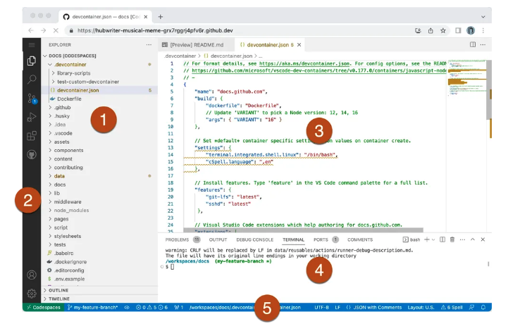
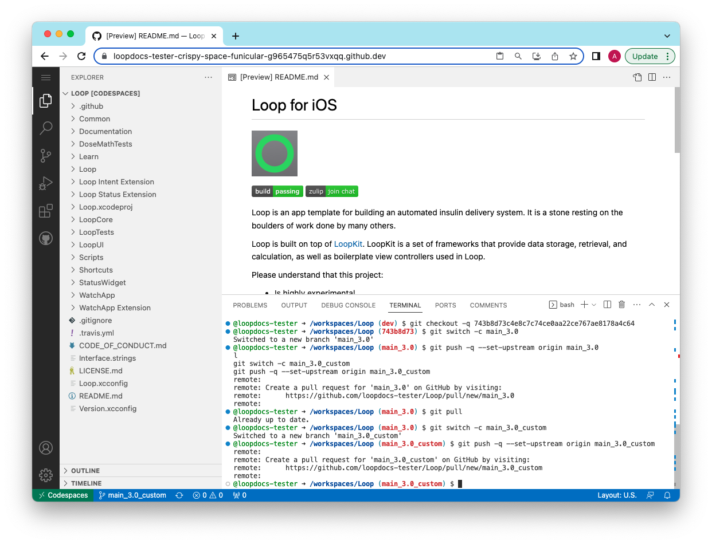
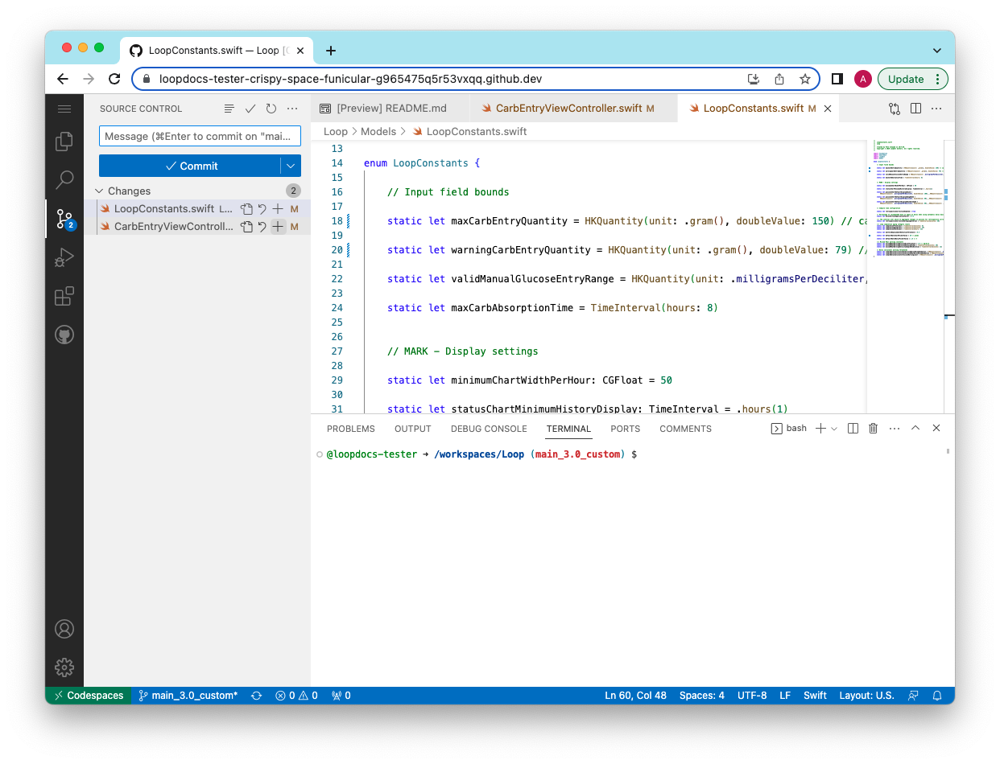
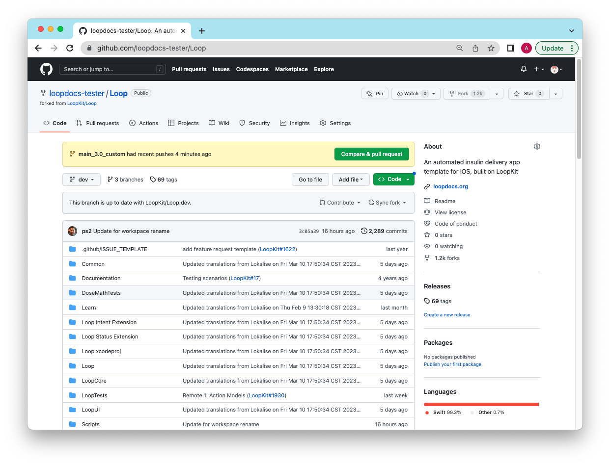

## Overview

!!! danger "DRAFT"
    This procedure is in DRAFT mode - only minimal graphics are provided.

    WARNING - After a recent release - wait for the release number to be updated on this page before using any of the copy/paste commands.

!!! info "Time Estimate"
    * About half an hour to an hour per Module
        * Typically 1 or 2 Modules
    * Ten minutes to configure your LoopWorkspace branch
    * One minute to start the build
    * An hour before the TestFlight build shows up on your phone

!!! abstract "Summary"
    * LoopDocs: Decide on Modules to modify [Code Customization](../build/code_customization.md)
    * GitHub (each Module):
        1. Fork Module (GitHub)
        1. Modify Module (GitHub->Codespaces)
        1. Save your new branch (Codespaces->GitHub)
        1. Prepare command line and save
    * All Module command lines prepared
    * GitHub (build Loop)
        1. Modify LoopWorkspace (GitHub->Codespaces)
        1. Save your new branch (Codespaces->GitHub)
        1. Action: Build Loop
    * Phone: Install Loop with TestFlight

!!! question "FAQs"
    - **Do I need a Mac computer?** No. This can be done on any browser, although it will be easier using a computer.
    - **Should I build without customizations first?** Yes. Make sure the build process works without customizations. You don't need to install the build on your phone, just make sure it builds without errors before you start modifying.

## How to Customize a GitHub Build

You do not need a Mac, you can still do this using any browser on a computer.

There is some background information at the bottom of this page starting at [LoopWorkspace](#loopworkspace) if you want to know what you are doing. Otherwise, just follow the steps like a cookbook.

## Editing Code

You will be using the online tool associated with GitHub called Codespaces. Any repository in your GitHub account can be opened with Codespaces.

You will need a text editor to format a command line for each module you change. Use the same text editor you use for saving your Secrets. You do not want characters like double hypen or quote symbols modified by a smart editor.

## Decide Which Modules You Want to Modify

Decide which [Code Customization](../build/code_customization.md) you want to make. Each customization lists a Module name. You will want a fork for each Module you wish to modify.

This table lists all the modules referred to on the Code Customization page linked above:

| Folder | Module | Fork From |
| --- | --- | --- |
| Loop/LoopCore | Loop | [https://github.com/LoopKit/Loop](https://github.com/LoopKit/Loop) |
| LoopKit/LoopKitUI/Extensions | LoopKit | [https://github.com/LoopKit/LoopKit](https://github.com/LoopKit/LoopKit) |
| OmniBLE/OmniBLE/PumpManagerUI | OmniBLE | [https://github.com/LoopKit/OmniBLE](https://github.com/LoopKit/OmniBLE) |
| rileylink_ios/OmniKit/OmnipodCommon | rileylink_ios | [https://github.com/ps2/rileylink_ios](https://github.com/ps2/rileylink_ios) |

!!! tip "Pro Tip"
    Open 4 browser tabs or windows so you can click to switch locations.

    * This page
    * [LoopDocs: Code Customization](../build/code_customization.md) 
    * Your GitHub account
    * A new one that you'll use to open Codespaces

## Create a Fork for Selected Module

If you want a modification that uses a particular module, you must fork that module to your GitHub account. You will repeat the Fork and Modify steps for each module.

1. Log into your GitHub account
1. Right click (or control click) on the URL in the table above
1. This opens a new browser tab at the URL of the repository you need to fork
1. Tap on Fork, your fork will show up in the tab

Remember - you can only have a single fork of a given repository. If you already have a fork, you don't need another one; but it must be a fork from the URL listed above.

!!! question "I already have a fork"
    Go to [Existing Fork for Module](#existing-fork-for-module) and follow the directions there.

When you fork a repository, the default branch is the one that is forked. That is ok. Only include that default branch when forking.

| username/Repository | Default Branch |
| --- | --- |
| LoopKit/LoopWorkspace | main |
| LoopKit/Loop | dev |
| LoopKit/LoopKit | dev |
| LoopKit/OmniBLE | dev |
| ps2/rileylink_ios | dev |

The LoopWorkspace main branch is always the most recent released code.

!!! tip "Pro Tip"
    If you know you want to change more than one Module, go on and prepare the forks for each Modules you want to customize.

This page has instructions for applying customizations to released code, main branch of LoopWorkspace. Don't worry about the other repositories using dev as the default branch. Everything you need to update LoopWorkspace main is included in the dev branches of the lower level repositories (Modules).

!!! warning "Loop with LnL Patches"
    Some Loop users build with the loopnlearn version of LoopWorkspace using the main_lnl_patches branch. If you are one of those users, do not use the URL table above. There is also an extra step required to prepare your fork. The LnL instruction page is not yet available; but will be found on the LnL website (later).

    If you want to deal with both released Loop (fork from LoopKit) and LnL with Patches, it is suggested you set up a second free GitHub account. The second account could have a name like username-lnl, where you insert your current username. If you do it this way, you use the same four Apple Secrets for both repositories and you can choose the same MATCH_PASSWORD, but the GH_PAT will be unique for each GitHub account.

## Open Module in Codespaces

Now that the selected module fork exists in your GitHub account, you will open it in Codespaces. (If you are returning to change a customization you've already made, be sure to select the branch where you already made the previous customization; [Update Customization](#update-customization)).

For this portion of the process, work with a single Module until you are done with the customization for that module. The final step will be to create and save a special command you will use when setting up the LoopWorkspace later.

1. Right click (or control click) on [Codespaces](https://github.com/codespaces)
    * This opens a new tab in your browser
    * Click on the green button on the right that says `New Codespace`
1. On new screen
    * Click on Select a repository and choose your GitHub username/moduleName for the module you want to modify (you can start typing your username if there are too many choices)
    * You will see a message the `Codespace usage for this repository is paid for by username` - you get 60 free hours per month, so you can ignore this message
        * First time - leave the branch alone (dev)
        * Subsequent times - select your customized branch, e.g., main_3.0_custom
    * You do not need to modify the region or machine type
    * Click on the green button at the bottom that says `Create codespace`
1. A message appears saying setting up your codespace; and then the Codespaces screen appears showing the README.md file (by default) for that repository
1. Your screen will be similar to that shown below

    {width="500"}
    {align="center"}

    * Note:
        * That image shown above is from [GitHub Docs: Working in a codespace in the browser](https://docs.github.com/en/codespaces/developing-in-codespaces/developing-in-a-codespace#working-in-a-codespace-in-the-browser)
        * You can click on that link for more information if desired, or just follow instructions below.
        * There are 5 sections of the display labeled with numbers inside red circles


If you have already made a customization in this module and you are returning for another modification, skip to [Customize the Module](#customize-the-module).

### Codespace Terminal

1. The terminal window should be showing in the panel section (indicated by the number 4)
1. You should see::<br>
    ```@username -> /workspaces/moduleName (dev) $```
    * where your username is after the @ symbol
    * and the current Module replaces moduleName
    * this is where you will paste the command you're about to copy

The commands you paste depend on whether this is the first time you've worked with the Module or if you have already started customizing it and thus already have a main_3.0_custom branch created.

### First Time for this Module

These commands are used ONLY for released version of Loop and only the first time you work with a given Module. 

This process has two steps:

* Step 1: Copy the indicated first command (Prepare xxx Module) and paste into the terminal window
    * When you try to paste - it will ask if you want to allow or block input
    * Allow the paste
    * Check for an error - do not continue if you see an error
* Step 2: If no error was seen, follow the instructions in [Create New Branch](#create-new-branch)

After these two steps are completed, then you will continue to [Customize the Module](#customize-the-module).

!!! danger "Alerts"
    * Skip ahead to [Update Customization](#update-customization) if you have already made modifications
    * Do not use if you built the LnL Patched Version of Loop
    * After you paste the Prepare xxx Module command (below), STOP if you get an error
    * If you do not get an error, continue to [Create New Branch](#create-new-branch) which is the same for all modules.

Copy the selected line for the current module into the terminal. If you see an error STOP. 

* Did you copy the correct line for the current Module?
* Is your Module dev branch up to date?

#### Prepare Loop Module (Loop 3.0.0)

``` { .sh .copy }
git checkout -q 743b8d73c4e8c7c74ce0aa22ce767ae8178a4c64
```

#### Prepare LoopKit Module (Loop 3.0.0)

``` { .sh .copy }
git checkout -q 0d5929e677e8fa6526860ba9538f1317067f7802
```

#### Prepare OmniBLE Module (Loop 3.0.0)

``` { .sh .copy }
git checkout -q 6d9b57d6491449c691f42c1a33d40300e985a714
```

#### Prepare rileylink_ios Module (Loop 3.0.0)

``` { .sh .copy }
git checkout -q 482ef4fb972e1d5456f66990434d1069e5cba223
```

### Create the Custom Branch

Copy and paste the next command to create a special branch in your fork that matches the released code for this Module.

``` { .sh .copy }
git switch -c main_3.0
```

You should see the response: `Switched to a new branch 'main_3.0'`

Assuming no error, copy and paste these commands next. You will see a popup asking you if you want to paste multiple lines. Say yes and check the box to not ask again.

``` { .sh .copy }
git push -q --set-upstream origin main_3.0
git pull
git switch -c main_3.0_custom
git push -q --set-upstream origin main_3.0_custom
```

You should see the items you pasted in the terminal followed by responses talking about the `remote` (your GitHub repository) and how to create a pull request; that you are already up to date; that you switched to a new branch and then another `remote` message. Your screen should be similar to the graphic below.

{width="750"}
{align="center"}

!!! success "What did those steps accomplish?"
    You now have 3 branches in your Codespace (local) and your GitHub (remote) versions of your repository for this Module:

    * dev
    * main_3.0
    * main_3.0_custom

    Right now main_3.0 and main_3.0_custom are identical and match the released copy for that Module.
    
    Next step, you will modify main_3.0_custom.

Skip ahead to [Customize the Module](#customize-the-module) and make the changes to this branch that you want for your Module.

## Update Customization

If you are returning to change a customization you've already made, follow these directions.

1. Right click (or control click) on [Codespaces](https://github.com/codespaces)
    * This opens a new tab in your browser
1. Click on the Codespace tab at the top center
    1. If your Codespace for this Module already exists (list at bottom of browser window), you just need to open it (click on 3 dots and choose open in browser)
    1. If your Codespace for this Module does not exist:
        * Click on the green button on the right that says `New Codespace`
        * Click on Select a repository and choose your GitHub username/moduleName for the Module you want to modify
        * Select your customized branch, e.g., main_3.0_custom
        * You do not need to modify the region or machine type
        * Click on the green button at the bottom that says `Create codespace`
1. A message appears saying setting up your codespace; and then the Codespaces screen appears showing the README.md file (by default) for that repository
1. In the terminal window, you should see the line: 
    ```@username -> /workspaces/moduleName (main_3.0_custom) $```

Continue with [Customize the Module](#customize-the-module).

### Customize the Module

You will be using the [Code Customization](../build/code_customization.md) page. Best to open that in a separate browser window so you can go back and forth.

For each modification, there is a `Key_Phrase` to help you find the line of code.

Click on the codespaces magnifying glass, paste the `Key_Phrase` into the search bar. If you use the copy icon and paste the `Key_Phrase`, you'll need to hit backspace to remove the extra return.

TO DO - put in a GIF showing making changes.

Make the change and save the file.

The source control icon now has a number showing. The number is how many different files in this Module that you have modified.

This "cookbook" has you modify all the items in the Module at once and then save that to your repository. There are many ways to do this. If you want to save (commit) each change separately, that is fine.

Repeat this process for all items you wish to change in this Module. Note that some customizations change the same file, so in that case, the number by the source control icon will not increase each time you make a change.

The graphic below shows 2 files ready to commit:

{width="750"}
{align="center"}

When you are done with the changes for this Module, you will need to:

1. Stage the modified file(s)
    * Tap the + icon to right of each file
1. Add a commit message (not required but good practice)
1. Commit the change (to your local copy in Codespaces)
1. Sync the change (to your GitHub fork)

You will see a warning `This action will pull and push commits from and to "origin/main_3.0_custom".`

Select `OK, don't show again'

If you see message: `Do you want to periodically run git fetch` - say No

You are done with this module. 

Click the Codespaces icon at bottom left.
Choose Stop Codespace from the menu. Don't worry about the changes won't be saved message - you just saved the changes with the sync command above.

The screen will then show the Codespace is stopped message. You can close the tab.

Return to your github account and look at the repository for the Module you just changed. It should be similar to the graphic below.

{width="750"}
{align="center"}

!!! tip "Advanced Method"
    If you want to create a patch for this modification that you might be able to use again with the next release, there are instructions under [Advanced Topic: Create a Patch](#advanced-topic-create-a-patch)

Move on to the next module, repeating all these steps in [Open Module in Codespaces](#open-module-in-codespaces).

## Update LoopWorkspace

The final step is to update your LoopWorkspace fork to use these commits instead of the ones the released code uses.

This "cookbook" tells you one method to do that. There are other ways.

Open your text-only editor (you could do this in the same file where you save your Secrets if you want).

Create one line for each module.

* The beginning of the line is: `git update-index --cacheinfo 160000 `
* The middle of the line is: `the full SHA-1 (instructions below)`
* The end of the line is the cased-sensitive moduleName in double quotes: `"moduleName"`

In other words you will have 1 or more lines in your text file (these examples have nonsense SHA-1 that you must replace with your actual values):

``` { .sh .copy title="Example lines to copy and paste and then modify" }
git update-index --cacheinfo 160000 0123456789abcdef0123456789abcdef01234567 "Loop"
git update-index --cacheinfo 160000 0123456789abcdef0123456789abcdef01234567 "LoopKit"
git update-index --cacheinfo 160000 0123456789abcdef0123456789abcdef01234567 "OmniBLE"
git update-index --cacheinfo 160000 0123456789abcdef0123456789abcdef01234567 "rileylink_ios"
```

For each Module you customized, return to your GitHub fork for that Module (`https://github.com/username/moduleName`) to get the SHA-1 for that Module.

* Click on the branch and choose main_3.0_custom
* Click on the clock item to the right
    * This brings up the commit history screen
    * Your last commit should be the top one
    * Click on the copy full SHA-1 icon
    * Replace the nonsense SHA-1 for the Module with this real one in your text file where you are preparing the commands

Prepare the commands for each Module customization you want for this build in your text file.

### First Modification

Only use this section if you have not previously created the main_3.0_custom branch for LoopWorkspace.

Open the Codespace and select your fork of LoopWorkspace **main** branch.

Copy and paste the following lines into your terminal:

``` { .sh .copy }
git switch -c main_3.0_custom
git push -q --set-upstream origin main_3.0_custom
```

Then skip ahead to [Modify LoopWorkspace](#modify-loopworkspace).

### Subsequent Modifications

Only use this section if you have created the main_3.0_custom branch for LoopWorkspace; but want to add a new modification.

Open (or reopen) the Codespace and select your fork of LoopWorkspace **main_3.0_custom** branch.

### Modify LoopWorkspace

Copy and paste your prepared lines into the terminal.

Click on the source control icon - your changes are already staged. 

Type a message in the comment and click Commit.

Click on sync changes.

Return to your GitHub window for LoopWorkspaces.

* Modify the default branch to be main_3.0_custom
* Click on Action: Build Loop

In about 1 hour, your customized Loop will be available for installation on your phone via TestFlight.

## Special Cases

### Existing Fork for Module

What if you already have a fork of one of the modules?

#### Situation 1

**Your fork is from using this page earlier and you already have a main_#.#_custom branch**

* Option A: You want to add a new customization to your existing main_#.#_custom branch
    * Go to [Update Customization](#update-customization)
* Option B: You want to throw away your existing main_#.#_custom branch and start over
    * Follow the [GitHub Instructions to delete a branch](https://docs.github.com/en/pull-requests/collaborating-with-pull-requests/proposing-changes-to-your-work-with-pull-requests/creating-and-deleting-branches-within-your-repository#deleting-a-branch)
    * Click on Code, make sure you are at the dev branch and sync the fork
    * Go to [Open Module in Codespaces](#open-module-in-codespaces)

#### Situation 2

**Your existing fork is from the correct location (LoopKit or ps2)**

* Option A: Your existing fork shows the dev branch as the default branch
    * Tap on sync fork
    * Go to [Open Module in Codespaces](#open-module-in-codespaces)
* Option B: You probably know what to do or this would not be your situation - ask for help if you are confused

#### Situation 3

**Your existing fork is from a username other than (LoopKit or ps2)**

If your fork is from loopnlearn then you need to follow the directions (that are not written yet) on the loopandlearn dot org website.

If you know this is a fork you do not care about, you can delete the repository.

* Instructions to delete a repository are found at [GitHub Docs](https://docs.github.com/en/repositories/creating-and-managing-repositories/deleting-a-repository)

Once deleted, go to [Create a Fork for Selected Module](#create-a-fork-for-selected-module).

### Advanced Topic: Create a Patch

If you want to create a text file with a patch for your customization, you will take a few extra steps. Refer to the figure and the steps below it.

{width="750"}
{align="center"}

If you don't see the green `Compare & pull request` icon, modify the following URL with your username and the desired Module name and click on the `Create pull request` icon instead:

```
https://github.com/loopdocs-tester/Loop/compare/main...main_3.0_custom
```

* Click on the green `Compare & pull request` icon
    * Change the LoopKit (or ps2) username to your username
    * Change the branch from dev to main_3.0
    * Scroll down to review the changes you just made
* Then click the green Create pull request button
* **DO NOT MERGE** the pull request
* Click in the URL for the browser
* At the end of the URL, add `.patch` and hit return

You now have a "patch" text file. Download and save this file on your computer.

The default name when you select File->Save Page As, is 1.patch.txt. It's a good idea to revise this. For the graphic below, the filename was modified to `Loop_main_3.0_custom_1.patch.txt` and a folder called `patches` in Downloads was used for storage.

{width="750"}
{align="center"}

## Background Information

### LoopWorkspace

The LoopWorkspace repository is the umbrella organization holding all the pieces needed to build the Loop app. Part of what LoopWorkspace provides is a list of pointers to a specific commit for each module used in the workspace.

* A commit is a specific version of code in a repository
* A workspace is a grouping of several repositories (modules) into a complete package
* The workspace includes a list of the specific commit for each repository (module)

The steps given earlier on this page modifies the commit for the module that you change used by LoopWorkspace when it builds.

* A commit to a module can be made without affecting the workspace
* To update the workspace to use the new commit for a module, the list containing the specific commit for that repository (module) must also be updated
    * This update is itself a commit to the workspace repository

This allows a given module, say Loop, to be updated with a new commit; but that commit doesn't affect the Loop app that you build using LoopWorkspace. Once you change the LoopWorkspace to point to the new commit in Loop, then the Loop app you build 

### What are branches again?

Branches indicate different version of code - this tutorial is pretty nice.

* The history required for the main branch (released code) is also present in the dev branch for the submodules
* The commands listed earlier on this page are to assist you in creating your own branch and you will customize that branch
* If you later want to modify your customization, start with the branch you already created and edit it

