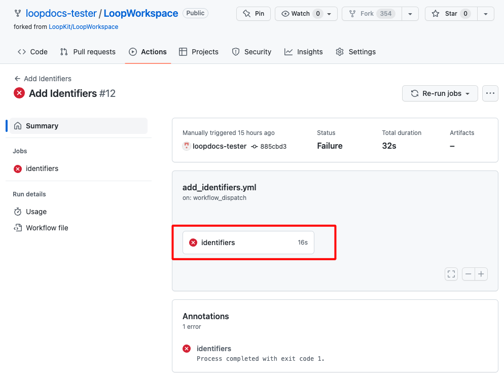
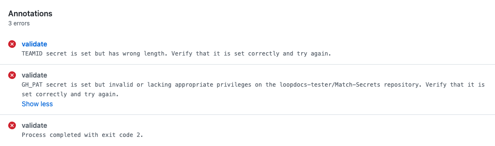
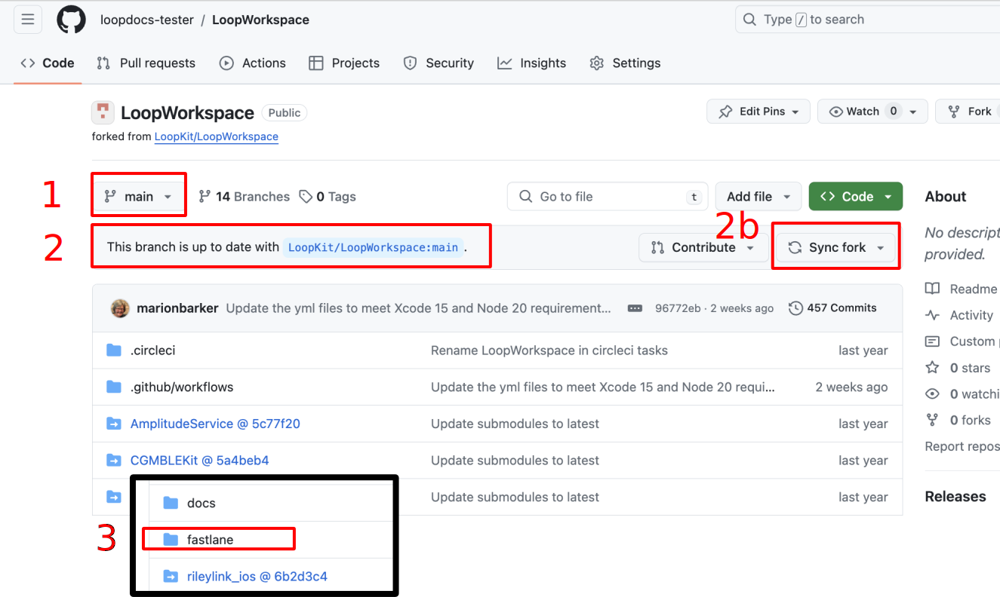
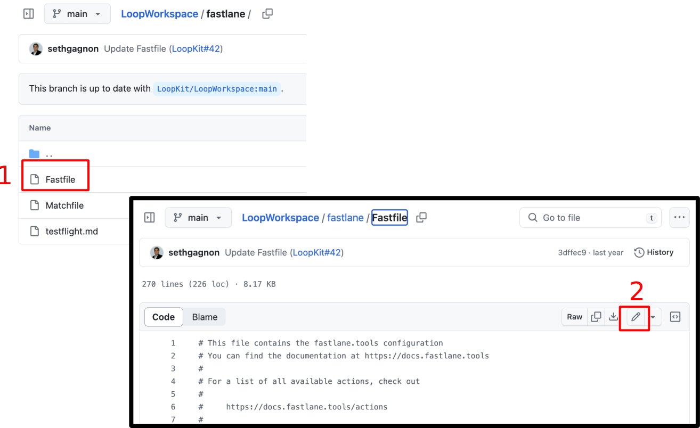
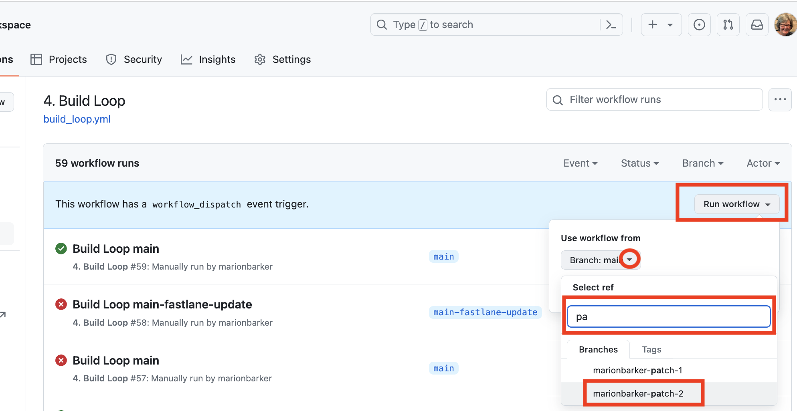

## Help with Errors

If you get an error when building with a browser, use this page to figure out what to do.

If you are still unsuccessful, then post your request for help along with your *GitHub* **username**. Mentors can go to your public&nbsp;_<span translate="no">GitHub repository</span>_, check the status and then view your log files directly.

* Do not copy from the log file and post the words
* Do not take a screenshot of what you think is an error
* Just post your username and the name of the app you are trying to build

!!! tip "Username, Not Pictures"
    If you've been around the DIY community for a while, you know the mantra about screenshots. Well, when using a browser to build, **screenshots are close to useless**.

    All that is needed to assist is your *GitHub* **username**.

But first - try to diagnose it yourself using this page.

### Most Common Mistakes

These are some of the most common errors to date.

1. You made a spelling error when adding <code>Secrets</code>
    * Each secret must be spelled exactly the way it is presented in the instructions
    * If you are using an automatic translation, please keep an original page open too and copy from it to make sure there are no spelling errors in the secret name
1. You did not add the `App Group Identifier` to all 4 of the required identifiers in this step: [Add `App Group` to `Identifiers`](gh-first-time.md#add-app-group-to-identifiers)
1. You used a smart editor instead of a text-only editor to save your information
    * It only takes one letter to be changed from lower-case to upper-case by your smart editor to ruin your day
    * The alpha-numeric values used for `GH_PAT`, `FASTLANE_ISSUER_ID` and `FASTLANE_KEY` contain both upper and lower-case characters and all the values are case-sensitive
1. When saving `TEAMID`, you typed what you thought you saw instead of using copy and paste
1. You skipped running one of the actions
1. You need to sign a program license agreement or update a credit card at&nbsp;<span translate="no">Apple Developer</span>
    * Be sure to read [Misleading Error Message](#misleading-error-message)

If you are running development code, skip ahead to [Preview for Next Version](#preview-for-next-version).

## Misleading Error Message

If there are *Apple* Developer agreements you have not accepted, you may get errors when you try to Build that indicate your *Apple* <code>Secrets</code> are incorrect even if they are not.

* The misleading message tells you that one or more of these: <code>FASTLANE_ISSUER_ID</code>, <code>FASTLANE_KEY_ID</code> or <code>FASTLANE_KEY</code> is not correct
* Check your *Apple* Developer account for agreements first, before trying to fix those
* If you previously built successfully - it is almost certainly the agreement
* It can take 15 minutes to an hour after the agreement is signed before it can be used

If you need detailed instructions, click on this [<code>Apple Program License Agreement</code> Help Page](https://support.pushpay.com/s/article/Accepting-the-Apple-Program-License-Agreement){: target="_blank" }.

You can also get this message if the credit card used to purchase the Developer account is not current, e.g., no longer valid or expiration date has passed.

> One user reported: The expiration date on the credit card used for auto-renew of my developer account was updated and the value in the Apple account did not match the new one. After updating my account with the new expiration date - Browser Build succeeded again.

## Find Your Error

> For Version 3.2.3 and earlier - later versions have an improved method for display errors.

There is a separate section for each step in the process. First, you must follow the [Examine the Error](#examine-the-error) instructions to view the record of the failed action. Then go to the section for the Action you were trying to complete to look for possible error strings to copy into the search box.

1. [Action: `Validate Secrets`](#action-validate-secrets-errors)
1. [Action: `Add Identifiers` Errors](#action-add-identifiers-errors)
1. [Action: `Create Certificates` Errors](#action-create-certificates-errors)
1. [Action: `Build Loop` Errors](#action-build-loop-errors) before a successful build
1. [Repeat `Build Loop` Errors](#repeat-build-loop-errors) after a successful build

If you discover a new error, please reach out to help us update the documentation.

## Examine the Error

It doesn't matter which action you are running; after the action completes, you will either see a green check mark <font color="green">:material-checkbox-marked-circle:</font> for **success** or a red x mark <font color="red">:fontawesome-solid-circle-xmark:</font> for **failure**. The graphic below shows an example for the `Add Identifiers` action.

{width="700"}
{align="center"}

If you click on the *action* name, it opens a secondary screen as shown below.

{width="500"}
{align="center"}

Click on the top link to view the record of the failed action as shown in the graphic below. You will be pasting strings into the search box (highlighted with a green rectangle) to look for a documented error. Please read the instructions below the graphic.

{width="700"}
{align="center"}

* Paste in a possible error string (copy it exactly); repeat until you find a match
* If the possible error string is found - follow the directions for that error
* Still stuck?
    * Post for help including your ==*GitHub* **username**==
    * With that, mentors can diagnose your problem - or at least make a good guess at what you need to try
    * Please **do NOT post a screenshot**

!!! tip "Where to find my *GitHub* username?"
    You can find it:

    -  either in the URL of your fork of `Loopworkspace`, after `github.com` in between the forward slashes (`/`).
       https://github.com/==username==/Loopworkspace
    - or on the [*GitHub* website](https://github.com){: target="_blank" }

        
        {width="200"}
        {align="right"}

        {width="400"}

    As your *GitHub* `username` is case-sensitive, use copy and paste.

## Action: `Validate Secrets` Errors

To generate the graphic below, some items were deliberately set to be incorrect in the *Secrets* list. Representative error messages are shown when running the validate secrets action.

{width="800"}
{align="center"}


## Action: `Add Identifiers` Errors

Use the [Examine the Error](#examine-the-error) instructions to find your error message.

There are two errors that we are familiar with at this point. Look for text matching what is listed below and view what has caused this error to be seen.

### Error: credentials missing / invalid

Copy the words on the line below and paste them into the search function for your action log.


> ``` { .text .copy }
> Authentication credentials are missing or invalid
> ```

The full error looks like this:

> Authentication credentials are missing or invalid. - Provide a properly configured and signed bearer token, and make sure that it has not expired. Learn more about Generating Tokens for API Requests https://developer.apple.com/go/?id=api-generating-tokens`


This can be caused by an error in the value (or spelling) of one of these keys:

* `FASTLANE_ISSUER_ID`
* `FASTLANE_KEY_ID`
* `FASTLANE_KEY`
* `GH_PAT`

!!! danger "Use a Text-Only Editor"
    If you used a "smart" editor when saving your *Secrets* in an archive file before pasting them into the repository `Secrets`, it might have changed a lowercase letter to an uppercase letter.

    If even one character is capitalized when it should not be, you will not succeed at the Add Identifiers step.

### Error: `Invalid curve name`

If you see:

> ``` { .text .copy }
> invalid curve name
> ```

This was caused by an error in the format of the value entered for the `FASTLANE_KEY`.

Make sure you copy in a text editor from the first hyphen to the last hyphen.


## Action: `Create Certificates` Errors

Use the [Examine the Error](#examine-the-error) instructions to find your error message.

### Error: Wrong TEAMID in `Secrets`

Copy the words on the line below and paste them into the search function for your action log.

> ``` { .text .copy }
> error: No profile for team '***' matching 'match AppStore
> ```

If that phrase is found, then:

* You probably do not have the correct `TEAMID` entered in your `Secrets`
* The rest of these instructions assume:
    * You have already created a *Loop* App in the *App Store* with that incorrect `TEAMID`
    * This is true if you completed the steps after running Action: `Add Identifiers` and before Action: `Create Certificates`

Follow these steps:

!!! tip "Open each link below in a separate tab"
    It is best to open each link below in a separate tab so you can return to this list and keep using the links in each step.

1. Delete all the identifiers that you can, following the steps in [Configure to Use Browser: Delete Identifiers](gh-first-time.md#delete-identifiers)
    - Delete all the other identifiers first, then try to delete the *Loop* identifier with the wrong <code>TEAMID</code>
    - It is fine to just ignore identifiers with the wrong <code>TEAMID</code>, but do not use them

1. Enter your `TEAMID` correctly in the repository `Secrets`
    - Make sure you use copy and paste from your [Apple Developer Membership](https://developer.apple.com/account/#!/membership){: target="_blank" } page for that `TEAMID`.
    - Follow the update instructions here (this example is for `GH_PAT`, you'll do the same but for `TEAMID`) [Update Secrets](gh-update.md#update-secrets)

1. Run Action: [Configure to Use Browser: `Add Identifiers`](gh-first-time.md#add-identifiers) again

1. Follow all the steps in this section with the **correct** `TEAMID` [Configure to Use Browser: Configure Identifiers for Loop](gh-first-time.md#configure-identifiers-for-loop) but when you get to the [Configure to Use Browser: Create Loop App in App Store Connect](gh-first-time.md#create-loop-app-in-app-store-connect), you need to return to this page and follow the instructions below to remove the app and add a new one.

The first time through, you created an app with a `Bundle ID` that does NOT include your `TEAMID`.

You will remove that app and create a new one.

#### Remove App with Incorrect `TEAMID`

Go to [`App Store Connect / Apps`](https://appstoreconnect.apple.com/apps){: target="_blank" } and follow the numbered steps in the graphic below.

1. Find the *Loop* app you created earlier and click on it
2. On the left side, under `General`, click on `App Information`
    * Confirm that the value listed under `Bundle ID` is the incorrect one
    * The `Bundle ID` says: `com.NOT_YOUR_TEAMID.loopkit.Loop`
3. Scroll to the bottom of the page and tap on `Remove App`
4. The dialog box, similar to the one in the graphic below, should appear and you tap `Remove`
    * After the *App* is removed, you'll see a very similar screen, where you can tap on `Restore App`
5. But since you want that *App* removed, tap on `Apps` at the very top of the screen and proceed to the next step

{width="700"}
{align="center"}

That *App* with the wrong `Bundle ID` remains in the *App store* but it is hidden so it won't confuse you.

#### Add App with Correct `TEAMID`

Now click on the `Add Apps` button or the :heavy_plus_sign: (plus sign) if you have other apps in the *App Store*.

Follow the [Configure to Use Browser: Create Loop App in App Store Connect](gh-first-time.md#create-loop-app-in-app-store-connect) directions with these additions:

* You must come up with a new name for your *Loop* App
* Triple-check that the `Bundle ID` you choose is for *Loop* and contains your `TEAMID`, it should look like: `com.TEAMID.loopkit.Loop`
* You must come up with a new `SKU` for your *Loop* App (try `1234`, if you used `123` before)

#### Create Certificates

You should be able to continue with the [Configure to Use Browser Steps to `Create Certificates`](gh-first-time.md#create-certificates) and then proceed from there with `Build Loop` and keep going.

### Error: Missing Repository Access

Copy the words on the line below and paste them into the search function for your action log.

> ``` { .text .copy }
> Error cloning certificates
> ```

The full error looks like this:

> Error cloning certificates repo, please make sure you have read access to the repository you want to use

or

> Error cloning certificates git repo, please make sure you have access to the repository - see instructions above

If you see this phrase, the `fastlane` package that is utilized during the `3. Create Certificates` action cannot access your repository to create certificates for your *Loop* app. This is due to insufficient repository access rights that were not granted during the creation of your `GH_PAT` token.

To fix this error:

- Open this link: [https://github.com/settings/tokens/](https://github.com/settings/tokens/){: target="_blank" }
  - Here you will see your personal access token (`Fastlane Access Token`) that was created during [Configure to Use Browser: Setup *GitHub*: Create `GitHub Personal Access Token`](../gh-actions/gh-first-time.md#create-github-personal-access-token)
  - Note that `Tokens (classic)` is highlighted in the menu on the left
  - Click on the token name (should be bold, blue **`Fastlane Access Token`** ) to open its detail page
  - None of the checkboxes under **`Select Scopes`** will be checked – this is what's causing the issue.
  - Add a check beside the `workflow` permission scope (the graphic does not match the words, you want to use `workflow` to get both `repo` and `workflow` scope)
  - Scroll all the way to the bottom and click `Update token` (it's a long way, ignore all other settings, do not check anything else)

{width=700}

After you have clicked `Update token` you should see the token overview again with the message `Some of the scopes you’ve selected are included in other scopes. Only the minimum set of necessary scopes has been saved. ` (You can dismiss the message using the `X` near the upper right side if it appears).

NOTE: for next release or if using the dev branch - you want <code>GH_PAT</code> to have `repo, workflow` scope. So click on the workflow scope now and save yourself a step later.

#### Create Certificates

You should be able to continue with the [Configure to Use Browser Steps to `Create Certificates`](gh-first-time.md#create-certificates) and then proceed from there with `Build Loop` and keep going.

### Error: Could not create

Copy the words on the line below and paste them into the search function for your log file.

> ``` { .text .copy }
> Could not create another Distribution certificate
> ```

The full error message is:

> `Could not create another Distribution certificate, reached the maximum number of available Distribution certificates`

These steps are needed to make room for a `Certificate`:

1. Delete an old `Distribution Certificate`
    * *Apple* limits you to two `Distribution Certificates`
    * Use this link to view your [Apple Developer Certificates](https://developer.apple.com/account/resources/certificates/list){: target="_blank" }
        * Carefully examine the `Type` column - do **not** delete a `Development` `Certificate`
        * If you accidentally delete a `Development` `Type` certificate associated with an Xcode build for your Loop app - it will stop working and you will be very sad
    * Click on the oldest `Distribution` `Certificate` and revoke it
        * You will get an email informing you the certificate was revoked
1. To create a new `Certificate`:
    * Return to *GitHub* and your fork
    * Run the `Action`: `Create Certificates`
1. You are now ready to run the `Action`: `Build Loop`

!!! question "But what about *TestFlight* builds?"
    Previous builds using this method that are already in *TestFlight* are not affected by deleting the `Distribution Certificate`.

### Error: Could not decrypt

Copy the words on the line below and paste them into the search function for your log file.

> ``` { .text .copy }
> decrypt the repo
> ```

The full error message is:

> `Couldn't decrypt the repo, please make sure you enter the right password`

If you know you entered the incorrect <code>MATCH_PASSWORD</code> in your repository <code>Secrets</code>, go and fix it now and try again.

Otherwise, you need to follow the steps to [Reset Match-Secrets](#reset-match-secrets).

## Action: `Build Loop` Errors

!!! warning "Run `Create Certificates` First"
    You must run Action: `Create Certificates` before attempting to run Action: `Build Loop`

Use [Examine the Error](#examine-the-error)

* Click on the Action log on GitHub
* There may be a series of green items followed by a red one
* Click on the red item to view the error
* Use the search function in this log to locate your error using one of the strings below

For each section below, copy the phrase into the search function of the log. If you find it, solve that error. If not, move on to the next one.

### `Could not find an app on App Store Connect`

Copy the words on the line below and paste them into the search function for your action log.

> ``` { .text .copy }
> Could not find an app on App Store Connect
> ```

If that phrase is found, then:

* Make sure you completed the [Create Loop App in App Store Connect](gh-first-time.md#create-loop-app-in-app-store-connect) Step
    * Once you've resolved that step, run these *Actions* again:
        * `Create Certificates`
        * `Build Loop`


* This can also be caused if you correctly created the *Loop* App but entered an incorrect value for the `TEAMID`.
    * If you have the incorrect `TEAMID`, check this link: [Certificates, Identifiers & Profiles](https://developer.apple.com/account/resources/identifiers/list){: target="_blank" } for entries with the incorrect `TEAMID` embedded
    * For example, if your `TEAMID` is `0123456789`, but you entered `000123`, you may see both of these in your identifiers list
        * `com.0123456789.loopkit.Loop`
        * `com.000123.loopkit.Loop`
    * Delete the "bogus" identifier version, fix your `TEAMID` and rerun all three steps:
        * `Add Identifier`
        * `Create Certificates`
        * `Build Loop`

### `Error: Provisioning Profile`

Copy the words on the line below and paste them into the search function for your action log.

> ``` { .text .copy }
> error: Provisioning profile "match AppStore
> ```

If that phrase is found one, or more times, it means you missed a step when configuring the Loop identifier or missed associating your *Loop* App Group with one or more identifiers.

For example, if you see:

`error: Provisioning profile "match AppStore com.***.loopkit.Loop" doesn't include the com.apple.developer.usernotifications.time-sensitive entitlement.`

Go back to [First-Time: Add or Review Configuration for Loop Identifier](gh-first-time.md#add-or-review-configuration-for-loop-identifier) and make sure you enabled the `Time-Sensitive notification` for Loop.


For example, you might see:

* `error: Provisioning profile "match AppStore com.***.loopkit.Loop.SmallStatusWidget`
* `error: Provisioning profile "match AppStore com.***.loopkit.Loop.statuswidget`
* `error: Provisioning profile "match AppStore com.***.loopkit.Loop.Loop-Intent-Extension`

Return to [Add App Group to Other Identifiers](gh-first-time.md#add-app-group-to-identifiers) and fix the missing items.

You must create certificates again before you can build *Loop*:

* Action: `Create Certificates`
* Action: `Build Loop`

### `A new one cannot be created because you enabled`

Copy the words on the line below and paste them into the search function for your action log.

> ``` { .text .copy }
> A new one cannot be created because you enabled
> ```

If that phrase is found with lines similar to the following:

```
[31mA new one cannot be created because you enabled `readonly`
[31mProvisioning profiles in your repo for type `appstore`:
[31m- 'AppStore_com.NOT_YOUR_TEAMID.loopkit.Loop.statuswidget.mobileprovision'
[31m- 'AppStore_com.NOT_YOUR_TEAMID.loopkit.Loop.SmallStatusWidget.mobileprovision'
[31m- 'AppStore_com.NOT_YOUR_TEAMID.loopkit.Loop.mobileprovision'
[31m- 'AppStore_com.NOT_YOUR_TEAMID.loopkit.Loop.LoopWatch.mobileprovision'
[31m- 'AppStore_com.NOT_YOUR_TEAMID.loopkit.Loop.Loop-Intent-Extension.mobileprovision'
[31m- 'AppStore_com.NOT_YOUR_TEAMID.loopkit.Loop.LoopWatch.watchkitextension.mobileprovision'
```

This tells you, the `Bundle ID` you selected in [First-Time: Create Loop App in App Store Connect](gh-first-time.md#create-loop-app-in-app-store-connect) does NOT have your `TEAMID` embedded in the name.

Once you have created an app in the *App Store* that is not based on your `TEAMID`, you cannot delete it, but you can Remove it (i.e. hide it so that it is no longer visible on this page and you don't accidentally click on it).

1. Open this link: [App Store Connect / Apps](https://appstoreconnect.apple.com/apps){: target="_blank" } to view your apps; log in if needed.
1. Find the App with the wrong `Bundle ID` and click on it
1. On the left-hand side, click on `App Information` (under `General`)
    * Confirm the `Bundle ID` listed does not include your `TEAMID`
    * Scroll all the way to the bottom
    * Tap on `Remove App`
    * New dialog window appears, select `Remove`

At this point, get your correct `TEAMID`, fix your Secrets file to have the correct `TEAMID` and then return to [First-Time: Configure Secrets](gh-first-time.md#configure-secrets). This time you will be updating `TEAMID` in the repository secret list.


## Repeat `Build Loop` Errors

This section is only for people who have successfully built using *GitHub Build Actions*.

Use the [Examine the Error](#examine-the-error) instructions to find your error message.

### `ERROR: Asset validation failed`

This error indicates your fork needs to be updated. As of 29 April 2024, you are required to use Xcode 15 to build the app.

There are serveral phrases you can check for. All of them have the same solution.

Copy the words on the line below and paste them into the search function for your action log.

> ``` { .text .copy }
> ERROR: Asset validation failed
> ```

> ``` { .text .copy }
> Could not download/upload from App Store Connect
> ```

Solution: Update your fork. See instructions on the Update page: [Update `Fork`](gh-update.md#update-fork){: target="_blank" }

### Intermittent TestFlight Upload Number Error

!!! warning "This is an intermittent error"
    Looking into history, we see that this error has been reported intermittently over the last few years.

Copy the words on the line below and paste them into the search function for your action log.

> ``` { .text .copy }
> Error: The provided entity includes an attribute
> ```

The full error looks like this: `Error: The provided entity includes an attribute with a value that has already been used The bundle version must be higher than the previously uploaded version: #`

Examine the number that is there. If it is 3, you need to use 4 in the Solution step. If it is 53, you use 54.

**Solution:** You must force Apple to update to a build number higher than the one it has on record.

Summary of what you will do (don't do it yet); there are detailed steps and graphics below:

1. You will edit the Fastfile in your `fork` and save the changes to a new `patch` branch
3. Perform the Action to `Build Loop` and select the `patch` branch when you build

> There is no reason to expect subsequent builds to fail with this same error, but if it does, repeat this section.

#### Prepare your `fork`

The graphic below shows the steps to make sure your `fork` is up to date and to locate the `fastfile` folder:

1. Select the `branch` that you plan to build
2. Check the `fork` for that `branch` is up to date
    * If it is behind, `sync` the fork
3. Scroll down to locate the folder `fastlane` and click on it (next graphic)

    {width="750"}
    {align="center"}

#### Prepare to Edit your Fastfile

1. After clicking on the `fastlane` folder, 3 files are visible; click on `Fastfile`
3. When the `Fastfile` file opens click on the pencil icon so you can edit the file

{width="750"}
{align="center"}

#### Edit your Fastfile

1. Type either ++command+"C"++ (Mac) or ++control+"C"++ (PC) to reveal the find and replace dialog shown in the graphic below
    * Copy the phrase indicated below and paste it into the find buffer, and then type into the replace buffer the build number you want to require (one more than indicated by your last error)

    ``` { .txt .copy }
    previous_build_number + 1
    ```

2. Tap on the `Find` button and the `Replace` button to make 2 changes to the file
3. After modifying the two lines, click on the `Commit changes` button at upper right

{width="750"}
{align="center"}

#### Save to a Patch Branch

Refer to the graphic below. The number `3` by the `Commit changes` button indicates the selection made in the previous step; it is shown for reference.

1. Tap on indicator that you will save to a new branch - *GitHub* will automatically name it for you
2. Tap on `Propose changes` button and then STOP; do not click on `Open pull request` - you are done with this step

{width="750"}
{align="center"}

#### Build using Patch Branch

Select `Action: Build Loop`

Refer to the first graphic below:

* Tap on Run Workflow (on the right side)
* Tap on the drop-down arrow to the right of the default `branch`
* Choose the `branch` you just created
    * Start to type `patch` in the `branch` selection drop-down
    * Only `branches` with that phrase will be displayed
* After you have the correct `branch` selected, tap on run workflow

{width="400"}
{align="center"}

There is not a lot of indication that the build started - be patient - or refresh the screen - do NOT start another build. Your build status should be similar to the next graphic.

{width="700"}
{align="center"}

Once you get a successful build, you return to using your normal `branch` for future builds.

> There is no reason to expect subsequent builds to fail with this same error, but if it does, repeat this section.

### `Could not install WWDR certificate`

Assuming you have successfully built using the Browser-Build / *GitHub* method before:

* If the details show this message, `Could not install WWDR certificate`, make sure your [*Apple developer* account](https://developer.apple.com){: target="_blank" } is in good standing and that there are no agreements that need to be accepted
* Sometimes this is a sign that *Apple* did not respond to a request, this failure happens in the first few minutes
    * Repeat the build and it should be fine the next time

{width="500"}
{align="center"}

## Reset `Match-Secrets`

This is not the first thing to try, but sometimes it is the best approach.

There might be several reasons to do this:

* You lost your <code>MATCH_PASSWORD</code> and want to build one of the [Other Apps](gh-other-apps.md)
* You thought you entered the correct <code>MATCH_PASSWORD</code> but you are getting [Error: Could not decrypt](#error-could-not-decrypt)
* You are having trouble renewing your certificates after using Browser Build for a year

These steps are needed to reset your `Match-Secrets`:

1. Delete your `Match-Secrets` Repository
    * Instructions to delete a repository are found at [GitHub Docs](https://docs.github.com/en/repositories/creating-and-managing-repositories/deleting-a-repository){: target="_blank" }
1. Create a new private `Match-Secrets` *Repository*
    * main branch: follow the directions [First-Time: Create `Match-Secrets`](gh-first-time.md#create-match-secrets)
    * dev branch: the `Action`: `Validate Secrets` automatically creates a new private `Match-Secrets` repository if you don't have one
1. In your fork of LoopWorkspace:
    * Run the `Action`: `Create Certificates`
    * If this fails, click on this link for the most likely [Error: Could not create](#error-could-not-create)
    * If that doesn't help, check all your <code>Secrets</code> and try again
1. You are now ready to run the `Action`: `Build Loop`

!!! important "Other Apps"
    All DIY iOS apps that have an associated <code>*GitHub* Browser Build</code> method require the same 6 <code>Secrets</code>.

    If you add an app to your *GitHub* username (by forking the repository and adding <code>Secrets</code>) and then build it, it encrypts your `Certificate` using `MATCH_PASSWORD`.

    If you already have the other apps configured and then you delete `Match-Secrets` and add a new one, you will need to run `Create Certificates` for each app before the next time you build each app - go ahead and do that now so you don't forget.

## Preview for Next Version

Error annotations are available for Version 3.3.0 and later. These were contributed by community volunteers along with the improvements to enable automatic updates and automatic builds.

## Examine Annotation

If a&nbsp;<span translate="no">GitHub Action</span>&nbsp;fails, you will see a clear notification.

First consider the following results from the&nbsp;<span translate="no">GitHub Action: 1. Validate Secrets</span>.

Your screen may look similar to the graphic below. The name in parentheses refers to the branch used to develop these wonderful messages. Yours may be (dev) or (main), once 3.4.0 is released.

{width="500"}
{align="center"}

But there are so many reasons why this could happen. The first step is to click on the link highlighted by the red rectangle in the graphic above. This opens a new detailed view. The GIF below shows two different error messages. The first frame shows the error in the Annotation box at the bottom (you may need to scroll down to see this), and you may need to click on "Show More" to see the full message as seen in the second frame. The third frame of the GIF shows a different message. Each one these messages is designed to make it easier for you to diagnose your own problem.

{width="800"}
{align="center"}

Notice that&nbsp;<span translate="no">GitHub Action: 1. Validate Secrets</span>&nbsp;is broken into three jobs each of which will either pass and show a green check or fail and show a red check. The secrets are validated with each action, so you will see this a lot.

For example, the graphic below shows a failure of&nbsp;<span translate="no">GitHub Action: 3. Create Certificates</span>&nbsp;.

{width="800"}
{align="center"}

This is an example of a message that is not terribly descriptive - which is why it is shown here. In this case, you can click on just the one job that failed. There will be less to sort through to find your error. The most likely reason for this error is [Error: Could not Create](#error-could-not-create).

If you run across an error that does not have a nice message, be sure to post as discussed in [Help with Errors](#help-with-errors). You may be contributing to future improvements for this process.

