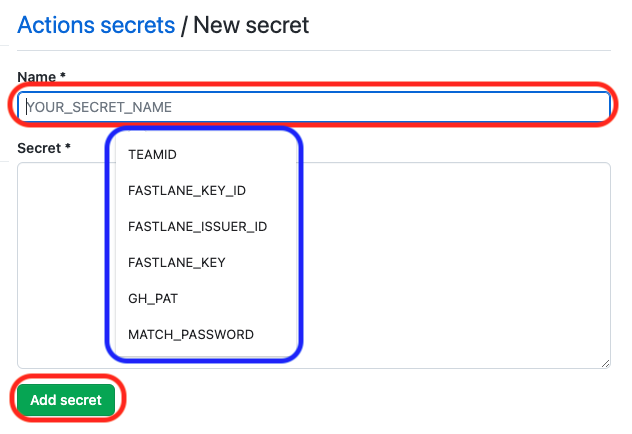
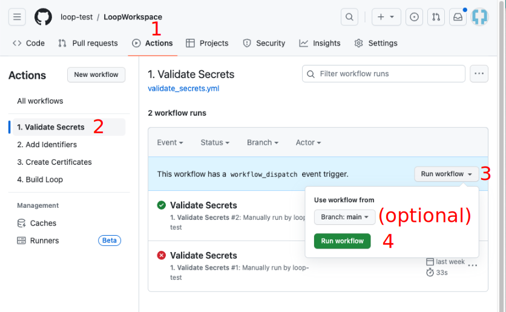

## Using *GitHub* Browser Build Method to Build Other Apps

Once Loop 3 was released with the ability to build using a browser, a lot of other repositories in the DIY universe began to add the same feature. **Only apps that are companions to &nbsp;Loop&nbsp; are included on this page.** If you want to build another DIY app that is not included here, look for the file `fastlane/testflight.md` in that app's repository and open it in a browser. The instruction for that apps should be located in that file.

The same technique is used and the same six Secrets are applied to each repository. Those secrets are tied to your *Apple* Developer ID and your *GitHub* account.

* Loop Caregiver
* Loop Follow

!!! warning "GH_PAT - NEW RECOMMENDATION"
    It is now recommended that you use a *GitHub* Personal Access Token (GH_PAT) that never expires

    - [GitHub Update: Regenerate *GitHub* Token](gh-update.md#regenerate-github-token)

    If you choose a *GitHub* personal access token that expires, you will get an email to renew it about 6 days ahead. You will paste your updated GH_PAT into the secrets for each repository you use and initiate the Build Action for that app. This will ensure continued availability of all your apps that you build with this method.

### Prerequisites

* If you have already built using the &nbsp;GitHub Browser Build&nbsp; method, it is easy to build the next repository. Skip ahead to [Fork and Add Secrets](#fork-and-add-secrets)

* If this is the first repository you have built with the &nbsp;GitHub Browser Build&nbsp; method, you must first complete the initial steps found on [GitHub First-Time](../gh-actions/gh-first-time.md). When you reach the point where
    * You have created your Match-Secrets repository
    * You are told to [GitHub First-Time: Fork LoopWorkspace](../gh-actions/gh-first-time.md#fork-loopworkspace)
        * Review the directions but don't do it
        * Return here and check the table below
        * Use that table to find the link of the repository you will fork

!!! important "Use the repository for the application you are building"
    Many graphics on this page show &nbsp;LoopWorkspace, just remember to use the repository for the app you want to build, that is either &nbsp;Loop Follow&nbsp; or &nbsp;Loop Caregiver.

## Fork and Add Secrets

* You will return to this page after reviewing (but not doing) this step [GitHub First-Time: Fork LoopWorkspace](../gh-actions/gh-first-time.md#fork-loopworkspace)
    * Use the same method as that section, but fork the repository for the app you plan to build

| App | Fork from this Address | Documentation |
|---|---|---|
| &nbsp;Loop Caregiver&nbsp; | [https://github.com/LoopKit/LoopCaregiver](https://github.com/LoopKit/LoopCaregiver) | [LoopDocs: &nbsp;Loop Caregiver](../nightscout/loop-caregiver.md) |
|Loop Follow | [https://github.com/loopandlearn/LoopFollow](https://github.com/loopandlearn/LoopFollow) | [Loop Follow](https://github.com/loopandlearn/LoopFollow#loop-follow)|

## Configure Secrets for this App

After successfully creating your fork of the repository for this app:

* If you have already built Loop using the &nbsp;GitHub Browser Build&nbsp; method, skip ahead to [Add Existing Secrets](#add-existing-secrets)

* If this is the first repository you have built with *GitHub*
    * You should follow the detailed steps at [GitHub First-Time: Configure Secrets](../gh-actions/gh-first-time.md#configure-secrets), except you will apply the Secrets to the repository for the app you are planning to build
    * Once your 6 secrets have been added, return to this page and skip ahead to [Validate Secrets](#validate-secrets) on this page.

### Add Existing Secrets

!!! tip "MATCH_PASSWORD"
    An early version of *GitHub* First-Time had incorrect information about the need to save MATCH_PASSWORD.

    If you did not save your MATCH_PASSWORD in your file with all your Secrets, you will need to delete your Match-Secrets repository, create a new one and then add all your Secrets into all you repositories again and run all the Actions again.

    Instructions are found at [Reset Match-Secrets](gh-errors.md#reset-match-secrets).

Open the text file in which you maintain a copy of your 6 Secrets so you can copy each value into the Secrets for this repository.

1. Click on the repository for your app
1. Click on the Settings Icon near the top right of your repository
    * On the left side, tap on `Secrets and variables` dropdown and choose Actions
    * After you select Actions, your screen should look like the graphic below

    {width="700"}
    {align="center"}

1. Tap on `New repository secret` and add each of the 6 Secrets
    * You will notices the New secret dialog looks a little different
    * As soon as you click on the Name* Box, the 6 Secret Names show up as a dropdown as shown in the graphic below
    * Select each one in turn and paste the secret value into the Secret* box and hit Add secret

    {width="500"}
    {align="center"}

Once all six Secrets are added, you will either to the first Action to validate your secrets.

## Validate Secrets

The first action step is to Validate Secrets.

{width="200"}
{align="left"}

Near the top middle of your Repository fork, click on the "Actions" tab.

* The first time you click on `Actions` with this repository you'll be informed that `Workflows aren't being run on this forked repository`
* Tap on the green button that says: `I understand my workflows, go ahead and enable them`

The workflows are now displayed: look at the list on the left side similar to that shown in the graphic below. (You can dismiss the Actions Enabled message using the X near the upper right side if it appears).

* The graphic below is an example from Loop, your screen will show your app and associated repository

This step validates most of your six Secrets and provides error messages if it detects an issue with one or more.

1. Click on the "Actions" tab of your &nbsp;Loop Follow&nbsp; or &nbsp;Loop Caregiver&nbsp; repository and enable workflows if needed
1. On the left side, click on 1. <code>Validate Secrets</code>
1. On the right side, click `Run Workflow` to show a drop-down menu
    * You will see your default branch (`main` for LoopFollow, `dev` for LoopCaregiver)
    * You can select a different branch, but typically, you run the default
1. Tap the green button that says `Run workflow`.

{width="700"}
{align="center"}

The `Validate Secrets` &nbsp;Action&nbsp; should succeed or fail in a few minutes. Do not continue to the next step until this one succeeds.

* If you see the green check (:octicons-check-circle-fill-16:{: .passed })  continue to the next section
* If you see the red `X` (:octicons-x-circle-fill-16:{: .failed }):
    * [Examine the Error](gh-errors.md#examine-the-error) tells how to view the file needed to diagnose your problem.
    * [Action: Validate Secrets Errors](gh-errors.md#action-validate-secrets-errors) tells you what to search for in the file
    * Resolve the error and repeat the Action: [Validate Secrets](#validate-secrets)

## Add Identifiers

Near the top middle of your Repository fork, click on the "Actions" tab.

* The graphic below is an example from Loop, your screen will show your app and associated repository

Refer to the graphic below for the numbered steps:

1. Click on the "Actions" tab of your repository
1. On the left side, click on "Add Identifiers"
1. On the right side, click "Run Workflow" to show a drop-down menu
    * You will see your default branch (`main` for LoopFollow, `dev` for LoopCaregiver)
    * You can select a different branch, but typically, you run the default
1. Tap the green button that says "Run workflow".

    {width="700"}
    {align="center"}

The `Add Identifier` &nbsp;Action&nbsp; should succeed or fail in a few minutes.

* If you see the green check (:octicons-check-circle-fill-16:{: .passed })  continue to the next section
* If you see the red `X` (:octicons-x-circle-fill-16:{: .failed }):
    * [Examine the Error](gh-errors.md#examine-the-error) tells how to view the file needed to diagnose your problem.
    * [Action: Add Identifiers Errors](gh-errors.md#action-add-identifiers-errors) tells you what to search for in the file
    * Resolve the error and repeat the Action: [Add Identifiers](#add-identifiers)

## Review App Identifier

Open this link: [Certificates, Identifiers & Profiles: Identifiers List](https://developer.apple.com/account/resources/identifiers/list) on the apple developer site.

After successfully performing the Add Identifiers Action, you will see the identifier for your app with a Name and Bundle ID matching that in the table below. You will see your unique TEAMID embedded in the identifier. (If you previously built this App with Xcode, the name may start with XC but the ending should match.)

| App Name | Name | Bundle ID |
| --- | --- | --- |
| &nbsp;Loop Caregiver&nbsp; | &nbsp;Loop Caregiver&nbsp; | com.TEAMID.loopkit.LoopCaregiver |
| Loop Follow | LoopFollow | com.TEAMID.LoopFollow |

Some apps, like Loop, require updates to the Identifiers after they are generated.

These apps, &nbsp;Loop Caregiver&nbsp; and &nbsp;Loop Follow, do not require that extra step.

## Create App in App Store Connect

You will be following the directions below to create an App in App Store Connect if you don't already have one.

This requires you to provide some information. Examine the table below for the bundle ID associated with your app. 

| App Name | Bundle ID |
| --- | --- |
| &nbsp;Loop Caregiver&nbsp; | com.TEAMID.loopkit.LoopCaregiver |
| &nbsp;Loop Follow&nbsp; | com.TEAMID.LoopFollow |

1. Open this link: [App Store Connect / Apps](https://appstoreconnect.apple.com/apps) to view your apps; log in if needed. 

1. If this App already exists, you can continue to [Create Certificates](#create-certificates)
1. Click the Add Apps button or the blue "plus" icon and select New App as shown in the graphic below

    {width="300"}
    {align="center"}

1. The New App dialog box opens and should appear similar to the graphic below. Before you fill anything out, make sure your Bundle ID is available in the dropdown menu. If you do not see the Bundle ID for your app; back out of this screen and follow the directions in [GitHub First-Time: Find My Loop](gh-first-time.md#find-my-loop), where you'll be finding App Name instead of Loop.
    * Select "iOS".
    * Enter a name: this will have to be unique
        * You could start with "App Name ABC" where ABC are your initials
        * If that is already taken, you can add a number, for example, "App Name ABC 123"
        * This name is what you see on the App Store Connect list and in the *TestFlight* app
        * Once installed on your phone, you will see the actual app name
        * You can [Change the App Store Connect Name](../gh-actions/gh-deploy.md#change-the-app-store-connect-name) later if you want
    * Select your primary language.
    * Choose the bundle ID for your app
    * SKU can be anything; for example "123" but must be unique across all your apps, so try 1234 or 12345 depending on how many apps you build with this method
    * Select "Full Access".

    {width="600"}
    {align="center"}

1. Click Create but do not fill out the next form. That is for submitting to the app store and you will not be doing that.

You are done with this activity. You can close the browser tab, but before you do, note the *TestFlight* tab at the top of the page. You'll be using that tab after you complete the next two actions.

## Create Certificates

* The graphic below is an example from Loop, your screen will show your app and associated repository

Refer to the graphic below for the numbered steps:

1. Click on the "Actions" tab of your Repository repository
1. On the left side, click on "Create Certificates"
1. On the right side, click "Run Workflow" to show a drop-down menu
    * You will see your default branch (`main` for LoopFollow, `dev` for LoopCaregiver)
    * You can select a different branch, but typically, you run the default
1. Tap the green button that says "Run workflow".

    {width="700"}
    {align="center"}

1. Wait a minute or two for the action to finish
    * If this action fails, head over to [Action: Create Certificates Errors](gh-errors.md#action-create-certificates-errors)
    * Once you've resolved the error, repeat the Actions [Add Identifiers](#add-identifiers) and then Create Certificates. (The Add Identifiers might not be required but it is fast and should be done as a matter of routine.)

## Build App

* The graphic below is an example from Loop, your screen will show your app and associated repository

Refer to the graphic below for the first four steps:

1. Click on the "Actions" tab of your Repository repository.
1. On the left side, click on "Build App Name".
1. On the right side, click "Run Workflow" to show a drop-down menu
    * You will see your default branch (`main` for LoopFollow, `dev` for LoopCaregiver)
    * You can select a different branch, but typically, you run the default
1. Tap the green button that says "Run workflow".

    {width="700"}
    {align="center"}

1. Wait a few minutes to make sure there is not an early failure
    * If this action fails, head over to [Action: Build Loop Errors](gh-errors.md#action-build-loop-errors)
    * Once you've resolved the error, it's a good idea to repeat all three steps in this order:
        * [Add Identifiers](#add-identifiers)
        * Create Certificates
        * Build Loop
1. If the process appears to be happening without an error, go do something else for a while. The build should take about 20-30 minutes.
1. Your app should eventually appear on [App Store Connect](https://appstoreconnect.apple.com/apps).

## Add Users to *TestFlight* for App

Once the first build completes, you will be able to configure *TestFlight* for the app - follow the template for setting up *TestFlight* for Loop found in [GitHub First-Time: Set Up Users and Access (TestFlight)](../gh-actions/gh-first-time.md#set-up-users-and-access-testflight)

## Deployment

The [GitHub Deployment](gh-deploy.md) walks you through the steps to deploy to a phone. When going through those steps, replace your App Name for Loop. Everything else is the same.

