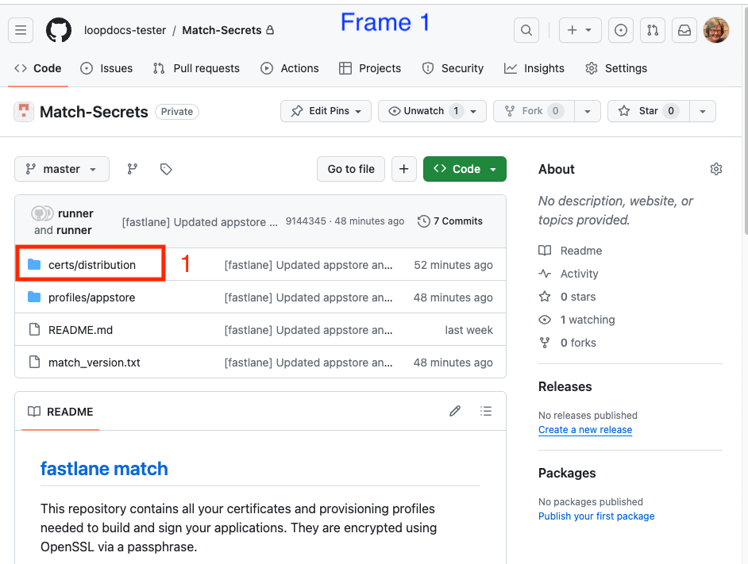

## Overview

**This page is only relevant when building with a browser.**

**For *Mac*, please see: [Update/Rebuild with *Mac*](../build/updating.md)**

???+ info "Time Estimate (click to open/close)"
    Build the *Loop* App

    - 5 min: Check *Apple* account status
    - Check if you need to renew certificates (once a year only)
    - 5 min: Update version if a new one is available
    - 5 min: Start the Build
    - 1 hour: Wait for the build to complete and appear in the *TestFlight* app on your phone
        * depends on *GitHub*, *Apple* and *TestFlight*
    - 5 min: Install from *TestFlight* onto your phone

    Once a Year [Renew Certificate](#renew-certificate)

    * 5 min: Clear out expired certificates
    * 5 min: Generate new certificates

???+ abstract "Page Summary (click to open/close)"
    **The *Loop* app must be built at least every 90 days when you build with a browser - this is *TestFlight* requirement.**

    Most users will start at [How to Update or Rebuild](#how-to-update-or-rebuild).

    If your *GitHub* `Personal Access Token` has expired, we recommend you update it with `No Expiration` as explained at [GitHub Token](#github-token).

    If you are running `Loop-dev`, be sure to review these instructions but modify for the branch you are using: refer to [Build Loop dev with Browser](build-dev-browser.md)

???+ question "FAQs (click to open/close)"
    - **"What is an update?"** Anytime you want to change versions or if your *TestFlight* build is about to expire, follow the instructions on this page.
    - **"Do I delete my old Loop app first?"** Definitely **not**! If you keep your Loop app on your phone, your Loop settings (and existing pod) will continue to work the same after the update. Seamless.
    - **"Do I need to start a new pod when I update?"** No. Your existing pod session will continue seamlessly if you are using the same Developer Account as the last time you built.
    - **"What if I'm using a new/different developer account?"** If you aren't building with the same developer account used when your existing app was built, then you will be installing a brand new (second) Loop app on your phone. Your existing pod won't work with the new app, so you might want to time this transition when you are due to change pods. Delete the old app once you get the new one all set up.
    - **Do I need a computer?** No.
    - **Can I do this on my phone?** Yes, especially after you update your *GitHub* token to `No Expiration`.
    - **Did the directions change?** Yes. We now recommend you select a *GitHub* Personal Access Token that never expires and supports automatic update and rebuild when that feature is released. It simplifies the build every 90-day process significantly.
    - **How do I set my *GitHub* `Personal Access Token` to never expire and to support the automatic rebuild feature?** See this section [Regenerate Token](#regenerate-token).
    - **What happens to my existing builds when I change my *GitHub* Personal Access Token?** Nothing. The <code>GH_PAT</code> only affect future builds. Previous build are available for the full 90 days.
    - **Is there anything I have to do once a year?** Yes. Once a year you need to get a new `Distribution Certificate`. These only last one year. See this section [Renew Certificate](#renew-certificate)

## When to Update or Rebuild

Under ordinary circumstances, you do not *have to* rebuild or update your *Loop* app until *TestFlight* forces you to (90 days). However, there is no harm in building more frequently.

* You control when the new app is installed on your phone, refer to: [Install on Phone: Disable Automatic Install from *TestFlight*](gh-deploy.md#disable-automatic-install-from-testflight)
* You always want a build available in the *TestFlight* app
    * You can use *TestFlight* to quickly install the app if you loose or break your phone and need to replace it
    * You can use *TestFlight* to quickly install the app if someone accidentally deletes the app from your phone

## How to Update or Rebuild

!!! abstract "Summary of Update Steps"
    1. [Accept Agreements](#accept-agreements)
    2. [Renew Certificate](#renew-certificate) **(once a year)**
    3. [Update `Fork`](#update-fork)
    4. [Build the *Loop* App](#build-the-loop-app)
    5. [Wait for *TestFlight*](#wait-for-testflight)
    6. [Install on Phone](#install-the-loop-app-on-the-phone)

    Ignore the email that says you need to fix "issues" in your app. You are not selling the app in the app store; so no action is required. The app you built is for personal use for you or a family member.

    There is also a helpful video for updating (it does not include the Renew Certificates step, which is only done once a year):

    * [How to Update and Rebuild DIY Loop with a Web Browser](https://www.youtube.com/watch?v=0ipTsiqbbrQ){: target="_blank" }

### Accept Agreements

> This is Step 1 of 6 - it may not always be necessary, but please check every time.

Sign in to your [Apple Developer account](https://developer.apple.com/account){: target="_blank" }. If there are agreements you have not accepted, you will get errors when you try to Build that indicate your *Apple* <code>Secrets</code> are incorrect - that is very unlikely. You may also need to update your credit card information if it has changed, for example, if there is a new expiration date.

* For an update, you do not need to modify the <code>FASTLANE_ISSUER_ID</code>, <code>FASTLANE_KEY_ID</code> or <code>FASTLANE_KEY</code>
* Check your *Apple* Developer account for agreements, then continue

If you need detailed instructions, click on this [<code>Apple Program License Agreement</code> Help Page](https://support.pushpay.com/s/article/Accepting-the-Apple-Program-License-Agreement){: target="_blank" }.

* Accept the `Apple Program License Agreement` (only)
    * You do NOT need to accept anything related to the `Paid Applications Schedule Agreement`
    * That is only required when you sell an app through the `App Store`

!!! warning "Wait After You Agree"
    It typically takes 15 minutes before your updated agreement is available so you can complete your build.

    If your build with browser fails, wait longer. An hour wait was reported by one person.

### Renew Certificate

> This is Step 2 of 6 - it is only needed once a year - you should get an email from Apple 30 days before your `Distribution Certificate` expires.

**Once a year, you need to renew your `Distribution Certificate` to continue using the build with browser method.**

> Note that these steps should become more automated, but for now, here's what you need to do when you get an email from Apple informing you that "Your `Distribution Certificate` will no longer be valid in 30 days."

> Many people report not seeing the email; that is covered in the steps below.

**Apps in TestFlight that have not already expired are not affected by revoking the certificate.**

* Apps installed on the phone continue to run
* Apps can be installed from TestFlight onto a phone up through the TestFlight expiration date
* You just cannot build a new app until a new Certificate is generated

??? question "Do you want to know more? (Click to open/close)"
    This is only a summary - please follow the detailed steps below carefully.

    * Delete all your `Distribution Certificates`. Apple only allows you to have 2 of these. So get rid of the old ones so you will be able to create a new one that will last a full year. (Step 1 below.)

    * The Certificate in question is embedded in your `Match-Secrets repository`. In order to proceed, you need to remove the old certificate from `Match-Secrets`. Later this will be automated and can be done without modifying your `Match-Secrets repository`, but for now the easiest way to do that is to just delete the `certs/distribution` folder in your current `Match-Secrets repository`.

    * Finally, for every app that you build with this method, you need to run `Create Certificates` for that app. (Step 4 below.)

#### Manual Steps to Renew Your `Distribution Certificate`

!!! warning "Delete and Create"
    **Do not miss the final step in this section. After you delete certificates, you must run the Action for `Create Certificates` before you can build an app again.**

1. Use this link to view your [Apple Developer Certificates](https://developer.apple.com/account/resources/certificates/list){: target="_blank" }
    * If your screen shows no Certificates and you see a message "Getting Started with Certificates", your certificate already expired and was removed by *Apple*; so skip ahead to Step 2: Navigate to your `Match-Secrets` Repository
    * Carefully examine the `Type` column - do **not** delete a `Development Certificate`
        * If you do not have any rows that say `Distribution Certificate`, your certificate already expired and was removed by *Apple*; so skip ahead to Step 2
        * If your certificate has an expiration date several months in the future - you can wait and renew your certificate later; skip ahead to [Update `Fork`](#update-fork)
    * Click each row that has a `Distribution Certificate` and revoke it
    * You will get an email informing you the certificate was revoked
1. Navigate to your `Match-Secrets` Repository
    * You can do this several ways, but the URL address will be `https://github.com/username/Match-Secrets` where `username` is replaced by your *GitHub* username
1. Delete the `certs/distribution` folder using these instructions. The GIF below indicates the places to click with numbered red rectangles:
    * Frame 1: Click 1 on the folder called `certs/distribution`
    * Frame 2: Click 2 and 3 on the three dots in the upper right and then `Delete directory`
    * Frame 3: Click 4 and 5 on `Commit changes` in the upper right and then accept the suggested choice by clicking on `Commit changes` in the lower right

    {width="700"}
    {align="center"}

1. In your fork of LoopWorkspace:
    * Run the [`Action`: `Create Certificates`](gh-first-time.md#create-certificates){: target="_blank" }

!!! question "Deleting the certs/distribution folder did not work for me"
    Some people reported trouble with this step. The other option is to delete and create a new `Match-Secrets` repository: see [Reset `Match-Secrets`](gh-errors.md#reset-match-secrets){: target="_blank" }

!!! warning "Other Apps"
    If you build other apps using the build with browser method, they have just had their certificates revoked.

    * The existing apps you installed from TestFlight continue working until their TestFlight expiration date
    * You cannot build new versions of the app until you run `Create Certificates` for that app
    * To make sure you don't forget, go ahead and do that for all your other `repositories` now

### Update `Fork`

> This is Step 3 of 6 - it may not always be necessary, but please check every time.

Open your *GitHub* account and select your <code>LoopWorkspace repository</code> from your repositories list.

{width="700"}
{align="center"}

* If your `fork` is up to date with LoopKit version, you will see the message `This branch is up to date with LoopKit/LoopWorkspace:{branch}` - there is no need to build again unless your Loop app in *TestFlight* is about to expire - in which case, proceed to [Build the *Loop* App](#build-the-loop-app)
* If your `fork` shows a message such as `This branch is 3 commits behind LoopKit:main` and you want to update and build, then click `Sync Fork` by tapping where the red rectangle is shown in the graphic above, then in the pop-up window, tap on `Update branch`
* If your `fork` shows a message such as `This branch is 3 commits behind LoopKit:main and 4 commits ahead of LoopKit:main`; you might need to manually sync and choose to `discard changes`; you can always customize again after the update

!!! question "Building a different branch"
    Do I need to do anything special to build a different branch?

    Yes: please follow instructions at [Build Development Version](#build-development-version)

### Build the *Loop* App

> This is Step 4 of 6 - this is always required.

Refer to graphic below as you follow the steps to build the *Loop* app.

* Click on the `Actions` tab
* Select the `4. Build Loop` workflow on the left
    * If using a mobile browser, be sure to use landscape mode to more closely match how *GitHub* looks on a computer.
* Look on the right and click `Run workflow` to  see the dropdown
* Click on the green `Run workflow` button in the dropdown
* Wait ~25 min for the build to complete successfully
* It is then processed by *Apple* and sent to *TestFlight* (be patient)

{width="700"}
{align="center"}

#### What if the Build Fails

If a new release is announced at [Current Release](../version/releases.md#current-release), look to see if there are instructions about extra steps required with the release. (The release after 3.2.3 will certainly have extra instructions.)

If you are using the dev branch, head over to [Build Development Version](#build-development-version) for information.

Otherwise, head over to [Errors with Browser](gh-errors.md).

#### *Apple* Email to Ignore

You can ignore an email from *Apple* that there are things you must fix in your app:

*  There is no action you need to take - the developers will handle any updates that are required before it affects your ability to build the app
* Other warnings only address issues if you were selling the app in the app store, but it is for your own personal use

### Wait for *TestFlight*

You'll receive an App Store Connect email confirming that the build has completed processing, and a *TestFlight* email confirming the new app is ready to test.

* If you get an email that the action failed, then return to your repository and look for Build Action error messages
    * Click on the most recent Build job with the red x by it
    * If the details show this message, [`Could not install WWDR certificate`](gh-errors.md#could-not-install-wwdr-certificate)
         * This means *Apple* did not reply to *GitHub* as fast as *GitHub* expected
         * Make sure your developer account is in good standing and that there are no agreements that need to be accepted
        * Repeat the build (previous step)

### Install the *Loop* app on the phone

> This is Step 6 of 6 - once you finish this, you are done and your app will last 90 days.

Open the *TestFlight* app on the Loopers phone and install the most recent version of the *Loop* app. Most Loopers have automatic update disabled on their phones, so this is a manual process. **Don't forget.**

The updated Loop app will show up in your *TestFlight* app on the Looper's phone.

* Your new app will have "Expires in 90 days"
    * There may be older builds that are still in *TestFlight*
    * It takes time for the update to show up in the *TestFlight* app
    * Wait for the one that expires in about 90 days
* You will also see a build number in parentheses, that number increments each build - don't worry about the number

!!! tip "Calendar Reminder"
    This is a good time to put a calendar reminder in your favorite app.

    Set it up for a few days before the *TestFlight* app will expire.

#### Automatic Update Disabled

Option 1: If you chose to [Disable Automatic Install from *TestFlight*](../gh-actions/gh-deploy.md#disable-automatic-install-from-testflight), you control when to install the app on the phone.

* **This is the recommended option**
* Open *TestFlight* on your phone and click `Install` as shown in the GIF below
* If you are building for a child, follow the [*TestFlight* for a Child](gh-deploy.md#testflight-for-a-child) instructions again

{width="300"}
{align="center"}

#### Automatic Update Enabled

> We strongly recommend you toggle off Automatic Updates to allow you to be in full control over when the app is updated. This is even more important if you're using automatic builds from GitHub for version 3.3 or later.

Option 2: If you chose to enable Automatic Updates from *TestFlight* for the *Loop* app, the updated build will be installed over your existing app as soon as it uploaded to *TestFlight*.

* In this case, when you look at the *TestFlight* app on your phone, the app should have installed automatically
* Refer to the GIF above, the message will say `Open` instead of `Install`

## Choose Previous Build

If you are a typical user who just builds a single version for yourself or your child, you do not need to read this section.

This section provides detailed instructions if you want to choose a previous build to install on your phone. Typically, the most recent build is selected but there may be special cases:

* You are supporting multiple family members and may build different versions for each
* You want to test a different `branch` or set of customizations; you can install a previous build once you are done with the test

This section covers two topics.

1. Optional: [Add Test Details](#add-test-details) to the TestFlight build
2. [Select a Previous Build](#select-a-previous-build)

### Add Test Details

About half an hour after the build action completes, the new build will appear in the TestFlight screen at this link: [App Store Connect / Apps](https://appstoreconnect.apple.com/apps){: target="_blank" }

* Log in if needed
* Select your *Loop* app
* Click on the `TestFlight` tab to see a screen similar to the graphic below

{width="700"}
{align="center"}

Select the build to which you wish to add testing notes. When you tap on that icon, it opens a screen similar to that in the next graphic.

{width="700"}
{align="center"}

Click inside the box under **Test Details**. Insert the text you want to see on the phone before you install this version of the app. Tap the <code>Save</code> button at upper right and then <code>< iOS Builds</code> at upper left.

In this example, the branch and commit number are included followed by an indication that this version includes the customizations preferred by this person. Your test details can be as simple as "Use this for Charlie".

!!! tip "Commit Number"
    If your build includes customizations, your commit number will not match what the developer expects to see if you need to ask for help.

    Use this section [Customization and SHA-1](edit-browser.md#customization-and-sha-1) to determine the SHA-1 before customization.

### Select a Previous Build

First open the *TestFlight* app on your phone and select the *Loop* app.

Near the bottom of the screen is a row labeled previous builds.

* Tap on the previous builds row
* The available builds are grouped by app version number, choose your desired version
* Typically you choose the most recent build for that version and click Install and then Open after installation completes
* All your settings should remain

The following graphic shows the view seen in the *TestFlight* app on the phone. By adding test details (as explained in the previous section), the desired build is clear. For most people - they will just use the most recent build. This procedure is useful for those who build often or who support multiple family members.

{width="300"}
{align="center"}

## The *Loop* App Build Details

In the *Loop* app, once installed on your phone, tap on `Settings -> Support -> Issue Report`. The graphic below shows an example of the Build Details included in the report.

* The `profileExpiration` listed here is irrelevant - the app expires when the *TestFlight* expiration indicates
    * Pro Tip: Add a calender reminder for your next build
* An app built with a browser displays a `sourceRoot` that starts with `/Users/runner/work/LoopWorkspace`
    * The `buildDateString` is when the app was built and transferred to *TestFlight*, not when it was installed on your phone
    * You can use 90 days from this date, as well as the Expires in ## Days on the *TestFlight* app, to know when you need to rebuild

{width="300"}
{align="center"}

## *GitHub* Token

Your *GitHub* `Personal Access Token` should be configured:

* `Never expire`
* `repo, workflow` permission scope

If you are not logged in to *GitHub* and have not logged in recently, then you may see the authentication screen when doing the steps below.

Authenticate if requested by clicking on the green `Send SMS` button or entering your password.

{width="300"}
{align="center"}

Once you are authenticated, you will have access to view your personal access token.

### Modify `Personal Access Token`

If your `Personal Access Token` has not expired but does not have the correct permission, you should modify it. Do not regenerate it.

Click on the link to view your token and compare it to the graphic below.

* [Link to access your *GitHub* `Personal Access Token`](https://github.com/settings/tokens){: target="_blank" }

{width="600"}
{align="center"}

The graphic above has a blue rectangle added to indicate where you should see your token. If yours does not look like this, click on the link (`FastLane Access Token`) to open a new display. Watch the GIF below - there are 4 frames, the last one has the Update token button.

1. Click on the link (`FastLane Access Token`) to open a new display
1. This example has no workflow or repo checks in it
1. Add a check to the workflow box
1. Scroll all the way to the bottom of the screen and click on the green `Update token` button

{width="600"}
{align="center"}

After you click on the `Update token` button, your `FastLane Access Token` should now show `repo, workflow` and look like the earlier graphic above.

The only reason to regenerate a token is if it is set to expire. Do not do the next section unless you have to.

### Regenerate Token

If your `Personal Access Token` has expired or has an expiration date, you can regenerate the new one at any time.

!!! tip "Update new GH_PAT to <code>Secrets</code>"
    After you get your new token, immediately add it to your <code>Secrets</code> for any app you build with this method. You don't have to rebuild the app, but it's a good idea to at least run `Action 1. Validate Secrets` for each repository to make sure you did not make a mistake.

You can regenerate your *GitHub* `Personal Access Token` at any time by clicking on the link below. (it will open in a new browser tab.)

* [Link to access your *GitHub* Personal Access Token](https://github.com/settings/tokens){: target="_blank" }

The `FastLane Access Token` is a clickable link.

{width="600"}
{align="center"}

After you click on `FastLane Access Token` your screen should be similar to the graphic below.

!!! question "Your existing *TestFlight* builds are fine"
    The yellow *GitHub* warning by the `Regenerate Token` button is for new builds you make in the future.

    Previous builds are still available in *TestFlight* and are not affected by this action.

Note - selecting the `workflow` check box below is new. If yours does not show that selection, add it before you click on Regenerate token (red highlight in graphic below).

{width="600"}
{align="center"}

Click on Regenerate token (red highlight in previous graphic) to see screen similar to next graphic. 

* Most Loopers will have classic personal access tokens
    * If you are a developer who needs to use the fine-grained (by repository) option, that's fine

Be sure to change the Expiration from `30 days` to `No Expiration`. When you select `No Expiration` a *GitHub* warning appears. Click on the green `Regenerate Token` button (red highlight in following graphic).

{width="600"}
{align="center"}

The next screen shows your new token. Copy the token using the copy icon and save it along with your other secret settings.

{width="600"}
{align="center"}

The next step is to update GH_PAT in your <code>Secrets</code>. (If you build other apps with this method - update the GH_PAT for all of them right now - do not forget.)

### Update <code>Secrets</code>

This example is for updating GH_PAT in the <code>Secrets</code> for your `repository`, but the same method can be applied when changing any of the <code>Secrets</code>.

Open the `repository` for which you will update <code>Secrets</code>. On the far right is a Settings selection. If you don't see Settings (if last item on row is Insights), then you are **not** on your `fork` or you need to sign in to your *GitHub* account. You should see `username/LoopWorkspace` with `forked` from `LoopKit/LoopWorkspace` underneath.

Refer to the GIF for help. There are 3 frames.

{width="500"}
{align="center"}

1. Tap on Settings, then scroll down until you see `Secrets and variables` on the left side and click on the drop down indicator to display `Actions`.
1. Keep scrolling on the same screen, past the `Action secrets / New repository secret` row, until you see the list of your current <code>Secrets</code>. 
1. Click on the GH_PAT, tap on the pencil and enter the new token in the form. Click on Update Secret to complete the action.

Scroll all the way to the top of the screen and tap on your LoopWorkspace link. Then follow the [How to Update or Rebuild](#how-to-update-or-rebuild) instructions to start a new build.

## Build Development Version

The information to build a development (`dev` or any other branch) has been moved to a new page: [Build dev with Browser](build-dev-browser.md)
