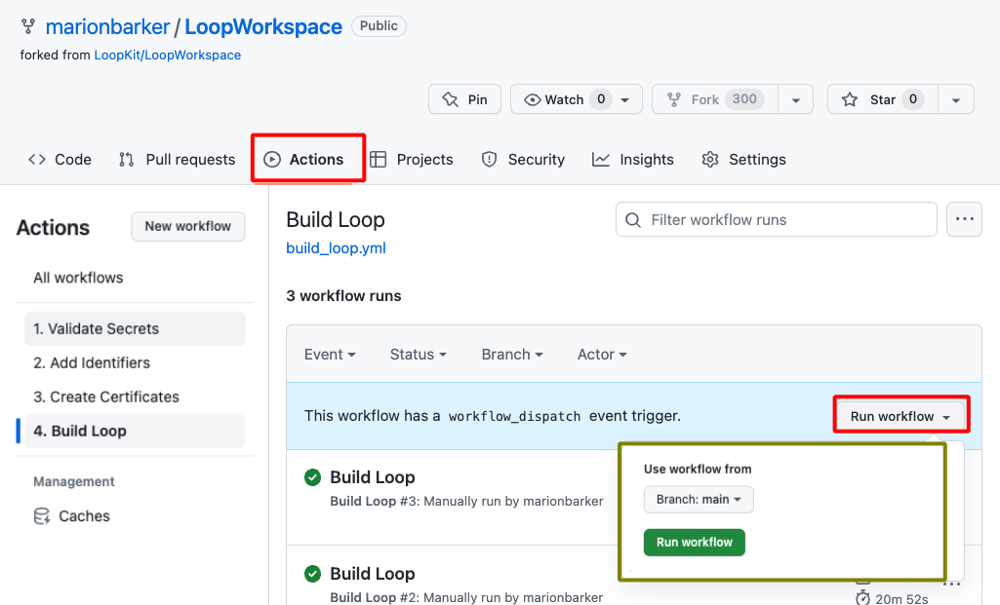
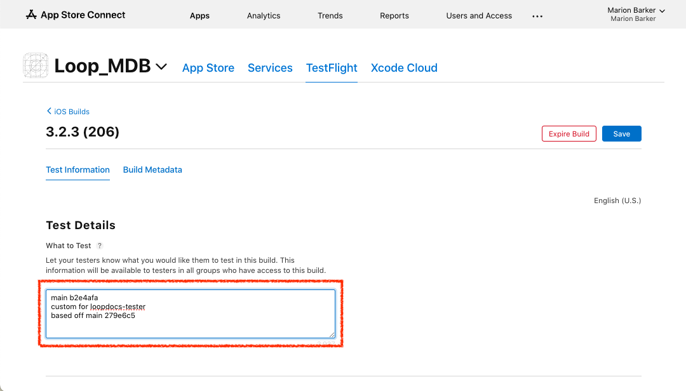
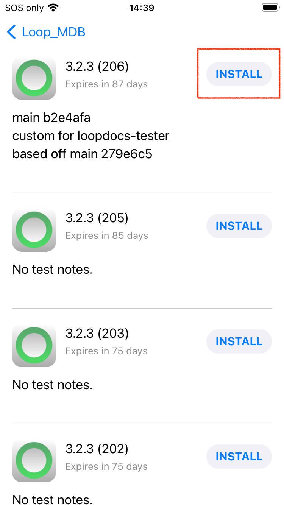
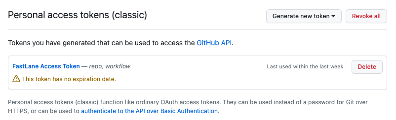
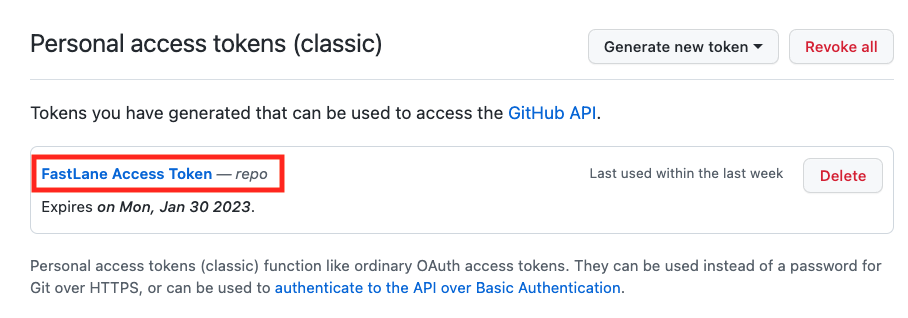
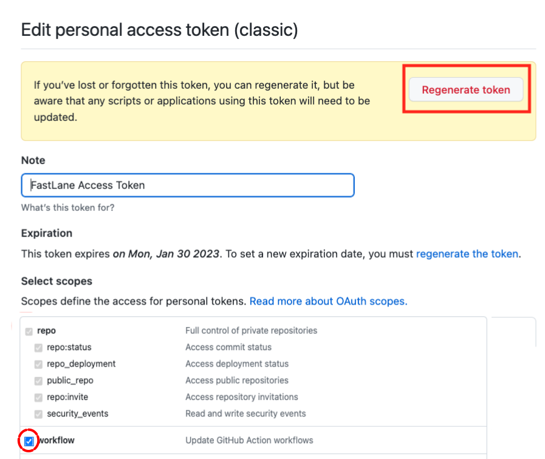

## Overview

**This page is only relevant when building with a browser.**

**For *Mac-Xcode*, please see: [Update/Rebuild with *Mac-Xcode*](../build/updating.md)**

???+ info "Time Estimate (click to open/close)"
    Build the *Loop* App

    - Check *Apple* account status
    - Update version if a new one is available
    - Start the Build: 5 minutes
    - Wait for the build to complete and appear in the *TestFlight* app on your phone
        * about an hour
        * depends on *GitHub*, *Apple* and *TestFlight*

    Optional: If you need to update your *GitHub* Personal Access token

    * 5 minutes to regenerate token
    * 5 minutes to update the GH_PAT Secret for each of your app <code>repositories</code>

???+ abstract "Page Summary (click to open/close)"
    **The *Loop* app must be built at least every 90 days when you build with a browser - this is *TestFlight* requirement.**

    Most users will start at [How to Update or Rebuild](#how-to-update-or-rebuild):

    * If currently using verion 3.2.3 or earlier, there are extra steps included to update to 3.4
    * This provides automatic build

    If you are running `Loop-dev`, be sure to review [Build Development Version](#build-development-version)

    * You should be following along with zulipchat when using the `dev branch`
    * Summary build updates can be found under the [One-Time Changes](#one-time-changes) section

???+ question "FAQs (click to open/close)"
    - **"What is an update?"** Anytime you want to change versions or if your *TestFlight* build is about to expire, follow the instructions on this page.
    - **"Do I delete my old Loop app first?"** Definitely **not**! If you keep your Loop app on your phone, your Loop settings (and existing pod) will continue to work the same after the update. Seamless.
    - **"Do I need to start a new pod when I update?"** No. Your existing pod session will continue seamlessly if you are using the same Developer Account as the last time you built.
    - **"What if I'm using a new/different developer account?"** If you aren't building with the same developer account used when your existing app was built, then you will be installing a brand new (second) Loop app on your phone. Your existing pod won't work with the new app, so you might want to time this transition when you are due to change pods. Delete the old app once you get the new one all set up.
    - **Do I need a computer?** No.
    - **Can I do this on my phone?** Yes, especially after you update your *GitHub* token to `No Expiration`.
    - **Did the directions change?** Yes. We now recommend you select a *GitHub* Personal Access Token that never expires and supports automatic update and rebuild when that feature is released. It simplifies the build every 90-day process significantly.
    - **How do I set my *GitHub* `Personal Access Token` to never expire and to support the automatic rebuild feature?** See this section [Regenerate Token](#regenerate-token).
    - **What happens to my existing builds when I change my *GitHub* Personal Access Token?** Nothing. The <code>GH_PAT</code> only affect future builds. Previous build are available for the full 90 days.

## When to Update or Rebuild

Under ordinary circumstances, you do not *have to* rebuild or update your *Loop* app until *TestFlight* forces you to (90 days). However, there is no harm in building more frequently.

* You control when the new app is installed on your phone, refer to: [Install on Phone: Disable Automatic Install from *TestFlight*](gh-deploy.md#disable-automatic-install-from-testflight)
* You always want a build available in the *TestFlight* app
    * You can use *TestFlight* to quickly install the app if you loose or break your phone and need to replace it
    * You can use *TestFlight* to quickly install the app if someone accidentally deletes the app from your phone

## How to Update or Rebuild

!!! abstract "Summary of Update Steps"
    * [Accept Agreements](#accept-agreements)
    * [Update `Fork`](#update-fork)
    * [Build the *Loop* App](#build-the-loop-app)
    * [Wait for *TestFlight*](#wait-for-testflight)
    * [Install or Confirm Installation](#install-or-confirm-installation)

    Ignore the email that says you need to fix "issues" in your app. You are not selling the app in the app store; so no action is required. The app you built is for personal use for you or a family member.

### Accept Agreements

Sign in to your [Apple Developer account](https://developer.apple.com/account). If there are agreements you have not accepted, you will get errors when you try to Build that indicate your *Apple* <code>Secrets</code> are incorrect - that is very unlikely. You may also need to update your credit card information if it has changed, for example, if there is a new expiration date.

If you need detailed instructions, click on the [<code>Apple Program License Agreement</code>](https://support.pushpay.com/s/article/Accepting-the-Apple-Program-License-Agreement) help page.

* Accept the `Apple Program License Agreement` (only)
    * You do NOT need to accept anything related to the `Paid Applications Schedule Agreement`
    * That is only required when you sell an app through the `App Store`

!!! warning "Wait After You Agree"
    It typically takes 15 minutes before your updated agreement is available so you can complete your build.

    If your build with browser fails, wait longer. An hour wait was reported by one person.

### Update `Fork`

Open your *GitHub* account and select your <code>LoopWorkspace repository</code> from your repositories list.

{width="700"}
{align="center"}

* If your `fork` is up to date with LoopKit version, you will see the message `This branch is up to date with LoopKit/LoopWorkspace:{branch}` - there is no need to build again unless your Loop app in *TestFlight* is about to expire - in which case, proceed to [Build the *Loop* App](#build-the-loop-app)
* If your `fork` shows a message such as `This branch is 3 commits behind LoopKit:main` and you want to update and build, then click `Sync Fork` by tapping where the red rectangle is shown in the graphic above, then in the pop-up window, tap on `Update branch`
* If your `fork` shows a message such as `This branch is 3 commits behind LoopKit:main and 4 commits ahead of LoopKit:main`; you might need to manually sync and choose to `discard changes`; you can always customize again after the update

!!! question "Building a different branch"
    Do I need to do anything special to build a different branch?

    Yes: please follow instructions at [Build Development Version](#build-development-version)

### Build the *Loop* App

If you have successfully built Loop 3.4 with automatic build configuration enabled and later decide to manually build Loop, all that is required is to run the action: Build Loop for your fork and skip ahead to [Wait for TestFlight](#wait-for-testflight).

#### Updating from 3.2.x to 3.4

For the update from 3.2.x to 3.4, you must do a few more actions than normal, but you will get automatic updates and builds in the future.

#### Add and Update New Identifier

The `Identifier` for the "`widget`" changed from "`SmallStatusWidget`" to the more descriptive "`LoopWidgetExtension`". You need to run Add Identifier, wait for it to succeed and then add the `App Group` to this one new Identifier, shown in the table below.

All other identifiers should be already set up. If they are not, please go through the steps on the [Configure to use Browser: Add `App Group` to `Identifiers`](gh-first-time.md#add-app-group-to-identifiers) to figure out what you are missing.

| `NAME` | `IDENTIFIER` |
|-------|------------|
| `Loop Widget Extension` | `com.TEAMID.loopkit.Loop.LoopWidgetExtension` |

* Open the [Certificates, Identifiers & Profiles: Identifiers List](https://developer.apple.com/account/resources/identifiers/list) page.
* Click on the "`LoopWidgetExtension`" identifier
* Edit the App Group to include `group.com.TEAMID.loopkit.LoopGroup` where you use your `TEAMID`

#### Create Certificates and Build

You must create certificates again to cover the new Identifier name and to provide support for the addition of the Libre sensors. (This step is required whether you use Libre or not - Loop needs permission to have that capability). Once the certificate action succeeds, then run the action to build Loop.

1. Run the Action for Create Certificates
1. Run the Action for Build Loop

Refer to graphic below as you follow the steps to build the *Loop* app.

* Click on the `Actions` tab
* Select the `4. Build Loop` workflow on the left
    * If using a mobile browser, be sure to use landscape mode to more closely match how *GitHub* looks on a computer.
* Look on the right and click `Run workflow` to  see the dropdown
* Click on the green `Run workflow` button in the dropdown
* Wait ~25 min for the build to complete successfully
* It is then processed by *Apple* and sent to *TestFlight* (be patient)

{width="700"}
{align="center"}

#### What if the Build Fails

If a new release is announced at [Current Release](../version/releases.md#current-release), look to see if there are instructions about extra steps required with the release. (The release after 3.2.3 will certainly have extra instructions.)

If you are using the dev branch, head over to [Build Development Version](#build-development-version) for information.

Otherwise, head over to [Errors with Browser](gh-errors.md).

#### *Apple* Email to Ignore

* You can ignore an email from *Apple* that there are things you must fix in your app - that refers to things to fix before putting that app in the App Store and you will not be doing that

### Wait for *TestFlight*

You'll receive an App Store Connect email confirming that the build has completed processing, and a &nbsp;TestFlight&nbsp;email confirming the new app is ready to test.

* If you get an email that the action failed, then return to your repository and look for Build Action error messages
    * Click on the most recent Build job with the red x by it
    * If the details show this message, [`Could not install WWDR certificate`](gh-errors.md#could-not-install-wwdr-certificate)
         * This means *Apple* did not reply to *GitHub* as fast as *GitHub* expected
         * Make sure your developer account is in good standing and that there are no agreements that need to be accepted
        * Repeat the build (previous step)

The updated app will show up in your&nbsp;TestFlight&nbsp;app.

* Your new app will have "Expires in 90 days"
    * It takes time for the update to show up in the&nbsp;TestFlight&nbsp;app
    * There may be older builds that are still in&nbsp;TestFlight
* You will also see a build number in parentheses, that number increments each build

### Install or Confirm Installation

#### TestFlight Automatic Update Disabled

Option 1: If you chose to [Disable Automatic Install from *TestFlight*](../gh-actions/gh-deploy.md#disable-automatic-install-from-testflight), you control when to install the app on the phone.

* **This is the recommended option**
* Open *TestFlight* on your phone and click `Install` as shown in the GIF below
* If you are building for a child, follow the [*TestFlight* for a Child](gh-deploy.md#testflight-for-a-child) instructions again

{width="300"}
{align="center"}

#### Automatic Update Enabled

> We strongly recommend you toggle off Automatic Updates to allow you to be in full control over when the app is updated. This is even more important if you're using automatic builds from GitHub for version 3.3 or later.

Option 2: If you chose to enable Automatic Updates from *TestFlight* for the *Loop* app, the updated build will be installed over your existing app as soon as it uploaded to *TestFlight*.

* In this case, when you look at the&nbsp;TestFlight&nbsp;app on your phone, the app should have installed automatically
* Refer to the GIF above, the message will say `Open` instead of `Install`

## Choose Previous Build

If you are a typical user who just builds a single version for yourself or your child, you do not need to read this section.

This section provides detailed instructions if you want to choose a previous build to install on your phone. Typically, the most recent build is selected but there may be special cases:

* You are supporting multiple family members and may build different versions for each
* You want to test a different `branch` or set of customizations; you can install a previous build once you are done with the test

This section covers two topics.

1. Optional: [Add Test Details](#add-test-details) to the TestFlight build
2. [Select a Previous Build](#select-a-previous-build)

### Add Test Details

About half an hour after the build action completes, the new build will appear in the TestFlight screen at this link: [App Store Connect / Apps](https://appstoreconnect.apple.com/apps)

* Log in if needed
* Select your *Loop* app
* Click on the `TestFlight` tab to see a screen similar to the graphic below

{width="700"}
{align="center"}

Select the build to which you wish to add testing notes. When you tap on that icon, it opens a screen similar to that in the next graphic.

{width="700"}
{align="center"}

Click inside the box under **Test Details**. Insert the text you want to see on the phone before you install this version of the app. Tap the <code>Save</code> button at upper right and then <code>< iOS Builds</code> at upper left.

In this example, the branch and commit number are included followed by an indication that this version includes the customizations preferred by this person. Your test details can be as simple as "Use this for Charlie".

!!! tip "Commit Number"
    If your build includes customizations, your commit number will not match what the developer expects to see if you need to ask for help.

    Use this section [Customization and SHA-1](gh-customize.md#customization-and-sha-1) to determine the SHA-1 before customization.

### Select a Previous Build

First open the *TestFlight* app on your phone and select the *Loop* app.

Near the bottom of the screen is a row labeled previous builds.

* Tap on the previous builds row
* The available builds are grouped by app version number, choose your desired version
* Typically you choose the most recent build for that version and click Install and then Open after installation completes
* All your settings should remain

The following graphic shows the view seen in the *TestFlight* app on the phone. By adding test details (as explained in the previous section), the desired build is clear. For most people - they will just use the most recent build. This procedure is useful for those who build often or who support multiple family members.

{width="300"}
{align="center"}

## TestFlight&nbsp;Expiration Warning

For version 3.3.0 and newer, the usual [Loop expiration notification system](../operation/features/notifications.md#loop-app-expiration-notification) alerts the user when the app is within 20 days of expiration. In addition to that modal alert, the user can examine the bottom of the Settings screen at any time to see the expected expiration date and time.

{width="300"}
{align="center"}

## GitHub Personal Access Token

Your *GitHub* `Personal Access Token` should be configured:

* `Never expire`
* `repo, workflow` permission scope

Refer to [Modify Automatic Building](#modify-automatic-building) if you don't want to accept the default recommendation to automatically update and build.

If you are not logged in to *GitHub* and have not logged in recently, then you may see the authentication screen when doing the steps below.

Authenticate if requested by clicking on the green `Send SMS` button or entering your password.

{width="300"}
{align="center"}

Once you are authenticated, you will have access to view your personal access token.

### Modify `Personal Access Token`

If your `Personal Access Token` has not expired but does not have the correct permission, you should modify it. Do not regenerate it.

Click on the link to view your token and compare it to the graphic below.

* [Link to access your *GitHub* `Personal Access Token`](https://github.com/settings/tokens)

{width="600"}
{align="center"}

The graphic above has a blue rectangle added to indicate where you should see your token. If yours does not look like this, click on the link (`FastLane Access Token`) to open a new display. Watch the GIF below - there are 4 frames, the last one has the Update token button.

1. Click on the link (`FastLane Access Token`) to open a new display
1. This example has no workflow or repo checks in it
1. Add a check to the workflow box
1. Scroll all the way to the bottom of the screen and click on the green `Update token` button

{width="600"}
{align="center"}

After you click on the `Update token` button, your `FastLane Access Token` should now show `repo, workflow` and look like the earlier graphic above.

The only reason to regenerate a token is if it is set to expire. Do not do the next section unless you have to.

### Regenerate Token

If your `Personal Access Token` has expired or has an expiration date, you can regenerate the new one at any time.

!!! tip "Update new GH_PAT to <code>Secrets</code>"
    After you get your new token, immediately add it to your <code>Secrets</code> for any app you build with this method. You don't have to rebuild the app, but it's a good idea to at least run `Action 1. Validate Secrets` for each repository to make sure you did not make a mistake.

You can regenerate your *GitHub* `Personal Access Token` at any time by clicking on the link below. (Right-click, control-click to open in a new browser tab.)

* [Link to access your &nbsp;GitHub Personal Access Token](https://github.com/settings/tokens)

!!! question "Your existing &nbsp;TestFlight builds are fine"
    The yellow &nbsp;GitHub warning by the `Regenerate Token` button is for new builds you make in the future.

    Previous builds are still available in &nbsp;TestFlight and are not affected by this action.

The `FastLane Access Token` is a clickable link.

{width="600"}
{align="center"}

After you click on `FastLane Access Token` your screen should be similar to the graphic below.

Note - selecting the `workflow` check box below is new. If yours does not show that selection, add it before you click on Regenerate token (red highlight in graphic below).

{width="600"}
{align="center"}

Click on Regenerate token (red highlight in previous graphic) to see screen similar to next graphic. 

* Most Loopers will have classic personal access tokens
    * If you are a developer who needs to use the fine-grained (by repository) option, that's fine

Be sure to change the Expiration from `30 days` to `No Expiration`. When you select `No Expiration` a &nbsp;GitHub warning appears. Click on the green `Regenerate Token` button (red highlight in following graphic).

{width="600"}
{align="center"}

The next screen shows your new token. Copy the token using the copy icon and save it along with your other secret settings.

{width="600"}
{align="center"}

The next step is to update GH_PAT in your <code>Secrets</code>. (If you build other apps with this method - update the GH_PAT for all of them right now - do not forget.)

### Update <code>Secrets</code>

This example is for updating GH_PAT in the <code>Secrets</code> for your `repository`, but the same method can be applied when changing any of the <code>Secrets</code>.

Open the `repository` for which you will update <code>Secrets</code>. On the far right is a Settings selection. If you don't see Settings (if last item on row is Insights), then you are **not** on your `fork` or you need to sign in to your *GitHub* account. You should see `username/LoopWorkspace` with `forked` from `LoopKit/LoopWorkspace` underneath.

Refer to the GIF for help. There are 3 frames.

{width="500"}
{align="center"}

1. Tap on Settings, then scroll down until you see `Secrets and variables` on the left side and click on the drop down indicator to display `Actions`.
1. Keep scrolling on the same screen, past the `Action secrets / New repository secret` row, until you see the list of your current <code>Secrets</code>. 
1. Click on the GH_PAT, tap on the pencil and enter the new token in the form. Click on Update Secret to complete the action.

Scroll all the way to the top of the screen and tap on your LoopWorkspace link. Then follow the [How to Update or Rebuild](#how-to-update-or-rebuild) instructions to start a new build.

## Build Development Version

You can build any desired branch (available at LoopKit/LoopWorkspace) using the *GitHub* Browser build method. This section is suitable if you have already built either dev or main branch using the [GitHub First-Time](gh-first-time.md) instructions.

**No matter the method used to build Loop for any branch other than main, you are testing development code. Please read this link now before continuing.**

* **[What's going on in the dev branch](../version/development.md#whats-going-on-in-the-dev-branch)**

The graphics show the dev branch. If you want a different branch, just substitute that branch name for dev.

!!! tip "Overview of what you will do"
    1. Your `LoopWorkspace fork` must have the `branch` you want
        * You will either add it or make sure it is up to date
        * You cannot just rename your existing branch to dev - you must get the dev branch from LoopKit
    1. When you select the action `4. Build Loop` and then click on the `Run Workflow` dropdown, you must select `dev` there before clicking the green `Run workflow` button - see [Build `Branch`](#build-branch)

### Check Current `Branch`

Your `LoopWorkspace fork` is at `https://github.com/username/LoopWorkspace` where you substitute your actual *GitHub* `username`. You need to be logged into *GitHub*. Review the graphic below as you go through the steps.

1. Click on the `branch` icon to display the `branches` as shown in the lower half of the graphic below:
    * If the `branch` you want is not listed, then continue with Step 2
    * Otherwise, skip ahead to [Update `Branch`](#update-branch)
1. Click on the `New branch` button and follow the [Add `Branch`](#add-branch) steps

{width="700"}
{align="center"}

### Add `Branch`

Each step in the list below matches with the number in the graphic. In the top half of the graphic, the left side shows the initial display and the right side shows the display after making the indicated selections:

1. Click on the drop down menu labeled 1 in the graphic and choose LoopKit/LoopWorkspace as show in the top right graphic
2. Click on the drop down menu labeled 2 in the graphic and choose dev
3. Click on the `Branch` name box labeled 3 in the graphic and type dev
    * The branch name in your `fork` should always match the branch name you are adding; check that you type it correctly
4. Review the dialog items to make sure everything is correct and then tap on Create branch

{width="700"}
{align="center"}

### Update `Branch`

Tap the `Code` button (upper left) and ensure this branch in your `fork` is up to date.

* Select the desired branch in the dropdown menu (this graphic shows dev branch)
* If the message indicates this branch is "behind", tap on the sync `fork` button and then the Update branch button

{width="700"}
{align="center"}

### One-Time Changes

Look in this section for one-time changes for building dev with a browser that require special, one-time actions. After the release of 3.4.0, this section is empty.

Skip ahead to [Build Branch](#build-branch).

### Build `Branch`

If you want a branch to be the one you build all the time, you may choose to [Change Default `Branch`](#change-default-branch). This is not necessary except for special cases.

If you have one branch as default, for example main, and choose to build a different branch, there is an extra step when you `Build Loop`. Refer to step 4 in the graphic below. Use the branch dropdown menu to select the branch you want before hitting the green Run workflow button.

{width="700"}
{align="center"}

!!! 

## Change Default `Branch`

There can be several reasons why you would change your default branch.

* It can be convenient to have the branch you build most be configured as the default branch
* The branch you want to build has a different workflow than your default branch (not typical)
    * In this case, you **must** modify the default branch
    * Check the zulipchat conversation about the branch you are testing to see if it is necessary to make it default

These are the steps to modify the default branch.

For this example, we show how to change from a default branch of `main` to a default branch of `dev`. Note - only the owner of the repository can take this action and they must be logged in. Otherwise the Settings tab does not appear.

For the numbered steps below, refer to the graphic found under each group of steps.

1. Click on the Settings Icon near the top right of your LoopWorkspace
    * You may need to scroll down to see the `Default Branch` as shown in the graphic
    * Do not tap on the Branches tab to the left under Code and Automation, that is not the correct menu

    {width="700"}
    {align="center"}

1. To the right of the default branch name there is a pencil and a left-right arrow icon
    * Tap on the left-right arrow icon to bring up the `Switch default branch to another branch` dialog
1. Click on the dropdown next to the current default branch, in this example, `main`
1. Select the desired default branch, in this example, `dev`
1. Click on the `Update` button

    {width="700"}
    {align="center"}

1. You will be presented with an are-you-sure question.
    * Click on the red `I understand, update the default branch.` button

    {width="400"}
    {align="center"}

Your default branch has been changed.

## Modify Automatic Building

For someone using [development code](#build-development-version) for their own use, they probably want to decide when to update their `fork` to the most recent commit. They can still have the advantage of automatic building without automatic updates. There may be other configurations someone would choose. These options are added to Loop 3.3.0 and later.

You can affect the default behavior:

1. [Modify Automatic Schedule](#modify-automatic-schedule)
1. [Disable Automatic Actions](#disable-automatic-actions)

### Modify Automatic Schedule

You can modify the automation by creating and using some variables.

To configure the automated build more granularly involves creating up to two environment variables: `SCHEDULED_BUILD` and/or `SCHEDULED_SYNC`. See [How to configure a variable](#how-to-configure-a-variable). 

Note that the weekly and monthly `Build Loop` actions will continue, but the actions are modified if one or more of these variables is set to false. **A successful Action Log will still appear, even if no automatic activity happens**.

* If you want to manually decide when to update your repository to the latest commit, but you want the monthly builds and keep-alive to continue: set `SCHEDULED_SYNC` to false and either do not create `SCHEDULED_BUILD` or set it to true
* If you want to only build when an update has been found: set `SCHEDULED_BUILD` to false and either do not create `SCHEDULED_SYNC` or set it to true
    * **Warning**: if no updates to your default branch are detected within 90 days, your previous TestFlight build may expire requiring a manual build

|`SCHEDULED _SYNC`|`SCHEDULED _BUILD`|Automatic Actions|
|---|---|---|
| `true` (or NA) | `true` (or NA) | keep-alive, weekly update check (auto update/build), monthly build with auto update|
| `true` (or NA) | `false` | keep-alive, weekly update check with auto update, only builds if update detected|
| `false` | `true` (or NA) | keep-alive, monthly build, no auto update |
| `false` | `false` | no automatic activity, no keep-alive|

### How to configure a variable

1. Go to the "Settings" tab of your LoopWorkspace repository.
2. Click on `Secrets and Variables`.
3. Click on `Actions`
4. You will now see a page titled *Actions secrets and variables*. Click on the `Variables` tab
5. To disable ONLY scheduled building, do the following:
    - Click on the green `New repository variable` button (upper right)
    - Type `SCHEDULED_BUILD` in the "Name" field
    - Type `false` in the "Value" field
    - Click the green `Add variable` button to save.
7. To disable scheduled syncing, add a variable:
    - Click on the green `New repository variable` button (upper right)
    - - Type `SCHEDULED_SYNC` in the "Name" field
    - Type `false` in the "Value" field
    - Click the green `Add variable` button to save
  
Your build will run on the following conditions:

- Default behaviour:
    - Run weekly, every Wednesday at 08:00 UTC to check for changes; if there are changes, it will update your repository and build
    - Run monthly, every first of the month at 06:00 UTC, if there are changes, it will update your repository; regardless of changes, it will build
    - Each time the action runs, it makes a keep-alive commit to the `alive` branch if necessary
- If you disable any automation (both variables set to `false`), no updates, keep-alive or building happens when `Build Loop` runs
- If you disabled just scheduled synchronization (`SCHEDULED_SYNC` set to`false`), it will only run once a month, on the first of the month, no update will happen; keep-alive will run
- If you disabled just scheduled build (`SCHEDULED_BUILD` set to`false`), it will run once weekly, every Wednesday, to check for changes; if there are changes, it will update and build; keep-alive will run

### Disable Automatic Actions

To enable the scheduled build and sync, the `GH_PAT` must hold the `workflow` permission scopes. This permission serves as the enabler for automatic and scheduled builds with browser build. To disable this, follow these steps:

1. Go to your [FastLane Access Token](https://github.com/settings/tokens)
1. If it says `repo`, `workflow` next to the `FastLane Access Token` link, then automatic building is enabled
1. To disable automatic update and build, click on the link to open the token detail view
    * Click to uncheck the `workflow` box
    * Click to check the `repo` box
1. Scroll all the way down to and click the green `Update token` button
1. Your token now holds only the `repo` permission

If you choose not to have automatic building enabled, be sure the `GH_PAT` has `repo` scope or you won't be able to manually build.

## Stop Building

What if I decide I don't want the automatic building feature?

* If you are using the released version of Loop, please leave automatic building running
    * Please read [TestFlight Automatic Updates](gh-deploy.md#testflight-automatic-updates) on how to configure TestFlight so you choose when the updated app gets installed on your phone
    * Otherwise, you may see the dreaded "Loop Beta has expired" message, have a Loop that won't open and not have a version ready to go in TestFlight that you can install within a few seconds

* If you are taking a break from Loop and want to stop monthly Build emails, consider disabling actions for the `Build Loop` action for your app.
    * [GitHub Directions to Disable and Enable a Workflow](https://docs.github.com/en/actions/using-workflows/disabling-and-enabling-a-workflow#disabling-a-workflow)
    * It is the Build action that kicks off the update and build steps, so simply disabling the one action is sufficient

* If you are done with the *Loop* app, you can delete the whole repository; but you should be sure about this because you'll need to start over with [Configure to Use Browser](gh-first-time.md) to restore ability to build the *Loop* app using a browser.

### Create the `alive branch` Manually

The `alive branch` will receive some additional commits to its history. This is part of automating the process. The `alive branch` is not used for building the app. You do not need to interact with it. Make sure you don't already have an `alive branch`. If you do and you are getting errors, then delete the `alive branch` and try again.

1. Go to the `Code` tab of your `repository`
1. Click the `branch` icon dropdown button, and then View all branches
1. Click the green `New branch` button (upper right)
1. Type `alive` in the `New branch name` field
1. Select `LoopKit/LoopWorkspace` as `Source`
1. Select `dev` in the `branch` dropdown.
1. Click the green `Create new branch` button