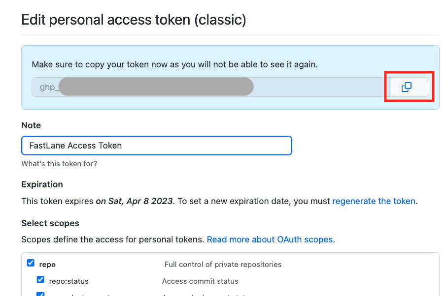

## Update Loop using GitHub Actions

This is only available with Loop 3 and Loop development branch.

!!! info "Time Estimate"
    - If you need or choose to update your GitHub Personal Access token
        * 5 minutes to regenerate token
        * 5 minutes to update one of your Secret Settings
    - Start the Build: 5 minutes
    - Wait for build to complete and appear in TestFlight on your phone
        * 30 to 45 minutes

!!! abstract "Summary"
    **You must build Loop every 90 days when you use the GitHub build method.**

    - For GitHub token update, start at [GitHub Token](#github-token)
    - Otherwise, start at [GitHub Build Update](#github-build-update)

!!! question "FAQs"
    - **Do I need a computer?** No.
    - **Can I do this on my phone?** Yes, but it is easier on a computer or tablet.
    - **Did the directions change?** Yes. We now recommend you select a GitHub Personal Access that never expires. It simplifies the build every 90-day process significantly.
    - **How do I regenerate my GitHub Personal Access token to never expire?** See this section [Regenerate GitHub Token](#regenerate-github-token).
    - **What happens to my existing builds when I change my GitHub Personal Access Token?** Nothing. The GH_PAT only affect future builds. Previous build will be available for the full 90 days.

## GitHub Update Summary

The brief summary is listed below:

1. Log in to GitHub
1. Go to your LoopWorkspace repository
1. Update your fork (if needed)
1. Select Actions: Build Loop
1. After Build completes and is processed by TestFlight (about 30 to 45 minutes)
    * Loop is automatically updated on the phone when automatic updates are enabled in TestFlight (default) for that phone

    or

    * Open TestFlight on that phone to install new version when automatic updates are disabled

## GitHub Token

If your GitHub Personal Access Token has not expired and you don't want to regenerate it, skip ahead to [GitHub Build Update](#github-build-update).

If you want to follow the new recommendation of using a GitHub Personal Access Token that never expires, you can regenerate the new one at any time.

### Regenerate GitHub Token

You can regenerate your GitHub Personal Access Token at any time by clicking on the link below. (Right-click, control-click to open in a new browser tab.)

* [Link to access your GitHub Personal Access Token](https://github.com/settings/tokens)

If you are not logged in to GitHub and have not logged in recently, then you may see the authentication screen. Click on the link below, and authenticate if requested by clicking on the green `Send SMS` button or entering your password.

{width="300"}
{align="center"}

Once you are authenticated, your screen should be similar to the graphic below. The `FastLane Access Token` is a clickable link.

{width="600"}
{align="center"}

After you click on `FastLane Access Token` your screen should be similar to the graphic below.

{width="600"}
{align="center"}

Click on Regenerate token (red highlight in previous graphic) to see screen similar to next graphic. 

* Most Loopers will have classic personal access tokens
    * If you are a developer who needs to use the fine-grained (by repository) option, that's fine

Be sure to change the Expiration from `30 days` to `No Expiration`. When you select `No Expiration` a GitHub warning appears. Click on the green `Regenerate Token` button (red highlight in following graphic).

{width="600"}
{align="center"}

The next screen shows your new token. Copy the token using the copy icon and save it along with your other secret settings.

{width="600"}
{align="center"}

The next step is to update GH_PAT in your LoopWorkspace Repository Secrets. (If you build other apps with this method - update the GH_PAT for all of them right now - do not forget.)

### Update Secrets

This example is for updating GH_PAT in the Secrets for your repository, but the same method can be applied when changing any Secret.

This can be done with the GitHub Personal Access Token still in your paste buffer - but to be safe, save the token with your other secret settings. If you lose track, just [Regenerate GitHub Token](#regenerate-github-token) again.

The graphics and instructions in this section are using a phone. This was done just to prove we weren't kidding when we said you can do it all on your phone. Most people use a computer browser.

Scroll all the way up to the top of the window to see the hamburger menu, click on it and choose your name and icon (near bottom of the list). Scroll down to the LoopWorkspace repository and tap on the link.

Do a horizontal scroll (required on your phone, probably not on a browser) on the row that starts with Code and ends in Settings and tap on Settings. If you don't see Settings (if last item on row is Insights), then you are **not** on your fork or you need to sign in to your GitHub account. You should see `username/LoopWorkspace` with forked from `LoopKit/LoopWorkspace` underneath.

Review the GIF below that shows horizontal scroll to find and tap on Settings, then scroll down on the phone to reach "Secrets and variables", open the drop down indicator to see Actions.

{width="300"}
{align="center"}

After tapping on Settings -> Secrets and Variables -> Actions, keep scrolling on the same screen, past the Action secrets / New repository secret row, until you see your Repository secrets list as shown in the next GIF.

{width="300"}
{align="center"}

When you see the secret, GH_PAT, tap on the pencil and then scroll down until you see the Actions secrets / Update secret dialog as shown in the next graphic. Paste your new token into the Value section and tap Update Secret.

{width="300"}
{align="center"}

Scroll all the way to the top of the screen and tap on your LoopWorkspace link. Then follow the [GitHub Build Update](#github-build-update) instructions to start a new build.

## GitHub Build Update

1. Sign in to GitHub and select your LoopWorkspace repository from your repositories list
1. Look to see if your fork is up to date
    * When you go to your fork to do the update, simply sync the branch if it says there are updates and you get the latest release (details below graphic)
        * The dropdown in this graphic shows the dev branch
        * Yours should show the main branch

    {width="700"}
    {align="center"}

    * If your fork is up to date with LoopKit version for that `{branch}`, you will see the message `This branch is up to date with LoopKit/LoopWorkspace:{branch}` - there is no need to build again unless you are near your 90 day expiration data - in which case, proceed to Step 3
    * If your fork shows a message such as `This branch is 3 commits behind LoopKit:main` and you want to update and build, then click `Sync Fork` by tapping where the red rectangle is shown in the graphic below, then in the pop-up window, tap on `Update branch`

    !!! question "Building a different branch"
        Do I need to do anything special to build a different branch?

        Yes: please follow instructions at [GitHub Build for dev](#github-build-for-dev)

1. Build Loop - refer to graphic below as you follow the steps
    * Click on the 'Actions' tab
    * Select the '4. Build Loop' workflow on the left
    * Look on the right and click 'Run workflow'
    * Click on the green `Run workflow` button in the dropdown
    * Wait ~25-45 min for the build to complete and be processed by TestFlight

    {width="700"}
    {align="center"}

1. You'll receive an App Store Connect email confirming that the build has completed processing, and a TestFlight email confirming the (now updated) app is ready to test.
    * If you get an email that the action failed, then return to your repository and look for Build Action error messages
        * Click on the most recent Build job with the red x by it
        * If the details show this message, "[Could not install WWDR certificate](gh-errors.md#could-not-install-wwdr-certificate)", make sure your developer account is in good standing and that there are no agreements that need to be accepted
        * Repeat the build (previous step) and it should be fine the next time
    * If you get an email from Apple that there are things you must fix in your app - that refers to things to fix before putting that app in the App Store and you will not be doing that
        * As long as you get the TestFlight updated app, you can ignore that email
1. The updated Loop app will show up in your TestFlight app
    * But wait until you see "Expires in 90 days"
    * The app is in TestFlight from your prior build
    * It takes time for the update to show up in the TestFlight app
    * You will also see a build number in parentheses, that will increment each time
1. If you chose to leave [TestFlight Automatic Updates](../gh-actions/gh-deploy.md#testflight-automatic-updates) enabled for Loop, the updated build will be installed over your existing app.
1. If you choose to disable automatic updates
    * Open TestFlight on your phone and click `Install` as shown in the GIF below
    * If you have automatic updates enabled in TestFlight, the app should have installed automatically, in which case the message should say `Open`.

    {width="300"}
    {align="center"}

1. If you are building for a child, follow the [Install TestFlight Loop for Child](gh-deploy.md#install-testflight-loop-for-child) instructions again

## GitHub Build Details

In the Loop app, once installed on your phone, tap on Settings -> Support -> Issue Report. The graphic below shows an example of the Build Details included in the report.

* Note that the profileExpiration listed here is irrelevant - the app expires when the TestFlight expiration indicates - a later version of Loop 3 will probably capture that date and provide a notification in the app; but for now, you must remember
* Notice that the sourceRoot starts with `/Users/runner/work/LoopWorkspace`
    * When you see that sourceRoot, you know this app was installed from GitHub build and TestFlight
    * In this case the buildDataString is associated with when the app was built, not when it was installed on your phone
    * You can use 90 days from this date, as well as the Expires in ## Days on the TestFlight app, to know when you need to rebuild
    * If you set your GH_PAT token to expire in 90 days, you'll get an email about a week ahead - that acts as good reminder

{width="300"}
{align="center"}

## GitHub Build for dev

You can build any desired branch (available at LoopKit/LoopWorkspace) using the GitHub Browser build method. This section is suitable if you have already built either dev or main branch using the [GitHub First-Time](gh-first-time.md) instructions.

**No matter the method used to build Loop for any branch other than main, you are testing development code. Please read this link now before continuing.**

* **[What's going on in the dev branch](../version/development.md#whats-going-on-in-the-dev-branch)**

The instructions show using the dev branch. If you want a different branch, just substitute that branch name for dev. You must set that branch in your fork as the default branch.

!!! tip "Overview of what you will do"
    1. Connect your LoopWorkspace fork with the dev branch, if it is not already connected
    1. Ensure your LoopWorkspace fork has the dev branch as the default branch
    1. Run all the Actions again
        * It might not be necessary, but some underlying changes may require this
        * Running Action 1: Verify Secrets is not necessary because it is included in the other actions, but it is quick and then you don't have to decide which Actions you need to run

### Return to Your LoopWorkspace Fork

You need to be logged into GitHub.

There are a lot of ways to get to your fork of LoopWorkspace - any method is fine. Only one is provided in these docs.

* Click on your personal icon at upper right to see the drop-down menu and select "Your repositories"

{width="200"}
{align="center"}

* You should see (at least) 2 repositories: Match-Secrets and LoopWorkspace
* Click on LoopWorkspace to open that repository

### Connect Fork to New Branch

#### Check Current Branches

1. Click on the Branches icon to open the branches display as shown in the lower half of the graphic below:
    * If the branch you want is not listed, then continue with Step 2
    * Otherwise, skip ahead to [Set Default Branch](#set-default-branch)
1. Click on the `New branch` button

{width="700"}
{align="center"}

#### Add Branch

Each step in the list below matches with the number in the graphic. In the top half of the graphic, the left side shows the initial display and the right side shows the display after making the indicated selections:

1. Click on the drop down menu labeled 1 in the graphic and choose LoopKit/LoopWorkspace as show in the top right graphic
2. Click on the drop down menu labeled 2 in the graphic and choose dev
3. Click on the Branch name box labeled 3 in the graphic and type dev
    * The branch name in your fork should always match the branch name you are adding; check that you type it correctly
4. Review the dialog items to make sure everything is correct and then tap on Create branch

{width="700"}
{align="center"}

### Set Default Branch

You need to make your new branch the default branch.

If your desired branch is not the default branch, these are the steps to modify the default branch. For this example, we show how to change from a default branch of `main` to a default branch of `dev`. Note - only the owner of the repository can take this action and they must be logged in. Otherwise the Settings tab does not appear.

For the numbered steps below, refer to the graphic found under each group of steps.

1. Click on the Settings Icon near the top right of your LoopWorkspace
    * You may need to scroll down to see the Default Branch as shown in the graphic - do not tap on the Branches tab to the left under Code and Automation

    {width="700"}
    {align="center"}

1. To the right of the default branch name there is a pencil and a left-right arrow icon
    * Tap on the left-right arrow icon to bring up the `Switch default branch to another branch` dialog
1. Click on the dropdown next to the current default branch, in this example, `main`
1. Select the desired default branch, in this example, `dev`
1. Click on the `Update` button

    {width="700"}
    {align="center"}

1. You will be presented with an are-you-sure question.
    * Click on the red `I understand, update the default branch.` button

    {width="400"}
    {align="center"}

Your default branch has been changed.
