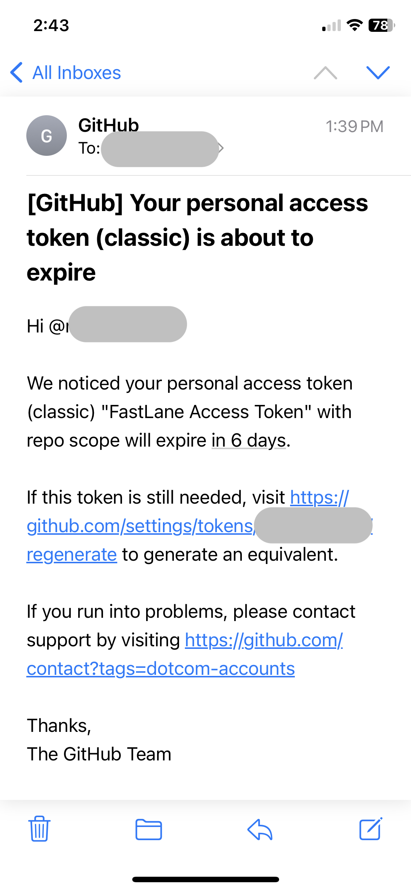
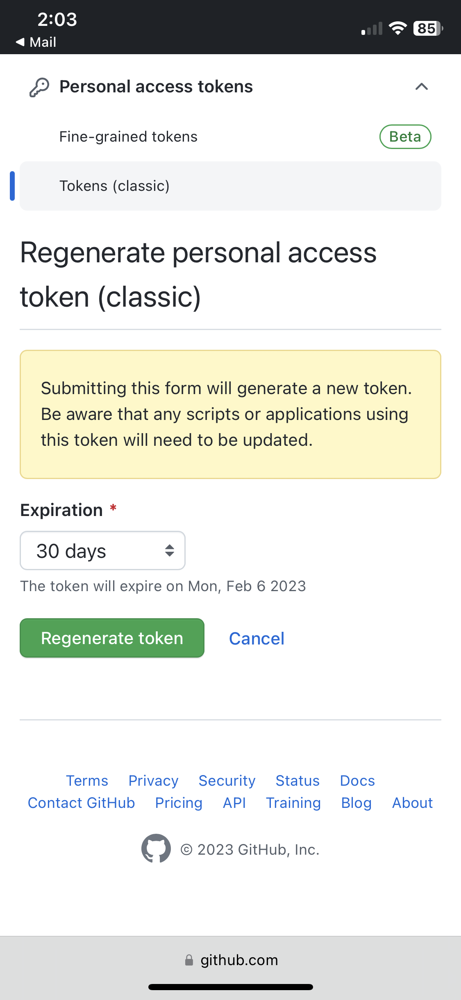
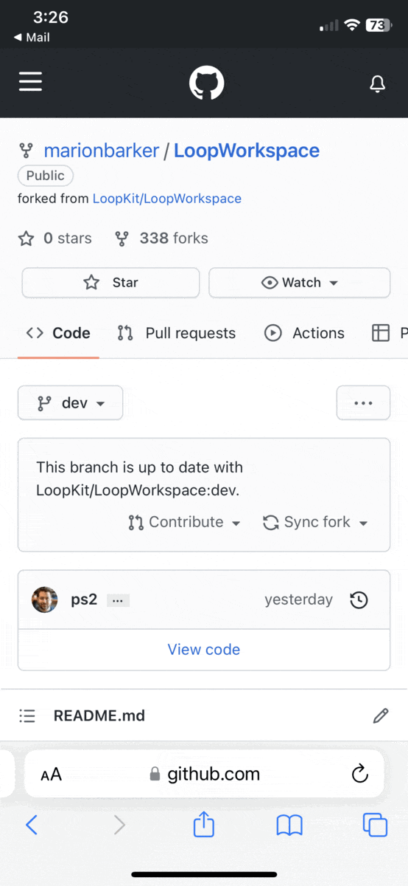
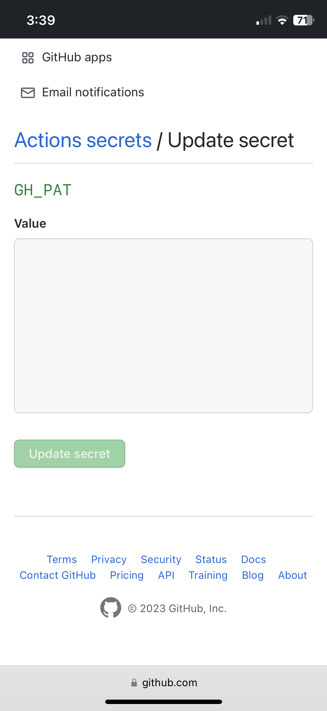
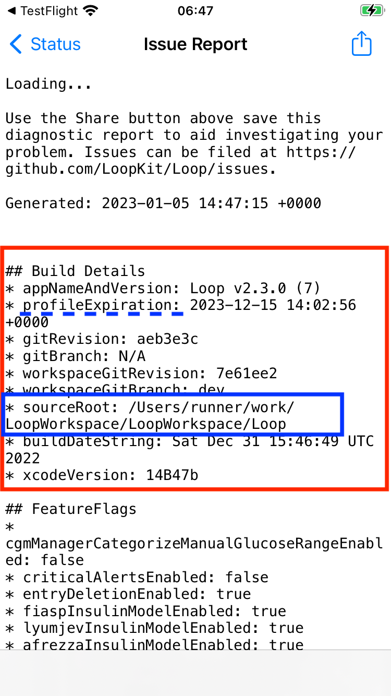

## Update Loop using GitHub Actions

This is only available with Loop 3 and Loop dev branch.

Once you have built Loop one time with github Build Actions, updates are fast and easy.

**You must build Loop every 90 days when you use this method.**

## GitHub Build Update

1. Sign in to GitHub and select your LoopWorkspace repository from your repositories list
1. Look to see if your fork is up to date
    * The dropdown in this graphic shows the dev branch.
    * After the release of Loop-dev as Loop 3.0, you will want master. For a specific release, such as 3.1.2 (which does not exist - so don't look for it), it will be that specific release.
    * If your fork is up to date with LoopKit version for that `{branch}`, you will see the message `This branch is up to date with LoopKit/LoopWorkspace:{branch}}` - there is no need to build again unless you are near your 90 day expiration data - in which case, proceed to Step 3
    * If your fork shows a message such as `This branch is 3 commits behind LoopKit:dev` and you want to update and build, then click `Sync Fork` by tapping where the red rectangle is shown in the graphic below, then in the pop-up window, tap on `Update branch`

    {width="700"}
    {align="center"}

1. Build Loop - refer to graphic below as you follow the steps
    * Click on the 'Actions' tab
    * Select the 'Build Loop' workflow on the left
    * Look on the right and click 'Run workflow'
    * Make sure the desired Branch is selected
    * Click on the green `Run workflow` button in the dropdown
    * Wait ~25-45 min for the build to complete

    {width="700"}
    {align="center"}

1. You'll receive an App Store Connect email confirming that the build has completed processing, and a TestFlight email confirming the (now updated) app is ready to test.
    * If you get an email that the action failed, then return to your repository and look for Build Action error messages
        * Click on the most recent Build job with the red x by it
        * If the details show this message, "[Could not install WWDR certificate](gh-errors.md#could-not-install-wwdr-certificate)", make sure your developer account is in good standing and that there are no agreements that need to be accepted
        * Repeat the build (previous step) and it should be fine the next time
1. The updated Loop app will show up in your TestFlight app
    * But wait until you see "Expires in 90 days"
    * The app is in TestFlight from your prior build
    * It takes time for the update to show up in the TestFlight app
    * You will also see a build number in parentheses, that will increment each time
1. If you chose to leave [TestFlight Automatic Updates](../gh-actions/gh-deploy.md#testflight-automatic-updates) enabled for Loop, the updated build will be installed over your existing app.
1. If you choose to disable automatic updates
    * Open TestFlight on your phone and click `Install` as shown in the GIF below
    * If you have automatic updates enabled in TestFlight, the app should have installed automatically, in which case the message should say `Open`.

    {width="300"}
    {align="center"}

## GH_PAT Expired

### Regenerate the GitHub Token

You will get an email from GitHub when your GH_PAT (that you use to Build Loop) is getting close to expiration.

I renewed my GH_PAT token, updated my LoopWorkspace Secret Settings and started the build action for Loop, all on my phone in just a few minutes.

All the graphics in this section are from my phone.

Email warning:

{width="300"}
{align="center"}

Click on the "regenerate" link to be taken to your GitHub account (you might need to follow 2-factor authentication to get access). If your Expiration is set at 30 days, as shown, you may prefer to select 90 days instead. That's how often you need to rebuild Loop using GitHub actions. The email acts as a handy reminder. Click on the green Regenerate token button.

As soon as you regenerate, you cannot build again until you [Update Secrets with New GitHub Token](#update-secrets-with-new-github-token). Your current app in TestFlight is **not** affected, but might may be close to expiring. So finish the job while you are thinking about it.

{width="300"}
{align="center"}

The next screen appears with your token (mine is not shown for security reasons - it's above the portion displayed). Save your token by clicking on the copy button. You should probably update your [Secret Settings](../gh-actions/gh-first-time.md#secret-settings) right away.

{width="300"}
{align="center"}

### Update Secrets with New GitHub Token

The graphics and instructions in this section are using a phone. If you are working in a browser, use the [Configure Secrets Settings](../gh-actions/gh-first-time.md#configure-secrets-settings) to see what the screens look like in a browser.

This can be done with the GH_PAT still in your paste buffer - but to be safe, save the token somewhere on your phone.

Scroll all the way up to the top of the window to see the hamburger menu, click on it and choose your name and icon (near bottom of the list). Scroll down to the LoopWorkspace repository and tap on the link.

Do a horizontal scroll (required on your phone, probably not on a browser) on the row that starts with Code and ends in Settings and tap on Settings. If you don't see Settings (if last item on row is Insights), then you are **not** on your fork or you need to sign in to your GitHub account. You should see `username/LoopWorkspace` with forked from `LoopKit/LoopWorkspace` underneath.

Review the GIF below that shows horizontal scroll to find and tap on Settings, then scroll down on the phone to reach Secrets, open the drop down indicator to see Actions.

{width="300"}
{align="center"}

After tapping on Settings -> Secrets -> Actions, keep scrolling on the same screen, past the Action secrets / New repository secret row, until you see your Repository secrets list as shown in the next GIF.

{width="300"}
{align="center"}

When you see the secret, GH_PAT, tap on the pencil and then scroll down until you see the Actions secrets / Update secret dialog as shown in the next graphic. Paste your new token into the Value section and tap Update Secret.

{width="300"}
{align="center"}

Scroll all the way to the top of the screen and tap on your LoopWorkspace link. Then follow the [GitHub Build Update](#github-build-update) instruction above to start a new build.

## GitHub Build Details

In Loop, tap on Settings -> Support -> Issue Report. The graphic below shows an example of the Build Details included in the report.

* Note that the profileExpiration listed here is irrelevant - the app expires when the TestFlight expiration indicates - a later version of Loop 3 will probably capture that date and provide a notification in the app; but for now, you must remember
* Notice that the sourceRoot starts with `/Users/runner/work/LoopWorkspace`
    * When you see that sourceRoot, you know this app was installed from GitHub build and TestFlight
    * In this case the buildDataString is associated with when the app was built, not when it was installed on your phone
    * You can use 90 days from this date, as well as the Expires in ## Days on the TestFlight app, to know when you need to rebuild
    * If you set your GH_PAT token to expire in 90 days, you'll get an email about a week ahead - that acts as good reminder

{width="300"}
{align="center"}

