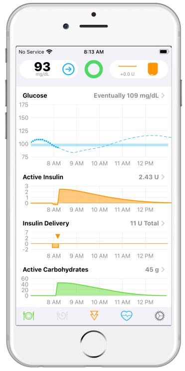

---
hide:
    - navigation
---

Welcome to the *LoopDocs* website where you can learn about the *Loop* app.

## What is the *Loop* App?

The *Loop* app is an automated insulin delivery application that you build and operate on an iPhone.

{width="300"}
{width="200"}

* The *Loop* app uses your settings, meal entries and glucose data to calculate insulin dosing needed to bring your blood glucose within the correction range you set
    * You enter your personal therapy settings (e.g., basal rate schedule, carbohydrate ratio, insulin sensitivity)
    * You indicate your CGM and pump
* You choose how to operate the *Loop* app:
    * <code>Closed Loop</code>: Predict, recommend and control insulin dosing
    * <code>Open Loop</code>: Explore interface, test settings, learn to enter meals and dose

### What is&nbsp;_Loop_&nbsp;Video

!!! success "&nbsp;_Loop_&nbsp;Video"
    * This [What is&nbsp;_Loop_](https://youtu.be/64qhgnmkyAE) video with associated [pdf deck](http://www.loopandlearn.org/wp-content/uploads/2021/05/What-is-Loop.pdf) was created by the&nbsp;Loop and Learn&nbsp;team
    * It is a great introduction, created when Reese was using an earlier version of Loop
    * Special thanks to 
        * Tina and Reese Hammer for the terrific video
        * Matthew Fouse for his beautiful graphics

## What are my next steps?

This site shows you step-by-step how to [**build**](intro/requirements.md){: target="_blank" }, [**set up**](loop-3/loop-3-overview.md){: target="_blank" } and [**operate**](operation/loop/open-loop.md){: target="_blank" } the *Loop* app.

* **You do not need a technical or computer background to do this**
* **You can choose to build the *Loop* app several ways:**
    * Use a [browser](browser/bb-overview.md){: target="_blank" } on any computer or tablet and install it on your *iPhone* via *TestFlight*
    * Use an **up-to-date** [*Mac* Computer](build/overview.md){: target="_blank" } and install it directly on your *iPhone*

In order to become proficient with the app, you should learn the information on this site. Consider doing this over a period of time and reviewing the materials more than once.

* You should test and perhaps adjust your settings to be successful with the *Loop* app (or any hybrid closed-loop system)
* As you read the documentation, you will find links to a robust volunteer support community
    * You're invited - come introduce yourself
    * Don't be afraid to ask questions, just let us know where in the documentation you got confused so we can make improvements

There is a common saying in our community:

> Do It Yourself (DIY) does not mean Do It Alone!

Once you are using the app, you should regularly follow one or more support forums for important updates on the *Loop* app. Spending this time is important for success in building and operating the *Loop* app safely.

This website is updated regularly to keep pace with development of the *Loop* app and *Apple* releases.

## Important Disclaimer

Please consult with your health care professional regarding your diabetes management.

* The *Loop* app is an open source project used by many, but it is not approved for therapy by any government organization.
* **You take full responsibility for building and running this system and do so at your own risk.**

## Volunteer Community

The *Loop* app has been, and continues to be, developed and supported by volunteers. From the code to this website, you are able to use this app because many volunteers continue to give their personal and family time.

Please add *your* time by reading this website before embarking on your *Loop* journey.
