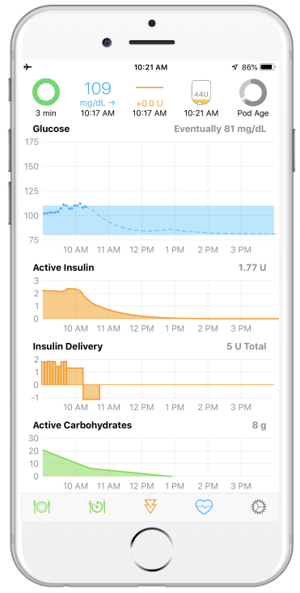

---
hide:
    - navigation
---

# Welcome to Loop

Welcome to the "LoopDocs" website.  This is a great place to start to learn all things Loop.

This site takes you step-by-step through the process to build, set up and operate the Loop app.  You do not need a technical or computer background to do this.

Loop requires a substantial time commitment.  You need to learn the information on this site and follow the steps carefully. Consider doing this over a period of time and reviewing the materials more than once.

You will need to test and perhaps adjust your settings to be successful with Loop, or any hybrid closed-loop system. In addition to the documentation found on this site, you will find links as you read to a robust support community.

Once you are enjoying all the benefits of Loop, you should regularly follow one or more support forums for important updates on Loop. Spending this time is important for success in building and operating Loop safely.

This website is updated regularly to keep pace with Loop developments and Apple releases.

## What is Loop

Loop is an app you build and load on an iPhone (or iPod).

After building the Loop app:

* You enter your personal therapy settings (e.g., carbohydrate ratio, basal rates, insulin sensitivity)
* You enter the carbs you eat
* Loop uses this information, your insulin on board (IOB) and glucose data, to determine how much insulin you need to bring your blood glucose within the target range you set
* You can choose to have Loop automatically control insulin dosing (closed-loop mode) or have Loop recommend insulin that you manually accept or modify (open-loop mode)

{width="300"}
{width="200"}

### What is Loop Video

If you have never used Loop, click on links below for an introduction.

!!! success "Loop Video"
    * This [What is Loop](https://youtu.be/64qhgnmkyAE) video with associated [pdf deck](http://www.loopandlearn.org/wp-content/uploads/2021/05/What-is-Loop.pdf) was created by the Loop and Learn Team
    * Special thanks to Tina and Reese Hammer for the terrific video
    * Special thanks to Matthew Fouse for the generous use of his beautiful graphics

## Important Disclaimer

Please consult with your health care professional regarding your diabetes management.

* The Loop app is an open source project used by many, but it is not approved for therapy by any government organization.
* **You take full responsibility for building and running this system and do so at your own risk.**

## Volunteer Community

Loop has been, and continues to be, developed and supported by volunteers. From the code to this website, you are able to loop because many volunteers have given their personal and family time.

Please add your time by reading this website thoroughly before embarking on your Loop journey.

