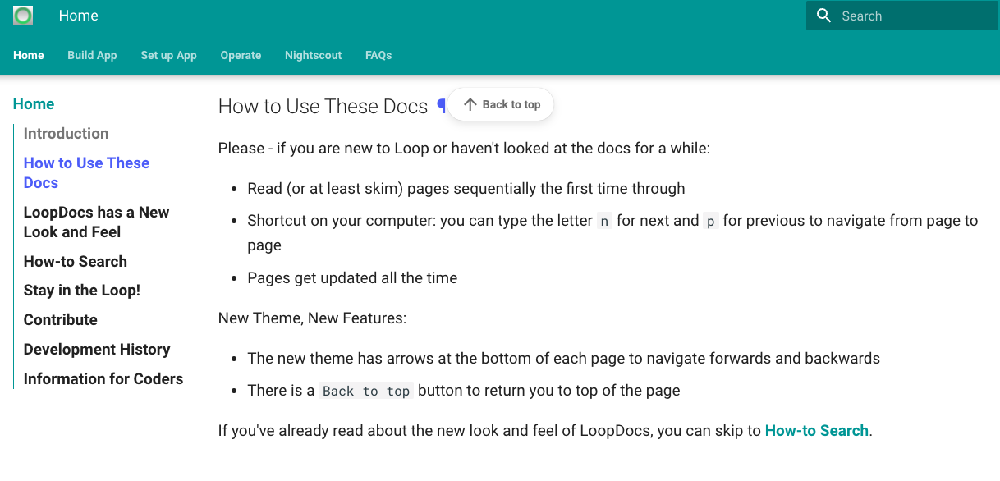
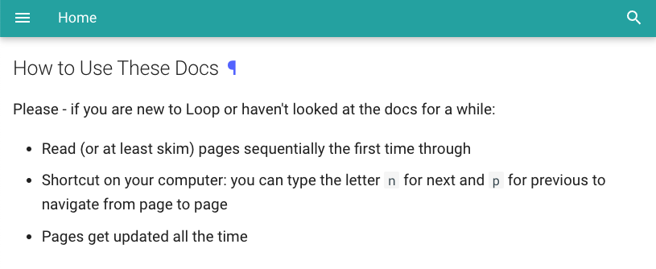
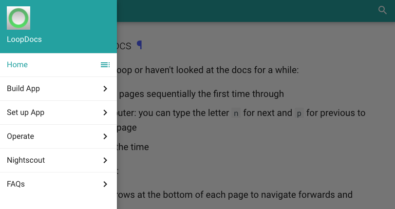

---
hide:
    - navigation
---

# Welcome to Loop

[New Look and Feel](#loopdocs-has-a-new-look-and-feel)

## Introduction

What is Loop?

* Loop is an app you build yourself and load on your iPhone (or iPod)
* Loop assists in the many insulin dosing decisions people with diabetes face every day
* Loop uses a compatible continuous glucose monitor (CGM) and is paired using the RileyLink protocol with your compatible pump
    * Loop works with older Medtronic pumps and the Eros (not Dash) Omnipods
    * Loop requires a [RileyLink compatible device](build/step5.md#rileylink-compatible-devices) to communicate between the phone and pump

What CGMs work with Loop?

The Loop app works with Dexcom’s G4, G5 and G6 CGM. For Medtronic users, Loop also works with first generation Guardian and Guardian 2 Medtronic sensors compatible with the 522, 722, 523 and 723 pumps. There are other versions of Loop available that may work for you if you are not using one of these specific CGMs.  These other versions (known as forks) are created by Loop users and are maintained by them. This document does not cover those other CGM options, but check out the [Community Information](index.md#stay-in-the-loop) below.

{width="300"}
{width="300"}

!!! warning "Important"
    Please understand that this project:

    - Is highly experimental
    - Is not approved for therapy

    **You take full responsibility for building and running this system and do so at your own risk.**

The Loop algorithm on your phone predicts future glucose based on carbohydrate intake, insulin on board, and current CGM readings. You enter your own settings for desired correction range, basal schedule, insulin sensitivity factor (ISF), carbohydrate ratio (CR) and the type of insulin you are using.  The glucose predictions, using your settings and meal entries, provide Loop with the information needed to recommend a bolus or temporary basal rate to attain a targeted glucose range in the future.

The system can either operate “open-loop” where insulin delivery recommendations must be enacted by the user or “closed-loop” where modifications to insulin delivery are enacted automatically.

You may be saying, "I can't build an app." But the wonderful volunteers in this community prepared this amazing website with step-by-step instructions containing pictures and arrows (say thank you to Katie DiSimone). The website is updated by more volunteers as improvements are made to the Loop app and when Apple makes changes to its iOS, Xcode and macOS environment. This language may sound scary, but it will become easier. As a new Looper don't be afraid to [reach out to mentors](#stay-in-the-loop), learn the terminology and before long you will be Looping. As you continue with Looping, you soon can pass on your knowledge to others.

Once you've built the app, plan to learn to use it in stages. First, run “open loop” to familiarize yourself with Loop’s operation. This allows you to understand why Loop is making certain recommendations and determine if you need to adjust your Loop settings.

One thing many new users ask is why do my settings need to be different for Loop?  The main reason is that Loop uses a realistic insulin model including the long tail of residual insulin activity - and updates its calculations every 5 minutes. This is a different way of thinking about insulin delivery. Other strategies, e.g., assuming a linear fall-off model for insulin activity, correcting 2 or 3 hours after a meal, trading a higher basal rate to avoid worrying about snacks, etc. will not work.  There is a whole section on settings - just giving you a heads up.

When you progress to “closed-loop”, do so safely by starting with conservative Correction Ranges and Delivery Limits and only progress to more aggressive settings after several days of no lows. Please ask questions at this point about why Loop is making the recommendations it does.  It should be similar to the therapy decisions you would make yourself.  If the recommendations it makes are different than you would make, try to figure out why. Hint - it is probably your settings.

## How to Use These Docs

Please - if you are new to Loop or haven't looked at the docs for a while:

* Read (or at least skim) pages sequentially the first time through
* Navigation shortcuts (might be available with on your browser/keyboard)
    * Hit the letter `n` for next page
    * Hit the letter `p` for previous page
    * Hit the `End` button for end of page
    * Hit the `Home` button to top of page
* Pages get updated all the time

New Theme, New Features:

* The new theme has arrows at the bottom of each page to navigate forwards and backwards
* There is a `Back to top` button to return you to top of the page

If you've already read about the new look and feel of LoopDocs, you can skip to [How-to Search](#how-to-search).

## LoopDocs has a New Look and Feel

LoopDocs transitioned to a new theme (November 2021) with a different loop and feel. This theme (thank you [Material for MkDocs](https://squidfunk.github.io/mkdocs-material/)) allows  improved customization and much better searching. The top bar looks like this on your browser:

{width="450"}
{align="center"}

Some details of the display are dependent on whether you are on a mobile device or a computer (with browser width > 1220 pixels).  After the first set of graphics, which show the difference between these two views for this location in LoopDocs, all other graphics show the wide-browser view.

!!! note "Graphics a bit out of date"

    The list of `Headers on this Page` have been moved to the right side for Wide Browsers. The graphics will be updated later and then this comment will be removed.

### Wide-Browser View

* If you are on a browser with a screen width of 1220 pixels or more:
    - There are tabs at the top to quickly skip between Sections
    - Pages available for that section are shown to the left of the documentation
        - If there is a `>` symbol, click on it to reveal additional pages
    - Headers on the current page are shown to the right of the documentation

    For example, after clicking on the `How to Use These Docs` heading, it is highlighted and the word to the right of the Loop Logo changes to indicate the name of the page currently being displayed.

    {width="600"}

### Narrow-Browser View

* If you are on a mobile device or your browser width is narrow:
    - This is the view of the same location in LoopDocs as shown above
    - Note the `Hamburger Menu` (3-parallel-line stack) with the word `Home` (current Page) beside it
      {width="450"}  
    - When you tap on the hamburger menu, this view is shown:
      {width="450"}  
        - The `Home` is highlighted because that's the Page you're currently displaying
        - From here you have these choices
            1. Click on the highlighted Page to view the current page Table of Contents
            1. Click on a Section (for some Pages you may need to use the back button to get to the list of Sections or Pages of interest)

## How-to Search

* Search for topics by clicking the Search icon or typing the letter `s` on your keyboard
    * You don't need to click anything else - just start typing
    * If you clicked away from the search box, then click in the area above the words `Type to start searching`
      {width="250"}     
    * As you begin to type, suggested completions appear which you can choose by hitting the right-arrow key or keep typing
    * At the same time a series of suggested Pages are displayed
      {width="600"}  
    * Scroll down and decide which Page is most likely
        * If more than one instance of the search term was found on that page, click on the `# more on this page` to reveal the Headers to choose from
        * If you click (or right-click) on the Page - it opens the page; if you select a Header - it opens to that header.
        * The contents of the search box will be used the highlight every instance found on the selected page
    * To keep the list present, right-click and select `Open in New Tab`
    * Examine any tabs you might open and then return to the list as needed
    * If you hit return, the Search display vanishes
    * If you click anywhere on your current page, whatever you typed in the search box stays available for reuse
* There is another website, [Looptips](https://kdisimone.github.io/looptips/), you should review
    * While these articles were written and illustrated with an earlier version of Loop, they are well worth reading
    * This link is repeated on the Operate->Looping Tips->Loop Tips page

## Stay in the Loop!

There are a number of social media options. (Read the directions on each of these - some ask you to answer questions - please do so):

  * The fastest way to get help (with the most mentors) is [The Looped Facebook Group](https://www.facebook.com/groups/TheLoopedGroup).
  * There is another group, Loop and Learn, that has a lot of Loop-centric information, a T1D Speaker Series covering many topics of general diabetes interest as well as Loop-specific chats, alerts whenever there is an update to iOS and Xcode, Quick Tips and articles written by mentors providing their Loop experience.
      * [LoopandLearn Facebook Group](https://www.facebook.com/groups/LOOPandLEARN)
      * [LoopandLearn Website](https://www.loopandlearn.org)
  * Both the Looped and LoopandLearn Facebook groups provide support for some Loop forks, which support other CGM, as well as other DIY closed loop options.
  * Many Loopers use the Nightscout tool to assist them in monitoring their settings in Loop. The fastest Nightscout help can be found in the original #wearenotwaiting community [CGM in the Cloud](https://www.facebook.com/groups/CGMinthecloud).
  * For those not interested in Facebook or interested in what is coming next for Loop, join [Loop Zulipchat](https://loop.zulipchat.com) and be sure to subscribe to all the streams or you'll miss some interesting conversations.  

### Search Then Post

!!! danger "Don't Panic"
    It's really easy to panic if Loop fails to build or if you are having trouble using your Loop app, but take the time to do a quick [Search](#how-to-search) in these docs and in your favorite social media group before posting a question. You might get an answer immediately.

    Please post your question in only one group on Facebook or under one stream on zulipchat - many mentors monitor more than one place. If you don't hear an answer in 24 hours, then try a different place

    On Facebook the protocol is:

    * Search to see if your question has already been answered
    * Add a comment if you find an existing post to say "I had this problem too and this post helped" - this bumps that post near the top so other can see it
    * Make a new post if you still have a question
    * Leave your question posted after you've gotten an answer, but edit the original post to say it's been resolved (add the word RESOLVED to the beginning of the original post)
        * Mentors save time - they know you've been helped and don't need to read all the comments on that post
        * Others may have the same question and will read your post

## Contribute

Please submit suggestions for updates and improvements to this documentation. If you notice a typo, poor word choice or some explanation that could be improved or clarified, there are a couple of options (more instructions follow):

* You can issue a Pull Request (best if it is a simple typo or wording update)
* You can open an Issue (best if a major rewrite is needed or you think a conversation would help)
* You can post on Facebook or Zulipchat

If you decide to do a Pull Request (PR) or create an Issue, first look to see if someone has already opened a [PR](https://github.com/LoopKit/loopdocs/pulls) or [Issue](https://github.com/LoopKit/loopdocs/issues) on the topic so you don't create a duplicate. Note - you do not have to log in to github to review the PR and Issues, but you cannot comment or add a new PR or Issue without logging in.

* If a PR or Issue on the topic is open, feel free to add your comments (don't be shy)
* If a PR doesn't exist, watch this [LoopDocs Pull Request video](https://youtu.be/6qSppvgGxpg) on how to create one (it's easy, video is less than 5 minutes)
* If your Issue is new, please add it by clicking on the `New Issue` button
    * Give the Issue a descriptive title
    * Indicate what page or pages need updating with a brief description
    * This opens the conversation (those who signed up to `watch` the loopdocs repository get a notice)
    * This collaboration is quite useful in finalizing changes

If you do not have a github userID, but are a member of the Loop Facebook group or Loop Zulipchat, you can post a message there.  

* On [Facebook](https://www.facebook.com/groups/TheLoopedGroup) - make sure your post is clear that you have a comment about LoopDocs
* On Loop Zulipchat, please use the [documentation stream, Loopdocs Issue](https://loop.zulipchat.com/#narrow/stream/270362-documentation/topic/Loopdocs.20Issue) topic

There are many pages of content and we need all the reviewers we can get to help find typos and pages that need to be updated.

For those interested in delving deeper, see the next few sections.

## Development History

Loop is an open-source, shared project.

  * Read about the early history of Loop development: [History of Loop and LoopKit](https://medium.com/@loudnate/the-history-of-loop-and-loopkit-59b3caf13805), written by Loop developer Nate Racklyeft

  * Read about the early days and the many advances brought about by the greater Diabetes Community of people who are not waiting: [The Artificial Pancreas Book](https://www.artificialpancreasbook.com/) written by Dana Lewis and check out her website [DIYPS](https://diyps.org)

  * Read about how hard it was to get a new insulin pump (Omnipod) to work with Loop: [Insulin Pumps, Decapped Chips and Software Defined Radios](https://medium.com/@ps2) written by Loop developer Pete Schwamb and [Deep Dip Teardown of Tubeless Insulin Pump](https://arxiv.org/ftp/arxiv/papers/1709/1709.06026.pdf) by Sergei Skorobogatov

The project continues to be a labor-of-love by a community of users; maintained and improved by volunteers.

## Information for Coders

[Loop](https://github.com/LoopKit/Loop) is an app template for building an automated insulin delivery system. It is a stone resting on the boulders of work done by many others.

The app is built on top of [LoopKit](https://github.com/LoopKit/LoopKit). LoopKit is a set of frameworks that provide data storage, retrieval, and calculation, as well as boilerplate view controllers used in Loop. Using the open-source Loop app template, you can build an insulin delivery system that uses specific commercial and open-source hardware and software technologies to bring together the insulin pump, continuous glucose monitor (CGM), and insulin dosing algorithm to create a DIY automated insulin delivery system. This version is known as Loop.  

For more information on how to contribute to an open-source project, please review:

  * [How to Contribute to Open Source](https://opensource.guide/how-to-contribute/)
  * Review the Loop [LICENSE](https://github.com/LoopKit/Loop/blob/master/LICENSE.md)
  * Review the Loop [CODE_OF_CONDUCT](https://github.com/LoopKit/Loop/blob/master/CODE_OF_CONDUCT.md)

Then if you want to contribute, please join [Loop Zulipchat](https://loop.zulipchat.com) and be sure to subscribe to all the channels. Meet the developers and testers who make this app the life-changing tool that so many people use. Learn about what is coming next.
