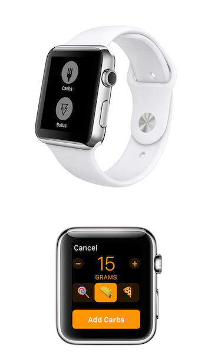

# Welcome to Loop

## Introduction

[Loop](https://github.com/LoopKit/Loop) is an app template for building an automated insulin delivery system. It is a stone resting on the boulders of work done by many others.  

The app is built on top of [LoopKit](https://github.com/LoopKit/LoopKit). LoopKit is a set of frameworks that provide data storage, retrieval, and calculation, as well as boilerplate view controllers used in Loop.

Please understand that this project:

- Is highly experimental
- Is not approved for therapy

Using the open source Loop app template, you can build an insulin delivery system that uses specific commercial and open source hardware and software technologies to bring together the insulin pump, continuous glucose monitor (CGM), and insulin dosing algorithm to create a continuous insulin basal dosing “Loop”.  This Loop predicts future glucose based on basal-rate schedules, carbohydrate intake, insulin on board, and current CGM readings.  These glucose forecasts provide Loop with the information needed to recommend a temporary basal rate to attain a targeted glucose range in the future.  The system can either operate as an “open loop” by making recommendations to the user for their approval before enacting or as a “closed loop” by automatically setting the recommended temporary basal rate.  *You take full responsibility for building and running this system and do so at your own risk.*

You should undertake this project in stages. For example, first “open loop” to familiarize yourself with Loop’s operation. Also, investigate the code to ensure you understand what it is recommending and why. Then when you progress to “closed loop”, do so safely by starting with appropriate safety limits and only progress to higher limits after several days of no lows. Please ask questions at this point about why Loop is making the recommendations it does.  It should be similar to the therapy decisions you would make yourself.  If the recommendations it makes are different than you would make, try to figure out why.

## Development History

Loop has been developed as an open-source, shared project.  For a really interesting read about the history of Loop development, check out this [History of Loop and LoopKit](https://medium.com/@loudnate/the-history-of-loop-and-loopkit-59b3caf13805) post, written by Loop developer Nate Racklyeft.  The project continues to be a labor-of-love by a community of users; maintained and improved by volunteers.

## Stay in the Loop!

[Sign up for the Loop Users announcement list](https://groups.google.com/forum/#!forum/loop-ios-users) to stay informed of critical issues that may arise.

Join the gitter chat at [https://gitter.im/LoopKit/Loop](https://gitter.im/LoopKit/Loop)

There is also a [Looped Facebook Group](https://www.facebook.com/groups/TheLoopedGroup/?fref=nf) that you might wish to join for support.  When you request to join the group, please remember to check your messages box on facebook and respond to the message.

## Contribute

Please consider submitting any updates and improvements to the docmentation that you want to share by submitting PRs to the [loopdocs repo](https://github.com/LoopKit/loopdocs).  Also, read the [LICENSE](https://github.com/LoopKit/Loop/blob/master/LICENSE.md) and [CODE_OF_CONDUCT](https://github.com/LoopKit/Loop/blob/master/CODE_OF_CONDUCT.md).
