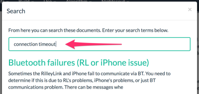

# Willkommen bei Loop

## Einleitung

[Loop](https://github.com/LoopKit/Loop) ist eine App-Vorlage, um ein automatisiertes Insulinabgabesystem zu erstellen Es ist ein kleiner Baustein, der nur entstehen konnte, weil er sich auf reichlich Arbeit vieler Beteiligter stützt.  

Die App setzt direkt auf die Arbeit von [LoopKit](https://github.com/LoopKit/LoopKit) auf. LoopKit ist eine Ansammlung von Frameworks, die die Speicherung und Abfrage von Daten und Berechnungen sowie den Gebrauch von standardmäßigen Ansichtscontrollern in Loop ermöglicht.

!!!WARNUNG "Wichtig"

    Bitte nehmen Sie zur Kenntnis, dass dieses Projekt

    - im äußersten Maß experimentell ist
    - nicht als Therapie anerkannt ist

      **Sie tragen die alleinige Verantwortung für die Erstellung und den Betrieb des Systems und 
      tragen daher die Risiken komplett selbst.**

Mit der Open-Source-App-Vorlage Loop können Sie ein Insulinabgabesystem erstellen, das aus ausgewählter kommerzieller und Open-Source-Hardware- und Softwaretechnologien wie einer Insulinpumpe, einer kontinuierlichen Glukosemessung (CGM) und einem Insulindosierungs-Algorithmus besteht. Der Algorithmus ermöglicht einen kontinuierlichen Basalinsulindosierungs-“Loop”.  Dieser Loop errechnet zukünftige Glukosewerte anhand von einem Basalratenprofil, der eingegebenen Kohlenhydratmenge,dem aktiven Insulin und dem aktuellen CGM-Wert. Diese Glukosewertvorhersage ist die Grundlage für Loop, um temporäre Basalraten zu bestimmen, um zukünftig die Glukosewerte innerhalb des Korrekturbereichs zu erreichen. Das System kann als “open loop” betrieben werden, indem dem Nutzer Basalraten empfohlen werden, die der Nutzer bestätigen muss, bevor die Basalrate angwendet wird. Oder es wird als “closed loop” betrieben, wobei die empfohlenen Basalraten automatisch angewendet werden. 

Sie sollten den Beginn des Loopens in Phasen aufteilen. Fangen Sie zum Beispiel mit dem “open loop” an, um sich mit der Vorgehensweise von Loop vertraut zu machen. Machen Sie sich ebenfalls mit dem Quellcode vertraut, damit Sie verstehen, was Ihnen und warum es Ihnen vorgeschlagen wird. Wenn Sie dann den “closed loop” betreiben, starten Sie mit angemessenen Sicherheitsgrenzen, die Sie fortschreitend erweitern können, wenn Sie mehrere Tage keine Hypos hatten. Stellen Sie sich zu diesem Zeitpunkt, die Frage, warum Loop Ihnen diesen Vorschlag unterbreitet. Die Antwort sollte der Entscheidung ähneln, die Sie aufgrund Ihrer bisherigen Therapie selber getroffen hätten. Sollten die Vorschläge von Ihren Entscheidungen differieren, versuchen Sie den Grund für den Unterschied herauszufinden.

## Entwicklungsverlauf

Loop wird bisher als ein geteiltes Open-Source-Projekt betrieben. Um weitere, interessante Details über die Entwicklung von Loop zu erfahren, besuchen Sie diesen [History of Loop and LoopKit](https://medium.com/@loudnate/the-history-of-loop-and-loopkit-59b3caf13805) Beitrag (nur auf Englisch verfügbar), der von dem Loop Entwickler Nate Racklyeft verfasst wurde.  Das Projekt ist eine Herzensangelegenheit aller Beteiligter, das mithilfe ehrenamtlicher Mitarbeit unterhalten, entwickelt und verbessert wird.

## Wo finden Sie was in den Docs?

* Nutzen Sie das Navigationsmenü im oberen Bereich, um Informationen, die Sie suchen, direkt zu finden.
* Eine Inhaltsangabe von der aktuellen Webseite wird Ihnen immer links angezeigt.
* Wenn Sie in den Loop Docs etwas suchen möchten, klicken Sie auf das  Symbol.

    

## Bleiben Sie auf dem Laufenden!

[Melden Sie sich bei der Loop Users announcement list an](https://groups.google.com/forum/#!forum/loop-ios-users), um über Kritisches, das auftauchen kann, informiert zu werden. (nur auf Englisch verfügbar)

Schließen Sie sich dem Gitter-Chat an [https://gitter.im/LoopKit/Loop](https://gitter.im/LoopKit/Loop) (nur auf Englisch verfügbar)

Es gibt auch eine [Looped Facebook Group](https://www.facebook.com/groups/TheLoopedGroup/?fref=nf), der Sie beitreten können, um Supportanfragen zu stellen.  Um der Gruppe beizutreten, vergessen Sie bitte nicht, den Posteingang bei Facebook auf eine neue Nachricht von der Gruppe zu überprüfen und auf die Nachricht zu antworten.(nur auf Englisch verfügbar)

## Ihr Beitrag

Bitte ziehen  Sie in Erwägung, Updates und Verbesserungsvorschläge zur Dokumentation, die Sie teilen möchten, mithilfe eines Pull Request an [loopdocs repo](https://github.com/LoopKit/loopdocs) einzureichen. Weitere Informationen über Beiträge zu einem Open-Source-Projekt erhalten Sie hier [How to Contribute to Open Source](https://opensource.guide/how-to-contribute/) (nur auf Englisch verfügbar). Bittte beachten Sie ebenfalls Loop [LICENSE](https://github.com/LoopKit/Loop/blob/master/LICENSE.md) and Loop [CODE_OF_CONDUCT](https://github.com/LoopKit/Loop/blob/master/CODE_OF_CONDUCT.md).(nur auf Englisch verfügbar)
