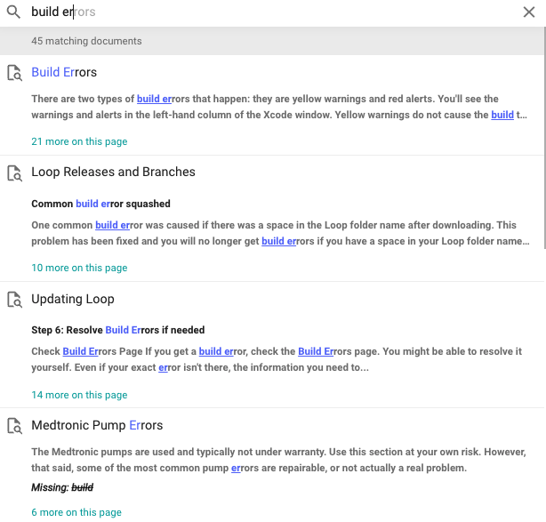

## How to Find Help

Volunteers generously provide support for Loop via online platforms. You have several options for joining conversations on Loop and asking for help.  Links to the main platforms are listed below.  Non-US Loop users in Italy, Australia, and several other countries have also formed Facebook (FB) groups.

* The [Looped Group](https://www.facebook.com/groups/TheLoopedGroup) on Facebook. Looped Group is the original FB group for DIY looping systems. There are a lot of active members there with an excellent history of helping people.
* Loop and Learn is a community that provides Loop-centric information, a T1D Speaker Series covering many topics of general diabetes interest as well as Loop-specific chats, alerts whenever there is an update to iOS and Xcode, Quick Tips and articles written by mentors providing their Loop experience.
    * [LoopandLearn Facebook Group](https://www.facebook.com/groups/LOOPandLEARN)
    * [LoopandLearn Website](https://www.loopandlearn.org)
    * [LoopandLearn YouTube Channel](https://youtube.com/loopandlearn)
* The [LoopTips](https://loopkit.github.io/looptips/) website provides non-build information that is helpful once you are looping, e.g., how to print endo reports, find Loop data, deal with therapy settings changes, etc.
* Many Loopers use a companion app called Nightscout. Nightscout help can be found in the [CGM in the Cloud](https://www.facebook.com/groups/CGMinthecloud) Facebook group.
* For those interested in what is coming next for Loop and those who prefer not to use Facebook, join [Loop Zulipchat](https://loop.zulipchat.com) and be sure to subscribe to all the streams or you'll miss some interesting conversations.
* Loop has an Instagram account @diy.loop where some updates are shared.

### How to Ask for Help

If you are having trouble building or using your Loop app, there are some important steps to get responses to your question, while also being considerate of our volunteers' time.

1. Always search in **both** [LoopDocs](#website-search) and your favorite [support group](#how-to-find-help). 
    * Confused about how to search in a Facebook group? [Here is a video](https://www.youtube.com/watch?v=_vSN6C-Uo04) to help.
2.  If you use Facebook, click on the Featured posts (at the top of the page); many posts asking for help are already answered there.
3.  Don't post a duplicate question in multiple groups (mentors monitor many groups). Only post to a different group if you have had no responses for several hours.
4.  If a LoopDocs search, FB or Zulipchat search, and a check of Looped Group featured posts pinned to the top of the page haven't answered your question, then post for help. Review the [tips for how to post for help](../build/community.md) so that our volunteers get all the information they'll need to help you, without needing to ask 40 questions first.    
5.  Leave your question posted even after you've gotten an answer, but edit the original post to add the word **RESOLVED** at the beginning of the original post. 
    * This helps other Loopers who have the same question
    * This helps mentors know they don't need to respond to help you

## How to use LoopDocs

### Website Short Cuts

One of our awesome Loop volunteers captured the domain names  `loopdocs.org` and `looptips.org`.  So you can find these valuable websites by simply typing loopdocs or looptips followed by .org in your browser. In other words, you don't need to remember or type `https://loopkit.github.io/loopdocs/`.

### Website Navigation

There are a lot of links you can click on this website.

* Some links take you to a different section of the same page
* Some links take you to a different page in LoopDocs
* Some links take you to a different website

If you click on the link, you are moved to the new location and must hit the back button on your browser to return.

You can choose to open that link in a new window or new tab.

* If your mouse has a right button, then right click the link
* On a Mac with no right button, hold down the Control key and click
* On a mobile device, click and hold the link and choose where to open the link

!!! tip "Keyboard Navigation"
    When viewing the site at a computer, you can use keys as shortcuts:
    
    * `n` for next page
    * `p` for previous page
    * `s` for search

The website navigation depends on whether you are on a mobile device or a computer (with browser width > 1220 pixels). 

* For the wide-view:
    * The tabs for the different sections of LoopDocs are visible across the top of the browser
    * Once a tab is selected:
        * That tab is highlighted
        * The list of pages in that tab is displayed on the left side
        * The Table of Contents for the current page is displayed on the right side
* For the mobile (or narrow) display:
    * From the Home page, tap the Hamburger Menu to display the tabs for the different sections of LoopDocs
    * Once a tab is selected:
        * The list of pages in that tab is displayed in the Hamburger Menu
        * To return to the main tab list, tap the back arrow
        * To see the Table of Contents, use the Hamburger Menu and scroll to the highlighted page (current page) and tap again

### Website Search

It is not uncommon to have a question about Loop. But, it is exceptionally rare to have the question not already answered in LoopDocs, so please **search for answers** by selecting the Search tool (upper right) or typing `s` then a search term at a computer. As you begin to type, suggested completions and links to pages are displayed. Click on the item you think answers your question.
      {width="600"} 

## How to Improve LoopDocs

Please submit suggestions for updates and improvements to this documentation. There are many pages of content and we welcome reviewers to help find typos and outdated info/links. If you notice a typo, poor word choice or some explanation that could be improved or clarified, there are a few options. The first two options use github, a website where open-source code and documentation is often shared. You can only use github if you have an account (it's free).

1. You can issue a Pull Request (best option if it is a simple typo or wording update)
2. You can open an Issue (best option if a major rewrite is needed or you think a conversation would help), or 
3. You can post on Facebook or Zulipchat 

### Pull Requests and Issues

If you decide to do a GitHub Pull Request (PR) or create an Issue, first look to see if someone has already opened a [PR](https://github.com/LoopKit/loopdocs/pulls) or [Issue](https://github.com/LoopKit/loopdocs/issues) on the topic so you don't create a duplicate.

* If a PR or Issue on the topic is open, feel free to add your comments (don't be shy), but please don't create a duplicate
* If a PR doesn't exist, watch this [LoopDocs Pull Request video](https://youtu.be/6qSppvgGxpg) on how to create one (it's easy, video is less than 5 minutes)
* If your Issue is new, please add it by clicking on the `New Issue` button
    * Give the Issue a descriptive title
    * Indicate which page or pages need updating , along with a brief description of the problem(s)

### Facebook or Zulipchat
Helpful tips for providing LoopDocs feedback through Facebook and/or Zulipchat:

* In [Looped Group](https://www.facebook.com/groups/TheLoopedGroup) - make sure your post is clear that you have a comment about LoopDocs in particular.
* In Loop Zulipchat, please use the [documentation stream, Loopdocs Issue](https://loop.zulipchat.com/#narrow/stream/270362-documentation/topic/Loopdocs.20Issue) channel.

