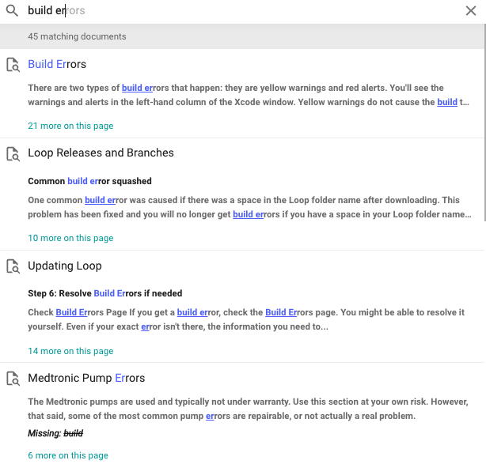

# Intro Overview

The Intro tab of LoopDocs contains information to help a new user get started with the LoopDocs website and with Loop. It also has a quick reference for the website contents.

## Tooltips

LoopDocs has words that may be unfamiliar. For a definition of any word with a dashed underline, simply hover your mouse over the word, or tap on the word on a mobile device, to view the definition.

Every tootip definition is also found in the [Glossary](../faqs/glossary.md) - so head over there if you have trouble reading the tooltips. 

## Website Contents

The main tabs for LoopDocs are:

* [Home](../index.md): The home page for LoopDocs
* [Intro](overview-intro.md): This section with general information
* [Build](../build/overview.md): Instructions to build your Loop app the first time, or [update](../build/updating.md) next time
* [Set Up](../operation/overview.md): Instructions to set up your Loop app initially; these pages are also useful for reference while using the app
* [Operate](../operation/loop/open-loop.md): Many pages on using the Loop app
* [Troubleshoot](../troubleshooting/overview.md): This is the first place to go if you're having trouble with Loop
* [Loop 3](../loop-3/loop-3-overview.md): Temporary section. It will move to Set Up when Loop 3 is released. (Loop-dev is close to but not quite ready for release as Loop 3.)
* [Version](../version/overview-version.md): Information about Loop versions, code customization and development
* [Nightscout](../nightscout/overview.md): Loop-specific Nightscout details
* [FAQs](../faqs/overview-faqs.md): pages with safety tips, frequently asked questions and the Glossary

### Website Short Cuts

One of our awesome Loop volunteers captured the domain names  `loopdocs.org` and `looptips.org`.  So you can find these valuable websites by simply typing loopdocs or looptips followed by .org in your browser. In other words, you don't need to remember or type `https://loopkit.github.io/loopdocs/`.

### Website Navigation

!!! tip "Keyboard Navigation"
    When viewing the site at a computer, you can use keys as shortcuts:
    
    * `n` for next page
    * `p` for previous page
    * `s` for search

The website navigation depends on whether you are on a mobile device or a computer (with browser width > 1220 pixels). 

* For the wide-view:
    * The tabs mentioned in [Website Contents](#website-contents) are visible across the top of the browser
    * Once a tab is selected:
        * The list of pages in that tab is displayed on the left side
        * The Table of Contents on the current page is displayed on the right side
* For the mobile (or narrow) display:
    * From the Home page, tap the Hamburger Menu to display the tabs mentioned in [Website Contents](#website-contents)
    * Once a tab is selected:
        * The list of pages in that tab is displayed in the Hamburger Menu
        * To return to the main tab list, tap the back arrow
        * To see the Table of Contents, use the Hamburger Menu and scroll to the highlighted page (current page) and tap again

### Website Search

It is not uncommon to have a question about Loop. But, it is exceptionally rare to have the question not already answered in LoopDocs, so please **search for answers** by clicking the Search tool (upper right). As you begin to type, suggested completions and links to pages are displayed. Click on the item you think answers your question.
      {width="600"} 

