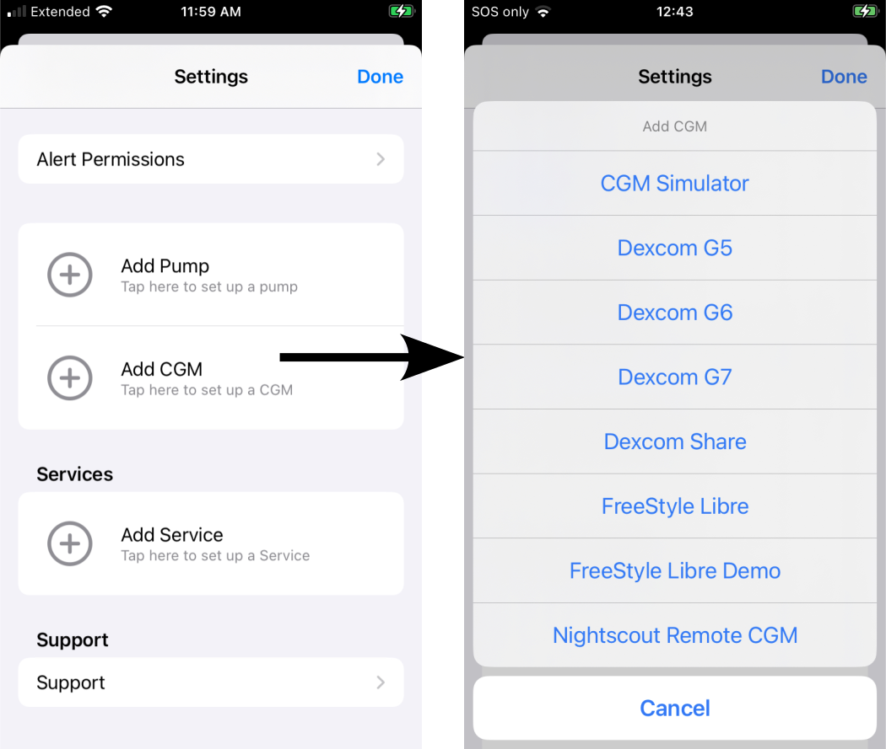
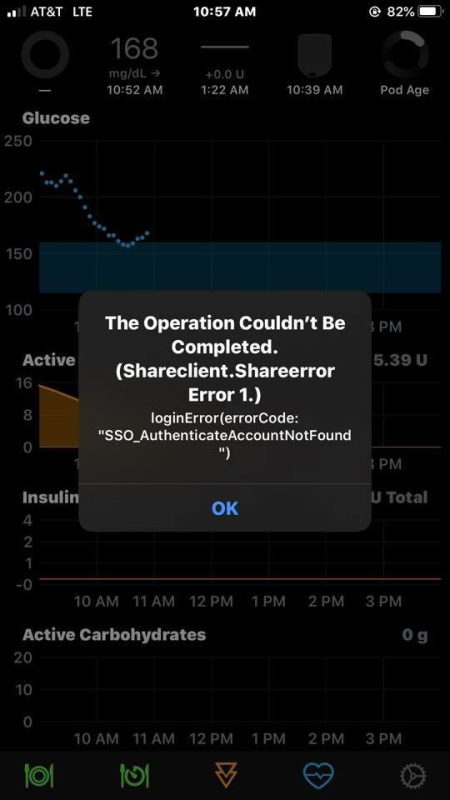

# CGM Configuration

## CGM Choices

The CGM configuration can be selected from the Heads-Up-Display ([HUD](displays_v3.md#heads-up-display)) or from the [Loop Settings](settings.md) screen.

The HUD will look like the graphic below if no CGM or Pump is configured for Loop:

{width="350"}
{align="center"}

There are several choices for a CGM with Loop as shown in the graphic below:

* CGM that reside on the same phone (internet not required)
    * [Dexcom G5](#dexcom-g5-and-g6-cgm)
    * [Dexcom G6](#dexcom-g5-and-g6-cgm)
    * [Minimed Enlite CGM](#medtronic-enlite-cgm)
        * Medtronic Pump only
        * **You must [add pump](add-pump.md) first**
        * Not visible in graphic below because no pump with connected Enlite sensor was attached
* CGM that require active internet
    * [Dexcom Share](#dexcom-share-as-a-cgm)
    * [Nightscout Remote CGM](#nightscout-remote-cgm)
* CGM Simulator - useful to learn the app interface

## Add CGM

The graphic below shows the display when a user taps on Add CGM in the Settings screen. Tap on the desired CGM to advance to the next screen.

{width="500"}
{align="center"}

!!! info "Comment for Experienced Loopers"
    With Loop 3

    * There is a new option for CGM, [Nightscout Remote CGM](#nightscout-remote-cgm)
    * The Dexcom G4 is no longer available from Dexcom so that option was removed

### Dexcom G5 and G6 CGM

The Dexcom G5 and G6 require

* Dexcom app must be running on the Loop iPhone and be paired to an active transmitter
* User must enter that active transmitter ID in the located indicated by the red rectangle in the graphic below
* Do not enter your share credentials
* Do not add the transmitter ID to Loop first

{width="300"}
{align="center"}

!!! info "FYI: When You Change Transmitters"

    When you change Dexcom transmitters, you will need to select the `Delete CGM` button at the very bottom of the CGM info page in Loop. After that, proceed with Dexcom Instructions for changing transmitters.  Once the new transmitter is paired with the Dexcom app, then you tap `Add CGM` to enter the new transmitter. You cannot just tap on your old transmitter ID to update it.
 
    The how-to information for changing a transmitter is found by searching LoopDocs. TO DO - put the link here.

    If you don't update your transmitter ID when you change active transmitters, your Loop will not get CGM data from the Dexcom app.

#### About Dexcom Share credentials

You do **NOT** need your Share account info listed in Loop settings if you are using a G5 or G6 system. The transmitter ID is sufficient. In fact, the recommendation is that you leave your Share account empty so that you don't accidentally become internet-dependent for CGM data when you forget to update your transmitter ID when you start a new transmitter. Just leave the Share credentials blank.

### Medtronic Enlite CGM

You must first connect the sensor when you add your compatible Metronic pump. The option to select the sensor will then be available when you tap `Add CGM`.

### Dexcom Share as a CGM

!!! warning "If you need to use Dexcom Share"

    If the dexcom is on another phone and you choose to use Share (not advised), here is some information.

    For all selections, the Dexcom Share credentials (in other words, account login) is the same as what you used to log in to the active Dexcom app on your iPhone. **Dexcom Share account is not always the same login info as your Dexcom Clarity account.** The information is entered when you first log in to the app and then is never displayed again, nor visible under any information screens. If you have forgotten your G5/G6 account info, you can delete the Dexcom app and redownload it to try logging in again. This will not cause a restart of any sensor sessions in progress.

    If you do not enter your Share credentials correctly into Loop, you will get an error when Loop tries to access your Share account to backfill CGM data. An example of the error message is shown in the graphic below. If you see that message, delete your Share account from Loop settings and try again.

    {width="300"}
    {align="center"}

If you added Share credential when selecting [G5 or G6](#dexcom-g5-and-g6-cgm) (not recommended) and later change transmitters without deleting and adding the CGM with the new transmitter ID, Loop will get data from your Dexcom Share server and will not work without cell or wifi connection. (TO DO) - is the following still true? When Loop is using data from Dexcom Share servers, a small cloud will appear above the BG reading in Loop and should tip you off that maybe you forgot to update your transmitter ID.

### Nightscout Remote CGM

If the user has CGM data available at their Nightscout URL, they can select that as a source for CGM data for Loop. The user must acknowledge they understand the risks of using a remote source that requires internet, as shown in the graphic below.

{width="350"}
{align="center"}

The user must enter both the URL and API_SECRET for their site to ensure the security of the data.

{width="350"}
{align="center"}

When using Nightscout Remote CGM, if the user needs to modify credentials or switch to a different CGM, the user must go through the Loop->Settings->CGM menu.

## CGM Icon

Tapping on the CGM icon in the HUD shows more information about the last CGM reading.

For Dexcom G5/G6 and Share, the same screen is obtained by tapping on Loop Settings->CGM.

For Nightscout Remote CGM, the Nightscout URL is opened when tapping on the CGM icon in the HUD, while the credential sections is shown when tapping on Loop Settings->CGM.

The graphic below shows the result of tapping on the CGM icon when using a Dexcom G6.  It includes the time of the last reading to the nearest second, along with other information about that sensor and transmitter. It also has an option to go to the Dexcom app on the same device.

{width="250"}
{align="center"}

## Final CGM Steps

!!! warning "Please Review Detailed Pages"
    There is a lot of detailed information in the rest of this section - probably too much to absorb the first time through - although you should read it at least once.  Keep coming back while you are learning to use Loop in Open Loop.

    * [Displays](displays_v3.md)
    * [Settings](settings.md)
    * [Therapy Settings](therapy-settings.md)
    * [Optional Services](../operation/loop-settings/services.md)

    Status and Commands for :

    * [RileyLink](../operation/loop-settings/rileylink.md)
    * [Omnipod Common](omnipod.md)
    * [Medtronic](medtronic.md)

Now that you have added your CGM, you are ready to either add a [Pump](add-pump.md), if you have not done so, or proceed to the [Open Loop](../operation/loop/open-loop.md) page.

## Modify CGM

To modify the selected CGM, it must first be deleted. Then a new CGM can be added.  Scroll to the bottom of the current CGM screen and tap `Delete CGM`.

When changing Dexcom Transmitters, you must first `Delete CGM` and then add the CGM back with the new Transmitter serial number.
