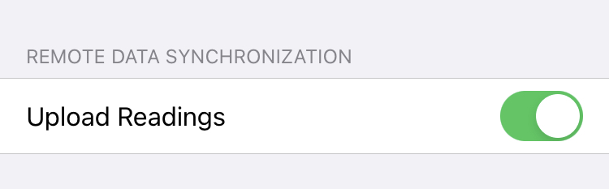
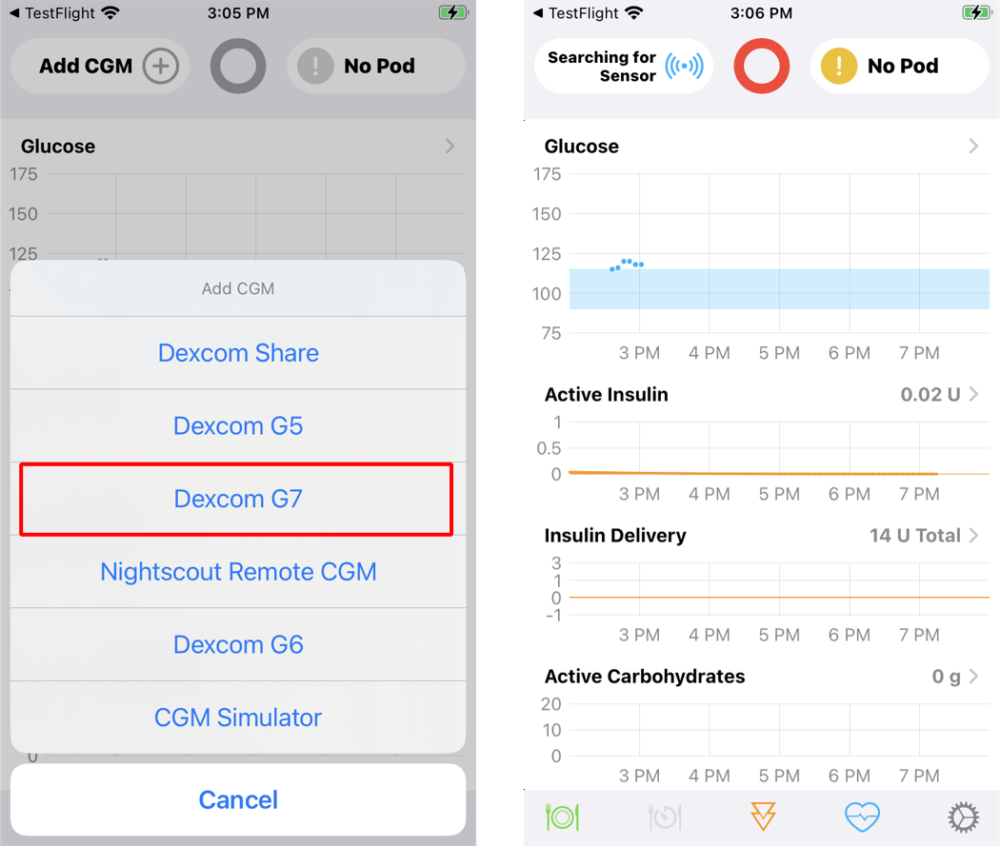
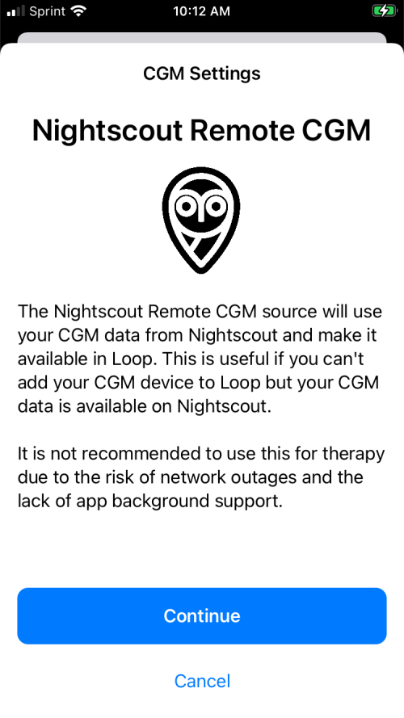
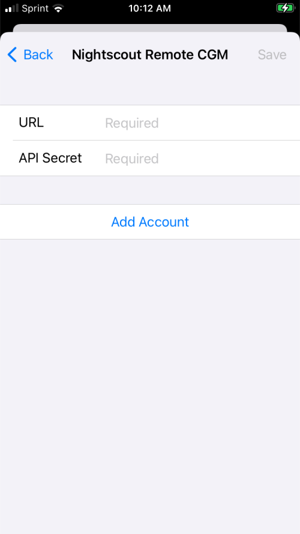

## CGM Choices

A CGM can be added from the Heads-Up-Display ([HUD](displays-v3.md#heads-up-display)) or from the [Loop Settings](settings.md) screen ⚙️.

The HUD will look like the graphic below if no CGM or Pump is connected with Loop:

{width="350"}
{align="center"}

Loop can be connected to the following CGMs:

* CGMs that reside on the same phone (internet not required)
    * [Dexcom G5](#dexcom-g5-g6-one)
    * [Dexcom G6 or ONE](#dexcom-g5-g6-one)
    * [Dexcom G7 or ONE+](#dexcom-g7-or-one)
    * [Libre](#libre) **(Loop 3.4 and later)**
        * Only some Libre sensors are supported; some have encryption that limits DIY use
    * [Minimed Enlite CGM](#medtronic-enlite-cgm)
        * Medtronic Pump only
        * **You must [add the Medtronic pump](add-pump.md) first**
            * If Enlite is connected to Medtronic pump and that pump is connected to Loop, then an option for Enlite shows up when choosing a CGM, _not visible in graphic below_
* CGMs that require active internet (WiFi or Cell)
    * [*Dexcom Share*](#dexcom-share-as-a-cgm)
    * [Nightscout Remote CGM](#nightscout-remote-cgm)
* CGM Simulator - useful to learn the app interface

## Add CGM

To add a CGM, go to the Settings screen ⚙️, tap on `Add CGM`, and tap on your CGM.

{width="500"}
{align="center"}

If you later decide to use a different CGM type, you must first delete the CGM and then add CGM to choose the new one.

*   For Dexcom G5, G6 or ONE, you must delete the CGM when you change transmitters (about once every 90 days)

!!! warning "Set up *Focus* Mode"
    Don't forgot to check your [iOS *Focus* Notifications](../faqs/safety-faqs.md#ios-focus-notifications) when you add or change your CGM.

    * Dexcom CGM must have the app for G6 or G7 added separately
    * Libre CGM (`dev` branch only) must have Loop notifications turned on to get CGM alerts
    * Nightscout or other alerts: if you use another app to provide alerts, be sure to add them to *Focus* as well

### Remote Upload from Loop

Loop provides an option to upload CGM values to a remote service like Nightscout or Tidepool. In many cases this can be a preferred solution.

With Loop 3, the data-store on the Loop phone keeps a full week of data. If there is an interruption in the upload, when it is restored, Loop will fill in up to 1-week of CGM data that was not previously uploaded.

Some people use Dexcom Share to feed their remote services. There have been outages with Share. When those occur, the data is not back-filled like it is with Loop.

This is the reason why there's a comment under each CGM below to select Upload Readings.

{width="350"}
{align="center"}

### Dexcom G5, G6, ONE

To use the Dexcom G5, G6 or ONE:

* Select Dexcom model, use `Dexcom G6` for either  G6 or ONE
* Dexcom app must be running on the Loop iPhone and paired to an active transmitter
* User must enter that active transmitter ID in the location indicated by the red rectangle in the graphic below
* Do **not** enter your `Share Credentials`
    * The graphic below shows `Tap to set`
    * Do not tap, leave it alone
* Only add the **transmitter ID** to Loop **after** it is paired with the *Dexcom app* on your phone

{width="300"}
{align="center"}

#### Where to get the Transmitter ID for Dexcom G6? 

You can find the **transmitter ID** in your Dexcom G6 app or on the back of the transmitter box (please refer to the below screenshots). 

* In your Dexcom G6 app
  * Tap "⚙️ Settings"
  * The **transmitter ID** is located under section "CGM" where it says "Transmitter" with a the 6-digit string.
  * Alternatively, while in Settings, tap on the <kbd>></kbd> in the "Transmitter" row: your **transmitter ID** is the 6-digit identifier next to "SN" (short for serial number). 

{width="550"}
{align="center"}

* On the back of your transmitter box 
  * Your transmitter ID is the 6-digit number next to "SN" and the QR code on the back of the carton.

{width="350"}
{align="center"}

It is suggested that you enable [Remote Upload from Loop](#remote-upload-from-loop).

#### Change Dexcom Sensor

When you change a Dexcom G5, G6 or ONE sensor, you do this in the Dexcom app. When the sensor completes warmup and CGM values are once again reported in the Dexcom app, Loop picks these values up because you are using the same Dexcom Transmitter.

#### Change Dexcom Transmitter

When you change the Dexcom G5, G6 or ONE Transmitter, you need to delete your CGM selection from Loop and then add it back after you complete the pairing with the transmitter in your Dexcom app.

??? info "FYI: When You Change Dexcom Transmitters (click to open)"

    Before you change Dexcom transmitters, select the `Delete CGM` button at the very bottom of the CGM info page in Loop. If you leave the transmitter connected in Loop, you may have trouble pairing your new transmitter. If pairing does work, then Loop will not get CGM data from the Dexcom app on your phone.

    Follow the instructions here: [What do I do when I switch Dexcom transmitters?](../faqs/cgm-faqs.md#what-do-i-do-when-i-switch-dexcom-transmitters).

    The Dexcom G7 is handled differently - Loop automatically detects when a new sensor/transmitter pair is added to the Dexcom G7 app.

Your selection to enable [Remote Upload from Loop](#remote-upload-from-loop) must be repeated with each new Transmitter. The default setting is disabled.

#### About *Dexcom Share* credentials

You do **NOT** need your Share account info listed in Loop settings if you are using a G5 or G6 system. The transmitter ID is sufficient. In fact, you should leave your Share credentials blank so that you don't accidentally become internet-dependent for CGM data if you forget to update your transmitter ID when you start a new transmitter.

### Dexcom G7 or ONE+

This is only available on Loop 3.

You must have the G7 app on the same phone as Loop. When the G7 app switches to the next sensor/transmitter assembly, Loop automatically switches too.

It is suggested that you enable [Remote Upload from Loop](#remote-upload-from-loop).

{width="500"}
{align="center"}

!!! tip "Don't forget Health Permissions"
    For those switching from *Dexcom G6* to *Dexcom G7*, you might forget to add permission for the *G7* app to write to *Apple Health*. If you want long-term history of those CGM readings to persist in *Apple Health*, turn on the permission for the *Dexcom* app to write glucose to *Health*.

    If either the G6 or the G7 has permission to write to *Apple Health*, then *Loop* will delete the *Loop* glucose data in *Apple Health* that are older than 3 hours and newer than 1 week. The *Dexcom* app will write its glucose values to Health when each value is 3 hours old.

### Libre

The Libre plugin for Loop, [LibreTransmitter](https://github.com/dabear/LibreTransmitter#libretransmitter-for-loop), connects directly via Near Field Communication (NFC) during pairing (for some sensors) and via Bluetooth (direct to sensor or direct to a transmitter attached to the sensor) for regular readings. No other app is needed.

* Libre 1 are supported but must use a third-party transmitter (miaomiao and bubble transmitters are supported)
* European Libre 2 can be used directly or via transmitter
* American Libre 2 is not supported
* Libre 3 is not supported

!!! tip "Connecting to Libre"
    First reading for a new sensor will often take 2-4 minutes. This is due to some technicalities on how the Libre sensor announces its presence via bluetooth.

There are solutions for some Libre 3 but they cannot reside on an iPhone. The Android solution can be uploaded to Nightscout, with Loop using Nightscout as a Remote CGM; but this requires internet access to continue closed-loop performance.

Part of the problem with Libre sensors is that there are differences in region, type and "security generations" which makes it hard to account for all variants. For example, the Libre 2 US has a different "security generation" than European Libre 2 sensors (different encryption in the data transmitted over bluetooth).

Libre 3 sensors have started appearing as well, but are unsupported. Other Libre sensors that are unsupported: Libre Pro, Libre H, Libre Sense Glucose Sport Biosensors.

### Medtronic Enlite CGM

The Medtronic Enlite CGM is only available if you have connected it to your compatible Medtronic Pump.

* Make sure your pump reports the Enlite CGM results
* Go through the [Add Pump](add-pump.md) to Loop steps with that Medtronic pump
* Then do the [Add CGM](add-cgm.md) steps and the sensor should be presented as an option

### *Dexcom Share* as a CGM

!!! warning "If you need to use *Dexcom Share*"

    If the dexcom is on another phone, you can use Share if internet / cell coverage is good.
    
    *Dexcom Share* is not available for Dexcom ONE CGM.
    
    The *Dexcom Share* credentials (in other words, account login) is the same as what you used to log in to the active Dexcom app on your iPhone. ***Dexcom Share* account is not always the same login info as your Dexcom Clarity account.** The information is entered when you first log in to the app and then is never displayed again, nor visible under any information screens. If you have forgotten your G5/G6 account info, you can delete the Dexcom app and redownload it to try logging in again. This will not cause a restart of any sensor sessions in progress.
    
    If you do not enter your Share credentials correctly into Loop, you will get an error when Loop tries to access your Share account to backfill CGM data. An example of the error message is shown in the graphic below. If you see that message, delete your Share account from Loop settings and try again.
    
    {width="300"}
    {align="center"}

### Nightscout Remote CGM

If the user is already uploading CGM data to their Nightscout URL, they can select that as a source for CGM data for Loop. The user must acknowledge they understand the risks of using a remote source that requires internet, as shown in the graphic below. 

In addition to the risks of missing data, if the internet is not reliable, you must also make sure the CGM data sent to Nightscout is reliable.

!!! important "DANGER - Make sure Nightscout CGM Data is Reliable"
    Just because you can use Nightscout as a CGM source does not mean you should.

    If you decide to use Nightscout as a CGM source, make sure the data stored in Nightscout is reliable. If the app you choose uploads bad results to Nightscout, you don't want Loop to use that bad data.
    
    _Sensors that can be added to Nightscout via other apps include Dexcom, some Libre, and some Medtronic sensors. Please refer to [Nightscout Docs: Configure your Uploader](https://nightscout.github.io/uploader/setup/){: target="_blank" }._
    
    There are third-party apps that bring Libre data to your Loop phone. Cuustomization instructions are provided at the `Loop and Learn` website: [Libre Support for Loop 3.2.x](https://www.loopandlearn.org/custom-code/#add-cgm-browser){: target="_blank" } that explain how to modify Loop 3 to use one of those apps for Browser Build. The Mac instructions are found on the same page. Please use these steps to get a version of Loop that does not rely on internet access to work.
    
    It is suggested that you use Open Loop during warmup until the new sensor begins to provide reasonable data. This is especially important with European Libre 2 using a direct Bluetooth connection.
    
    The xDrip4iOS app (which can also be found in the app store under the name Shuggah) may have a problem during the warmup of a new sensor (European Libre 2 using a direct Bluetooth connection). There were two instances of crazy high values being reported and picked up by Loop 3. One Shuggah user and one xDrip4iOS user who connected via Nighscout as a CGM with Loop 3 had a serious overdose of insulin because of bad readings with a new sensor. The developers of xDrip4iOS fixed their application - so make sure you have the latest version. Those developers have no control over what is provided by Shuggah.

{width="350"}
{align="center"}

The user must enter both the URL and API_SECRET for their site to ensure the security of the data. The URL must start with `https://` and cannot have any extra spaces in the line.

{width="350"}
{align="center"}

When using Nightscout Remote CGM, if the user needs to change credentials or switch to a different CGM, the user must go through the Loop->Settings ⚙️->CGM menu.

## Change CGM

To change CGM Types, you first delete your existing CGM selection and then add a new CGM.

### Change a Nightscout Remote CGM

For **Nightscout Remote CGM**, the Nightscout URL is opened when tapping on the CGM icon in the Heads-Up Display, while the credential sections with the `Delete CGM` row are shown when tapping on Loop `Settings` ⚙️, and selecting CGM.

After deleting a CGM, the [Head-Up-Display](#cgm-choices) at the top of the Loop main screen will show the `Add CGM` icon.

### Change Other CGM

Other CGM, you can tap on the CGM from either the Heads-Up Display or tap on `Settings` ⚙️, and select your CGM.

Scroll to the bottom of the screen and select `Delete CGM`.

### Dexcom G5, G6 and One (not G7)

For older Dexcom sensors, the transmitter is replaced separately about once every three months. In order to enter a new transmitter number, you must first delete the CGM and then add the CGM.

Detailed instructions are found at [CGM FAQs: What do I do when I switch Dexcom transmitters?](../faqs/cgm-faqs.md#what-do-i-do-when-i-switch-dexcom-transmitters).

With the Dexcom G7, the user only needs to let the Dexcom G7 app know when to use the new sensor. The Loop app automatically switches to the new sensor with no additional steps required by the Looper.
