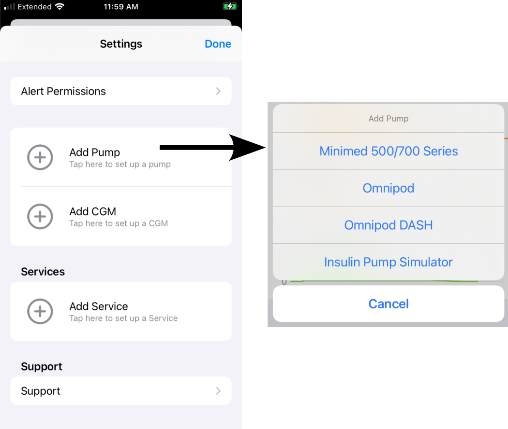
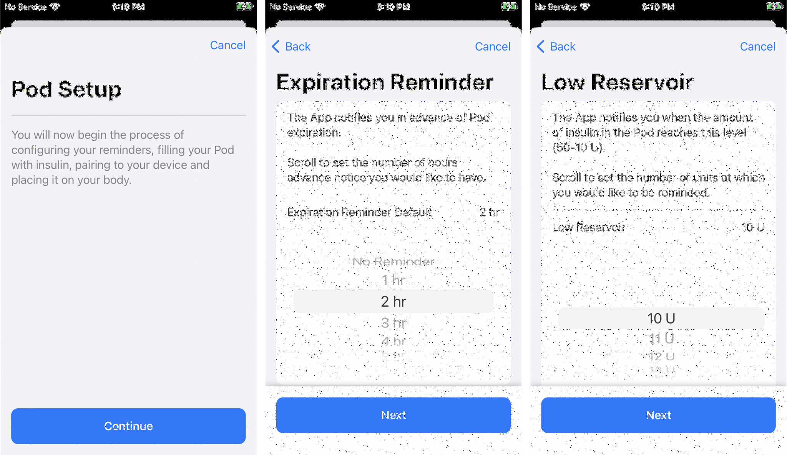
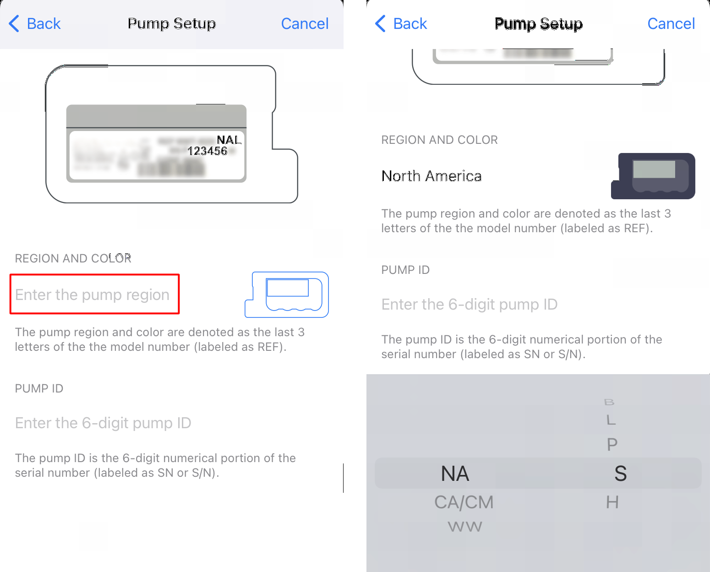
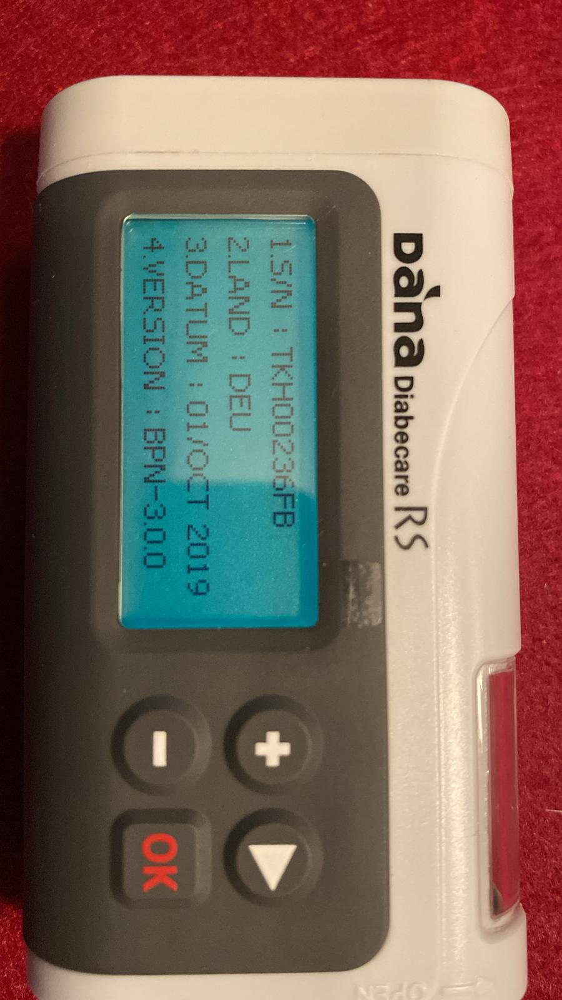
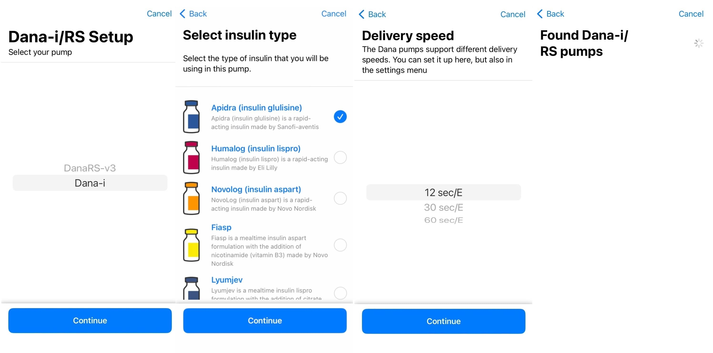
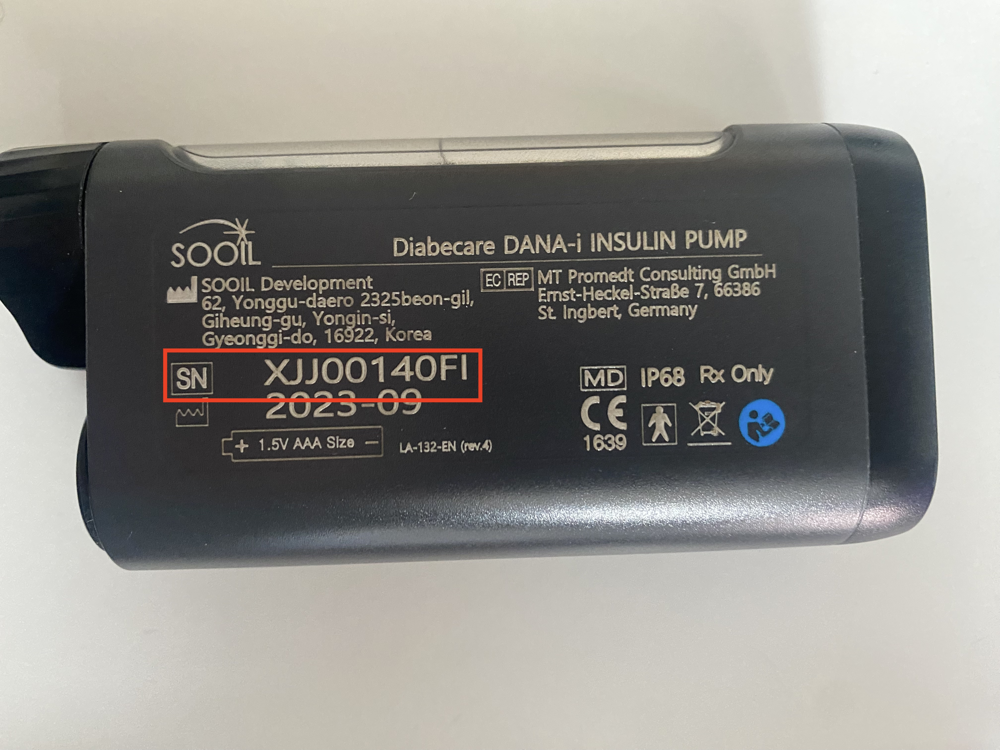
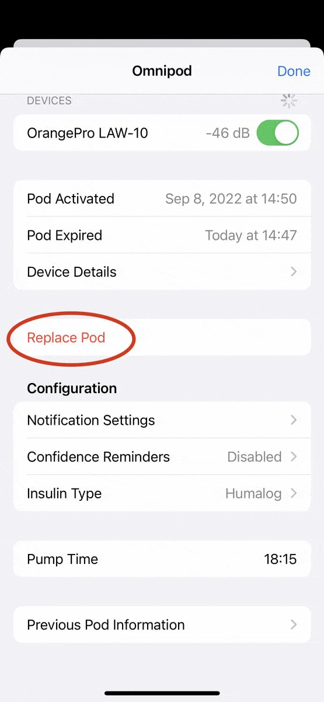

## Pump Choices

You can choose a pump from the Heads-Up-Display ([HUD](displays-v3.md#heads-up-display)) or from the [Loop Settings](settings.md) screen.

The HUD looks like the graphic below if no CGM or Pump is chosen:

{width="350"}
{align="center"}

!!! question "Switching Pumps?"
    To change the pump connected to Loop go to [Change Pump Type](#change-pump-type).

Loopers can choose from 4 pumps and a simulator:

* Minimed
    * Note: only some Minimed pumps are compatible
    * Please refer to [Compatible Pump](../build/pump.md#check-medtronic-pump-version) for additional details
* Omnipod
* Omnipod DASH
* Dana-i / DanaRS-v3 (Coming soon)
    * Note: DanaRS-v1 or any Dana korean versions are not supported
    * A special fork is required at this time (see [link](../build/pump.md#sooil-dana-pumps) for details)
* Insulin Pump Simulator

!!! info "Omnipod Terms"
    The Loop app and LoopDocs use these terms:

    * **Omnipod** is the older (Eros) pods (requires RileyLink compatible device to Loop)
    * **Omnipod DASH** is the newer BLE pods (phone talks directly to pod - no extra device needed to Loop)
    * **Omnipod Common** means information common to Omnipod and Omnipod DASH

### Summary of Steps to Add a Pump

Here is an overview of the different steps for adding each pump.  Before changing pumps, you need to delete the old pump first.  See [Change Pump Type](#change-pump-type) section below.

#### Steps for Omnipod

1. [Omnipod Common 1](#omnipod-common-1) (choose default notifications)
1. [Insulin Type](#insulin-type)
1. [Select RileyLink](#select-rileylink)
1. [Omnipod Common 2](#omnipod-common-2) (Pair Pod)

#### Steps for Omnipod DASH

1. [Omnipod Common 1](#omnipod-common-1) (choose default notifications)
1. [Insulin Type](#insulin-type)
1. [Omnipod Common 2](#omnipod-common-2) (Pair Pod)

#### Steps for Medtronic

1. [Insulin Type](#insulin-type)
1. [Select RileyLink](#select-rileylink)
1. [Medtronic](#medtronic)

#### Steps for [Dana-i / DanaRS-v3](#dana-i-danars-v3) (Coming soon)

## Add Pump

Tap on Add Pump in the Settings screen to see pump options (shown in the graphic below).

Tap on your Pump.

{width="500"}
{align="center"}

Medtronic pump users - skip ahead to [Insulin Type](#insulin-type).

## Omnipod Common 1

### Pod Nofication Defaults

Here are the common screens for adding Omnipod or Omnipod DASH showing the default settings. You can change the default settings later.

{width="600"}
{align="center"}

After you complete these screens, you select the insulin type.

## Insulin Type

For all pumps, you can choose from the insulin types below.

* Insulin Type
    * **Rapid Acting** (Novolog, Humalog, Apidra) or **Ultra Rapid** (Fiasp, Lyumjev)
    * Inhaled insulin (Afrezza) is not offered because it is not used in pumps. [Non-Pump Insulin](displays-v3.md#event-history-reservoir-and-non-pump-insulin)

{width="250"}
{align="center"}

To add a Omnipod DASH pump, skip ahead to [Omnipod Commom 2](#omnipod-common-2).

Omnipod and Medtronic users should continue to select a RileyLink compatible device.

## Omnipod or Medtronic

### Select RileyLink

For Omnipod and Medtronic pumps, you need a RileyLink compatible device to Loop.  The Device and your phone must be kept close to your pump for Loop to work.

!!! warning ""
    A new RileyLink compatible device is not listed next to its slider until after you connect the device to Loop. Find the little toggle in the device list, switch on that toggle, and the RileyLink will appear after the toggle is green.

    You can [personalize](../loop-3/rileylink.md#personalize-device) the name once it is connected to Loop.

{width="400"}
{align="center"}

All RileyLink compatible devices in the nearby area, not already connected to a Loop app, will display in the RileyLink Setup screen. Select your RileyLink by sliding the toggle to display green and then press the blue `Continue` button at the bottom of the screen.

If your device does not appear:

* Make sure it is charged and turned on
* Make sure it is not connected to a different phone or app

If you are adding a Medtronic pump, skip ahead to [Medtronic](#medtronic).

## Omnipod Common 2

After selecting a RileyLink for Omnipod, all other actions for Omnipod and Omnipod DASH are the same. Once a pod is paired, the Pump display is the same, except the Omnipod screen has a RileyLink Devices section.

For Omnipod (left) and Omnipod DASH (right), you should see the `Pair Pod` screen.

{width="500"}
{align="center"}

At this point - you should hit `Cancel` (upper right of screen) and review the [Omnipod Common](omnipod.md) page before pairing a pod.

!!! tip "New Looper / New Podder"
    Carefully review the [Pair Pod](omnipod.md#pair-pod) instructions and the rest of the [Omnipod Common](omnipod.md) page before continuing. Then, when you are ready, pair a pod.

    If you are not ready to fill and attach a pod with insulin, try filling a pod with water and let it drip into a ziplock bag to test running Loop on the pod. (Be sure the pod is not near anything when you hit "Insert Cannula".)

    You may enjoy reading [Rufus the Bear](https://www.loopandlearn.org/sl-rufus/){: target="_blank" }.

## Medtronic

If you followed this page to add your Medtronic pump, you have completed the first three steps.  If not, you can prepare your pump now, then do those first three steps using Loop (follow the links). All other steps be completed before you Connect the Pump.

1. Select [Minimed](#add-pump) as your pump
1. Select [Insulin Type](#insulin-type)
1. Select [RileyLink](#select-rileylink)
1. [Prepare Medtronic Pump](#prepare-medtronic-pump)
1. [Connect Pump to Loop](#connect-pump-to-loop)

### Prepare Medtronic Pump

!!! Tip "No Need to Set the Time"
    If you just added a battery to a Medtronic pump you have not used for a while, the pump initiation screens require you to set the date and time for the pump. You can just accept the default values; when you connect the pump to the *Loop* app, the time and date are automatically set.

!!! warning ""

    **Loop requires these settings on your Medtronic pump.**

    Check with your users guide (can be found online if you don't have one) for more detailed instructions on your model of pump if you're not sure how to accomplish these steps.

    If you have basal rates, insulin to sensitivity factor and carb ratios in your pump - these will be overwritten (using the Therapy Setting values) when you connect your pump to Loop. If those rates are important to you, record them prior to continuing.

- Turn off Patterns under the basal menu settings.
- Set the Max Basal and Max Bolus values in the Medtronic pump to be greater than or equal to the values you enter in the Loop [Therapy Settings](therapy-settings.md#delivery-limits). Otherwise, Loop will not connect to your pump with the error message: `Pump Error. Max setting exceeded`.
- Set your pump's `Temp Basal Type` to `Insulin Rate (U/hr)`.
- Set Remote Devices to `ON` and enter any random ID (010101 will work - avoid using all zeros). This setting is found in the pump's Utilities menu (for x23 continue to Connect Devices, Remotes) and turn `ON` the Remote Options.
- Cancel any currently running extended or dual wave boluses.  Loop cannot loop with those running.
- If you are using an Enlite CGM through your Medtronic pump, make sure that is configured properly before adding your pump to Loop

### Connect Pump to Loop

The final step is to connect your Medtronic pump to Loop.

- Make sure your RileyLink is turned on and nearby
- Add your pump's region, color as shown in the graphic below
    * Note that some Canadian pumps use `CM` instead of `CA` for the region code.  Select `CA/CM` in the dropdown menu.

{width="500"}
{align="center"}

- Add your pump's 6-digit serial number as shown in the graphic below
- Click the `Connect` button to connect the pump to Loop.
- The spinning icon continues until you see the blue check mark and `Continue` button
    - If Loop is not successful at connecting, you will get an error message and stay on this screen
    - If the [Delivery Limits](therapy-settings.md#delivery-limits) (max basal and max bolus) in the pump are lower than values you entered in Loop you will see an error message: `Pump Error. Max setting exceeded`. (See note below for other reasons you might see this message.)
        - In this case, edit the values in the pump and then click `Connect` to retry.

{width="750"}
{align="center"}

!!! warning "Max setting exceeded"
    It turns out the "Max setting exceeded" error might be displayed even when Max Bolus and Max Basal Rate are already set appropriately on the pump.

    * If you had previously used a pump that allows multiples of 0.025 U/hr basal rate and you have one of those rates in the basal rate schedule in Loop, you will not be able to connect to a different Medtronic pump that does not support those rates.
    * If this happens to you, cancel out of connecting to that pump
        - Refer to [Prep for Medtronic](settings.md#option-2-prep-for-medtronic) on the Settings page
            - Add a simulator so you can Change the scheduled basal rates
            - Delete the simulator
        - Try again

#### Bolus in Progress

If you get an error `Bolus in progress` on the pump when trying to connect, you probably need to rewind and load insulin into the reservoir.

If the pump has alerted that it is out of insulin, you cannot pair to Loop as a new pump.

#### Final steps

Once you have successfully connected to the Medtronic pump, click on `Continue`:

- You will then be presented with two more screens, click `Continue` for each
    - Pump Clock message
    - Pump is ready for use screen
- If you have an x23 or x54 pump, there is one more step - highlighted below

!!! info "For x23 and x54 Medtronic pump users only"
    | 

 ||
    |---|---|
    |{width="550"}|For x23 and x54 Medtronic pump users, there is a packet of information special to those pumps called MySentry messages. If you have never setup this part of the pump previously, you may see a screen, called "Pump Broadcasts", at this point in the setup process.  Follow the directions on the screen. They will require you to take some manual steps on your pump to "pair" it with your Loop app.  Basically, you will need to go to your pump's main menu, scroll down to Utilities, then Connect Devices, then Other Devices, turn that setting On, and then select Find Device. Once you do that, click on the `Continue` button in Loop app and the pairing will take place. This will allow those MySentry packets of information to flow to Loop app.  This step does not apply for x22 or x15 pump users, since those pumps do not have MySentry capabilities.|

Now that your pump is paired with Loop, you should select the type of battery you are using and decide whether to use My Sentry:

1. Select your pump's battery type (lithium or alakine)
    * There is a whole page about [Medtronic pump batteries](../operation/features/battery.md)
2. Leave the Preferred Data Source on Event History
1. If you have an x23 or x54 pump, choose whether to use My Sentry (saves phone battery) or not (saves OrangeLink battery)
    - For other Medtronic pumps, adjusting this setting does not do anything
    - Note that the Orange Link battery drain is substantial
        * Some users reported batteries needed to be changed every 2-4 days compared to 10 days with MySentry off

The Medtronic status and commands available are shown in the [Pump Settings](medtronic.md) page.

## Dana-i / DanaRS-v3

!!! important "Coming Soon"
    The Dana pump is not part of the released code yet. But the plug-in feature of Loop makes adding it extremely easy.
    
    If you want to test the Dana before it added to Loop, please join the discussion of this pump in zulipchat: [Dana Discussion](https://loop.zulipchat.com/#narrow/stream/144182-development/topic/Dana.20i.20pump){: target="_blank" }

!!! info "Support for Dana-i"
    All versions of the Dana-i are supported at the moment!

!!! warning "Check your DanaRS version before starting"
    Only the DanaRS firmware v3.0 or higher is supported, every other version is not supported or is untested (The korean versions are untested for example).
    To check your DanaRS version, please go to "Analyze" -> "Model information". The version should be at least `xxx-3.0.0`.

    {width="450"}
    {align="center"}

When you select the "Dana-i/RS" option, you will be prompted to select your pump model.
After this selection, you will get a short description on how the pairing process will work.
Then you will get the following menu's:

1. Select [Insulin Type](#insulin-type)
2. Select [Delivery speed](#delivery-speed)
3. Prepare your [Dana-i / DanaRS-v3 pump](#prepare-dana-idanars-v3)
4. Connect to your [Dana-i pump](#pairing-dana-i) or [DanaRS-v3 pump](#pairing-danars-v3)
5. (Optional): Enable [silent pump tones](#optional-enable-silent-pump-tones)
6. (Optional): [Check if you need a heartbeat](#optional-check-if-you-need-a-heartbeat)

{align="center"}

### Delivery speed

!!! info "IMPORTANT"
    The delivery speed can always be changed in the pump's settings, but you can only have one delivery speed active

The Dana pumps supports several bolus/delivery speeds.
This might be interesting to customize if you want to slow down the bolus speed for insulin types that feel like it is burning.
Dana supports 3 speeds:

* 12 seconds per unit (default)
* 30 seconds per unit
* 60 seconds per unit

### Prepare Dana-i/DanaRS-v3

Start by checking the device name at the back of your Dana (or inside the "Model information" menu).
This is a 10 character code, which is listed behind the SN.
The example below is from a Dana-i, but is the same for every Dana pump

{width="450"}
{align="center"}

After you have done the [Insulin Type](#insulin-type) and [Delivery speed](#delivery-speed), you will land on the Dana scanning page.
This page will show all the Dana pumps it could find in your area.
Once you see your device name in the list, click on it and Loop will try to connect to your Dana-i / DanaRS-v3.

### Pairing Dana-i

Once connected, your Dana-i will prompt you with a question if you want to connect.
Accept this and you will see a code on your Dana-i.
Meanwhile, you will see the standard iOS Bluetooth pairing modal.
Also accept this and fill in the code from your pump into iOS.
After that is done, Loop is ready to use your Dana-i!

{width="450"}
{align="center"}

### Pairing DanaRS-v3

Once you see your device name in the list, click on it and Loop will try to connect to your DanaRS-v3.

Once connected, your DanaRS-v3 will prompt you with a question if you want to connect.
Accept this and you will see two codes on your DanaRS-v3.
Meanwhile, you will see a prompt for 2 codes in Loop.
Fill in the codes from your pump into iOS and Loop is ready to use your DanaRS-v3!

### (Optional) Enable silent pump tones

Normally, a Dana pump will make a sound or a vibration every time a bolus is completed.
When Loop is configured with [Automatic bolus](settings.md#dosing-strategy), it might be anoying to have a beep or a vibration for every micro bolus.
Therefore, we strongly recommend user to enable the silent tones.

Sadly, only the Dana distributors know how to enable this feature at the moment.
But we do know you need to set your alarm to sound.
You can do this via: "Settings" -> "User options" -> "4. Alarm"

### (Optional) Check if you need a heartbeat

Most CGM provide a live Bluetooth connection, which the *Loop* app uses as a heartbeat to wake the app with each CGM reading.
Without a heartbeat, the *Loop* app will not run the algorithm when the app is in the background or the phone is locked.

Some pumps can also provide a heartbeat if the CGM you choose cannot provide one.

DanaKit doesn't provide a heartbeat by default.

Therefore, it is important to check if your CGM provides a heartbeat. If it does not, there are battery-intensive work-around methods for Dana pump. See [Dana Heartbeat Modes](../troubleshooting/dana-heartbeat.md).

## Change Pump Type

Before changing from one pump type to another pump type, you must delete the old pump type.

* If you are using Medtronic, scroll to the bottom of the pump screen and select `Delete Pump`

* Before switching between Omnipod and Omnipod DASH or any kind of Omnipod to Medtronic, you must deactivate your current pod
    * This does not include changing a pod, so long as the pods are of the same type
    * The `Switch to other insulin delivery device` button will not be available with an active pod
    * Follow along in the GIF below - it cycles though these steps.

        * Go to the Omnipod screen and tap on Replace Pod
        * Deactivate the pod
        * When deactivation completes, tap on Cancel in upper right
            * If you hit continue instead, tap cancel when Pair Pod screen appears
        * On the main Loop screen, tap on the ! No Pod icon
        * Scroll to the bottom of the screen
        * Tap on `Switch to other insulin delivery device` and follow the directions to complete the task

    * Now the new pump type can be selected from settings or tapping on the add pump icon on the HUD

    {width="350"}
    {align="center"}

The [Head-Up-Display](#pump-choices) at the top of the Loop main screen will now show the add pump icon.

