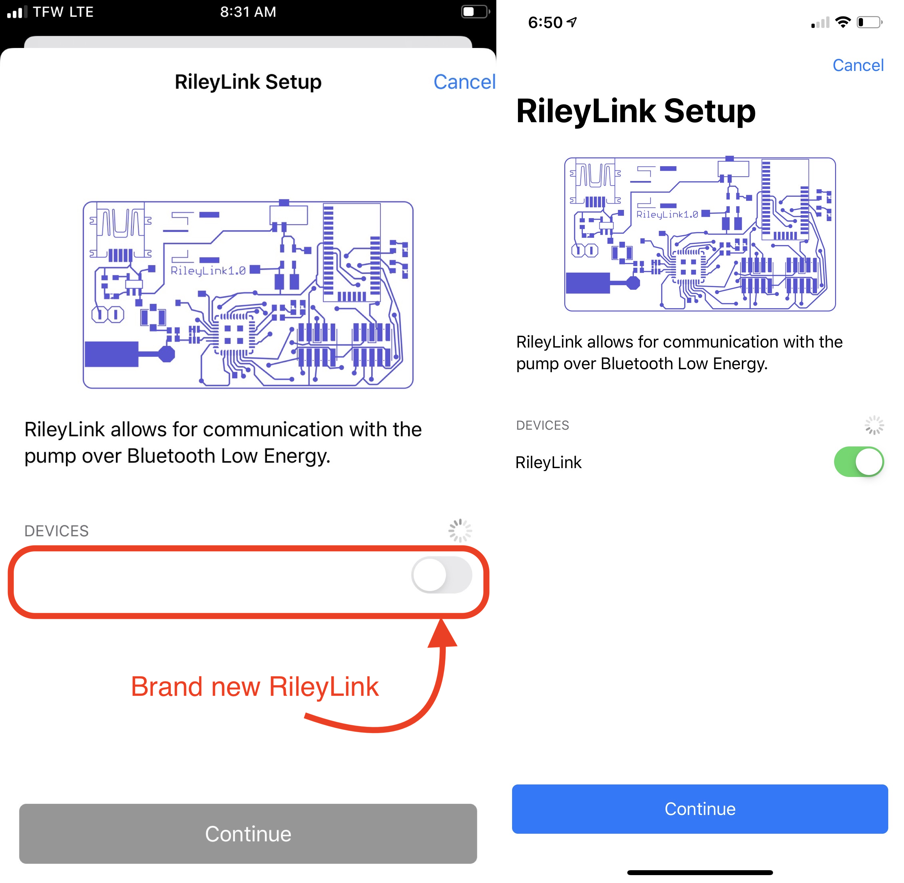

# Pump Configuration

## Pump Choices

The pump configuration can be selected from the Heads-Up-Display ([HUD](displays_v3.md#heads-up-display)) or from the [Loop Settings](settings.md) screen.

The HUD will look like the graphic below if no CGM or Pump is configured for Loop:

{width="350"}
{align="center"}

!!! question "Switching Pumps?"
    If you already have a pump connected to Loop and want to switch to a different pump, go to [Modify Pump](#modify-pump).

Loopers can choose from 3 pumps and a simulator:

* Minimed 500/700 Series
* Omnipod
* Omnipod DASH
* Insulin Pump Simulator

When adding a pump, the steps you take depend on the type of pump. 

* All steps for any pump are presented in order on this page
* When you see the words "If you are adding `type of pump`" skip ahead in docs to "link", click on the link to move to the next step for that pump

!!! info "Omnipod vs Omnipod DASH"
    Insulet uses the term Omnipod to refer to the older (Eros) pods.

    Insulet uses the term Omnipod DASH to refer to newer BLE DASH pods.

    The Loop app follows this convention. LoopDocs uses:

    * **Omnipod**: specific to the older (Eros) pods that require a RileyLink compatible device
    * **Omnipod DASH**: specific to the new BLE pods
    * **Omnipod Common**: refers to information that is common to both types of pods

## Add Pump

The graphic below shows the display when a user taps on Add Pump in the Settings screen. Tap on the desired Pump to advance to the next screen.

{width="500"}
{align="center"}

If you are adding a Medtronic pump, skip ahead to [Insulin Type](#insulin-type).

## Omnipod Common 1

### Pod Nofication Defaults

The graphics below show the common screens for adding Omnipod or Omnipod DASH. These are the default notifications used for all future pods. These default settings can be modified later.

{width="600"}
{align="center"}

After these screens are completed, the insulin type is selected.

## Insulin Type

The insulin type screen is presented for all pumps.

* Insulin Type
    * User can select from Rapid (Novolog, Humalog, Apidra) or Ultra-Rapid (Fiasp, Lyumjev)
    * For Rapid insulin, the [Child or Adult](therapy-settings.md#insulin-model) model selection made in Therapy Settings is used
    * For the Ultra-Rapid insulin, only one model is available
    * Inhaled insulin (Afrezza) is not suitable for pump use so is not offered at this screen; it is only available for use with [Non-Pump Insulin](displays_v3.md#event-history-reservoir-and-non-pump-insulin)

{width="250"}
{align="center"}

If you are adding an Omnipod DASH pump, skip ahead in the docs to [Omnipod Commom 2](#omnipod-common-2).

Omnipod and Medtronic users should continue to select a RileyLink compatible device.

## Omnipod or Medtronic

### Select RileyLink

For Omnipod and Medtronic pumps, a RileyLink compatible device is required for Loop to control your pump. You will learn to make it a habit to keep that device and your phone within range of your pump to keep Loop a nice green color.

!!! warning ""
    New RileyLink compatible devices won't have a name listed next to their slider at first. The name will only be displayed after connecting the device to Loop for the first time. So, if all you see in the device list is a little toggle and no "RileyLink" name...go ahead and switch that toggle. The default device name will appear after that toggle is green.

    You can later [personalize](../operation/loop-settings/rileylink.md#personalize-device) the name once it is connected to Loop.

{width="400"}
{align="center"}

A list of all RileyLink compatible devices in the nearby area will display in the RileyLink Setup screen. Select your RileyLink by sliding the toggle to display green and then press the blue `Continue` button at the bottom of the screen. 

If your device does not appear:

* Make sure it is charged and turned on
* Make sure it is not still connected to a different phone or app

If you are adding a Medtronic pump, skip ahead in the docs to [Medtronic](#medtronic).

## Omnipod Common 2

After selecting a RileyLink for Omnipod, all other actions for Omnipod and Omnipod DASH are the same. Once a pod is paired, the Pump display will be the same, except the Omnipod screen has a section for the RileyLink Devices.

For Omnipod (left) and Omnipod DASH (right), you should see `Pair Pod` screen.

{width="500"}
{align="center"}

New Loopers or those who have never used pods before should hit `Cancel`, finish this page and later review the [Pair Pod](omnipod.md#pair-pod) instructions and the rest of the [Omnipod Common](omnipod.md) screens. Then, when they are comfortable, pair a pod.

!!! tip "Try it with Water"
    Some people are fine filling a pod with insulin, priming, attaching the pod and inserting a "live" pod.
    
    Other people want to be a little more cautious.
    
    * If you are the cautious type, fill a pod with water and let it drip into ziplock bag you carry around
    * You can run parallel actions with Loop and your current dosing device
    * You may enjoy reading [Rufus the Bear](https://www.loopandlearn.org/sl-rufus/)
    * Just be sure the pod is not near skin when you hit `Insert Cannula`

Experienced Loopers will probably pair a pod immediately, but should still review the new material.

Skip ahead in the docs to read the sections: [Time Zone](#time-zone) and [Final Pump Steps](#final-pump-steps).

## Medtronic

If you've been following this page to add your Medtronic pump, you have completed the first three steps.  If not, you can prepare your pump now, then do those first three steps using Loop (follow the links). The final Connect the Pump step requires all other steps be completed first.

1. Select [Minimed 500/700 Series](#add-pump) as your pump
1. Select [Insulin Type](#insulin-type)
1. Select [RileyLink](#select-rileylink)
1. [Prepare Medtronic Pump](#prepare-medtronic-pump)
1. [Connect Pump to Loop](#connect-pump-to-loop)

### Prepare Medtronic Pump

!!! warning ""

    **Loop requires these settings on your Medtronic pump.**
    
    Check with your users guide (can be found online if you don't have one) for more detailed instructions on your model of pump if you're not sure how to accomplish these steps.
    
    If you have basal rates, insulin to sensitivity factor and carb ratios in your pump - these will be overwritten (using the Therapy Setting values) when you connect your pump to Loop. If those rates are important to you, record them prior to continuing.

- Turn off Patterns under the basal menu settings.
- Set the Max Basal and Max Bolus values in the Medtronic pump to be greater than or equal to the values you enter in the Loop [Therapy Settings](therapy-settings.md#delivery-limits). Otherwise, Loop will not connect to your pump with the error message: `Pump Error. Max setting exceeded`.
- Set your pump's `Temp Basal Type` to `Insulin Rate (U/hr)`.
- Set Remote Devices to `ON` and enter any random ID (010101 will work - avoid using all zeros). This setting is found in the pump's Utilities menu (for x23 continue to Connect Devices, Remotes) and turn `ON` the Remote Options.
- Cancel any currently running extended or dual wave boluses.  Loop cannot loop with those running.

### Connect Pump to Loop

The final step is to connect your Medtronic pump to Loop.  

- Make sure your RileyLink is turned on and nearby
- Add your pump's region, color as shown in the graphic below
    * Note that some Canadian pumps use `CM` instead of `CA` for the region code.  Select `CA/CM` in the dropdown menu.

{width="500"}
{align="center"}

- Add your pump's 6-digit serial number as shown in the graphic below
- Click the `Connect` button to connect the pump to Loop.
- The spinning icon continues until you see the blue check mark and `Continue` button
    - If Loop is not successful at connecting, you will get an error message and stay on this screen
    - If the [Delivery Limits](therapy-settings.md#delivery-limits) (max basal and max bolus) in the pump are lower than values you entered in Loop you will see an error message: `Pump Error. Max setting exceeded`. (See note below for other reasons you might see this message.)
        - In this case, edit the values in the pump and then click `Connect` to retry.

{width="750"}
{align="center"}

!!! warning "Max setting exceeded"
    It turns out the "Max setting exceeded" error might be displayed even when Max Bolus and Max Basal Rate are already set appropriately on the pump.

    * If you had previously used a pump that allows multiples of 0.025 U/hr basal rate and you have one of those rates in the basal rate schedule in Loop, you will not be able to connect to a different Medtronic pump that does not support those rates.
    * If this happens to you, cancel out of connecting to that pump
        - Refer to [Prep for Medtronic](settings.md#option-2-prep-for-medtronic) on the Settings page
            - Add a simulator so you can modify the scheduled basal rates
            - Delete the simulator
        - Try again

Once you have successfully connected to the Medtronic pump, click on `Continue`:

- You will then be presented with two more screens, click `Continue` for each
    - Pump Clock message
    - Pump is ready for use screen
- If you have an x23 or x54 pump, there is one more step - highlighted below

!!! info "For x23 and x54 Medtronic pump users only"
    | 

 ||
    |---|---|
    |{width="550"}|For x23 and x54 Medtronic pump users, there is a packet of information special to those pumps called MySentry messages. If you have never setup this part of the pump previously, you may see a screen, called "Pump Broadcasts", at this point in the setup process.  Follow the directions on the screen. They will require you to take some manual steps on your pump to "pair" it with your Loop app.  Basically, you will need to go to your pump's main menu, scroll down to Utilities, then Connect Devices, then Other Devices, turn that setting On, and then select Find Device. Once you do that, click on the `Continue` button in Loop app and the pairing will take place. This will allow those MySentry packets of information to flow to Loop app.  This step does not apply for x22 or x15 pump users, since those pumps do not have MySentry capabilities.|

Now that your pump is paired with Loop, you should select the type of battery you are using and decide whether to use My Sentry:

1. Select your pump's battery type (lithium or alakine)
    * There is a whole page about [Medtronic pump batteries](../operation/features/battery.md)
2. Leave the Preferred Data Source on Event History
1. If you have a x23 or x54 pump, choose whether to use My Sentry (saves phone battery) or not (saves OrangeLink battery)
    - For other Medtronic pumps, adjusting this setting does not do anything

The Medtronic status and commands available are shown in the [Pump Setting](medtronic.md) page.

## Time Zone

Loop allows the Pump to have a different time zone from the phone. The command to adjust time zone is found in the Pump Setting screen for an attached pump.

The schedules for the basal rates, correction ranges, insulin sensitivity factors and carb ratios stay at the pump time even if the user and their phone change time zones or when daylight savings time occurs.  To bring the pump into the same time zone as the phone, use this command in Loop. (Medtronic users - do NOT adjust time on your pump - always go through Loop.)

Select the Pump Settings display, scroll down to the Change Time Zone line, example shown in the graphic below (Medtronic / Loop 2.2.x example).  You can leave the time zone offset unchanged or touch it to change to the current time zone.  Note that the 24-hour configuration pattern for basal rates, insulin sensitivity factor, carb ratio and correction range are aligned with the time zone shown on this line.

{width="250"}

Once the Change Time Zone command is tapped, Loop no longer shifts the 24-hour configuration pattern to the old time zone.

If you choose to leave the pump and phone time zones different, the pump icon on the HUD will show the clock icon to remind you.

## Final Pump Steps

!!! warning "Please Review Detailed Pages"
    There is a lot of detailed information in the rest of this section - probably too much to absorb the first time through - although you should read it at least once.  Keep coming back while you are learning to use Loop in Open Loop.

    * [Displays](displays_v3.md)
    * [Settings](settings.md)
    * [Therapy Settings](therapy-settings.md)
    * [Optional Services](../operation/loop-settings/services.md)

    Status and Commands for :

    * [RileyLink](../operation/loop-settings/rileylink.md)
    * [Omnipod Common](omnipod.md)
    * [Medtronic](medtronic.md)

Now that you have added your pump, you are ready to either add a [CGM](add-cgm.md), if you have not done so, or review the material listed above and then proceed to the [Open Loop](../operation/loop/open-loop.md) page.

## Modify Pump

If you want to change the pump you are using, you must first delete the old pump.

* If you are using Omnipod of the same pod type, you do not delete the pump, just Deactivate a pod and pair a new one.

* If you are switching from one pump type (Omnipod or Medtronic) to another pump that requires a RileyLink compatible device
    - Disconnect from the device before deleting the pump
    - If you did not disconnect, you will not see that same device when you try to connect the new pump
        * Quit the Loop App and restart it to see that device again

* If you are switching between Omnipod and Omnipod DASH, you must first deactivate your current pod.

    * After the pod has been deactivated, a new row will show at the bottom of the pod screen
    * Tap on `Switch to other insulin delivery device` and follow the directions to complete the task

* If you are using Medtronic, scroll to the bottom of the pump screen and select `Delete Pump`

The [Head-Up-Display](#pump-choices) at the top of the Loop main screen will now show the add pump icon.
