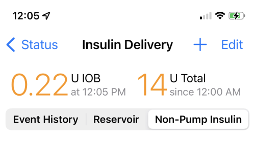

# Loop 3 Displays

This page has detailed information about Loop 3 Displays.

If you are running Loop v2.2.x, follow this link: [Loop v2.2.x Displays](../operation/loop-settings/displays.md).

## Main Loop Screen

The main Loop screen contains a Heads-Up Display ([HUD](#heads-up-display)) at the top (when in portrait mode) with various charts in the middle and a toolbar at the bottom.

{width="450"}
{align="center"}

#### Landscape

When the device is in landscape mode, the HUD is no longer visible, but the chart history is increased.  In landscape, each chart displays the last 8 hours of history along with the next 6 hours of glucose prediction. The toolbar is always visible while the chart display can be scrolled up and down to view charts of interest.

## Heads-Up Display

The Heads-Up Display (HUD) shows 3 icons:

* Left: [Glucose status](#glucose-status-icon)
* Middle: [Loop status](#loop-status-icon)
* Right: [Pump status](#pump-status-icon)

There is a `Status Row` underneath those three icons that is used to display bolus progress, some alerts and important messages. The `Status Row` is also a button that performs an action depending on the message.  These are described in the table in the [HUD Status Row](#hud-status-row) section. The `Status Row` is only visible in portrait mode, so make sure to orient your device to look for these messages.

## Charts

There are several charts on the main screen to help you navigate and understand Loop.  Tapping on a chart on your phone opens up additional information.

### Glucose Chart

{width="400"}
{align="center"}

The Glucose Chart displays glucose values in your preferred units.

!!! info "mg/dL or mmol/L"
    If your preferred glucose unit is not selected, follow these instructions to change [Glucose Units](onboarding.md#glucose-units).

The vertical scale is automatically adjusted by Loop to be as useful as possible while including the highest and lowest readings in the chart.

The horizontal axis is set to go forward from the current time through your DIA (insulin duration), so you can see what Loop thinks glucose will be eventually. It then goes back in time as far as there is room, based upon the width in pixels of your screen. Note, if you turn your device to landscape mode you will have more screen real estate and thus will be able to see further back in time.

The glucose [Correction Range](therapy-settings.md#correction-range) is shown as a blue bar on the glucose chart.  Single-value ranges (such as 100-100 mg/dL), will have a narrower blue bar.  When a temporary override range is enabled, a darker blue bar indicates the correction range during that override.

!!! warning "Negative Glucose Predition"
    If you have a crazy negative glucose prediction - it is likely that you set an [Override](../operation/features/workout.md) with a tiny sensitivity.

    * Do not panic - this is a prediction only; not reality.

    Best approach:

    * Open the loop until the prediction settles down.
    * In future, do not choose a tiny sensitivity to force less insulin
        * Increase the correction range in your override with a moderate change in sensitivity (50% to 90%)
        * Loop will reduce your basal rate at the next cycle (within 5 minutes)
        * Be cautious adding carbs during an override - make sure you understand the effects first

If you tap on the Glucose Chart itself, it will open the Predicted Glucose chart described below.

#### Predicted Glucose Chart

The predicted glucose view is a great way to gain insight into the various components’ importance in Loop’s prediction of eventual glucose.

{width="300"}
{align="center"}

The graph at the top of this view will match your Glucose Chart. Below this chart you will see an explanation of the variables Loop takes into account in predicting your future glucose value:  Carbohydrates, Insulin, Glucose Momentum and Retrospective Correction. You can tap on any of the entries to see the effects of that component by looking at the dashed lines.

!!! note "Display Only"
    These elements are not turned on and off in the Loop predictions. They just modify the graph so you can view the relative effects.

### Active Insulin Chart

{width="400"}
{align="center"}

The Active Insulin chart displays the total insulin contribution from both temp basals and boluses.  Active IOB can be either positive or negative.  Negative IOB results from the suspension of normally scheduled basals.  The active insulin displayed in the upper right corner of the chart does NOT include insulin contributions from a recently enacted temp basal or bolus until the (for Medtronic) pump’s reservoir volume is read and confirms a drop in reservoir volume (confirming the insulin has actually been delivered). The opposite is true for Omnipods. If a message is sent from Loop, it assumes the pod got the message and enacted it - even if the acknowledgement is not received.  Later, when communication is restored, if a command was not enacted by the pod, the Event History is updated.

**Medtronic Only**: So long as you have Event History as the Preferred Data Source in Loop settings, primed insulin deliveries (e.g., cannula fills or manual primes) will not be counted towards IOB.

### Insulin Delivery Chart

{width="400"}
{align="center"}

The Insulin Delivery chart displays a history of the temp basals enacted by Loop.  The display is relative to the scheduled basal rates entered in the Loop settings.  So, a rate displayed in this chart as `+0 units` would indicate no temp basal was set, and Loop defaulted to the scheduled basal rate.  Individual boluses are indicated by an orange triangle on the chart (shown in the graphic above, near the left-most time).  The total insulin delivered since midnight, including all basals and boluses **AND (Medtronic Only) priming insulin**, is given in the upper right corner of the graph.

Please note that for safety reasons, Loop will assume a bolus was successful, even if it is not sure that the pump responded as expected.  Once the communications with the pump settle down, Loop will (almost always) be able to reconcile whether a dose went through as expected. Occasionally, the bolus may be temporarily rendered (drawn) as a very high temp basal rate vs. a (triangle) discrete bolus event.  This does NOT mean that the Loop actually enacted a high temp basal rate...only that the bolus is being **drawn** on the chart as the equivalent of a high temp basal rate.

### Event History, Reservoir and Non-Pump Insulin

Clicking on either the Active Insulin or Insulin Delivery charts will open your Insulin Delivery history.  The top of the screen will display the current IOB and the total insulin delivered for the day since midnight (or since the time the loop became active if you started Loop after midnight). There are three tabs that can be viewed, with Event History shown by default:

{width="250"}
{align="center"}

* **Event History**: Event history is a detailed accounting of all pump/pod actions. Both Medtronic and Omnipod users will have a detailed record of event history. If you tap on an event, you get more detail. Turn your phone to landscape to improve readability.

* **Reservoir**:

    - **Omnipod** users should not worry if the reservoir display is blank. Pods do not report or track insulin remaining until their reservoirs get below 50 units remaining. When a pod is deactivated, the reservoir history for that pod is no longer displayed.
    - **Medtronic** users will have reservoir history displayed in 5-minute increments, unless Loop has been having communication issues.

* **Non-Pump Insulin**: The user can enter insulin taken by another method such as inhaled or by injection. The user can choose a different insulin type than used by the pump. This is explained further at this [link](features.md#non-pump-insulin).

!!! abstract "Previous Pod Insulin History"
    For those who want to delete some recorded insulin near the end of a pod because the site was not absorbing properly, this can be done in Apple Health.

    Before attempting that modification, please read this entire section on [How does Loop use Apple HealthKit](../faqs/algorithm-faqs.md#how-does-loop-use-apple-healthkit) in detail.

    Pay special attention to [Insulin and Apple HealthKit](../faqs/algorithm-faqs.md#insulin-and-apple-healthkit) section.

### Active Carbohydrates Chart

{width="400"}
{align="center"}

The Carbohydrate chart displays the carbs used by Loop to predict glucose changes.  The active COB is displayed in the upper right corner of the chart.  Clicking on the chart will open the Carb Entries history and you can edit/delete any previous entries through that screen.  Please read the [Meal Entry](../operation/features/carbs.md) page for more information about entering and editing carb entries.

#### ICE Chart

{width="300"}
{align="center"}

Click this link for even more details about [Insulin Counteraction Effects](../operation/features/ice.md). It's a good idea to read both the Meal Entry and ICE pages - this is an important concept.

## Toolbar

{width="400"}
{align="center"}

The toolbar is always found at the bottom of the main Loop screen in both portrait and landscape orientation. By tapping on one of these icons, you can begin a Meal Entry, start a Pre-Meal Range, initiate a Manual Bolus, select an Override or go to the Loop Settings screen.

From left to right, the icons are:

* **Meal Entry**- click on this icon to enter meals. Detailed info regarding how to enter, save, and edit meal entries can be found in the [Meal Entry](../operation/features/carbs.md) page.
    * _For those used to entering carbs on a Medtronic pump or coming from non-Loop DIY systems, Loop will not read carb entries from a Medtronic pump or Nightscout, so you must use the meal entry tool._

* **Pre-Meal Range** - click on this icon to start the [Pre-Meal Range](../operation/features/premeal.md) for one hour or until carbs are entered. (plate symbol turns dark green when active)

* **Bolus** - click on this icon to open the [Bolus](../operation/features/bolus.md) tool.

* **Overrides** - click on this icon to select a saved or custom [Override](../operation/features/workout.md) or to cancel an override if one is active (heart symbol turns dark blue when active)

* **Loop Settings** - click on this icon to make changes to any of your [Loop settings](settings.md).

## HUD Details

!!! abstract "Very Detailed Section"
    This section is packed with an incredible amount of detail. Remember it exists and come back when you need a reference to Loop 3 icons and messages.

    If you are a new looper your eyes may glaze over the first time through. Don't worry. But do come back and read this section again after you've used the system in Open Loop mode (before you enable Closed Loop mode). And then come back again after a day or so of closed loop testing.

    Experienced loopers need to read the detail on this page. There are important changes from Loop 2.2.x.

The Heads-Up-Display, visible in portrait mode, shows the Glucose Status on the left, the Loop Status in the middle and the Pump Status on the right. Once a CGM and pump have been added to Loop, the Loop Status icon will update and ideally be similar to the graphic below.

{width="300"}
{align="center"}

* The Glucose is displayed in the same units as the selected CGM
    * If units are incorrect, quit Loop, allow your CGM app to update and then restart Loop
    * You can override the display units, later, by selecting the [units in Apple Health](../faqs/apple-health-faqs.md#how-do-i-change-glucose-units)
* The green Loop icon indicates that within the last 5 minutes Loop completed a [cycle](#loop-cycle)
* The Pump Status indicates the scheduled basal rate is running
    * The +0.0 U display means the basal currently running is 0 U/hr different from the scheduled basal

### Loop Status Icon

The Loop Status Icon is the colored circle in the center of the main Loop display.  The three colors displayed are Green, Yellow or Red.  In all cases, more information is displayed by tapping on the Loop Status Icon, which brings up a modal message indicating the last time a loop cycle completed and other descriptive text.

#### Loop Cycle

A complete Loop cycle, at high level, includes these steps:

* Current Glucose is updated
* Glucose prediction is calculated along with any recommended change to insulin delivery to maintain future glucose above safety threshold and within correction range
* Messages are sent to the pump to modify insulin delivery if required and request current pump status
* Pump acknowledges the loop messages

This table shows examples of Loop Status Icons and what each icon means.

| 

 Icon | Meaning |
|---|---|
|{width="175"}|A green circle indicates the app is in Closed Loop mode and it completed a [cycle](#loop-cycle) within the last 5 minutes.|
|{width="175"}|A yellow circle indicates the app is in Closed Loop mode and it has completed a cycle in the last 5-15 minutes.  It is not unusual to have a few instances of yellow loops per day.  They can be caused by being out of range (physically), Bluetooth or RileyLink “noise” interference, or even that the pump was giving a bolus.  Most yellow loops will self-resolve without needing any special troubleshooting.|
|{width="175"}|A red circle indicates the Loop has not completed in over 15 minutes.  This is not a typical state, and you should [troubleshoot](../troubleshooting/yellow-red-loop.md) the problem.  In this case, either the [Glucose Icon](#glucose-status-icon) or the [Pump Icon](#pump-status-icon) or both will display an `alert` graphic.|
|{width="175"}|When the circle is open at the top, Loop is operating in “open-loop” mode. The color code is the same as for closed loop except the cycle involves updating predictions from available blood glucose values and obtaining pump status; but the app will not make any automated changes in insulin delivery.  While Manual Temp Basal (MTB) is active, the Open Loop icon will be displayed until MTB expires or is cancelled. _Note that MTB is only implemented in Loop 3 for Omnipod and Omnipod DASH, at the current time._|

!!! info "Fun Fact"
    The loop status icon will pulse slightly when Loop is communicating with the pump.  The pulsing will stop when the communication has completed (green loop) or given up (yellow or red loop).

### Glucose Status Icon

The table below shows examples of the Glucose Status Icon and what each icon means. The [Glucose Color Code](#glucose-color-code) is provided below the table.

| 

 Icon | Meaning |
|---|---|
|{width="175"}|The current glucose reading is displayed. It can be from the CGM or from a finger stick. The value must have been updated within the last 15 minutes to be displayed.  For the example shown, a valid trend arrow is available and is blue. Color codes are explained at this [link](#glucose-color-code).|
|{width="175"}|The last glucose reading from the CGM or from a finger stick is stale, i.e., it was acquired more than 15 minutes ago. In this case, the glucose prediction will stop updating.  The [HUD Status Row](#hud-status-row) message enables user to enter fingerstick glucose value if desired.  If in closed-loop mode, no changes will be made to insulin delivery. If a temporary basal is running, it continues running for the scheduled duration. Once the temporary basal expires, the pump resumes the scheduled basal rate.  When the app issues a temporary basal, the duration is always 30 minutes.  The user can enter a manual temporary basal duration up to the limits of their pump.|
|{width="175"}|If no CGM is currently selected, the Add CGM icon is displayed. The user can add a CGM following these [instructions](add-cgm.md).|
|{width="175"}|If no CGM is currently selected, but a glucose value was acquired within the last 15 minutes (from fingerstick or a different CGM), that value is displayed along with a plus sign. By tapping on the icon, the user can add a CGM following these [instructions](add-cgm.md).|

#### Glucose Color Code

|  Glucose Range |  Glucose Value Color | Trend Arrow Color |
|---|---|---|
|55 mg/dL (3.0 mmol/L) or below|**red** regardless of background color|**red**|
|56 to 79 mg/dL (3.1 and 4.4 mmol/L)|**black** (light mode) / **white** (dark mode)|**yellow**|
|80 to 199 mg/dL (4.4 to 11.0 mmol/L)|**black** (light mode) / **white** (dark mode)|**blue**|
|200 mg/dL (11.1 mmol/L) or above|**black** (light mode) / **white** (dark mode)|**yellow**|

#### CGM Display

Tapping on the CGM icon in the HUD shows more information about the last CGM reading.

For Dexcom G5/G6 and Share, the same screen is obtained by tapping on Loop Settings->CGM.

For Nightscout Remote CGM, the Nightscout URL is opened when tapping on the CGM icon in the HUD, while the credential sections is shown when tapping on Loop Settings->CGM.

The graphic below shows the result of tapping on the CGM icon when using a Dexcom G6.  It includes the time of the last reading to the nearest second, along with other information about that sensor and transmitter. It also has an option to go to the Dexcom app on the same device.

{width="250"}
{align="center"}

### Pump Status Icon

The nominal pump icon displays high-level status information for the pump with two main components: left side is the basal delivery status and right side is the reservoir status. For Pods, a lifecycle line is displayed underneath the pump icon during the last 24 hours of nominal pod life.

* The basal delivery status displays the enacted temp basal change relative to the scheduled basal.  For example, for a scheduled basal of 0.45 U/hr
    * If Loop sets a temp basal rate of 0.2 U/hr, the icon displays -0.25 U
    * If Loop sets a temp basal rate of 1.5 U/hr, the icon displays +1.05 U
    * When scheduled basal is running, the icon displays +0.0 U
* But what about [Overrides](../operation/features/workout.md)?
    * Using scheduled basal of 0.45 U/hr with override set to 70%, the "override basal rate" is 0.315 U/hr
        * That is a value that cannot be set in the pump, but Loop uses it for IOB calculations
            * If Loop sets a temp basal rate of 0.2 U/hr, the icon displays -0.115 U
            * If Loop sets a temp basal rate of 1.5 U/hr, the icon displays +1.185 U
* The reservoir status indicates insulin remaining graphically and displays a value when less than 50 U remain.
    * For Medtronic Pumps, the reservoir display indicates the level graphically.
    * For Pods, the reservoir graphic is constant until the pod begins to report reservoir level when less than 50 U remain.

The table below shows examples for a few nominal Pump Status Icons and Alert messages that might be shown.  In all cases, tapping on the Pump Status Icon opens the Pump Settings screen with more information.

| 

 Icon | Meaning |
|---|---|
|{width="175"}|This nominal pump status graphic is for a Pod with temp basal less than scheduled basal rate and no reported reservoir level.|
|{width="175"}|This nominal pump status graphic is for a Medtronic pump running scheduled basal rate and with a half-full reservoir.|
|{width="175"}|This nominal pump status graphic is for a pump running a high temp basal rate with the reservoir level reported.   When the reservoir level is above the notification level, the reservoir graphic is orange.|
|{width="175"}|This pump status graphic indicates 2 alerts: (1) the 15 U reservoir level is less than the notification level of 20 U selected by this user and (2) a small clock icon is added to the display to indicate the phone time zone and pump time zone do not match.   When the reservoir level is below the notification level, the reservoir graphic is yellow.  Follow the link for [time zone](#time-zone) information.|
|{width="175"}|This alert message indicates the reservoir reports 0 U. Although  pumps will continue to deliver some insulin after this point (max of 4 U for pods, or until all insulin is gone for both pods and Medtronic), the user should be aware that insulin delivery could stop at any moment.  Note that if you see a display of 0 U in yellow, that means there is 0.5 U or less reported by the pump.|
|{width="175"}|This alert message indicates no pod is currently paired so no insulin is being delivered.  Tap on the icon to reach the pod setting screen and pair a new pod, or switch to a different source for providing insulin.|
|{width="175"}|This alert message indicates all insulin delivery has been suspended.   A [Status Row](#hud-status-row) message appears to enable the user to resume delivery with one tap.   Alternatively, insulin can be resumed by tapping on the Pump Icon to enter the Pump Setting display and resume from that screen.|
|{width="175"}|This alert message indicates the user has initiated a manual temp basal (MTB). While the MTB is active, the Loop Icon Status will also display an Open Loop symbol to indicate no automatic adjustments are made until MTB expires or is canceled.   The lifecycle indicator across the bottom of the pod status indicates a pod within the final 24 hours of nominal life.  Tapping on the icon takes the user to the pump settings display where the rate and duration of the MTB are displayed.|
|{width="175"}|This alert message indicates it has been more than 15 minutes since the app was able to communicate with the pump.  Follow these [troubleshooting](../troubleshooting/yellow-red-loop.md) steps.|
|{width="175"}|This alert message indicates no pump has been added.   Follow the instruction for [adding a pump](add-pump.md#add-pump).|

### Time Zone

Loop allows your pump to have a different time zone from your phone.

* For Medtronic - the pump time shows on the pump display
    * Always use Loop to set your pump time
* For Omnipod Common - there isn't a clock on pods, but Loop has a concept of "pump" time for that pod

Your daily schedule for basal rates, correction ranges, insulin sensitivity factors and carb ratios is displayed with respect to midnight on "pump time". When you first [Add Pump](add-pump.md#add-pump) to Loop, the pump and phone are in the same time zone, but it's important to understand what happens when the time zone changes on the phone.

* The scheduled rates for basal, correction range, ISF and CR follow  the pump time
    * This is true even when your phone updates because of a new time zones (travel) or because of daylight savings (summer) time
    * This is true across pod changes

* To change the pump time zone to match your phone, select the Pump Settings display
    * An active row is available when phone and pump time zones are different
    * Touch the active row to update the pump time zone to phone time zone
        - Medtronic: Loop sets the pump time to the current phone time
        - Omnipod Common: Loop sends your scheduled basal rates to your pod based on phone time
        - Make sure your gear is close together (phone, pump and, if needed, RileyLink)

The display to modify time zone is slightly different for Loop 2.2.x and Loop 3 (links below):

* [Loop 3 Omnipod](omnipod.md#pump-time)
* [Loop 3 Medtronic](../operation/loop-settings/pump-commands.md#change-time-zone)
* [Loop 2.2.x](../operation/loop-settings/pump-commands.md#change-time-zone)

You can choose to leave the pump and phone time zones different; the pump icon on the HUD (Loop 3 only) will show the clock icon to remind you. Many people do this for short trips.

### Other Time Changes

What about other time changes?  Suppose the iOS -> General -> Time & Date is modified to manually change the time, but the time zone is not adjusted. (Sometimes this is done to defeat limits on games. **Do Not** do this on a Looping phone.  If you have an "old" glucose reading in the "future" - Loop will not predict correctly which may have dangerous consequences.) There will not be an obvious display in the HUD or Omnipod screen (which keys off time zone) but you will get regular warnings that phone does not have automatic time set.

Loop 3 will display this warning modal screen if it detects a problem with the Phone time. It leaves it up the user to decide what action should be taken. To make this warning stop, go to iOS -> General -> Time & Date and enable Set Automatically. 

{width="300"}
{align="center"}

### HUD Status Row

The Status Row is located immediately below the CGM, Loop and Pump Icons and is used to provide status, action buttons and information. The messages in the table are in order of priority. For example, a `No Recent Glucose` message is displayed even when an `Override` is active.

!!! warning "Bolus In Progress"
    The bolus messages are displayed with the highest priority:

    * If another message is shown when a bolus starts, the bolus message is displayed instead
    * To return to the other message, such as Override or `No Recent Glucose`, you must either wait for the bolus to complete or cancel the bolus by tapping on the `Status Row`
    * To ensure you do not accidentally cancel a bolus, keep the phone locked when not in use

| Status Row / Meaning |
|---|
|{width="350"}|
|When the user issues a manual bolus through the app, a `Starting Bolus` information message is displayed. Tapping on this message has no action.  As soon as the app issues a command to the pump (or sends it to the RileyLink to be delivered to the pump), the bolus in progress message appears.|
|  {width="350"}|
|As soon as a bolus is started, from either a manual command or an automatic bolus, the bolus in progress message is displayed. Tapping on the `Status Row` causes the app to attempt to cancel the bolus. The app can only cancel a bolus if communication is active between the app and the pump.  The message says `Bolused `**value**` of `**total**` U`. The **value** is based on a timer, so it is possible for an occlusion or other fault to occur while the app indicates bolus is in progress.  In case of a fault, the user can tap on the pump icon to force a new pump status reading. For the case of pods, this allows you to  silence a screaming pod quickly. Once the app communicates with the pump, the actual delivery status will be updated.|
|  {width="350"}|
|If the user taps on the bolus in progress message in the `Status Row`, the message changes to Canceling Bolus. Tapping on this message has no action.|
|  {width="350"}|
|As soon the app determines that the pump is suspended, the `Insulin Suspended, Tap to Resume` message is displayed. Tapping on the `Status Row` resumes scheduled basal delivery if communication is active between the app and the pump.  Medtronic pump users who suspend directly on the pump will notice a delay before this message is displayed. It is best to use the app Pump Settings screen to suspend the pump.|
|  {width="350"}|
|If a higher priority message is not displayed in the `Status Row` and the glucose value is stale (more than 15 minutes old), the `No Recent Glucose, Tap to Add` message is displayed. Tapping on the `Status Row` opens the [Manual Bolus](features.md#manual-bolus) screen for entry of a Fingerstick Glucose.   Note that if you choose not to accept a recommended bolus on this screen but you want to save the Fingerstick value, you need to tap the Bolus line to force it to 0 U and then tap `Save Without Bolusing`. However, be aware that, in Closed Loop mode, the app will use that glucose value for the next 15 minutes and may adjust insulin delivery accordingly.|
|  {width="350"}|
|If a higher priority message is not displayed in the `Status Row` and an override is active, the override symbol and name, along with the time at which the override expires, is displayed.   Tapping on the `Status Row` opens the screen for that particular override to enable the user to edit the override. Note that any changes made to that override are applied just to the current session. If you want the override permanently modified, refer to the [Overrides](../operation/features/workout.md) instructions.|
|  {width="350"}|
|If a higher priority message is not displayed in the `Status Row` and the Pre-Meal Range is active in the toolbar, the `Pre-meal Preset, until time stamp` is displayed. Tapping on the status row has no effect for this message.  **New with Loop 3:** The Pre-Meal Preset can be engaged with an Override. When both are active, the Pre-Meal Range supersedes the range of the active Override, but the other settings for that Override still apply. When both are active, the `Status Row` message reflects the Override with both the PreMeal and Override icons in the toolbar highlighted.|
