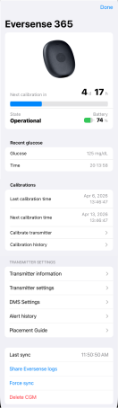
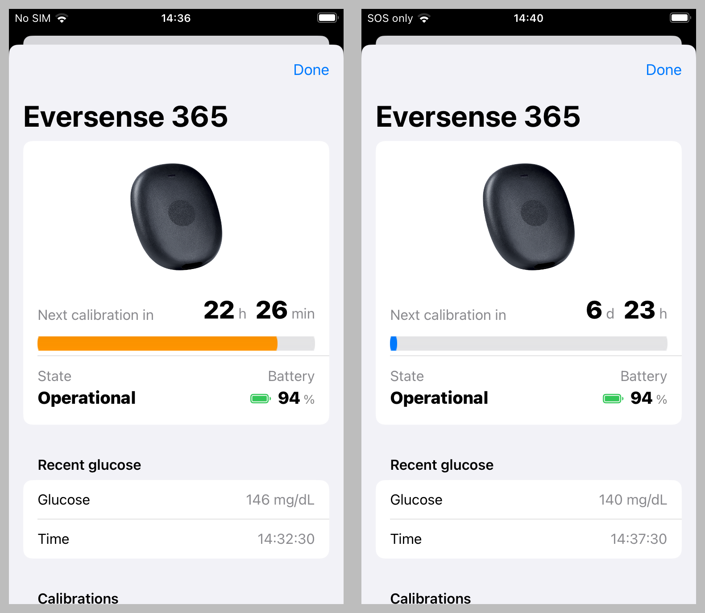

!!! warning "🚧 Documentation Under Construction 🚧"
    
    This page is under development.

    The addition of the Eversense CGM to iOS Open-Source Automated Insulin Delivery systems is new.
    
    Please review the [EversenseKit Issues](https://github.com/bastiaanv/EversenseKit/issues) page for open issues reported for the EversenseKit CGM Manager.

## Testing Eversense with the *Loop* App

* The branch needed to get Eversense in *Loop* is: `feat/eversense`
    * This branch is subject to rapid updates
    * This branch provides support for Dana and Medtrum along with the Eversense CGM

* Please refer to the [zulipchat Loop-dev development channel](https://loop.zulipchat.com/#narrow/channel/144182-development/topic/Loop-dev.20Status/with/515372445) before building this branch.

## Eversense 365 Screen

The user interface for the 365 sensor is shown below.
 
{width="300"}
{align="center"}

## Calibration and Battery Indicators

* Once stabilized, the Eversense Transmitter requires weekly calibrations
    * The Eversense will stop reporting glucose readings if the required calibration is more than 24 hours late
* The Eversense Transmitter requires charging every 2 to 3 days

The calibration status and battery level is highlighted at the top of the Eversense screen.

 
{width="600"}
{align="center"}

* The left screenshot shows an orange line indicating a calibration is due in less than 24 hours
* The right screenshot is after calibration

## *Loop* Main Screen

When calibration required is within 24 hours, the orange line is echoed on the top of the *Loop* main screen under the CGM icon to serve as a reminder to calibrate soon.

Once the calibration is due, there is a 24-hour grace period before transmitter stops reporting glucose values. During that time, the "Next calibration in" line is red. This red line is also echoed on the top of the *Loop* main screen under the CGM icon.

As usual for calibrating a CGM, choose a time when glucose is stable to measure glucose with a finger-stick and enter the value into the user interface. The calibration takes 15 minutes to process.