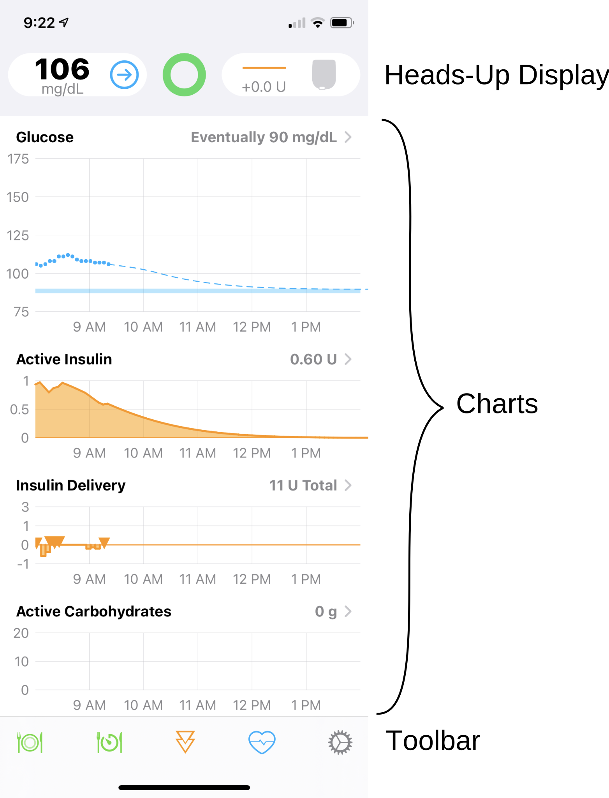
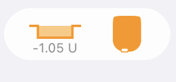
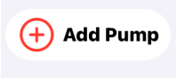

# Loop 3 Displays

This LoopDocs page is for Loop 3.

For Loop v2.2.x, follow this link: [Loop v2.2.x Displays](../operation/loop-settings/displays.md).

## Main Loop Screen

The main Loop screen contains a Heads-Up Display ([HUD](#heads-up-display)) at the top (when in portrait mode) with various charts in the middle and a toolbar at the bottom.

{width="450"}
{align="center"}

#### Landscape

When the device is in landscape mode, the HUD is no longer visible, but the chart history is increased.  In landscape, each chart displays the last 8 hours of history along with the next 6 hours of glucose prediction. The toolbar is always visible while the chart display can be scrolled up and down to view charts of interest.

## Heads-Up Display

The Heads-Up Display (HUD) shows 3 icons:

* Left: [Glucose status](#glucose-status-icon)
* Middle: [Loop status](#loop-status-icon)
* Right: [Pump status](#pump-status-icon)

There is a `Status Row` underneath those three icons that is used to display bolus progress, some alerts and important messages. The `Status Row` is also a button that performs an action depending on the message.  These are described in the table in the [HUD Status Row](#hud-status-row) section. The `Status Row` is only visible in portrait mode, so make sure to orient your device to look for these messages.

## Charts

The Loop charts are described in the Loop v2.2.x part of LoopDocs: [Charts](../operation/loop-settings/displays.md#charts).

But before you head over to that link, the `Insulin Delivery` screen, reached by tapping on either of the `Insulin` charts on the home screen, has been revised to include a new `Non-Pump Insulin` feature described at this [link](loop-3-features.md#non-pump-insulin).

!!! note "Documentation Update Needed"
    The documentation for the `Insulin Delivery` screen needs a more complete update - the behavior when a pod is changed is different with Loop 3 compared to Loop v2.2.x. As soon as a pod is deactivated, the delivery from that pod is no longer displayed on the `Event History` or `Reservoir` tab.
    
    This is true for both Eros and DASH pods. It is true, as well, if you change from one Medtronic pump to another.
    
    For those who want to delete some recorded insulin near the end of a pod because the site was not absorbing properly, this must now been done in Apple Health.

## Toolbar

The Loop toolbar is similar to Loop 2.2.x although there are some details that differ, as discussed in [Loop 3 Features](loop-3-features.md).

Loop Settings are shown when tapping on the gear icon. The Loop 3 Settings display is substantially different than for Loop 2.2.x.  Refer to the [Loop 3 Settings](loop-3-settings.md) page.

## Loop Widget on Lock Screen

Loop has a widget which can be added to the lock screen. The example graphic below shows the Dexcom G6 widget above the Loop 3 widget.

!!! info "Widgets"
    If you have never set up an iOS widget, please do an internet search, such as "Add widget to your iOS 15 Home Screen" for instructions.

{width="300"}
{align="center"}

## HUD Details

!!! abstract "Very Detailed Section"
    This section is packed with an incredible amount of detail. Remember it exists and come back when you need a reference to Loop 3 icons and messages.

    If you are a new looper your eyes may glaze over the first time through. Don't worry. But do come back and read this section again after you've used the system in Open Loop mode (before you enable Closed Loop mode). And then come back again after a day or so of closed loop testing.

    Experienced loopers need to read the detail on this page. There are important changes from Loop 2.2.x.

The Heads-Up-Display, visible in portrait mode, shows the Glucose Status on the left, the Loop Status in the middle and the Pump Status on the right. Once a CGM and pump have been added to Loop, the Loop Status icon will update and ideally be similar to the graphic below.

{width="300"}
{align="center"}

* The Glucose is displayed in the same units as the selected CGM
    * If units are incorrect, quit Loop, allow your CGM app to update and then restart Loop
* The green Loop icon indicates that within the last 5 minutes Loop completed a [cycle](#loop-cycle)
* The Pump Status indicates the scheduled basal rate is running
    * The 0.0 U display means the basal currently running is 0 U/hr different from the scheduled basal

### Loop Status Icon

The Loop Status Icon is the colored circle in the center of the main Loop display.  The three colors displayed are Green, Yellow or Red.  In all cases, more information is displayed by tapping on the Loop Status Icon, which brings up a [modal](onboarding.md#what-does-modal-mean) message indicating the last time a loop cycle completed and other descriptive text.

#### Loop Cycle

A complete Loop cycle, at high level, includes these steps:

* Current Glucose is updated
* Glucose prediction is calculated along with any recommended change to insulin delivery to maintain future glucose above safety threshold and within correction range
* Messages are sent to the pump to modify insulin delivery if required and request current pump status
* Pump acknowledges the loop messages

This table shows examples of Loop Status Icons and what the icon means. 

| 

 Icon | Meaning |
|---|---|
|{width="175"}|A green circle indicates the app is in Closed Loop mode and it completed a [cycle](#loop-cycle) within the last 5 minutes.|
|{width="175"}|A yellow circle indicates the app is in Closed Loop mode and it has completed a cycle in the last 5-15 minutes.  It is not unusual to have a few instances of yellow loops per day.  They can be caused by being out of range (physically), Bluetooth or RileyLink “noise” interference, or even that the pump was giving a bolus.  Most yellow loops will self-resolve without needing any special troubleshooting.|
|{width="175"}|A red circle indicates the Loop has not completed in over 15 minutes.  This is not a typical state, and you should [troubleshoot](../troubleshooting/yellow-red-loop.md) the problem.  In this case, either the [Glucose Icon](#glucose-status-icon) or the [Pump Icon](#pump-status-icon) or both will display an `alert` graphic.|
|{width="175"}|When the circle is open at the top, Loop is operating in “open-loop” mode. The color code is the same as for closed loop except the cycle involves updating predictions from available blood glucose values and obtaining pump status; but the app will not make any automated changes in insulin delivery.  While Manual Temp Basal (MTB) is active, the Open Loop icon will be displayed until MTB expires or is cancelled. _Note that MTB is only implemented in Loop 3 for DASH, at the current time._|

!!! info "Fun Fact"
    The loop status icon will pulse slightly when Loop is communicating with the pump.  The pulsing will stop when the communication has completed (green loop) or given up (yellow or red loop).

### Glucose Status Icon

The table below shows examples of the Glucose Status Icon and what the icon means. The [Glucose Color Code](#glucose-color-code) is provided below the table.

| 

 Icon | Meaning |
|---|---|
|{width="175"}|The current glucose reading is displayed. It can be from the CGM or from a finger stick. The value must have been updated within the last 15 minutes to be displayed.  For the example shown, a valid trend arrow is available and is blue. Color codes are explained at this [link](#glucose-color-code).|
|{width="175"}|The last glucose reading from the CGM or from a finger stick is stale, i.e., it was acquired more than 15 minutes ago.  In this case, the glucose prediction will stop updating. If in closed-loop mode, no changes will be made to insulin delivery. If a temporary basal is running, it continues running for the scheduled duration. Once the temporary basal expires, the pump resumes the scheduled basal rate. (When the app issues a temporary basal, the duration is always 30 minutes.)  The [HUD Status Row](#hud-status-row) will display a message to enable user to provide fingerstick glucose values if desired.|
|{width="175"}|If no CGM is currently selected, the Add CGM icon is displayed. The user can add a CGM following these [instructions](loop-3-cgm.md).|
|{width="175"}|If no CGM is currently selected, but a glucose value was acquired within the last 15 minutes (from fingerstick or a different CGM), that value is displayed along with a plus sign. By tapping on the icon, the user can add a CGM following these [instructions](loop-3-cgm.md).|

#### Glucose Color Code

|  Glucose Range |  Glucose Value Color | Trend Arrow Color |
|---|---|---|
|55 mg/dL (3.0 mmol/L) or below|**red** regardless of background color|**red**|
|56 to 79 mg/dL (3.1 and 4.4 mmol/L)|**black** (light mode) / **white** (dark mode)|**yellow**|
|80 to 199 mg/dL (4.4 to 11.0 mmol/L)|**black** (light mode) / **white** (dark mode)|**blue**|
|200 mg/dL (11.1 mmol/L) or above|**black** (light mode) / **white** (dark mode)|**yellow**|

### Pump Status Icon

The nominal pump icon displays high-level status information for the pump with two main components: left side is the basal delivery status and right side is the reservoir status. (TO DO - find out if MDT battery shows and where). For Pods, a lifecycle line is displayed underneath the pump icon during the last 24 hours of nominal pod life.

* The basal delivery status displays the enacted temp basal change relative to the scheduled basal.  For example, for a scheduled basal of 1.0 U/hr
    * If the app set a temp basal rate of 0.2 U/hr, the icon displays -0.8 U
    * If the app set a temp basal rate of 1.5 U/hr, the icon displays +0.5 U
    * When scheduled basal is running, the icon displays 0.0 U
* The reservoir status indicates insulin remaining graphically and displays a value when less than 50 U remain.
    * For Medtronic Pumps, the reservoir display indicates the level graphically.
    * For Pods, the reservoir graphic is constant until the pod begins to report reservoir level when less than 50 U remain.

The table below shows examples for a few nominal Pump Status Icons and Alert messages that might be shown.  In all cases, tapping on the Pump Status Icon opens the Pump Settings screen with more information.

| 

 Icon | Meaning |
|---|---|
|{width="175"}|This nominal pump status graphic is for a Pod with temp basal less than scheduled basal rate and no reported reservoir level.|
|{width="175"}|This nominal pump status graphic is for a Medtronic pump running scheduled basal rate and with a half-full reservoir.|
|{width="175"}|This nominal pump status graphic is for a pump running a high temp basal rate with the reservoir level reported.   When the reservoir level is above the notification level, the reservoir graphic is orange.|
|{width="175"}|This pump status graphic indicates 2 alerts: (1) the 15 U reservoir level is less than the notification level of 20 U selected by this user and (2) a small clock icon is added to the display to indicate the phone time zone and pump time zone do not match.   When the reservoir level is below the notification level, the reservoir graphic is yellow.  Follow the link for [time zone](../operation/loop-settings/pump-commands.md#change-time-zone) information.|
|{width="175"}|This alert message indicates the reservoir reports 0 U. Although  pumps will continue to deliver some insulin after this point (max of 4 U for pods, or until all insulin is gone for both pods and Medtronic), the user should be aware that insulin delivery could stop at any moment.  Note that if you see a display of 0 U in yellow, that means there is 0.5 U or less reported by the pump.|
|{width="175"}|This alert message indicates no pod is currently paired so no insulin is being delivered.  Tap on the icon to reach the pod setting screen and pair a new pod, or switch to a different source for providing insulin.|
|{width="175"}|This alert message indicates all insulin delivery has been suspended.   A [Status Row](#hud-status-row) message appears to enable the user to resume delivery with one tap.   Alternatively, insulin can be resumed by tapping on the Pump Icon to enter the Pump Setting display and resume from that screen.|
|{width="175"}|This alert message indicates the user has initiated a manual temp basal (MTB). While the MTB is active, the Loop Icon Status will also display an Open Loop symbol to indicate no automatic adjustments are made until MTB expires or is canceled.   The lifecycle indicator across the bottom of the pod status indicates a pod within the final 24 hours of nominal life.  Tapping on the icon takes the user to the pump settings display where the rate and duration of the MTB are displayed.|
|{width="175"}|This alert message indicates it has been more than 15 minutes since the app was able to communicate with the pump.  Follow these [troubleshooting](../troubleshooting/yellow-red-loop.md) steps.|
|{width="175"}|This alert message indicates no pump has been added.   Follow the instruction for [adding a pump](loop-3-pump.md#add-pump).|

### HUD Status Row

The Status Row is located immediately below the CGM, Loop and Pump Icons and is used to provide status, action buttons and information. The messages in the table are in order of priority. For example, a `No Recent Glucose` message is displayed even when an `Override` is active.

!!! warning "Bolus In Progress"
    The bolus messages are displayed with the highest priority:
    
    * If another message is shown when a bolus starts, the bolus message is displayed instead
    * To return to the other message, such as Override or `No Recent Glucose`, you must either wait for the bolus to complete or cancel the bolus by tapping on the `Status Row`
    * To ensure you do not accidentally cancel a bolus, keep the phone locked when not in use

| Status Row / Meaning |
|---|
|{width="350"}|
|When the user issues a manual bolus through the app, a `Starting Bolus` information message is displayed. Tapping on this message has no action.  As soon as the app issues a command to the pump (or sends it to the RileyLink to be delivered to the pump), the bolus in progress message appears.|
|  {width="350"}|
|As soon as a bolus is started, from either a manual command or an automatic bolus, the bolus in progress message is displayed. Tapping on the `Status Row` causes the app to attempt to cancel the bolus. The app can only cancel a bolus if communication is active between the app and the pump.  The message says `Bolused `**value**` of `**total**` U`. The **value** is based on a timer, so it is possible for an occlusion or other fault to occur while the app indicates bolus is in progress.  In case of a fault, the user can tap on the pump icon to force a new pump status reading. For the case of pods, this allows you to  silence a screaming pod quickly. Once the app communicates with the pump, the actual delivery status will be updated.|
|  {width="350"}|
|If the user taps on the bolus in progress message in the `Status Row`, the message changes to Canceling Bolus. Tapping on this message has no action.|
|  {width="350"}|
|As soon the app determines that the pump is suspended, the `Insulin Suspended, Tap to Resume` message is displayed. Tapping on the `Status Row` resumes scheduled basal delivery if communication is active between the app and the pump.  Medtronic pump users who suspend directly on the pump will notice a delay before this message is displayed. It is best to use the app Pump Settings screen to suspend the pump.|
|  {width="350"}|
|If a higher priority message is not displayed in the `Status Row` and the glucose value is stale (more than 15 minutes old), the `No Recent Glucose, Tap to Add` message is displayed. Tapping on the `Status Row` opens the [Bolus](loop-3-features.md#manual-bolus-screen) screen for entry of a Fingerstick Glucose.   Note that if you choose not to accept a recommended bolus on this screen but you want to save the Fingerstick value, you need to tap the Bolus line to force it to 0 U and then tap `Save Without Bolusing`. However, be aware that, in Closed Loop mode, the app will use that glucose value for the next 15 minutes and may adjust insulin delivery accordingly.|
|  {width="350"}|
|If a higher priority message is not displayed in the `Status Row` and an override is active, the override symbol and name along with the time at which the override expires is displayed.   Tapping on the `Status Row` opens the screen for that particular override to enable the user to edit the override. Note that any changes made to that override are applied just to the current session. If you want the override permanently modified, refer to the [Overrides](../operation/features/workout.md) instructions.|
|  {width="350"}|
|If a higher priority message is not displayed in the `Status Row` and the Pre-Meal Target is active in the toolbar, the `Pre-meal Preset, until time stamp` is displayed. Tapping on the status row has no effect for this message.  The Pre-Meal Preset can be engaged with an Override. When both are active, the Pre-Meal target range supersedes the target range of the active Override, but the other settings for that Override still apply. When both are active, the `Status Row` message reflects the Override with both the PreMeal and Override icons in the toolbar highlighted.|

