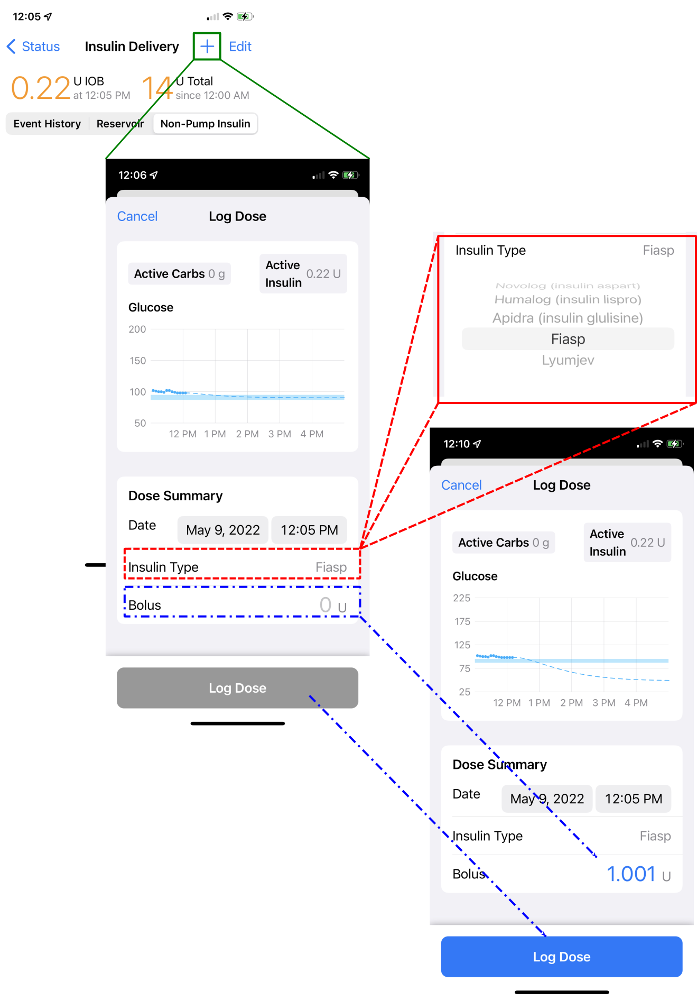
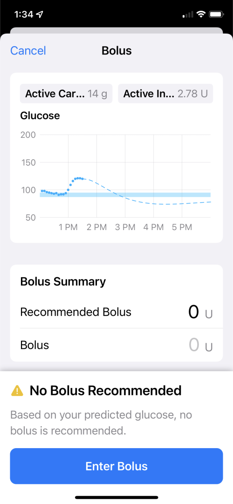

# Features

This page discusses updated versions of Loop features as well as new capabilities provided with Loop-dev.

!!! info "Loop-dev Displays"
    One thing you may notice on some screens is the primary button, with associated information message, is always visible at the bottom of even small screens.  You may need to scroll to see intermediate rows. 
    
    For example, if the default action on a bolus screen is to deliver the recommended bolus, that button is visible and active. The button remains fixed as other portions of the screen are scrolled up and down. When you make changes to selections, then the information displayed and the button label updates to reflect the action taken if you tap on the button.
    
    There are other screens, like the Onboarding and Therapy Settings screens, where you should read all the provided information.  Those screens require you to scroll to the bottom before being able to hit `Continue` or `Save`.

## Carb Data Source

Loop 3 does not read non-Loop carbohydrate entries from Apple Health, as previous versions did. It still writes to Apple Health. Some experienced loopers want to modify the code to enable Loop to read carbohydrate records from Apple Health with the full understanding of how that works. The instructions for this code customization option, using a flag set in the LoopConfigOverride.xcconfig file, will be added to the documentation later. For now search in zulipchat.

Users who build Loop-dev over Master, may find a permission switch to give Loop permission to read carb data from health, but without making the customization mentioned above, changing permission does not change the behavior of Loop.

## Non-Pump Insulin

If insulin is taken from a different source and the user wants to let Loop know, there is a new method in Loop-dev.

With Loop 2.2.x, the user manually entered the Insulin dose into the Apple Health app. Loop then imported that value.

With Loop-dev, the "old" method still works, but there is a new method for entering this information. This method enables the user to indicate the type of insulin so that the appropriate model is used by Loop. An updated `Glucose` prediction chart is displayed prior to saving the dose.

#### Enter non-pump insulin before carbs

!!! warning "WARNING"
    If you are planning to enter non-pump insulin to cover carbs and you do NOT want Loop to automatically start increasing insulin based on the carb entry, enter the non-pump insulin first and then add the carbs.
    
    To find out what Loop recommends, without actually dosing with Loop:
    
    * Wait for a CGM entry (or fingerstick) to appear in the HUD
        * Enter the carbs and continue to the bolus screen, i.e., do not save carbs
        * Note the recommended bolus, but do not actually bolus
        * Back up to the carb entry screen and `Cancel`
    * Go to the non-pump insulin screen and enter the bolus amount you've decided to take and select the model if a different from your pump
        * Don't forget to actually take the insulin
        * Add the carb entry and save carbs without bolusing

1. Tap on either of the insulin charts (Active Insulin or Insulin Delivery) on the home screen to display the `Insulin Delivery Screen`. This screen has 3 tabs.
    * **Event History** (default) is similar to Loop 2.2.x; however, the event history from a prior pod is not displayed once it is deactivated
    * **Reservoir** is similar to Loop 2.2.x; however, the reservoir value from a prior pod is not displayed once it is deactivated
    * **Non-Pump Insulin** is a new feature with Loop-dev

2. Select the `Non-Pump Insulin` tab to bring up the graphic shown below
    * Tap on the + sign (green solid lines)
    * `Log Dose` screen is displayed showing the current `Glucose` prediction
    * The default insulin type is that used by the pump
    * To modify Insulin Type, tap on that row (red dashed lines)
        * Picker wheel allows other insulin models to be selected
        * _At the current time, no model is in place for Afrezza (but you can customize your code to add it)_
    * Tap on the `Bolus` row (blue dash-dot lines) to bring up a keyboard
        * The `Glucose` prediction chart updates automatically based on the value entered in the Bolus row
        * Tip, add 0.001 to the actual dose to make it easier to see if reviewing in Apple Health
        * Once the user selects `Done` on the keyboard display, the entered value is displayed on the `Bolus` row and the `Log Dose` button changes from gray to blue
        * Tap on `Log Dose` to record or `Cancel` to quit

{width="500"}

## Bolus Entry

The bolus following carbs (`Meal Bolus`) and manual bolus (`Bolus`) screens are updated from Loop 2.2.x version. There is still a predicted `Glucose` chart that actively updates as the bolus value is updated and various buttons. 

* With Loop 2.2.x
    * The Recommended Bolus is provided but the default for the Bolus value is 0
    * If the user taps on the Recommended Bolus row, the recommended amount is transferred to the Bolus row
* With Loop-dev
    * The Recommended Bolus is provided AND the default for the Bolus is the recommended value
    * If the user taps on the Bolus row, the amount is modified to 0 and the keyboard is opened for entry

!!! info "Blue Means Active"
    * The blue color indicates an active button, whereas a grey button is inactive.
    * The value displayed on the `Bolus` row is blue to indicate if you tap on that, you can edit the value

### Meal Bolus Screen

When the `Meal Bolus` screen is entered following a carb entry or edit action, the active button might be `Save and Bolus` or, if no bolus was recommended, `Save without Bolusing`. The `Save` refers to saving the Carb entry or Carb edit that led to this screen in addition to saving the amount that might be bolused. It can also refer to saving a fingerstick value entered in the Meal Bolus screen.

Some people reported issues with the overlap between buttons and the keyboard for the `Meal Bolus` screen when choosing an option other than the default.

* There are several topic threads in zulipchat
* There may be an option added to allow you to save directly from the carb screen and skip the meal bolus screen for that case - but that is not yet available

#### Accept Recommendation

In the graphic below, the user enters carbs and taps continue to display the Meal Bolus screen.

* The left graphic shows a case where a bolus is recommended - tapping on the `Save and Deliver` button saves the carbs and delivers the bolus
* The right graphic shows a case where no bolus is recommended - tapping on the `Save without Bolusing` saves the carbs
* Note that these graphics are taken from a small phone - the left graphic shows all the information at once whereas the right graphic has an extra information message that requires the user to scroll to see the `Recommended Bolus` and `Bolus` rows
* For both graphics
    * Active Carbs and Active Insulin are displayed above the `Glucose` prediction graph - these are accurate at the time this screen is entered (before carbs or bolus are saved)
    * The Bolus Summary is presented below the `Glucose` prediction graph with three rows:
        * `Carb Entry`, the proposed carbs with the time to add the carbs and the absorption time displayed - to modify that information, tap on the `< Carb Entry` button at upper left
        * `Recommended Bolus` displays what Loop recommends for that proposed `Carb Entry`
        * `Bolus` default display is what Loop recommends, but user can edit that value

{width="900"}
{align="center"}

If a CGM entry arrives while in this screen, a **Bolus Recommendation Updated** [modal message](onboarding.md#what-does-modal-mean) will be displayed and must be acknowledged.

#### Modify Bolus

This section is a continuation of the information presented in the [Accept Recommendation](#accept-recommendation) portion of the `Meal Bolus` section. In the graphic below, the user overrides the recommended bolus.

* The left side shows a modified bolus less than the recommended bolus
* The right side shows a modified bolus greater than the recommended bolus
* Note that the `Glucose` prediction graph updates based off the `Bolus` value, giving the user the opportunity to accept or change their proposed value before tapping `Save and Deliver`
* At the next Loop cycle, the app modifies insulin delivery based on the saved information
    * For the example with bolus less than recommended amount:
        * Loop will **NOT** begin to automatically increase insulin delivery until the current glucose is above the bottom of the `Correction` range
        * The recommendation to add insulin when the current glucose is below the `Correction Range` is only offered as a manual feature and is limited to an amount predicted to maintain glucose above the `Safety Threshold`
    * For the example with bolus greater than recommended amount:
        * Loop will probably issue an automatic temp basal of 0 U/hr
        * This is a common "super-bolus" scenario; in other words, "borrow" basal for the meal bolus to limit post meal spikes
* Remember - the `Glucose` prediction is what happens if you `Save and Deliver` and then no further adjustments are made to insulin delivery by Loop

{width="900"}
{align="center"}

### Manual Bolus Screen

When the `Bolus` screen is entered directly from the toolbar, the button choices are `Enter Bolus` if none is recommended, `Deliver` if a value is on the `Bolus` row or `Cancel` using the button on the upper left. The user can also tap on the value on the `Bolus` row to bring up a keyboard to modify that amount. When doing that, the value is automatically set to zero.

There are other alert messages that might be displayed if the pump or CGM is not active.  Those are found on the [Loop 3 Displays](loop-3-displays.md) page.

The two graphics below are examples of manual bolus screens. 

* In the first graphic, no bolus was recommended
    * If you tap on the `Enter Bolus` button at the bottom, it brings up a screen to enable you to type in an amount and then `Deliver` it. 
    * Alternatively, you can tap the `0` amount in the `Bolus` row and perform the same action as the `Enter Bolus` button
    * If you do not want to override the recommendation, hit the `Cancel` button at upper left.

{width="350"}
{align="center"}

* In the second graphic, a recommended amount is shown
    * If you tap on `Deliver` that recommended dose is delivered
    * If you tap on the value on the `Bolus` row, you can override the amount
    * The amount displayed on the `Bolus` row is modified to 0 U with the first tap - at that point, you may enter a new value or tap `Cancel` using the button at upper left of the screen

{width="350"}
{align="center"}

## Remote Carb / Bolus

Loop-dev has a Remote Carb and Remote Bolus feature to enable remote caregivers to better assist the person who needs support managing with Loop.

The author of this feature wrote this [Remote Carb/Bolus Guide](https://docs.google.com/document/d/1wPpCljo9NuwllltjhImf7YZReIgqP9yF05PN7E6hphM) documentation. Please read carefully and use with the appropriate level of caution.

!!! warning "WARNING"

    You will be using this feature at  your own risk, like any other Loop code you build. It is very important you completely read and re-read the [Remote Carb/Bolus Guide](https://docs.google.com/document/d/1wPpCljo9NuwllltjhImf7YZReIgqP9yF05PN7E6hphM) before getting started. 
    
    There are validation and troubleshooting steps for each section of the guide. 
    
    Please make sure not to skip sections as this makes it difficult to troubleshoot.
    
    Be aware:
    
    * Apple limits how many push notifications (used by this feature) can be received on an iOS device
    * If the system feels too many are being sent, it may begin to throttle notifications
    * There is not a published limit, but consider limiting it to 1 per hour
    * When on cellular data, there may be further limitations to protect your data usage
 
