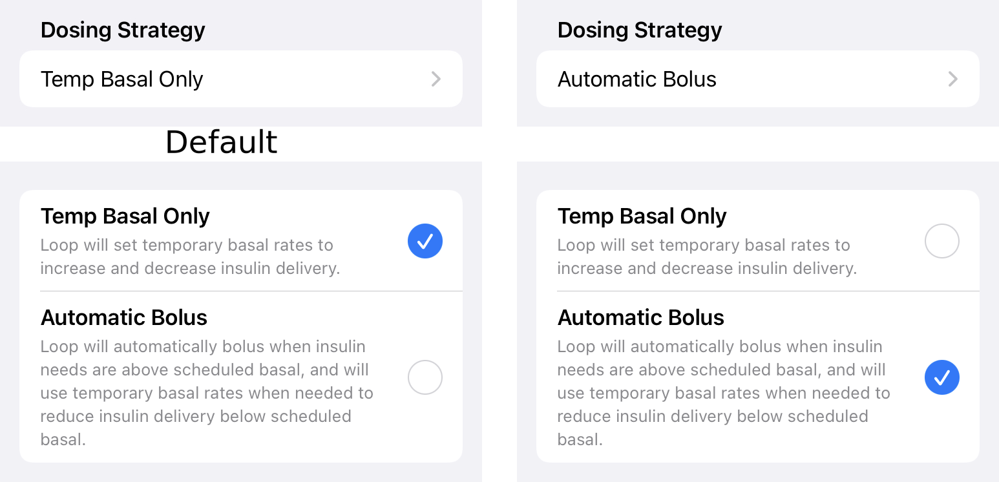

# Settings

The Settings screen, shown in the graphic below, is reached by tapping the gear icon in the [Toolbar](loop-3-displays.md#toolbar) on the app [home screen](loop-3-displays.md#main-loop-screen).

{width="250"}
{align="center"}

Each section and row on the Settings screen is described below.

## Closed Loop

The user can select closed loop or open loop using this slider. When you first start Loop, we encourage you to leave this slider disabled and become familiar with the app using [Open Loop](../operation/loop/open-loop.md) mode.

{width="500"}
{align="center"}

No automatic (closed loop) adjustment of insulin will occur and the slider will be disabled under the following conditions.

* No Pump added
* No CGM added
* User set a [Manual Temp Basal](loop-3-omnipod.md#manual-temp-basal)
* User suspended insulin delivery (planned - might not be in effect yet)

### Recommended Insulin

With every loop cycle - typically every 5 minutes - Loop updates the glucose prediction using

* CGM or Fingerstick glucose value (no older than 15 minutes)
* COB from meal entries
* IOB from previous insulin delivery
* Your [Therapy Settings](loop-3-therapy.md)

Based on this prediction, Loop calculates a recommended restriction in basal to raise the prediction to target range or a recommended bolus, subject to Delivery Limits, to lower the prediction to target range or allows current basal to continue. The glucose prediction is shown in the [Glucose Chart](loop-3-displays.md#charts) along with the measured glucose values.

* When in Open Loop, no automated action is taken.
* When in Closed Loop, automated action is taken based on the selected Dosing Strategy.

## Dosing Strategy

This row gives you the ability to select Dosing Strategy. The Dosing Strategy only affects the method by which the recommended bolus - if any - is delivered. The current selection is noted underneath the Dosing Strategy label. The default (initial) value for this setting is Temp Basal Only. Tap on the arrow to the right to modify your selection.

{width="500"}
{align="center"}

!!! quote "Words in Graphic"
    **Temp Basal Only:**
    Loop will set temporary basal rates to increase and decrease insulin delivery.
    
    **Automatic Bolus:**
    Loop will automatically bolus when insulin needs are above scheduled basal, and will use temporary basal rates when needed to reduce insulin delivery below scheduled basal.

Regardless of the Dosing Strategy selected, when glucose is below target or predicted to go below target, Loop decreases basal insulin using Temporary Basal.

**Temp Basal Only:** Subject to your Delivery Limits, Loop will deliver the Recommended Bolus over 30 minutes using positive temp basals (i.e., increase over your scheduled basal rate) to increase your IOB. 

**Automatic Bolus:** Subject to your Delivery Limits, you receive 40% of the Recommended Bolus at every loop cycle.

### Automatic Bolus

When you first start Loop, we encourage you to leave Dosing Strategy set to Temp Basal Only until you are sure your settings are dialed in.

The Automatic Bolus selection causes Loop to provide 40% of the recommended dose as a bolus at the beginning of each Loop cycle (when a CGM reading comes in). This is a faster method of getting the recommended insulin delivered. When Loop delivers extra insulin, the scheduled basal rate continues unchanged.

As with all Loop versions, you can manually bolus at any time by pressing the Bolus icon in the center of Loop's Main Screen.  Any bolus recommendation that you see when you press the Bolus icon will be 100% of the Recommended Bolus.

## Configuration

The Configuration section allows entry to the following screens:

### [Therapy Settings](loop-3-therapy.md)

### Pump

* [Add or Modify Pump](loop-3-add-pump.md)
* [Omnipod or Omnipod DASH](loop-3-omnipod.md) Status and Commands
* [Medtronic](loop-3-medtronic.md) Status and Commands

### [CGM Settings](loop-3-add-cgm.md)

## Services

The Services section allows additions of other services such Nightscout, Loggly and Amplitude.

## Support

The Support section enables the user to provide output data about the app. This information can be very helpful to folks trying to assist with problem reports.

The graphic below shows the screen provided when you tap on the Support row at the bottom of the Settings screen.

{width="250"}
{align="center"}

The Issue Report row creates a Loop Report text file with a lot of useful information for the developers if they need to assist you in solving a problem. This covers 84-hours (to enable a full pod history for users of Omnipod or Omnipod DASH). When you tap that row, you'll see a message that the file is loading.  That message never goes away but the rest of the page fills in fairly quickly. After that happens, use the up arrow to see various options to send it to yourself.

It's a good idea to use the Issue Report button and save it along with a screen shot if you think you will ask for help.  You can always discard these if you resolve the problem on your own.

The next two rows need to be explained - TO DO.

The last row creates a zip (compressed file) with detailed app information over a 7-day period. It is stored in a different format from the Loop Report and provides critical information to the developers when troubleshooting.
