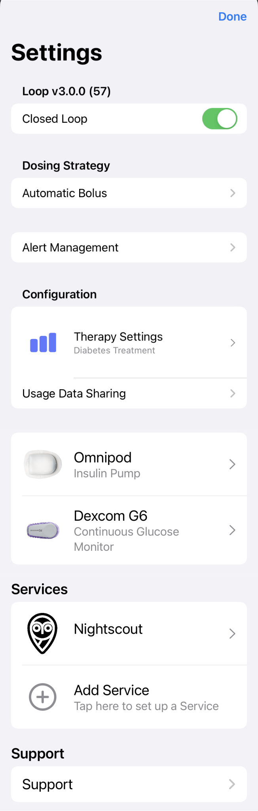

# Settings

The Settings screen has been completely updated for Loop-dev as shown in the graphic below.

{width="250"}
{align="center"}

For those coming from Loop 2.2.x

* Many of the Settings you may be familiar with are reached from Settings by tapping on [Therapy Settings](onboarding.md#therapy-information)
    * Note that changes to Therapy settings are protected by the same authorization required to dose insulin
* Nightscout can be added from Settings by tapping on Add Service (if you did not add it as part of onboarding)
* Issue Report is reached from Settings by tapping on Support
    * The Expiration Date for the Loop app is now included in the Issue Report
    
    

