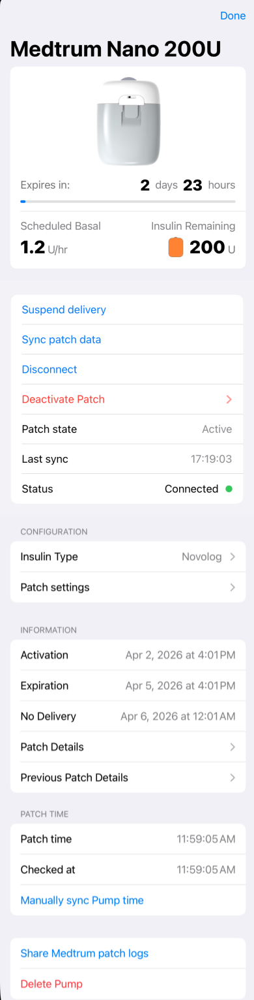
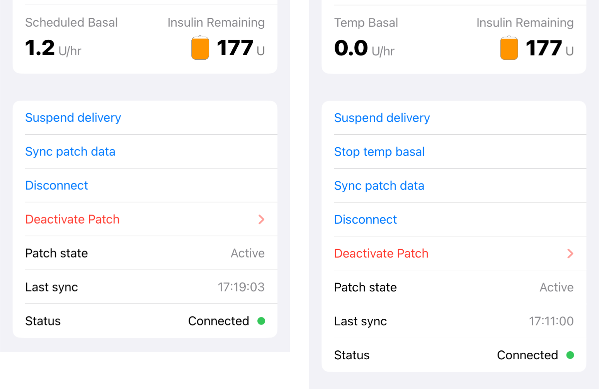
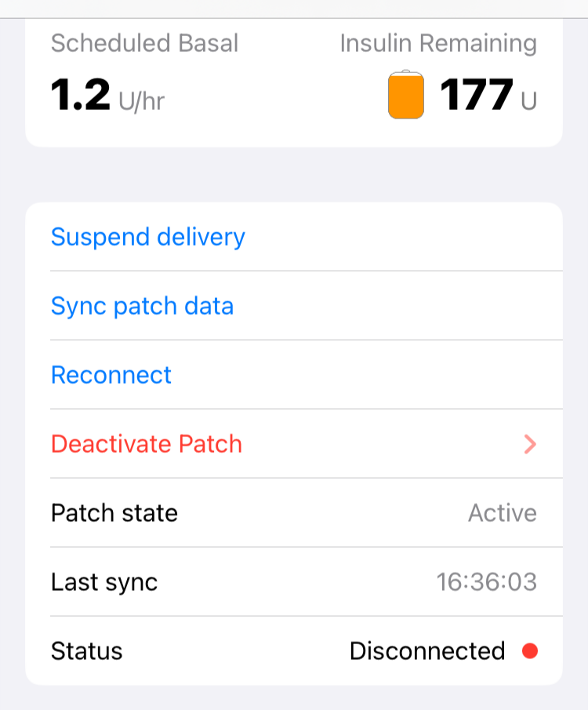
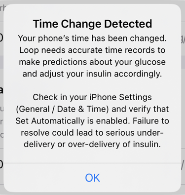
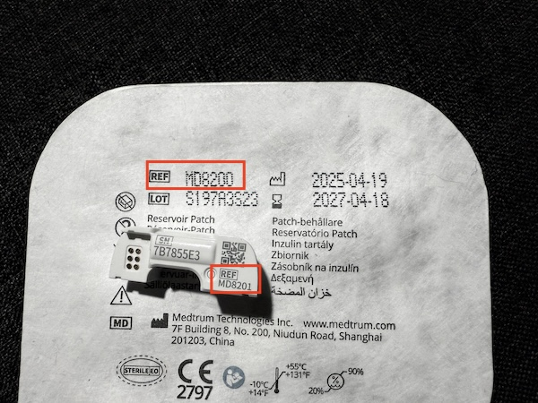
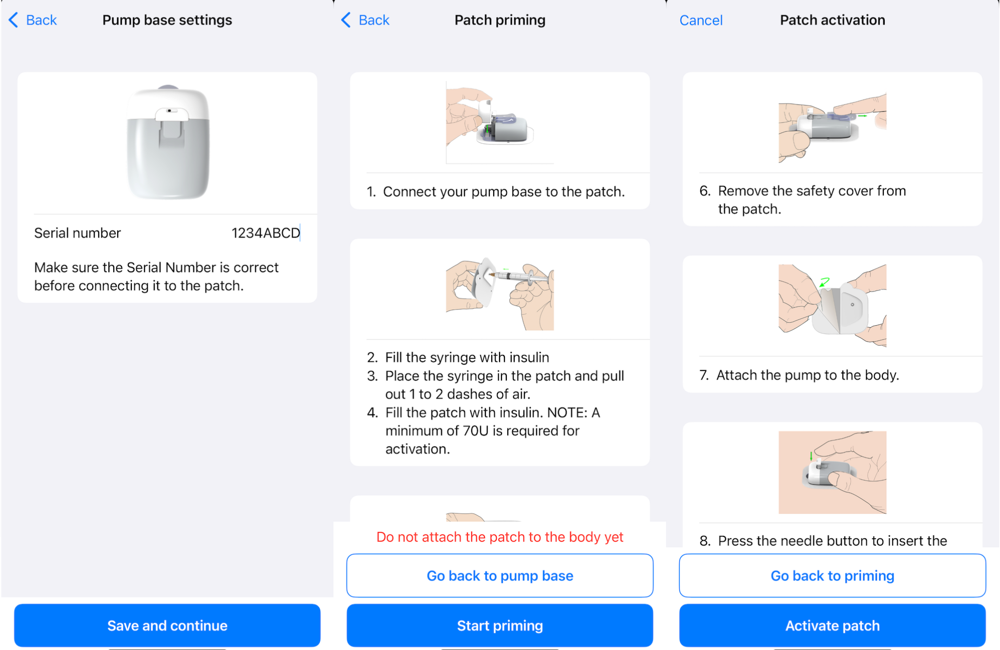
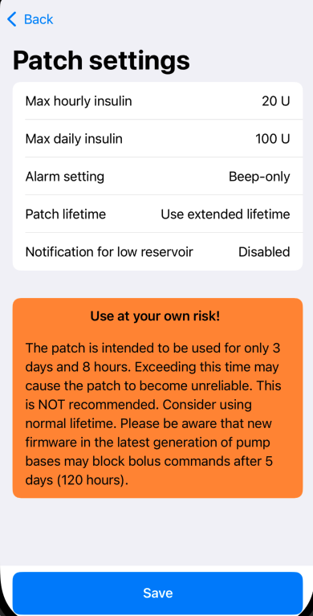

!!! important "🚧 Documentation Under Construction 🚧"
    
    This page is under development.
 
## Medtrum Nano Pump

The Medtrum Nano Pump is supported using the *Loop* app built with a feature branch.  See [Feature Branches](../version/development.md#how-to-build-feature-branches){: target="_blank" } for building instructions.

* The pump patch is designed to be changed every 3 days
* The pump base is reusable - do not accidentally discard the base after removing the patch
* Versions 200U (MD0201 & MD8201) and 300U (MD8301) are supported 

### When Testing Medtrum with Loop

* The branch needed to get Medtrum in Loop is: `feat/dev-dana-medtrum`.
    * This branch is subject to rapid updates.

* Please refer to the [zulipchat Medtrum channel](https://loop.zulipchat.com/#narrow/channel/144182-development/topic/Medtrum.20Nano.20-.20pumps.20for.20development.20use/with/481836247) before building this branch.

- - -

## Medtrum Nano Screen

The Medtrum Nano screen, shown in the graphic below, displays the patch status along with various options for adjusting settings.

{width="300"}
{align="center"}

### Patch Life

There is an 8-hour grace period following expiration.

* Normal Life
    * Patch expires at 72 hours
    * Patch stops delivery at 80 hours

!!! important ""
    The patch can be operated with the [Extended Lifetime Setting](#extended-lifetime-setting), but this is not recommended.

### Patch Summary

There is a summary of the patch status at the top of the screen.

* Just below the graphic of a Nano pump is an "Expires in:" line showing a graphical representaion of how long the patch has been operating and includes a text string reporting duration until expiration
    * The solid bar is proportional to patch hours from activation through expiration
        * It is blue for at least the first 48 hours
        * The line turns orange to warn the patch is within 24 hours of expiration
        * When the patch expires, the line turns red and the text indicates how much time until No Delivery
        * The warning orange and red lifecycle lines also appear in the [HUD Pump Status](displays-v3.md#pump-status-icon) icon
* The left side of the next row reports the current (absolute) basal rate
* The right side of the next row reports the reservoir level

### Patch Alerts

If [Patch Errors and Alerts](#patch-error-messages) occur, they will show up just below the Patch Summary.

## Actions

### Suspend Delivery

Tapping on `Suspend Delivery` halts all insulin delivery from the patch for a duration of 2 hours. You can resume insulin delivery before that by tapping on resume delivery.

* The user is alerted that pump is suspended by an icon on the OS-AID main screen header.
* The patch itself might vibrate or beep every 15 minutes

{width="150"}
{align="center"}

* For the *Loop* app, the [HUD Status Row](displays-v3.md#hud-status-row) message can be tapped to resume delivery.

{width="300"}
{align="center"}

#### No Manual Bolus While Patch is Suspended

If you request a manual bolus with Loop while a patch is suspended, Loop will send a notification that Bolus Failed with instructions that Pump is Suspended, Resume Delivery.  In other words, you must resume delivery before you will be allowed to bolus with pods.

### Stop Temp Basal

If a temporary basal rate is currently active, the Stop Temp Basal button is provided to immediately cancel that temporary basal and restore scheduled basal delivery.

The graphic below shows a nominal display with scheduled basal running on the left and temporary basal running on the right.

{width="600"}
{align="center"}

### Sync Patch Data

If the last sync was in the far past, you can force an immediate sync by tapping on Sync patch data.

!!! info "Items Updated by Sync"
    * Patch state (active, reservoir empty, fault, etc)
    * Patch datetime
    * Reservoir levels
    * Bolus/basal state
    * Patch battery voltage
    * Patch starttime

### Disconnect or Reconnect

The Nano pump is normally always connected to the phone with Bluetooth. The action button will show Disconnect and the Status will report Connected with a green dot. (See [Stop Temp Basal](#stop-temp-basal) for example screenshots.)

If you wanted to disconnect Bluetooth, tap on Disconnect and the display modifies as shown below. The action button will show Reconnect and the Status will report Disconnected with a red dot.

{width="400"}
{align="center"}

If the phone and pump are within Bluetooth range, the app will reconnect them almost immediately.

When the phone and pump are separated, the app will report Bluetooth is disconnected. It should reconnect promptly when the phone and pump are within range again. The Reconnect row allows you to hurry the process if desired.

### Deactivate Patch

The Deactivate Patch should only be tapped when you are ready to halt insulin permanently and remove the patch. Once you select this row, you are asked if you want to deactivate and then you must provide authentication to do so.

Once the patch is deactivated, use the Medtrum-provided tool to retract the needle before removing the patch.  Remove the patch and then promptly remove the pump base (brain) from the patch and put it in a safe place. The easiest way to remove the base is to turn the patch upside down and gently press on the plastic tab to release to base.

### Patch State

The Patch State refers to the patch itself, whereas [Status](#status) refers to the Bluetooth status.

The icon shown in the Loop main screen may not be as specific as the string in the Patch State row. So if you see Patch Error with the stop sign on the main screen, tap on the icon to determine the exact issue.

* **Active** (normal operation)
* **Fault**
* **Occlusion**
* **Battery Empty**
* **Suspended** (usually a manual action)
* **Suspended - Hourly max** (insulin delivered in the last hour exceeds patch setting)
* **Suspended - Daily max** (insulin delivered since midnight exceeds patch setting)
* **Expired**

The Suspended states can be updated by resuming, or modifying the hourly or daily maximum values in [Patch Settings](#patch-settings) and then clearing the alert.

### Status

The Status row reports the Bluetooth status:

* **Connected** (normal configuration)
* **Disconnected** (out of Bluetooth range)
* **Reconnecting...** (after tap on Reconnect)

- - -

## Configuration

The configuration section displays:

* [**Insulin Type**](#insulin-type) shows the Insulin Brand selected; be sure to modify this between patches if you change your insulin
* [**Patch Settings**](#patch-settings) tap on this row to modify settings for the patch

### Insulin Type

You selected [Insulin Type](add-pump.md#insulin-type){: target="_blank"} when connecting to this pump.

Tap on this row if you switch to a different type of insulin.

* The model used by Loop for all the rapid insulin brands are the same, but it's a good idea to record if you change brands - some people notice differences
* If you switch between rapid and ultra-rapid insulin, you need to let Loop know so it will use the appropriate model

### Patch Settings

Typically the default Patch Settings are selected during onboarding of the Medtrum Nano pump. However, you can modify these setting during or between pods.

Any changes made to Patch Settings after onboarding requires authentication to be saved.

1. **Max hourly insulin** & **Max daily insulin**: Medtrum Nano does not work with max bolus and max basal settings, it uses max hourly & max daily insulin. Just like the names suggests, it controls the maximum amount of insulin per hour or per day (measured since midnight). 
1. **Alarm setting**: The Medtrum Nano has the ability to make a beep if there is an occlusion, patch fault, empty battery, etc. These alarms can also be silenced using this setting.
1. **Patch lifetime**: Normally, the Medtrum Nano runs for 3 days and 8 hours. This is recommended to ensures the functioning of the patch and cannula. You can disable this limit but it is not recommended.  See [Extended Lifetime Setting](#extended-lifetime-setting) for more information.
1. **Notification for expiration**: If the **Patch lifetime** setting is set to normal lifetime, you have the ability to update this setting. You can control at what point the patch will alert you that patch is nearing expiration.
1. **Notification for low reservoir**: You can select the reservoir level at which you want to be notified or disable the notification.

- - -

## Information

The next section on the Medtrum Nano screen reports information about the current patch and the previous patch:

* **Activation**: Time at which patch was Activated
* **Expiration:** Time at which patch will Expire (8 hours before No Delivery time)
* **No Delivery**: Time at which patch will stop delivering insulin
    * If using extended life, please read [Extended Lifetime Setting](#extended-lifetime-setting)
    * If a Patch Fault was detected, this will give the time at which the fault was detected
* Access to [**Patch Details**](#patch-details)
* Access to [**Previous Patch Details**](#previous-patch-details)

#### Patch Details

Some additional details for the most recent patch are provided by tapping on this row.

Some items reported:

* Pump base serial number
* Pump base firmware version
* Pump base model
* Battery level (V)
* Insulin used (U)

#### Previous Patch Details

When you tap on the `Previous Patch Details` row, summary information is displayed about the patch before the one currently in use.

## Patch Time

Click on [Time Zone](displays-v3.md#time-zone){: target="_blank" } to understand how Loop treats "pump" time for pods.

When the Pump time zone matches the phone time zone, the Pump Time is displayed with black font. 

When the phone time zone and pump time zone do not match, there is a clock icon on the main screen in the Pump Status Icon of the HUD.

* Tap on the Pump Status Icon in the HUD (top red rectangle in graphic below)
* Information about Time Change is provided on the Nano screen
* The Pump Time displays the clock icon and yellow font
    * The `Sync to Current Time` row appears
    * Tap on the `Sync to Current Time` row to choose whether to make Pump Time match Phone Time or not (bottom red rectangle in graphic below)

🚧 TODO: The graphic below will be prepared later 🚧

{width="600"}
{align="center"}

### Other Time Changes

What about other time changes?  Suppose the iOS -> General -> Time & Date is modified to manually change the time, but the time zone is not adjusted. (Sometimes this is done to defeat limits on games. **Do Not** do this on an OS-AID phone.  If you have an "old" glucose reading in the "future" - Loop will not predict correctly which may have dangerous consequences.) There will not be an obvious display in the main display or Nano screen (which keys off time zone) but you will get regular warnings that phone does not have automatic time set.

> When automatic time is disabled on the iPhone settings, Loop will not automatically modify insulin delivery and the pump will revert to scheduled basal after the last temporary basal rate duration completes.

Loop 3 will display this warning modal screen if it detects a problem with the Phone time. It leaves it up the user to decide what action should be taken. To make this warning stop, go to iOS -> General -> Time & Date and enable Set Automatically. 

{width="300"}
{align="center"}

- - -

## Prepare Patch

!!! danger "Attach Pump Base Before Filling the Pump Patch with Insulin"
    Make sure the pump base matches the patch.

    * Before connecting your pump base with your patch, always check the REF on your patch with the REF on your pump base
    * The first 3 digits should always match, the patch always ends with 0, while the pump base always ends with 1
    * Do not use the patch with that base if they do not match

        {width="450"}
        {align="center"}

### Activation flow

!!! warning "IMPORTANT"
    Connect your pump base to the patch before adding insulin to your patch.
    Otherwise, you might corrupt the activation flow.

!!! abstract ""
    The graphics walk you through each step of the filling, pairing, priming, attaching and insertion process.

    You will probably need to scroll up or down to see all the instructions on your phone.

{width="500"}
{align="center"}

After the serial number prompt:

1. Attach the base to the patch and then tap on Continue
2. Follow the visual guide in the *OS-AID* app to pull out air and fill the patch with insulin
3. Press "Start priming" to start priming the patch

It is important to not attach the patch on your body before the priming process completes.

!!! warning "IMPORTANT"
    While the priming is running, DO NOT USE THE CANCEL BUTTON.
    This might corrupt the activation flow, so please be patient while the priming process is running.

After priming, follow the rest of the visual guide in the *OS-AID* app .
From here, you can attach the patch to your body and complete the activation process.

* Do not forget to insert the cannula manually
* Press firmly until you feel and hear a click - make sure the cannula stays inserted when you let go
* Tap on activate and in a few seconds you will see the nominal [Medtrum Nano Screen](#medtrum-nano-screen)

- - -

## Patch Error Messages

🚧 TODO: This section is under construction 🚧

- - -

## Extended Lifetime Setting

!!! warning "Extended Life"
    The Medtrum Nano allows operation using Extended Life, although this is not recommended.

    New firmware stictly limits delivery after 120 hours. After 120 hours, the patch will continue delivering scheduled basal rates until the batteries die. 
    
    The OS-AID pump manager assumes this 120-hour limit is enforced and provides suitable messages. Older Medtrum brains might allow full operation to continue. Please be exceedly cautious if you choose to extend your pump operation past the recommended 80 hours.

* Exended Life
    * Patch expires at 112 hours (this is an OS-AID notation)
    * Patch might stop accepting bolus or temporary basal rate commands at 120 hours

{width="300"}
{align="center"}
