## Overview

The information and user interface for all Omnipod Pods is the same, except Omnipod 5 and DASH Pods do not require a RileyLink compatible device. They communicate directly with the phone through Bluetooth.

!!! warning "O5 is in beta test"
    Omnipod 5 Pods should only be tested by experienced users willing to build a development branch: 
    
    * LoopWorkspace `dev`
    * LoopWorkspace `next-dev`

    The timing for when O5 is supported in these branches depends on when Pull Requests are merged.

    Please thoroughly read [Updates in dev](../version/development.md#updates-in-dev){: target="_blank" } before attempting to use one of these branches.

!!! warning "Use of O5 Pods requires a CGM with a heartbeat"
    * O5 Pod code is experimental and does not provide a heartbeat at this time
    * This means you rely on your CGM to wake up the app when it is in the background or the phone is locked
    * If your CGM does not supply a heartbeat, the app with stop automatically running when it is not open

- - -

## Pair Pod

!!! danger "Max Fill is 200 Units"
    When you fill the Pod do not exceed 200 units.

    If you overfill the Pod, you may get a Pod fault right after priming.

!!! info "Pod Filling and Insertion"
    The Pod filling and insertion instructions are the same with the Loop app as they are for the PDM.  These videos: [Filling a Pod with Insulin](https://youtu.be/qJBN6rlvn_Y) and [Inserting the Cannula](https://youtu.be/ss1vpsmaLoI), may be useful.

    For Omnipod 5 and DASH Pods:

    * You will use your phone instead of the PDM.  Be sure to keep the phone close to the Pod during pairing and insertion because the Pod uses a low-power mode during these activities.

    For Classic or Eros Pods:

    * You will use your phone and RileyLink compatible device instead of the PDM.  Be sure to keep the phone and RileyLink close during pairing and insertion because the Pod uses a low-power mode during these activities.

You'll be pairing a Pod every 2 or 3 days (max Pod life is 80 hours).

You'll see this screen every time you ask Loop to `Pair New Pod`.

With the new Universal Omnipod Pump Manager, the Pair Pod screen includes the name of the Pod Type you are pairin along with a description. Make sure you have the correct Pod Type selected for the Pod you just filled with insulin.

The Omnipod Common pairing protocol is the same for all Pods. The difference is that Classic or Eros Pods require a RileyLink compatible device and Omnipod 5 and DASH do not. There are also slight differences in some of the text and graphics, e.g., Omnipod DASH uses a blue needle cap and both the Classic and Omnipod 5 Pods use a clear needle cap.

Graphic below shows the Pair Pod screen for Eros (left), DASH (middle) and O5 (right).

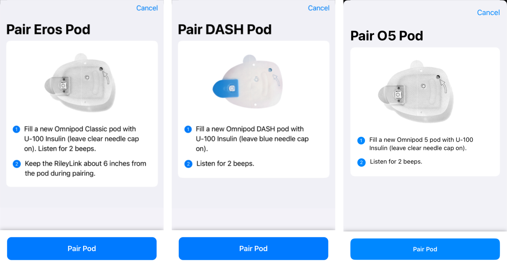{width="750"}
{align="center"}

!!! abstract ""
    Loop walks you through each step of the filling, pairing, priming, attaching and insertion process.

    It makes sure you are really ready to do the insertion.

    Please watch the [video of the *Loop* app screen when pairing a DASH Pod](https://drive.google.com/file/d/1mN5s8-oorvoa-gbjAaYbnUnl_-vvuhNC/view?usp=sharing) to see the full process before pairing your first Pod. In this video, once the Pod starts priming, you may want to skip forward (it takes about a minute to prime).

!!! danger "Keep Gear Close"
    * Make sure the phone (and RileyLink if using one) are close to the Pod before you tap Pair Pod
        * Do NOT move devices away from the Pod until you see the blue check mark and the `Continue` button on the phone screen
        * You can then move away to attach the Pod to your body
    * Make sure the phone (and RileyLink if using one) are close to the Pod before you tap `Insert Cannula`
        * Do NOT move devices away from the Pod until you see the blue check mark and the `Continue` button on the phone screen

### New Slider

!!! tip "The Insert Cannula and Deactivate Pod now use a Slider instead of a Button"
    For version 3.4.x and later there is a new slider to control insertion of the cannula and deactivation of a Pod. 

    The slider looks like the graphic below. (The Deactivate Pod slider is red.) You place your finger on the dark circular icon and, while keeping your finger in contact with the screen, drag all the way to the other side. (The direction depends on the natural direction for your selected language). After the drag operation, as soon as you lift your finger off the phone, the cannula insertion command is sent to the Pod.

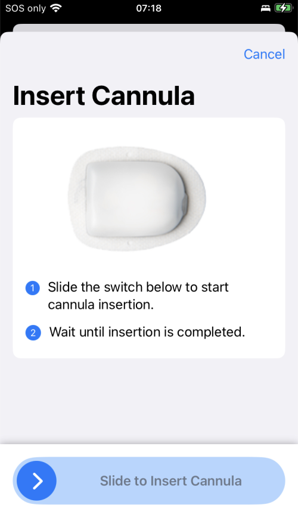{width="250"}
{align="center"}

The Screen that says Setup Complete allows you to change the Scheduled Reminder for this Pod if you want a different reminder time (including none) from your usual setting.

* This only changes the reminder for this one Pod
* If you want to change all future reminders, tap on Notifications to modify the Reminder Default
* In that same location, you can also change notification for the current Pod at any time

- - -

## Pod Status

The Pod Status screen is shown in the graphic below. The dashed green outline indicates the `Device` portion that is found only for the Omnipod.  All other features of the screen are common for Omnipod and Omnipod DASH. If your screen looks different, consider updating to version 3.4 or newer.

{width="250"}
{align="center"}

### Play Beeps

If you want to make sure Loop can talk to your Pod, click on the sound icon (highlighted by the red box) in the graphic above. If the icon is greyed out - that means Loop is having a communication issue reaching your Pod. Follow the usual [Troubleshoot: Pump is Not Responding](../troubleshooting/red-loop.md#pump-is-not-responding) steps to resolve this problem.

!!! tip "Other Uses"
    * Find (or startle) your child
    * Find the Pod that fell off overnight and is mixed with the laundry

### Pod Expires

* This line provides a count-down until expiration along with a graphical representation of Pod life
    * Once you are on the final day, the time remaining until expiration starts to report in Hours and Minutes
    * The solid bar is proportional to Pod hours since activation
        * It is blue for the first 48 hours
        * It is orange for the last 24 hours and also appears in the [HUD Pump Status](displays-v3.md#pump-status-icon) icon
        * After expiration, a full-width red bar is shown here and in the HUD Pump Status icon
* Once the Pod officially expires, at 72 hours, there is an 8 hour grace period
    * Insulet does not guarantee the Pod will keep working that long, but it often does
    * A note will appear on the [Pod Status](#pod-status) screen with count-down text:
        * Change Pod now. Insulin delivery will stop in HH hours, MM minutes or when no more insulin remains

### Basal Report

The next row changes the label depending on the situation. In all cases, the current basal rate is reported.

| 

 Label | Description |
|---|---|
|Scheduled Basal|Pod is running the scheduled basal rate|
|Insulin Delivery|Pod is running an automated or manual temporary basal rate|

### Insulin Remaining

Pods start reporting reservoir values when 50 U are left.

| 

 Value | Meaning |
|---|---|
|50+ U|Pod reservoir is greater than 50 U|
|Value U|Pod reservoir is estimated to be at least as great as the indicated value.|
| 0 U|Pod will attempt to deliver up to 4 U after it reports 0 U.   This is not guaranteed. The Pod senses when it is not successful delivering pulses and that can happen before 4 U have been delivered.|

- - -

## Actions

### Suspend Delivery

You may want to consider using a [Manual Temp Basal](#manual-temp-basal) of 0 U/hr instead of suspend.

Tapping on `Suspend Delivery` brings up a timed reminder screen. You can choose to be reminded (via a beep on the Pod itself) with 4 choices (or you can cancel the request):

* 30 minutes
* 1 hour
* 1 hour 30 minutes
* 2 hours

After you select the reminder time, Loop issues a command to the Pod to halt all insulin delivery: basals, temp basals, and boluses in progress. The label on the `Suspend Delivery` row changes to `Suspending` while Loop is communicating with the pump. When the label changes to `Resume Delivery`, all insulin delivery is stopped until the user resumes using the [HUD Status Row](displays-v3.md#hud-status-row) or the [Pod Status](#pod-status) screen.

As long as the spinning icon is spinning, Loop is trying to execute the Suspend or Resume command. If it fails to complete, a modal alert will appear that says "Error Suspending" or "Failed to Resume Insulin Delivery" which you must acknowledge. You must then repeat the command to try again. For Omnipod, make sure your RileyLink device is powered on and close to the phone and Pod.

When the phone is in portrait mode, so the HUD is visible:

* The user is alerted that pump is suspended by the HUD [Pump Status Icon](displays-v3.md#pump-status-icon).

{width="150"}
{align="center"}

* The [HUD Status Row](displays-v3.md#hud-status-row) message can be tapped to resume delivery.

{width="300"}
{align="center"}

#### No Manual Bolus While Pod is Suspended

If you request a manual bolus with Loop while a Pod is suspended, Loop will send a notification that Bolus Failed with instructions that Pump is Suspended, Resume Delivery.  In other words, you must resume delivery before you will be allowed to bolus with Pods.

#### Suspend Timer Reminder

At the end of the reminder time, an alert beep is issued by the Pod and a modal alert will be provided on the Loop app. You must acknowledge the modal alert on the phone to silence future Pod alerts. 

* If you do not acknowledge the modal alert, the Pod will keep beeping
* If you need a silent Pod, consider using [Manual Temp Basal](#manual-temp-basal) of 0 U/hr instead of Suspend

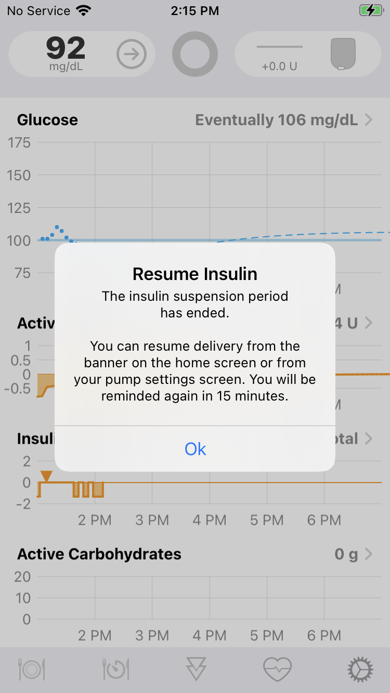{width="300"}
{align="center"}

!!! danger "Manually Resume Insulin Delivery"
    The halt of all insulin delivery continues until you manually resume. There is no automatic resumption of basal insulin from a suspend command.

    If you select a Manual Temp Basal command of 0 U/hr instead of Suspend:

    * Basal Delivery automatically resumes at the end of the selected duration without need for Loop to command it
    * At the end of the duration, Loop will restore Closed Loop, if you were in closed loop when you issued the Manual Temp Basal command
    * There are no beeps on the Pod to remind you to resume insulin delivery

### Manual Temp Basal

Tap on the `Set Temporary Basal Rate` to select a Manual Temp Basal.

This brings up the `Temporary Basal` screen shown on the left of the graphic below. 

* You can select any basal rate from 0 U/hr to your maximum basal rate set in [Delivery Limits](therapy-settings.md#maximum-basal-rate)
* You can choose any duration up to 12 hours in half-hour increments
* Once you select rate and duration and tap `Set Temporary Basal`, Loop goes into Open Loop mode and the Pod is commanded to that rate and duration. 

In other words, you can leave your phone behind and the selected basal rate continues for the selected basal duration. There will be no automated adjustments of delivery for the temp basal duration.  

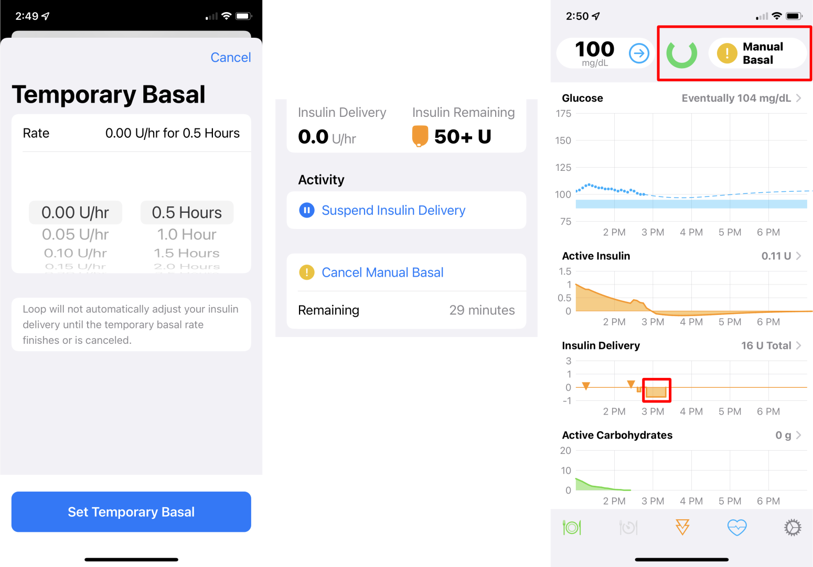{width="600"}
{align="center"}

#### During Manual Temp Basal

!!! warning "This Pod Only"
    The manual temp basal command from Loop tells the Pod to initiate a temp basal for the designated rate and duration.

    * The Pod itself takes care of the temp basal with no further interaction with Loop
    * Loop will no longer issue commands to the Pod without manual intervention from the user until the expected duration ends or user selects `Cancel Manual Basal`
    * Loop continues to request and receive status reports from the Pod while the Pod is within communication range

    **Deactivating this Pod and pairing a new one interrupts the temp basal.**

    **If you still need that basal rate, you must initiate it on the new Pod.**

Once the manual temp basal command is sent to the Pod, Loop changes to Open Loop mode and updates displays as shown in the graphic above

* [Pod Status](#pod-status) screen:
    * The [Basal Report](#basal-report) updates with the new rate and label indicates `Insulin Delivery`
    * The row label changes to `Cancel Manual Basal` and reports the time remaining until the temp basal expires
* Main screen (refer to red rectangle highlights):
    * The HUD [Loop Status Icon](displays-v3.md#loop-status-icon) changes to an `Open Loop` icon and the HUD [Pump Status Icon](displays-v3.md#pump-status-icon) indicates `Manual Basal`
    * The [Insulin Delivery](displays-v3.md#insulin-delivery-chart) plot indicates the planned duration of the manual temp basal
    * The [Glucose Prediction](displays-v3.md#glucose-chart) updates using that assumed change in insulin delivery

So long as you were in Closed Loop before requesting the Temp Basal, Loop returns to Closed Loop automatically when the duration ends or you cancel the temporary basal.

!!! info "Automatic Resumption of Scheduled Basal"
    The phone does not need to be in contact with the Pod for insulin delivery to return to scheduled basal at the end of the selected duration. That duration is commanded along with the temporary rate. Once the Pod accepts that command, and you'll get an error message if it does not, the Pod will resume scheduled basal rate without further commanding if there is insulin in the reservoir and a Pod fault does not occur.

For situations where you need a modification of your insulin needs that is not dependent on a particular Pod, review the information on the [Overrides](../operation/features/overrides.md) page.

### Devices

For Omnipod, there is a Devices section used to access the [RileyLink](../loop-3/rileylink.md) status and commands screen.

### Pod Display

The next section on the Pod screen reports:

* **Activation**: Time at which Pod was Activated
* **Expiration**; Time at which Pod will Expire
* **No Deliver**: Time at which Pod stops delivery insulin
    * If the Pod faults, this row changes to **Faulted** and reports the time of the fault
* **Pod Details**: Access to Current Pod Details
* **Previous Pod**:Access to Previous Pod Details

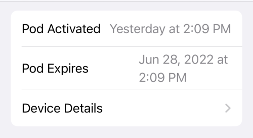{width="350"}
{align="center"}

!!! question "Time Drift"
    The Pod will expire when it thinks it has been 80 hours. The Pod clock may drift a few seconds with respect to phone time during the Pod life. The Expiration time gets updated when the Pod reports how long it thinks it has been since it was activated.

#### Pod Details

Some additional details for the most recent Pod status response message are displayed if you tap the Device Details row, as shown in the graphic below. Most people will not need to view this.

The graphic shows an example for Omnipod on the left, Omnipod DASH (TWI BOARD) in the middle and Omnipod DASH (NXP BLE) on the right. Do not worry about the different board styles (Device Name) for DASH. The developers did that for you. If you are asking for help from a mentor - they may request this information.

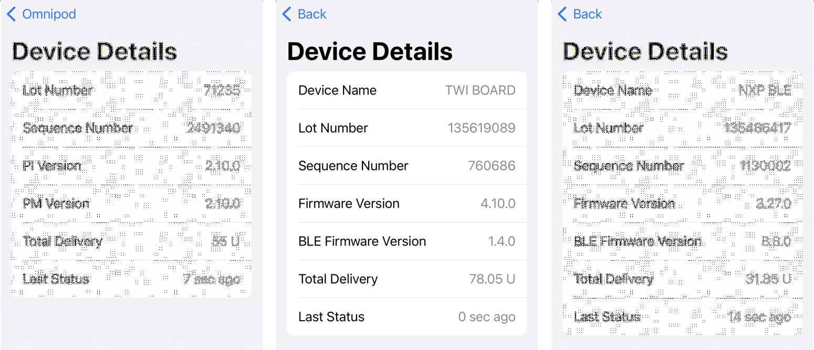{width="600"}
{align="center"}

#### Previous Pod

When you tap on the `Previous Pod` row, a graphic similar to those shown below is displayed. This provides summary information about the Pod before the one currently in use.

If the previous Pod had a fault and you choose to report it to Insulet, this screen reports the PDM reference code that Insulet uses in their tracking system.

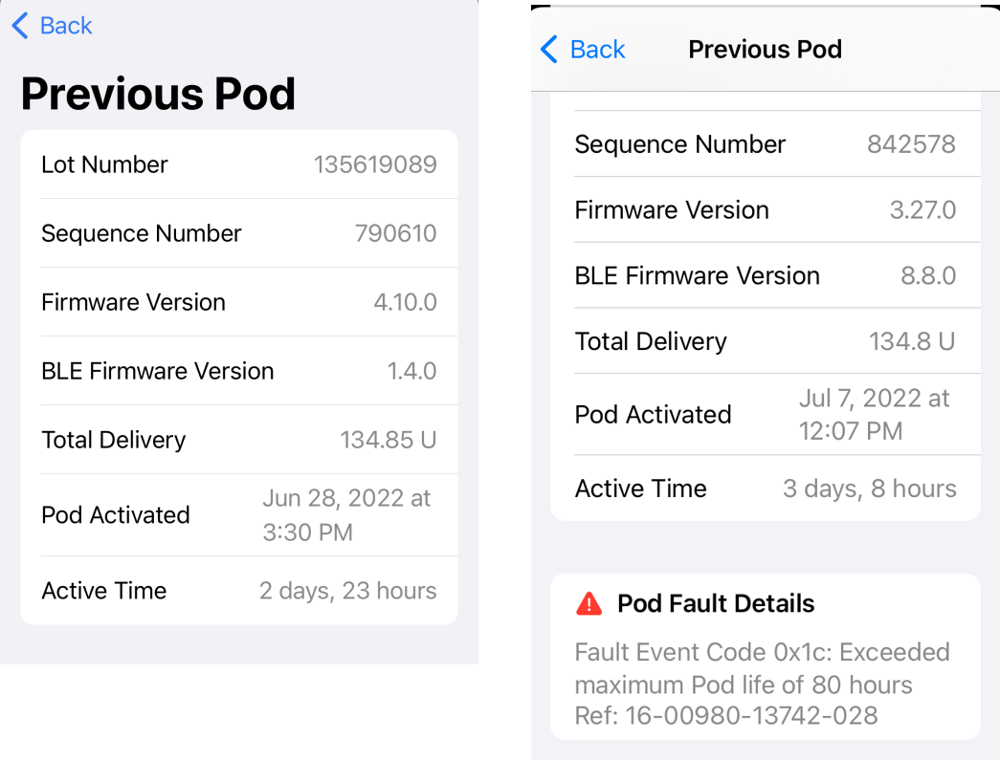{width="600"}
{align="center"}

!!! bug "Do Not Call Insulet about -049 (0x31) Faults"
    If you should happen to get a fault where the last 3 digits of the PDM ref code are "-049" (the Hex Designation is fault code 0x31), do **not** report this to Insulet and do **not** ask for a replacement. This means Loop did not ensure the Pod was in the correct state to accept a command. In other words, it was a bug in the Loop code. 
    
    We believe the code has been updated to prevent these faults. There was a brief period during development in which at least one of these happened - this was fixed July 3, 2022. If this happens to you, report it on zulipchat for the developers, save a Loop Report and rebuild if you have an older version of the development code.

- - -

## Deactivate Pod

When you tap on the `Deactivate Pod` row, the `Deactivate Pod` screen, shown below, is displayed. 

* Touch the circular icon and maintain contact while you slide your finger all the way across the phone
    * When you release the slide, the deactivation command is sent to the Pod
    * This action stops insulin delivery for this Pod and cannot be resumed
* If you have changed your mind, tap Back or Cancel to continue using the Pod

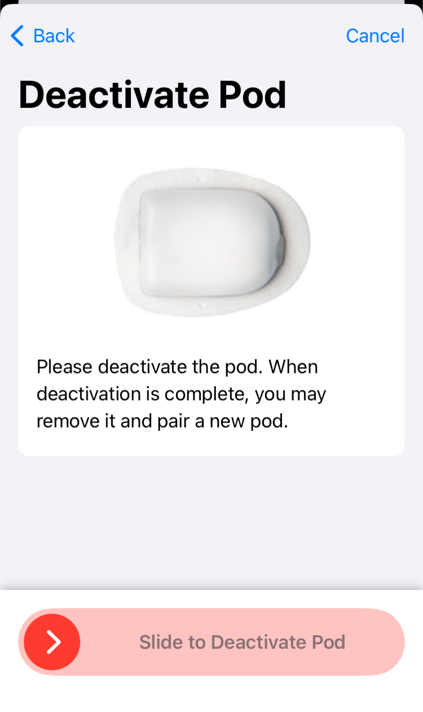{width="300"}
{align="center"}

When deactivation completes, you are presented with the [Pair Pod](#pair-pod) screen, ready for you to pair another Pod of the same type.

- - -

## Switch Pod Types

After the Pod is deactivated, you can choose to switch to a different Pod Type. Simply cancel out of the Pair Pod screen that is normally displayed following deactivation.

At that point, you can scroll to the bottom of the Omnipod screen and select the row that says *Switch to another pod or pump type*. Tapping on that row displays the screen, shown below, where you can choose *Switch pod type* or *Switch pump type*.

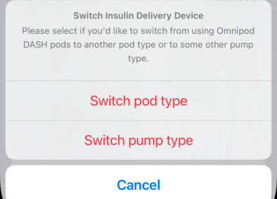{width="350"}
{align="center"}

If you select Switch pod type, you are taken to the [Pod Type](#pod-type) Selection screen

* All of your configuration settings including Insulin brand are maintained when switching Pod Types

!!! important "The Omnipod 5 is only available in the [development branches](../version/development.md#updates-in-dev){: target="_blank"} while in open beta testing"

!!! warning "Use of O5 Pods requires a CGM with a heartbeat"
    * O5 Pod code is experimental and does not provide a heartbeat at this time
    * This means you rely on your CGM to wake up the app when it is in the background or the phone is locked
    * If your CGM does not supply a heartbeat, the app with stop automatically running when it is not open

If you are using a development branch and choose Omnipod 5 Pod Type and have not previously gotten a certificate, one will be automatically downloaded for you.

* Be sure to read the [Omnipod 5 FAQs](../faqs/omnipod-faqs.md#is-omnipod-5-available-for-open-beta-testing){: target="_blank" }
* This one-time step requires internet access
* Once a certificate is successfully downloaded, you will be taken to the [Pair Pod](#pair-pod) screen for Omnipod 5

If you already have the required certificate, you will see a green check mark on the [Omnipod 5 Support](#omnipod-5-support) row at the bottom of your Omnipod screen. In that case, selecting Omnipod 5 as a Pod Type takes you straight to the Pair O5 Pod screen.

- - -

## Configuration

### Notification Settings

When you tap on the `Notifcation Settings` row, the graphic below is displayed. The notifications are a combination of beeps on the Pod with associated modal alerts on the phone app that must be acknowledged to prevent future beeps.

If a pod is active, you can modify the Expiration Reminder and Low Reservoir Reminder for that Pod as applicable

The defaults for futures Pods are always accessible
* Expiration Reminder Default: changes the reminder time for any future Pod
* Low Reservoir Reminder: changes the reminder level for all future Pods
* Critical Alerts: Information row about which alerts can be silenced by phone settings

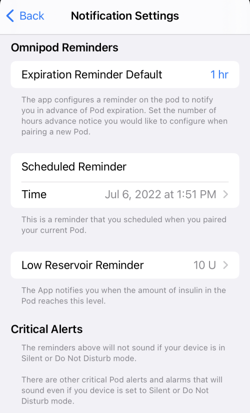{width="300"}
{align="center"}

### Confidence Reminders

When you tap on the `Confidence Reminder` row, the graphic below is displayed.  You can choose from three levels of audible responses that Loop requests from the Pod:

* Disabled: no audible Pod alerts to acknowledge commands
* Enabled: each manual command provides an audible sound to acknowledge it:
    * For manual dosage change, the Pod beeps at both the beginning and end of the manual command.
    * For automated dosage change, the Pod does not beep.
* Extended: Automated dosage change beeps, similar to the manual commands when set to `Enabled`

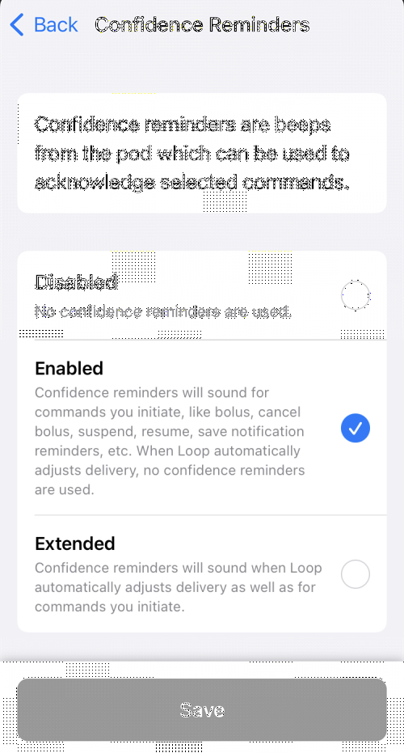{width="300"}
{align="center"}

### Silence Pod

The Silence Pod feature is new with version 3.4.x. This allows a user to tap on silence Pod to prevent any noises from the Pod, other than critical faults.

What Silence Pod will not do:

* This feature cannot change the "clicking" noise that comes from insulin delivery
* This feature will not prevent the constant alarm if the Pod fails for any reason such as out-of-time, out-of-insulin, occlusion detected or any other fault
* If you tap on the sound icon, the beeps will still be heard on the Pod

When would you use Silence Pod:

* During a meeting at work
* During a religious event
* Attending a performance
* Performing at an event
* Planning to change your Pod in the morning, but you know alerts will happen overnight
* You will be away from your phone for an activity and want to avoid any Notifications from beeping on the Pod
    * Notifications, unless silenced, alert on the phone and the Pod
    * The Pod beeps continue until acknowledged on the phone
    * If Silence Pod is enabled, the Pod beeps will be suppressed
    * When you return your phone, examine alerts for those notications

Caveats:

* You must remember to disable Silence Pod if you want to hear Notifications and Confidence Reminders as Pod beeps in addition to alerts on your phone
* The settings you have under Notifications and Confidence Reminders are not changed, the Pod beeps associated with them are simply silenced while Silence Pod is Enabled

The graphic below shows the Silence Pod control. This is only available for v3.4.x and later.

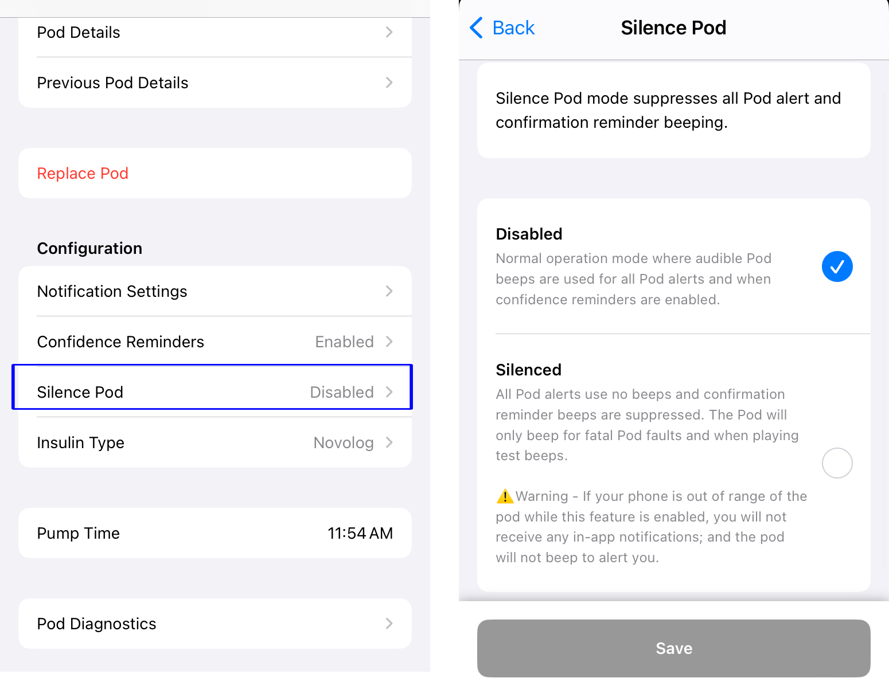{width="600"}
{align="center"}

### Insulin Type

You selected [insulin type](add-pump.md#insulin-type) when connecting to this pump.

Tap on this row if you switch to a different type of insulin.

* The model used by Loop for all the rapid insulin brands are the same, but it's a good idea to record if you change brands - some people notice differences
* If you switch between rapid and ultra-rapid insulin, you need to let Loop know so it will use the appropriate model

- - -

## Pump Time

Click on [Time Zone](displays-v3.md#time-zone) to understand how Loop treats "pump" time for Pods.

When the Pump time zone matches the phone time zone, the Pump Time is displayed with black font. 

When the phone time zone and pump time zone do not match, there is a clock icon on the main screen in the Pump Status Icon of the HUD.

* Tap on the Pump Status Icon in the HUD (top red rectangle in graphic below)
* Information about Time Change is provided on the Omnipod screen
* The Pump Time displays the clock icon and yellow font
    * The `Sync to Current Time` row appears
    * Tap on the `Sync to Current Time` row to choose whether to make Pump Time match Phone Time or not (bottom red rectangle in graphic below)

{width="600"}
{align="center"}

### Other Time Changes

What about other time changes?  Suppose the iOS -> General -> Time & Date is modified to manually change the time, but the time zone is not adjusted. (Sometimes this is done to defeat limits on games. **Do Not** do this on a Looping phone.  If you have an "old" glucose reading in the "future" - Loop will not predict correctly which may have dangerous consequences.) There will not be an obvious display in the HUD or Omnipod screen (which keys off time zone) but you will get regular warnings that phone does not have automatic time set.

Loop 3 will display this warning modal screen if it detects a problem with the Phone time. It leaves it up the user to decide what action should be taken. To make this warning stop, go to iOS -> General -> Time & Date and enable Set Automatically. 

{width="300"}
{align="center"}

### Pod Error Messages

This section presents some of the error message screens you may see specific to Pods.

#### Pod Faults

You are likely to hear a Pod fault before Loop notices. If your phone is locked, Loop only checks status every 5 minutes for Omnipod or 3 minutes for Omnipod DASH.

Unlock your phone, open Loop, navigate to the Pod Status screen and use the slider to Deactivate Pod to stop the noise. The Pod fault - even if it does not show up in the HUD or the Pod Status screen, will be picked up by the process of sliding to Deactivate Pod. You can then view the Fault information in the [Previous Pod Details](#previous-pod) screen.

#### Updates with Version 3.4.x

The updates included with version 3.4.x make it easier to find the Pod fault, should one occur.

The fault will appear on the Omnipod screen and more details will be shown when you tap on Replace Pod to arrive at the Deactivate screen. You can grab a quick screenshot on the Deactivate screen if desired.

The fault information can still be found under [Previous Pod Details](#previous-pod) if you need to find it after you Deactivate the "screaming" Pod.

- - -

## Pod Keep Alive Feature

No better solution has been found for dealing with the difficulty reconnecting Atlas DASJ Pods with iPhone 16 (all models) and iPhone 17e. Therefore, the features previously found just in the `feat/pod-keep-alive` branch of LoopWorkspace are part of the released code as of version 3.14.0.

There is a new "Pod Keep Alive" option at the bottom of the "Omnipod DASH" screen. This is intended to assist users who have both an iPhone 16 (all models) or 17e and [DASH Pods with a InPlay BLE (Atlas) board](../faqs/omnipod-faqs.md#keep-alive-atlas-or-inplay-dash-pods){: target="_blank" }. Model 17 phones, except for the 17e, do not exhibit this problem. No action is taken automatically unless both these cases are detected to be true.

It was tested for LoopWorkspace and Trio.

The concept is by choosing one of the Pod Keep Alive choices, the app sends a getStatus to the Pod before the 3 minute disconnect happens. Therefore, so long as you and the Pod stay close to the phone, the Pod will be connected for any command (either manual or automatic) including bolus, temp basal, modify scheduled basal rates, suspend, or deactivate.

The selection for Pod Keep Alive is found at the bottom of the Pod settings screen.

The default value is Disabled. The graphic below shows the Pod Keep Alive screen that allows the user to choose an option.

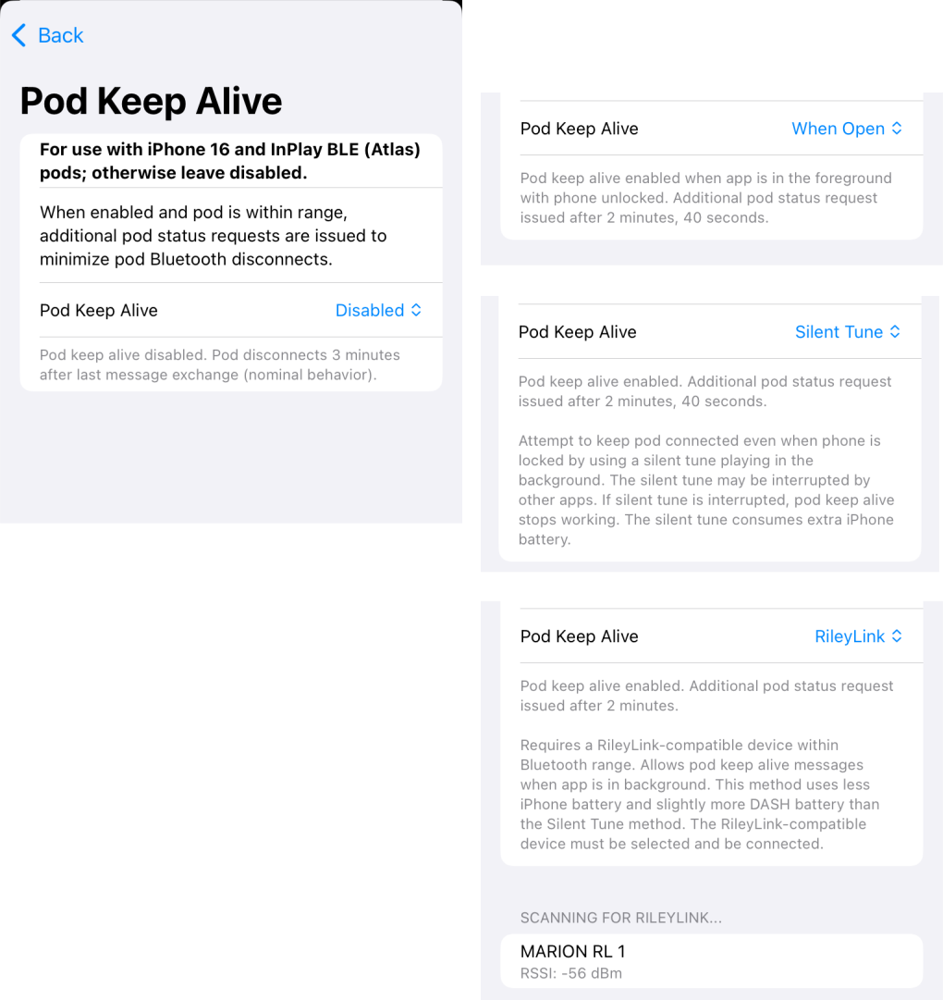{width="650"}
{align="center"}

There are 4 choices for Pod Keep Alive:

1. [Disabled](#disabled) (default)
2. [When Open](#when-open)
3. [Silent Tune](#silent-tune)
4. [RileyLink](#rileylink)

### Disabled

When Pod Keep Alive is disabled, the code behavior is unchanged from the nominal OmniBLE code.

!!! warning "Automatic Change for iPhone 16 or 17e and Atlas DASH Pod"
    If your app has Pod Keep Alive set to disabled and you have an **iPhone 16** or **iPhone 17e** and the Pod you just paired is an **InPlay (Atlas) Pod**, the configuration **automatically** switches to **When Open**. 
    
    The Pod Keep Alive configuration remains at **When Open** until you change it manually.

All three criteria must be true or no automatic change to the setting takes place:

* iPhone 16 (any model) or iPhone 17e
* pair a new Pod that is InPlay BLE (Atlas)
* Pod Keep Alive is Disabled

Note that during the time from pair to insert, the app keeps the screen open and unlocked unless you manually lock it.

This means you can take all the time you need between pair/prime and insert. As long as you don't manually lock the phone or move it out of range of the Pod, the Pod stays connected until you insert the cannula.

Once the Pod is inserted, the phone auto-lock timing is restored to the value the user has selected.

### When Open

When the app is open, it will send a getStatus to the Pod 2:40 (mm:ss) after the last Pod message was exchanged. This means the Pod does not disconnect from BLE and remains available to the phone.

This is true as long as the phone and Pod are in-range while the app is open with phone unlocked.

This mode is primarily to help out people who just paired an Atlas Pod for the first time with an iPhone 16 or 17e. It is meant to keep the Pod connected to the phone until the cannula is inserted.

> Imagine - you just hit retry 5 times to get the Pod to pair and prime and then when it's time to insert the cannula, the Pod has disconnected because it was more than 3 minutes since the last message exchange.  Then you have to keep hitting retry until the insertion process finally starts. With When Open, the Pod stays connected through the entire process of pairing, priming and inserting so long as the user does not manually lock the phone or move to another app.

The user should choose with Silent Tune or Riley Link going forward if they want to have reliable communication between their iPhone 16/17e and an Atlas Pod.

> If the Pod moves out of Bluetooth range, the Pod disconnects. With iPhone 16 or 17e it might take several seconds to minutes before the app reconnects to the Pod once it is back in range. This can cause disruptions until the reconnect happens.

### Silent Tune

A silent tune is played in the background which keeps the app alive even when the phone is locked. This will increase the battery usage on the phone.

While Silent Tune is selected, the app will send a getStatus to the Pod 2:40 (mm:ss) after the last Pod message was exchanged. This means the Pod does not disconnect from BLE and remains available for commands from the app so long as the phone and Pod stay within Bluetooth range.

> If the Pod moves out of Bluetooth range, the Pod disconnects. With iPhone 16 or 17e it might take several seconds to minutes before the app reconnects to the Pod once it is back in range. This can cause disruptions until the reconnect happens.

### RileyLink

For those who have a RileyLink (OrangeLink, EmaLink, etc), you can use that instead of the Silent Tune but you must keep the link with the phone.

While RileyLink is selected, the app is triggered by the RileyLink one minute heartbeat. The app will send a getStatus to the Pod 2:00 (mm:ss) after the last Pod message was exchanged. This means the Pod does not disconnect from BLE and remains available for commands from the app so long as the phone and Pod stay within Bluetooth range.

> If the Pod moves out of Bluetooth range, the Pod disconnects. With iPhone 16 or 17e it might take several seconds to minutes before the app reconnects to the Pod once it is back in range. This can cause disruptions until the reconnect happens.

> If the phone moves out of RileyLink range, then the app is not triggered by the RileyLink heartbeat and the Pod disconnects from BLE at the 3 minute cadence. With iPhone 16 or 17e it might take several seconds to minutes before the app reconnects to the Pod once it is back in range. This can cause disruptions until the reconnect happens.

- - -

## Pod Diagnostics

The row is typically used by developers. It opens a new screen with a variety of diagnostic options. These are listed in the table below.

| Name | 
|:--|
| Read Pod Status |
| Play Test Beeps |
| Read Pulse Log |
| Read Pulse Log Plus |
| Read Activation Time |
| Read Triggered Alerts |
| Pump Manager Details |

- - -

## Omnipod 5 Support

!!! warning "Use of O5 Pods requires a CGM with a heartbeat"
    * O5 Pod code is experimental and does not provide a heartbeat at this time
    * This means you rely on your CGM to wake up the app when it is in the background or the phone is locked
    * If your CGM does not supply a heartbeat, the app with stop automatically running when it is not open

To use Omnipod 5 Pods you must have a certificate installed on your phone. 

* Once you have a certificate, the *Omnipod 5 Support* row will show a green check mark

If you do not have a certificate, you can get one at any time using this row. Getting a certificate ahead of time is not required, but some people will feel more comfortable knowing the certificate is installed before they switch [Pod Types](#switch-pod-types).

* If your *Omnipod 5 Support* row shows a yellow warning badge, you can tap on it to request a certificate
* This one-time step requires internet access
* This certificate remains available for this app on this phone, even if you delete and reinstall the app

