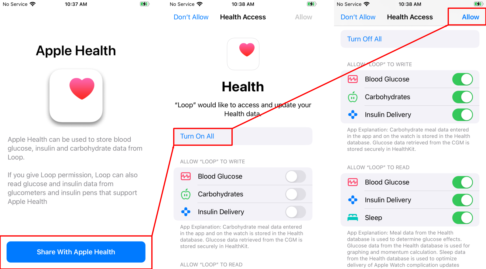

# Onboarding

## New Looper

!!! danger "New Loopers Should NOT Use Loop-dev Before it is Released"
    Once Loop-dev is released, this Loop 3 pages will be moved to the Set Up App section of LoopDocs.

    To make life easier for those of us preparing the new documentation, the wording on many pages in the Loop 3 section is set in the future - after the release.

    This is **not** an invitation for brand-new loopers to build Loop-dev as their first looping adventure.

    After the release, this section will be replaced with the words: If this is your first time using Loop - congratulations!

It is a good idea to review this page, _and the rest of what is now the Loop 3 Section (and will become the Set Up App section once Loop-dev is released),_ before pressing any buttons on your phone with your new Loop 3 app.

As soon as your app builds on your phone, you are guided through the set up process - this is called onboarding. As part of onboarding, there are information screens for each `Therapy Setting`. You are "forced" to acknowledge each screen while onboarding. If you later want to review those informational screens again - they are available on your phone through the [`Therapy Settings`](therapy-settings.md) screen.

This link shows a [video of onboarding](https://drive.google.com/file/d/1NkS-YGREFn1UBmBbOjsD2Yy0ZUyEYM1l/view?usp=sharing) with the pre-release version under test in March 2022.

### Entering and Editing Values

There are some mechanics associated with entering and editing values with Loop 3. Come back to this section if you have trouble later when you want to enter or modify a setting.

* If you want more information about a specific therapy setting, tap on the information icon on that screen or review the detailed [Therapy Settings](therapy-settings.md) page in LoopDocs
* Some screens only have one value for a given quantity
    * In that case you see the value that you can tap on and edit
    * If you tap on the value and the `Confirm Setting` or `Save` button is inactive (this can happen on the delivery limits screen), simply move the picker value to make the button active
* Some screens allow different values for different times of day
    * During onboarding as a new looper, you must tap the + sign to get the midnight time slot (all scheduled entries must start at midnight)
    * When you tap +, you can add an entry to any time-slot that does not already have an entry
        - Adjust the time and value(s) as desired (the last available time slot is 11:30 pm)
        - Tap Add to include this entry in your schedule
    * If a time-slot has an entry, you can tap on it to edit it
        - You can change the time within the constraint of the time entries before and after the slot you are editing
        - You can edit the value to any allowed value
    * If you want to delete one or more entries, tap on Edit
        - Tap the red icon to the left of the time-slot you want to delete and select delete
        - Continue until done, then tap Done

### Glucose Units

If you have never connected a glucose monitoring device to your phone's Apple Health app, the units selected on the phone might not be in the units you expect, i.e., mg/dL or mmol/L. The units Loop uses match what is in Apple Health.

* If the units in Apple Health are mg/dL and you try to enter therapy settings suitable for mmol/L, or vice versa, the guardrails in Loop will prevent your entries
* If this happens to you:
    * Quit out of onboarding
    * Follow the directions for [How to Change Glucose Units](#change-glucose-units)
    * Start the Loop app again and Onboarding will restart

## Onboarding Steps

Each of the onboarding steps is presented in order on this page. It is a good idea to follow the docs while you are entering values into your app for the first time.

!!! abstract "Settings Help"
    If your settings are incorrect when starting Loop (basal rates, insulin sensitivity, carb ratio, etc), you may need time to identify which settings need to be adjusted. You may be tired of reading this, but please remain in Open Loop until you've verified your settings.

    If you need help with your settings adjustment, head over to LoopTips for some [initial settings help](https://loopkit.github.io/looptips/settings/settings/).

### Welcome to Loop

The first screen you will see is the Welcome to Loop screen shown in the graphic below. Tap on `Let's Go` to continue.

{width="250"}
{align="center"}

### Apple Health Permissions

The next set of screens is used to give Loop permission to read and write to Apple Health. In the graphic below, from left to right, tap on the buttons highlighted with red boxes to configure permisions:

* Tap on the `Share with Apple Heath` button
* Tap on the `Turn On All` button in the middle
* Tap on the `Allow` button at upper right

The screen in the right side of the graphic was scrolled to enable the write and read permissions to be visible in that view. You need to enable Health Permissions to get the full capabilities of Loop.

{width="600"}
{align="center"}

You can reach the permissions screen later, if you want to review it. Open the Apple Health app, look at the toolbar at the bottom of the app where it says Sharing. Scroll to the bottom of Sharing and Select Apps, then review the Loop Settings.

!!! warning "Advanced Users Only"
    What about [reading carbohydrates from Health](#carb-data-source) with Loop?

### Connect Loop to Nightscout

!!! question "Nightscout"
    If you have no idea was Nightscout is, just select `Setup Loop without Nightscout`.

    [Nightscout](../nightscout/overview.md) is not required for Loop, but it is highly recommended and can be added later.

The next screen, shown on the left of the graphic below, enables the user to both connect Loop to Nightscout and to **download existing Loop settings** from Nightscout.

* A new Looper, without a Nightscout site, would choose the `Setup Loop without Nightscout` button which takes them to the Therapy Settings entry portion of onboarding.
* A new Looper, who already has a Nightscout site, would choose the `Use Nightscout with Loop` button to connect Loop to their site.
* An experienced Looper who also uses Nightscout would choose the `Use Nightscout with Loop` button to download their Therapy Settings from Nightscout for review.

If the user selects the `Use Nightscout with Loop`:

* The screen on the right of the graphic below is presented to enter your Nightscout URL (remember to use https: with the "s") and API_SECRET.
* Once those credentials are accepted, you can choose whether you want to import your settings from your Nightscout profile.
    * For new Loopers, any information populated on the Nightscout site will be downloaded
    * For current Loopers, this includes all the overrides you have previously saved.
    * Every Therapy Setting downloaded from Nightscout is presented for review.

&nbsp;

{width="500"}
{align="center"}

### Therapy Settings (Onboarding)

The next set of onboarding screens take you through the therapy settings one at a time.

The therapy settings are the heart of how Loop makes predictions. If your settings are not correct, the predictions will not be correct.

* This is yet another reminder to new Loopers:
    * Please start with Open Loop after you enter what you think are good settings for Basal, Insulin Sensitivity Factor and Carb Ratio.
* But wait - what are these other settings and what do they mean?
    * An informational graphic is provided by the app before you are asked to enter or confirm each therapy setting
    * A brief summary of each therapy setting is provided on this Onboarding page, but there is a more detailed [Therapy Settings](therapy-settings.md) page available.
        * Each item in the onboarding therapy settings below has a link that will take you to the appropriate section of the detailed Therapy Settings page.
        * Click on your browser back button to return to your place on this Onboarding page
    * In order, while onboarding, you will see:
        * Glucose Safety Limit
        * Correction Range
        * Pre-Meal Range
        * Basal Rates
        * Delivery Limits
            * Maximum Basal Rate
            * Maximum Bolus
        * Insulin Model
        * Carb Ratios
        * Insulin Sensitivites

!!! warning "Warning - Outside Typical?"
    The Therapy Settings have "guardrails" to warn you if your settings seem to be outside of typical.

    * Some indications are based on what experienced Looper used from surveying actual users
    * Some indications are for safety
    * It's fine to put Glucose Safety or Correction Ranges **higher** than is typical
    * It's fine to put Delivery Limits **lower** than is typical

    Take yellow indications with a grain of salt

    * It's OK to ignore "yellow" warnings when you are being conservative
    * It's OK to ignore "yellow" warnings if you're experienced and want to be aggressive

    A red limit cannot be exceeded without modify the code itself.

#### Glucose Safety Limit

If Loop predicts that your glucose will go below the [Glucose Safety Limit](therapy-settings.md#glucose-safety-limit) at any time in the next 3 hours and Loop is in Closed Loop, it will set a temporary basal rate of 0 U/hr in an attempt to prevent that future low.

If you ask Loop for a bolus recommendation, and the current prediction is that your glucose will go below the Glucose Safety Limit at any time in the next 3 hours, no bolus will be recommended.

There are some related settings: [Correction Range](therapy-settings.md#correction-range) and [Pre-Meal Range](therapy-settings.md#pre-meal-range). The Glucose Safety Limit can never be higher than the lowest of those ranges.

#### Correction Range

The [Correction Range](therapy-settings.md#correction-range) is the glucose range that you would like Loop to use when providing automated corrections. Correction range is not necessarily the same glucose range that you have discussed with your endocrinologist; generally the doctor's range may be much wider. For example, you may keep a correction range of 100-110 mg/dL (5.6-6.1 mmol/L) for Loop, but use a desired glucose range of 70-180 mg/dL (3.9-10 mmol/L) when discussing things with your endo about "time in range".

If you ask Loop for a [manual bolus recommendation](features.md#manual-bolus) while your current glucose is below the bottom of the correction range and above the glucose safety limit, Loop will recommend a value that should keep your glucose above the safety limit. Note - this is only if you request the bolus recommendation.  Loop will **not** automatically provide extra insulin, via high temp basal or automatic bolus, until your current glucose is higher than the bottom of the correction range.

#### Pre-Meal Range

The [Pre-Meal Range](therapy-settings.md#pre-meal-range), which is optional, can be used as an easy way to get a small amount of insulin delivered before a meal to help control post-meal glucose spikes. If you choose not to enter a value, the [pre-meal icon](../operation/features/premeal.md) in the toolbar will be inactive. If you enter a range and later prefer not to have one, you can remove it later.

If your normal range is 100-110 mg/dL (5.6-6.1 mmol/L) and pre-meal range is 80-80 mg/d L (4.4 mmol/L), for example, Loop will give you an extra push to get you to the lower range number before the meal. This early insulin brings you into the meal with a mini-prebolus. The pre-meal range, when activated by pressing on the [pre-meal icon](../operation/features/premeal.md) in the toolbar, will stay active for one hour, until carbs are entered, or until it is manually cancelled...whichever comes first.

#### Basal Rates

Only one basal schedule may be configured in the Loop app and the schedule must start at midnight.

As a new Looper onboarding with Loop, or anyone onboarding basal rates before a pump is added, you are limited to increments of 0.05 U/hr for basal rates and 0.00 U/hr is not allowed. Put values close to what you actually use because the values entered here affect what is allowed as a maximum basal rate in the [Delivery Limits](#delivery-limits) section.

Once a pump is added, the basal increments will match that for your particular pump. Once you complete onboarding and add your pump, you can then return to Therapy Settings and adjust the Basal rates for your particular pump.

During onboarding, the basal rates are saved by Loop.  Once you've added a pump, those same rates will be saved to your pump.

##### Medtronic Pump Users

!!! alert ""
    If you will be connecting a Medtronic pump after onboarding:

    * The values entered here will overwrite whatever is in your Medtronic pump when you first connect it
    * For those who build Loop 3 over an existing Loop app with a Medtronic pump attached - you will just be confirming values you used previously
    * If you have values in a [Loopable Medtronic pump](../build/step3.md#check-medtronic-pump-version) that you plan to attach after onboarding - please record those values

#### Delivery Limits

The maximum basal rate and maximum bolus settings are collectively referred to as Delivery Limits.

The Maximum Basal the app allows you to choose will be limited based on the basal rate schedule you just entered as well as pump limits, so make sure you put in sensible values. (There is a back button if you need it.)

##### Medtronic Pump Users

!!! alert ""
    If you will be connecting a Medtronic pump after onboarding:

    * The values entered here will overwrite whatever is in your Medtronic pump when you first connect it
    * Make sure that the Delivery Limit values in the Medtronic pump are equal to or greater than the values you enter while onboarding or you will not be allowed to connect to the pump.

#### Maximum Basal Rate

Maximum basal rate will cap the the maximum temporary basal rate that the Loop is allowed to issue to meet your correction range when you are in Closed Loop and you have selected a [Dosing Strategy](settings.md#dosing-strategy) of Temp Basal Only.

If you are a new looper, it is recommended you start with max basal set at 2-3 times your highest scheduled basal rate. This is for safety as you are ironing out your settings. If you choose 2 times your highest scheduled basal you may get a message informing you this is "lower than typical" - ignore this - take it as a sign you are putting safety first as a new looper.

Typically, Loop users set their maximum basal rate around 3-4 times their highest scheduled basal rate. With Loop 3, the app will not allow you to exceed 6.4 times your highest scheduled rate.

#### **Maximum Bolus**

Enter your desired single bolus maximum here. For safety, don't set a maximum bolus limit any higher than your typical large meal bolus. Many people like to set a sub 10 U maximum like 9 or 9.9 U to avoid accidentally typing in a bolus of 10 instead of 1.0 U.

#### Insulin Model

When Loop was originally developed, the fastest insulins available, also know as "rapid acting", had published data for behavior in adults and children. Therefore, Loop offers an Adult or Child model as part of onboarding. If you use a newer "ultra rapid" insulin, the model selected here is irrelevant, but a selection is required.

The specific type of insulin used is set when you select or edit the configuration of your [pump](add-pump.md#insulin-type).

#### Carb Ratios

Your [Carb Ratio](therapy-settings.md#carb-ratios) is the number of grams of carbohydrates covered by one unit of insulin.

* At least one carb ratio must be entered
* A daily schedule with varying carb ratio at different times of day can be entered

#### Insulin Sensitivities

Your [Insulin Sensitivity Factor](therapy-settings.md#insulin-sensitivities) refers to the drop in glucose expected from one unit of insulin over the entire duration of insulin activity. It may be different than what was used as a correction factor with shots or manual pumping. Loop uses these value(s) every 5 minutes when calculating predicted glucose levels.

* At least one insulin sensitivity factor (ISF) must be entered
* A daily schedule with varying ISF at different times of day can be entered

Loop works best if you have [tested and optimized](https://loopkit.github.io/looptips/settings/settings/) your ISF settings for accuracy. Insulin sensitivities can change for many reasons including waiting too long to change your infusion set. Loop will not auto-detect changes in ISF.

Incorrectly set ISF is the most common cause of roller coaster glucoses for new Loop users. You may need to raise (increase) your ISF value/number to help smooth a roller coaster glucose trend. You can read about that topic more over in LoopTips [here](https://loopkit.github.io/looptips/settings/settings/#3rd-insulin-sensitivity-factor).

### Therapy Settings Review

Once these are all entered, then the Therapy Settings screen is shown for your review. You must scroll down to see all settings and reveal the Save Settings button.  Only the top and bottom portions are shown, the other settings were not captured for this graphic.

{width="500"}

&nbsp;

### Notifications and Bluetooth

Once you save settings, Loop asks to send notifications and use Bluetooth. You need to allow both or Loop will not work properly.

* Notifications are necessary for safety reasons while you are Looping.

* Bluetooth is how Loop gets data from your CGM and talks to your Pump.

{width="500"}

&nbsp;

## CGM and Pump

For new Loopers, it is now time to add a CGM and a pump.  Follow these links for instructions.

* Add a [CGM](add-cgm.md)
* Add a [Pump](add-pump.md)

!!! info "Medtronic CGM"

    If you plan to use a Medtronic Enlite sensor for your CGM, you must first add that pump to Loop before the sensor will be shown as an option.

If you built Loop 3 over an existing app, your CGM and pump selections should have carried over.

##  Change Glucose Units

Loop can handle glucose units of mg/dL or mmol/L. The units Loop uses match what is in Apple Health. Once you connect a device that reports glucose to the phone, make sure the units match the device. Note - you can change units for Dexcom Share and it translates units for you - not sure about other devices.

* These instructions to change Blood Glucose units are for iOS 15
    * Select the Health app (Heart icon)
    * There's a toolbar at the bottom - select Browse
    * Scroll to find Vitals
    * Select Blood Glucose
    * Scroll to the bottom and select Unit
    * Tap on Unit, if it isn't right, and select the correct units
    * While you are there - go on and select Blood Glucose as a Favorite - it will be easier to find next time.

## Experienced Loopers

The first time you build Loop 3 on a device, you will need to go through the onboarding process too.

* If you build Loop 3 over Loop 2.2.x, the onboarding remembers the settings, previously saved overrides and your current pod or pump information is maintained. (Yes, you can build Loop 3 and keep using the same pod.)

* If you build Loop 3 onto a device without an existing Loop app and you have a Nightscout site, you can enter your Nightscout URL (remember to use https: with the "s") and API_SECRET and it will ask if you want to import your settings from your Nightscout profile. This includes all the overrides you have previously saved.

* If you are building on a device that does not have an existing Loop app and you choose not to use Nightscout, then follow the new Looper [Onboarding Steps](#onboarding-steps).

You will be presented with an information screen describing the setting (with a continue button) followed by your current settings (if available), which you must confirm to keep - or can modify and then confirm to change. Depending on the device you are using, you may need to scroll down to see the Continue or Save buttons for each setting.

!!! tip "What is in my Nightscout Profile"
    To check what is in your Nightscout profile that Loop would use as part of onboarding, follow these instructions.

    Note: you will get a json file - look that up using your favorite internet search method.

    1. Open your Nightscout URL
    1. Click in the URL address and append this text "/api/v1/profile.json"
    1. You can download the file and examine it if you are interested

### Check Imported Settings

!!! warning "WARNING"

    The new onboarding forces you to check all your imported [Therapy Settings (Onboarding Summary)](#therapy-settings-onboarding) but there may be other settings you need to check as well.

    * Dosing Strategy: may be at the default value of `Temp Basal Only`, even if you were using `Automatic Bolus` with Loop 2.x.x
    * Overrides: verify these are populated as expected
    * Pumps that use a RileyLink: confirm the device is selected and active in the Pump settings screen

### Carb Data Source

Loop 3 does not read non-Loop carbohydrate entries from Apple Health, as previous versions did. It still writes to Apple Health. Some experienced loopers want to modify the code to enable Loop to read carbohydrate records from Apple Health with the full understanding of how that works. The instructions for this code customization option, using a flag set in the LoopConfigOverride.xcconfig file, will be added to the documentation later. For now search in zulipchat.

Users who build Loop 3 over Loop 2.2.x, may find a permission switch to give Loop permission to read carb data from health, but without making the customization mentioned above, changing permission does not change the behavior of Loop.
