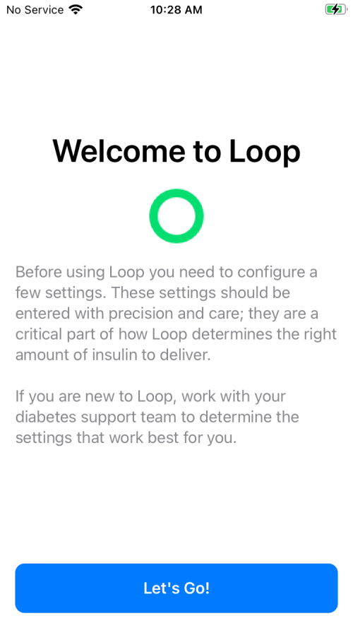
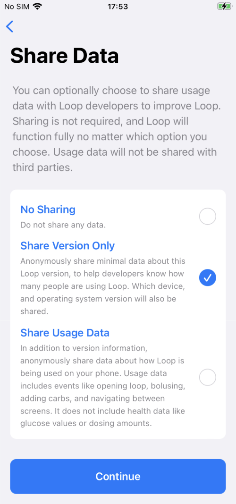
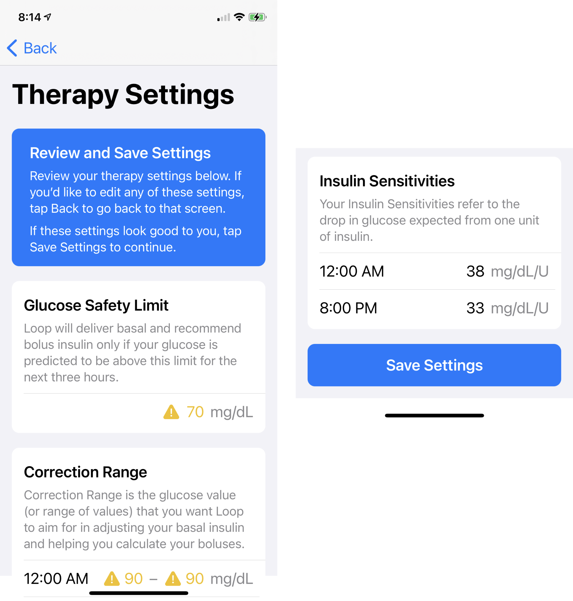

## Onboarding

As soon as your app builds on your phone, you are guided through the onboarding (set up) process. You will see information screens for each Therapy Setting and **must** acknowledge each screen. You can review those informational screens later by clicking the [Therapy Settings](therapy-settings.md) screen after a pump has been added.

### Entering and Editing Values

This section explains how to enter and edit values with Loop 3.

!!! info "Screens"
    With version 3 of the *Loop* app, the primary button, with an associated information message, is visible at the bottom of even small screens for many actions. You may need to scroll to see intermediate rows.

    There are other screens, like the Onboarding and Therapy Settings screens, where you are expected read all the provided information. Those screens require you to scroll to the bottom before being able to hit Continue or Save.

* For more information on a specific therapy setting, tap on the information icon on the screen or review the detailed [Therapy Settings](therapy-settings.md) page in LoopDocs
* Some screens only have one value for a given quantity
    * In that case, you can tap on and edit that value
    * If you tap on the value and the `Confirm Setting` or `Save` button is inactive, move the picker value to make the button active,
* Some screens allow different values for different times of day
    * Scheduled entries must start at midnight and at least one entry is required
    * During onboarding, new loopers must tap the &plus; sign to get the initial midnight time slot
    * When one or more entries are present, tap the &plus; sign to add an entry
        - Choose any time-slot without an entry
        - Enter desired value
        - Tap Add to include this entry in your schedule
    * Tap on a time-slot with an entry to edit it
        - You can change the time within the range of half hour after the slot immediately before and half hour before the slot after the slot under edit
        - You can edit the value to any allowed value
    * To delete one or more entries, tap on Edit
        - Then tap the red icon to the left of the time-slot you want to delete and select delete
        - Continue until done, then tap Done

### Glucose Units

First time connecting a glucose monitoring device to your phone's Apple Health app?  If so, the units on the phone might not be in the units you want, i.e., mg/dL or mmol/L. Loop uses the units in Apple Health.

* If the Apple Health units are mg/dL and you try to enter therapy settings suitable for mmol/L, or vice versa, the guardrails in Loop will prevent your entries
* If this happens:
    * Quit onboarding
    * Click on the link [FAQs: How Do I Change Glucose Units?](../faqs/apple-health-faqs.md#how-do-i-change-glucose-units)
    * Start the Loop app again and Onboarding will restart

## Onboarding Steps

Each onboarding step is presented in order on this page. Please follow this document while entering values into your app for the first time.

!!! abstract "Settings Help"
    Please stay in Open Loop until you verify that your settings (basal rates, insulin sensitivity, carb ratio, etc) are properly adjusted to work with the Loop algorithm. You may need time to evaluate and perhaps identify settings to adjust.

    If you need help with your settings adjustment, you may find useful tips in the companion website, LoopTips at this link: [LoopTips: Settings](https://loopkit.github.io/looptips/settings/settings/){: target="_blank" } tab.

### Welcome to Loop

The first screen you will see is the Welcome to Loop screen shown in the graphic below. Tap on `Let's Go` to continue.

{width="250"}
{align="center"}

### Apple Health Permissions

Next, you need to give Loop permission to read and write to Apple Health. In the graphic below, from left to right, tap on the buttons highlighted with red boxes to configure permissions:

* Tap on the `Share with Apple Heath` button
* Tap on the `Turn On All` button in the middle
* Tap on the `Allow` button at upper right

You need to enable Health Permissions for Loop to work.

{width="750"}
{align="center"}

You can review the permissions screen later. [FAQS: How Do I Modify Apple HealthKit Permissions](../faqs/apple-health-faqs.md#how-do-i-modify-apple-healthkit-permissions).

### Usage Data Sharing

!!! question "Language?"
    If the instructions on this screen are not your preferred language, make sure you built the released code.

Next, you will be asked your preference for Usage Data Sharing, with the default automatically set to `Share Version Only` as shown in the graphic below:

{width="350"}
{align="center"}

If you choose to share usage data, it is collected anonymously. The choices are:

* Do not share any usage data
* Share the Loop version number, phone type and iOS version number
* Additionally share usage data in terms of events only - health data such as values for glucose, insulin and carbs are **not** collected

#### Share Usage Data

If you select Share Usage Data you may wonder types of information is available to the Loop Developers.

* Statistics on loop failures can show which devices are causing more issues and which issues are more widespread
* Pod failures show whether particular versions of Loop affect the rate of failure, which helps determine fixes
* Learning how often particular features, like overrides, are used helps with future user interface design and improvements
* Language and location information helps understand the user base so `localization` (language translations) can be prioritized
* Version information helps quantify risk when a bug is found in a particular version of Loop, giving an indication of how many people may be affected

The Loop Developers are the only ones with access to this data.

### Connect Loop to Nightscout

The next screen, shown on the left of the graphic below, enables the user to both connect Loop to Nightscout and to **download existing Loop settings** from Nightscout.

!!! question "Nightscout"
    * [Nightscout](../nightscout/overview.md) is not required for Loop
    * It can be added later

!!! warning "Loop 3 with Nightscout Requires API_SECRET"
    * Even if you used Nightscout with Loop 2, you will neeed to add it again and you must include your API_SECRET

* If you have do not have a Nightscout site, or choose not to use it, select `Setup Loop without Nightscout` and skip ahead to [Therapy Settings (Onboarding)](#therapy-settings-onboarding)

* If you have a Nightscout site, select `Use Nightscout with Loop` to connect Loop to your site and download your profile (Therapy Settings) from Nightscout for review.

* If you were using a Nightscout site with a prior version of Loop, you need to type it in again.

{width="500"}
{align="center"}

If you select `Use Nightscout with Loop`:

* The right side of the graphic above shows the screen used to enter your Nightscout URL (remember to use https: with the "s") and API_SECRET.
* Once those credentials are accepted, choose whether you want to import your settings from your Nightscout profile (including any overrides previously saved).
* Every Therapy Setting downloaded from Nightscout is presented for review.

### Therapy Settings (Onboarding)

The next onboarding screens take you through the therapy settings one at a time.

The therapy settings are the heart of how Loop makes predictions. If your settings are not close, the predictions will not be correct.

* Therapy Settings
    * An informational graphic is shown before you are asked to enter or confirm each therapy setting
    * This Onboarding Page provides a brief summary of each therapy setting.
        * Each setting section on this page has a link to a more detailed description of that setting on the [Therapy Settings](therapy-settings.md) page.
        * If you follow a link, click on your browser back button to return to your place on this Onboarding page
    * While onboarding, you will see, in order:
        * Glucose Safety Limit
        * Correction Range
        * Pre-Meal Range
        * Carb Ratios
        * Basal Rates
        * Delivery Limits
            * Maximum Basal Rate
            * Maximum Bolus
        * Insulin Sensitivites

#### Guardrails While Onboarding

!!! warning "Warning - Outside Typical?"
    The Therapy Settings have "guardrails" to warn you if your settings are unusual.

    * Some indications are based on surveys of experienced Loopers
    * Some indications are for safety
    * It's fine to put Glucose Safety or Correction Ranges **higher** than "is typical"
    * It's fine to put Delivery Limits **lower** than "is typical"

Take the yellow (and red) indications with a grain of salt. You will get an extra modal screen that you must acknowledge. Simply confirm your choice and keep going.

* It's OK to ignore warnings when being conservative
* Experienced loopers may choose to ignore warnings to be more aggressive

A red limit cannot be exceeded without modifying the code itself. But values that show up as red can be saved - they are valid therapy selections.

!!! danger "mmol/L"
    People using mmol/L should avoid the red (the min or max end points) glucose values for their settings. They sometimes cause a crash.

The [Guardrails for Settings](therapy-settings.md#guardrails-for-settings) are summarized on the Therapy Settings page.

### Glucose Safety Limit

If Loop predicts that your glucose will go below the [Glucose Safety Limit](therapy-settings.md#glucose-safety-limit) at any time in the next 3 hours and Loop is in Closed Loop, it will set a temporary basal rate of 0 U/hr in an attempt to prevent that future low.

If you ask Loop for a bolus recommendation, and loop predicts your glucose will go below the Glucose Safety Limit at any time in the next 3 hours, no bolus will be recommended.

The Glucose Safety Limit can never be higher than the lowest of these related settings: [Correction Range](therapy-settings.md#correction-range) and [Pre-Meal Range](therapy-settings.md#pre-meal-range).

### Correction Range

Loop uses the [Correction Range](therapy-settings.md#correction-range) as the goal when it recommends a bolus and makes automated adjustments to insulin dosing.

!!! note "Correction Range vs Time in Range"
    For example, you may choose a correction range of 100-110 mg/dL (5.6-6.1 mmol/L) for Loop, but you may monitor your "success" or Time in Range using 70-180 mg/dL (3.9-10 mmol/L).

#### Manual vs Automated Dosing

Loop estimates future glucose over the next 6 hours (DIA) and, when in closed loop, adjusts insulin dosing. Loop uses or recommends the _smallest_ amount of insulin that will bring you to your target (Correction Range midpoint) over the whole forecast.

If you ask Loop for a manual [Bolus](../operation/features/bolus.md) recommendation while your current glucose is below the bottom of the correction range and above the glucose safety limit, Loop will recommend a value that should keep your glucose above the safety limit.

* This is only if you manually request a bolus recommendation.
* Loop will **not** automatically provide extra insulin, via high temp basal or automatic bolus, until your current glucose is higher than the bottom of your correction range.

### Pre-Meal Range

The [Pre-Meal Range](therapy-settings.md#pre-meal-range), which is optional, gives you a small amount of insulin before a meal to help control post-meal glucose spikes. The [Pre-Meal icon](../operation/features/premeal.md) is inactive if you choose not to enter a range.

!!! abstract "Example"
    If your normal range is 100-110 mg/dL (5.6-6.1 mmol/L) and pre-meal range is 80-80 mg/d L (4.4 mmol/L), Loop will give you extra insulin to move you towards the lower range number before the meal. This early insulin brings you into the meal with a mini-prebolus. The pre-meal range, when activated by pressing on the [pre-meal icon](../operation/features/premeal.md) in the toolbar, will stay active for one hour, until carbs are entered, or until it is manually cancelled...whichever comes first.

### Carb Ratios

Your [Carb Ratio](therapy-settings.md#carb-ratios) is the number of grams of carbohydrates covered by one unit of insulin.

* At least one carb ratio (CR) must be entered
* A daily schedule with varying CR can be entered

### Basal Rates

You must provide a [Basal Rate](therapy-settings.md#basal-rates) schedule and the schedule must start at midnight. Loop does not provide the option for having more than one profile saved that you can switch between.

If you onboard basal rates before a pump is added, you are limited to increments of 0.05 U/hr for basal rates and 0.00 U/hr is not allowed. Enter values close to what you actually use because the values determine your maximum basal rate in the Delivery Limits.

Once a pump is added, the basal increments will match those on your pump. The onboarding basal rates will be saved to your added pump. Return to Therapy Settings to adjust the Basal rates to your pump increments.

#### Medtronic Pump Users

If you will be connecting a Medtronic pump after onboarding:

* The values entered here will overwrite whatever is in your Medtronic pump when you first connect it
* For those who build Loop 3 over an existing Loop app with a Medtronic pump attached - you will just be confirming values you used previously
* If you have values in a [Loopable Medtronic pump](../build/pump.md#check-medtronic-pump-version) that you plan to attach after onboarding - please record those values if they are important to you

### Delivery Limits

The maximum basal rate and maximum bolus settings are collectively referred to as [Delivery Limits](therapy-settings.md#delivery-limits).

The Maximum Basal Rate the app allows you to choose will be limited based on the basal rate schedule you just entered as well as pump limits, so make sure you put in sensible values. (There is a back button if you need it.)

#### Medtronic Pump Users

If you will be connecting a Medtronic pump after onboarding:

* The values entered here will overwrite whatever is in your Medtronic pump when you first connect it
* Make sure that the Delivery Limit values in the Medtronic pump are equal to or greater than the values you enter while onboarding or you will not be allowed to connect to the pump.

#### Maximum Basal Rate

[Maximum Basal Rate](therapy-settings.md#maximum-basal-rate) will cap the maximum temporary basal rate that Loop issues to meet your correction range when you are in Closed Loop with a [Dosing Strategy](settings.md#dosing-strategy) of Temp Basal Only.

For safety, new loopers should start with a max basal set 2-3 times their highest scheduled basal rate. If you choose 2 times your highest scheduled basal, you may get a message informing you this is "lower than typical." Ignore this to put safety first as a new looper.

Experienced loopers typically set their maximum basal rate around 3-4 times their highest scheduled basal rate. Loop 3 app will not allow you to exceed 6.4 times your highest scheduled rate.

#### **Maximum Bolus**

[Maximum Bolus](therapy-settings.md#maximum-bolus) is the highest bolus amount Loop can recommend at one time to cover carbs or bring down high glucose.

For safety, don't set a maximum bolus limit any higher than your typical large meal bolus. Many people like to set a value less than 10 U, for example, 9 or 9.9 U, to avoid accidentally typing in a bolus of 10 instead of 1.0 U.

This setting also limits how much **automated** dosing is allowed. Loop will not automatically increase the user's IOB above two times the Maximum Bolus. This is true with <code>Dosing Strategy</code> of <code>Temp Basal Only</code> or <code>Automatic Bolus</code>.

### Insulin Sensitivities

Your [Insulin Sensitivity Factor](therapy-settings.md#insulin-sensitivities) is the drop in glucose expected from one unit of insulin over the entire duration of insulin activity. It may be a different value than what you used as the Correction Factor with shots or manual pumping. Loop uses your ISF every 5 minutes when calculating predicted glucose levels.

* At least one insulin sensitivity factor (ISF) must be entered
* A daily schedule with varying ISF can be entered

Loop works best if you have [tested and optimized](https://loopkit.github.io/looptips/settings/settings/){: target="_blank" } your ISF settings for accuracy. Insulin sensitivities can change for many reasons including waiting too long to change your infusion set. Loop will not auto-detect changes in ISF.

Incorrectly set ISF is a common cause of roller coaster glucoses for new Loop users. You may need to raise (increase) your ISF value/number to help smooth a roller coaster glucose trend. You can read about that topic more over in LoopTips [here](https://loopkit.github.io/looptips/settings/settings/#insulin-sensitivity-factor){: target="_blank" }.

### Therapy Settings Review

Once these are all entered, the Therapy Settings screen is shown for your review. You must scroll down to see all settings and reveal the Save Settings button.  Only the top and bottom portions are shown, the other settings were not captured for this graphic.

{width="500"}

### Notifications and Bluetooth

Once you save settings, Loop asks to send notifications and use Bluetooth. You must allow both for Loop to work properly.

* Notifications are necessary for safety reasons while Looping.

* Bluetooth lets Loop get data from your CGM and talk to your Pump.

{width="500"}

## CGM and Pump

For new Loopers, it is now time to add a CGM and a pump.  Follow these links for instructions.

* Add a [CGM](add-cgm.md)
* Add a [Pump](add-pump.md)

!!! info "Medtronic CGM"

    If you plan to use a Medtronic Enlite sensor for your CGM, you must first add that pump to Loop before the sensor will be shown as an option.

If you built Loop 3 over an existing app, your CGM and pump selections should have carried over.

## Experienced Loopers

!!! danger "Insulin Type"
    Insulin Type is in Pump Settings (not therapy settings) and will NOT be imported.

    After you finish onboarding, you must select Insulin Type on your pump settings screen. Without an insulin type, closed loop might not work or a different insulin type might be selected.

The first time you build Loop 3 on a device, you will need to go through the onboarding process too.

* If you build Loop 3 over Loop 2.2.x, the onboarding remembers the settings, previously saved overrides and your current pod or pump information is maintained. (Yes, you can build Loop 3 and keep using the same pod.)

* If you build Loop 3 onto a device without an existing Loop app and you have a Nightscout site, you can enter your Nightscout URL (remember to use https: with the "s") and API_SECRET and it will ask if you want to import your settings from your Nightscout profile. This includes all the overrides you have previously saved.

* If you are building on a device that does not have an existing Loop app and you choose not to use Nightscout, then follow the new Looper [Onboarding Steps](#onboarding-steps).

You will be presented with an information screen describing the setting (with a continue button) followed by your current settings (if available), which you must confirm to keep - or can modify and then confirm to change. Depending on the device you are using, you may need to scroll down to see the Continue or Save buttons for each setting.

!!! tip "What is in my Nightscout Profile"
    To check what is in your Nightscout profile that Loop would use as part of onboarding, follow these instructions.

    Note: you will get a json file - look that up using your favorite internet search method.

    1. Open your Nightscout URL
    1. Click in the URL address and append this text "/api/v1/profile.json"
    1. You can download the file and examine it if you are interested

### Check Imported Settings

!!! warning "WARNING"

    The new onboarding forces you to check all your imported [Therapy Settings (Onboarding Summary)](#therapy-settings-onboarding) but there may be other settings you need to check as well.

    * Dosing Strategy: may be at the default value of `Temp Basal Only`, even if you were using `Automatic Bolus` before
    * Overrides: verify these are populated as expected
    * Pumps that use a RileyLink: confirm the device is selected and active in the Pump settings screen
    * If you use Nightscout, make sure the site is getting Loop updates

    **HIGHLIGHTING THIS ONE - A LOT OF PEOPLE MISSED THIS:**

    * [Insulin Type](add-pump.md#insulin-type): ensure the correct insulin type is selected

### Carb Absorption Time Update

If you used earlier versions of Loop, please be aware that absorption times have changed.

!!! warning "Loop 3 Carb Absorption Times"
    Loop uses the absorption time for the carbs, along with your glucose readings, ISF and CR to recommend insulin dosing and estimate over time the carbs absorbed and carbs expected. See [Algorithm: Prediction](../operation/algorithm/prediction.md) for more details.

    * Loop 3 uses absorption times of 30 minute, 3 hours and 5 hours for the Candy, Taco, Pizza icons
        * Loop 2.2.x used 2 hours, 3 hours and 4 hours
    * The 30 minute (candy) time is for rapid acting carbs only

    If you selected the candy icon for a complex meal, you told Loop to expect your glucose to rise rapidly. When that rapid rise does not materialize, you may find Loop predicts an unexpectedly low glucose because the algorithm assumes something must be affecting your glucose downward in a strong way.

    If this happens to you, edit the carb entry to have a longer absorption time and Loop will recalculate the prediction.

### Carb Data Source

Loop 3 does not read non-Loop carbohydrate entries from Apple Health, as previous versions did. It still writes to Apple Health. Some experienced loopers want to modify the code to enable Loop to read carbohydrate records from Apple Health with the full understanding of how that works. The instructions for this code customization option, using a flag set in the LoopConfigOverride.xcconfig file, see the [Customize: Build-Time Features](../version/build-time-flag.md) section.

Users who build Loop 3 over Loop 2.2.x, may find a permission switch to give Loop permission to read carb data from health, but without making the customization mentioned above, changing permission does not change the behavior of Loop.
