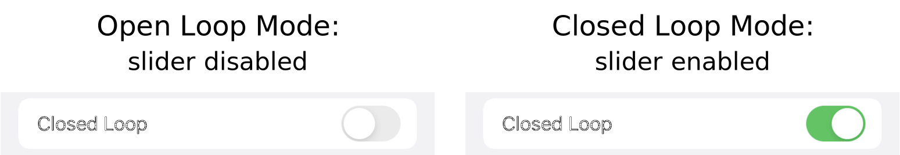
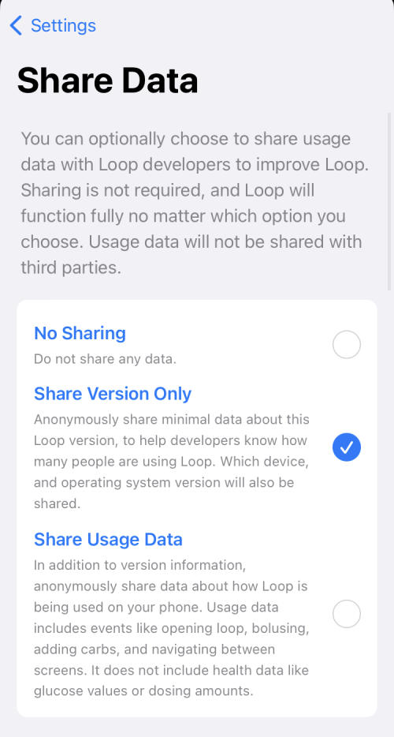
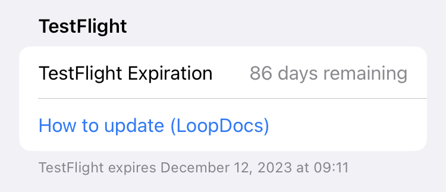
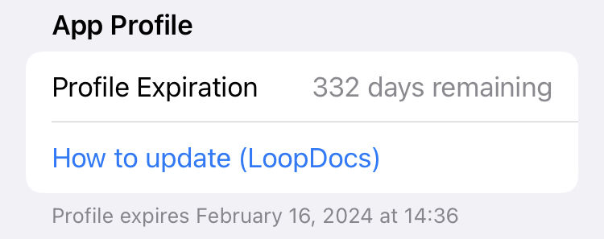

## Loop Settings Screen

The Settings screen is reached by tapping the gear icon in the [Toolbar](displays-v3.md#toolbar) on the [Main Loop Screen](displays-v3.md#main-loop-screen). The graphic below is for Loop 3.4 and later versions.

{width="250"}
{align="center"}

Each section and row on the Settings screen is described below.

## Closed Loop

The user can select closed loop or open loop using this slider. When you first start Loop, we encourage you to leave this slider disabled and become familiar with the app using [Open Loop](../operation/loop/open-loop.md) mode.

{width="500"}
{align="center"}

**As soon as Closed Loop is enabled, Loop will begin automatic adjustment of insulin dosing. Please ensure the settings you entered are appropriate for the Loop algorithm.**

No automatic (closed loop) adjustment of insulin will occur and the slider will be disabled under the following conditions.

* No Pump added
* No CGM added
* User set a [Manual Temp Basal](omnipod.md#manual-temp-basal)

### Recommended Insulin

With every loop cycle - typically every 5 minutes - Loop updates the glucose prediction using

* CGM or Fingerstick glucose value (no older than 15 minutes)
* COB from meal entries
* IOB from previous insulin delivery
* Your [Therapy Settings](therapy-settings.md)

Based on this prediction, Loop calculates a modification to insulin dosing to bring the user into the desired correction range. This can be a reduction in basal to raise the glucose prediction or a recommended bolus, subject to Delivery Limits, to lower the prediction. The glucose prediction is shown in the [Glucose Chart](displays-v3.md#charts) along with the measured glucose values.

* When in Open Loop, no automated action is taken.
* When in Closed Loop, automated action is taken based on the selected Dosing Strategy.

If you find this confusing, read how to [Think Like a Loop](https://loopkit.github.io/looptips/how-to/think-like-loop/) on the LoopTips website.

## Dosing Strategy

This row gives you the ability to select Dosing Strategy. The Dosing Strategy only affects the method by which the recommended bolus - if any - is delivered. The current selection is noted underneath the Dosing Strategy label.

### Temp Basal Only

The default (initial) value for this setting is Temp Basal Only. Tap on the arrow to the right to modify your selection.

{width="500"}
{align="center"}

!!! quote "Words in Graphic"
    **Temp Basal Only:**
    Loop will set temporary basal rates to increase and decrease insulin delivery.
    
    **Automatic Bolus:**
    Loop will automatically bolus when insulin needs are above scheduled basal, and will use temporary basal rates when needed to reduce insulin delivery below scheduled basal.

Regardless of the Dosing Strategy selected, when glucose is below target or predicted to go below target, Loop decreases basal insulin using Temporary Basal.

**Temp Basal Only:** Subject to your Delivery Limits, Loop will deliver the Recommended Bolus over 30 minutes using positive temp basals (i.e., increase over your scheduled basal rate) to increase your IOB. 

**Automatic Bolus:** Subject to your Delivery Limits, you receive 40% of the Recommended Bolus at every loop cycle.

### Automatic Bolus

When you first start Loop, we encourage you to leave Dosing Strategy set to Temp Basal Only until you are sure your settings are dialed in.

The Automatic Bolus selection causes Loop to provide 40% of the recommended dose as a bolus at the beginning of each Loop cycle (when a CGM reading comes in). This is a faster method of getting the recommended insulin delivered. When Loop delivers extra insulin, the scheduled basal rate continues unchanged.

With Loop 3.4.0 and later versions, you have the option of using Automatic Bolus with [Glucose Based Partial Application (GBPA)](features.md#glucose-based-partial-application-gbpa). This feature is reached through the [Algorithm Experiments](#algorithm-experiments) row of the Settings screen. It modifies the percentage of the recommended dose that is supplied with each Loop cycle. Instead of being a fixed 40%, it changes from 20% when glucose is near your selected Correction Range and gradually increases to 80% when glucose reaches 200 mg/dL (11.1 mmol/L).

As with all Loop versions, you can manually bolus at any time by pressing the Bolus icon in the center of Loop's Main Screen.  Any bolus recommendation that you see when you press the Bolus icon will be 100% of the Recommended Bolus.

## Alert Management

This row enables the user to modify Alert Permissions and to enable Missed Meal Notifications.

### Missed Meal Notifications

Loop detects situations where glucose excursions indicate you may have consumed carbs but did not enter them into Loop. When Missed Meal Notifications are enabled, you will be provided an alert that suggests when the meal was consumed and how many carbs are already absorbed at the time of the alert. You have the option to increase the grams of carbs to match your actual meal.

## Configuration

The Configuration section allows entry to the following screens:

### [Therapy Settings](therapy-settings.md)

There's a LoopDocs page devoted to therapy settings. Click on the link to get to that page: [Therapy Settings](therapy-settings.md).

#### Add Pump for Therapy Settings

!!! question "But I don't see Therapy Settings!"
    Therapy Settings is only accessible in the [Settings](#loop-settings-screen) screen when you have a pump connected to Loop.

    * Loop needs to know the parameters for the pump
    * There are several options presented below

#### Option 1: Prep for Pods

If you add an Omnipod (requires RileyLink) or Omnipod DASH up to the `Pair Pod` screen and then cancel, Loop will use the common Omnipod details to allow you to modify your Therapy Settings.

#### Option 2: Prep for Medtronic

If you need to modify Therapy Settings before connecting to a Medtronic pump:

* Add the Insulin Pump Simulator
    * Tap on the Pump in settings or the HUD to bring up the control screen
    * Select the type of Medtronic
    * Adjust the Therapy Settings as required
* Delete the Insulin Pump Simulator

#### Option 3: Simulate Loop

If you want to use Loop in parallel with your current method of dosing insulin.

* Add the Insulin Pump Simulator
* Tap on the Pump in settings or the HUD to bring up the control screen
* Choose the type of pump you wish to simulate (notice each pump has specific basal rates and ranges available)
* For best fidelity, use a real CGM (if available on the same phone) or set up the CGM to be from Dexcom Share or Nightscout
* For every meal or correction, you can echo that meal or correction with Loop using the simulated pump - watch and learn from recommendations and predictions

### Usage Data Sharing

!!! warning "iOS 15"
    If you are running an iOS 15 device, this screen is shown in German regardless of the language you choose for Loop. That is an accident that will be fixed by the next release. The English version is shown below.

You can review and modify your preference for Usage Data Sharing as shown in the graphic below:

{width="350"}
{align="center"}

If you change the check mark, it is immediately modified. Tap on Settings in upper left to return to the main Settings screen.

If you choose to share usage data, it is collected anonymously. The choices are:

* Do not share any usage data
* Share the Loop version number, phone type and iOS version number
* Additionally share usage data in terms of events only - health data such as values for glucose, insulin and carbs is **not** collected

### Algorithm Experiments

The Algorithm Experiments are new with Loop 3.4 and we recommend you review the details on the [Features](features.md) new with Loop 3 page. Many people have tested these and like them, but you need to decide whether to enable them.

* [Glucose Based Partial Application (GBPA)](features.md#glucose-based-partial-application-gbpa)
    * Affects speed of Automatic Bolus delivery when enabled
    * Provides smaller automatic bolus per cycle when glucose is near target range
    * Provides larger automatic bolus per cycle when glucose is higher
    * In all cases, the automatic bolus is always less than the recommended bolus
* [Integral Retrospective Correction (IRC)](features.md#integral-retrospective-correction-irc)
    * This changes the Loop model by considering longer-term differences between predicted glucose and actual glucose
    * The primary reason why people like this feature is it helps with the "stuck on high" phenomenon
    * It is not uncommon that someone who enables IRC may also need to adjust their ISF (increase the value slightly)

### Pump

The information about the pump section is detailed on several different pages. Follow the links below:

* [Add or Modify Pump](add-pump.md)
* [Omnipod or Omnipod DASH](omnipod.md) Status and Commands
* [Medtronic](medtronic.md) Status and Commands

For experts only, requires a special branch:

* [Dana Pumps](add-pump.md#dana-i-danars-v3)
* [Medtrum Pumps](add-pump.md#medtrum-nano)

### [CGM Settings](add-cgm.md)

The information about the CGM is found on the [Add or Modify CGM](add-cgm.md) page.

## Favorite Foods

[Favorite Foods](features.md#favorite-foods), new with Loop 3.4, can simplify meal entry if you choose to use it. You can create a Favorite Food here or on the Carb Entry screen. 

Note that to create a Favorite Food on the Carb Entry screen, an icon must be selected by typing on the plate icon and then choosing a food emoji. The standard Lollipop, Taco, Pizza icons selected from the top level are not sufficient to enable the Save as Favorite button.

## Services

The Services section allows additions of other services such Nightscout, Tidepool, Loggly and Amplitude.

Please refer to the [Optional: Service](services.md) page.

## Support

The Support section enables the user to provide output data ([Loop Report](#issue-report) and/or [Critical Logs](#export-critical-event-logs)) about the app. This information can be very helpful to folks trying to assist with problem reports.

The graphic below is similar to what you see when you scroll down to the Support section of the *Loop* Settings screen.

{width="250"}
{align="center"}

### `Issue Report`

Tap on the `Issue Report` row, on the graphic above, to create a Loop Report text file with a lot of useful information for the mentors or developers if they need to assist you in solving a problem. This covers 84-hours (to enable a full pod history for users of Omnipod or Omnipod DASH). When you tap that row, you'll see a message that the file is loading.  That message never goes away but the rest of the page fills in fairly quickly. After that happens, use the up arrow to see various options to save the report.

!!! note "Issue vs `Issue Report`"
    Be aware:
    
    * Issue (on github) is used to report code problems
    * `Issue Report` is an action in the *Loop* app to provide information you may need when you ask for help: refer to [How to Find Help](../intro/loopdocs-how-to.md#how-to-find-help)

It's a good idea to use the `Issue Report` button and save it along with a screenshot if you think you will ask for help.  You can always discard these if you resolve the problem on your own.

!!! tip "Pro Tip"
    The *Loop* Reports can be saved in the Files section on your iPhone. I have a folder on my phone Files named *Loop* Reports.

    You can upload them to zulipchat from your phone (new feature) using the paperclip in the zulipchat app. (Don't see a paperclip - update your app.)

### Submit Bug Report

Tap on the `Submit Bug Report` row to bring up one of the two views shown in the graphic below.  The left view is if you do not have a github account (or the phone is not signed in to your account). The right view is if your github credentials are available.

In either case, the first action should be to add a term or phrase to the search box (red rectangle) to see if your issue has already been reported and to read the status if it has been reported.  Please refer to the [GitHub Issues](../troubleshooting/overview.md#github-issues) section for more information.

{width="500"}
{align="center"}

### When Not to Submit a Bug Report

!!! warning "Not for Build or Settings Help"
    Submit Bug Report should be used when you believe there is an error in the code.

    * Use [How to Find Help](../intro/loopdocs-how-to.md#how-to-find-help) instead for these cases:
        * Trouble building
        * Trouble pairing a pod
        * Trouble with red loops
        * RileyLink is not working
        * Trouble adjusting your settings

### Export Critical Event Logs

The last row under Support creates a zip (compressed file) with detailed app information over a 7-day period. It is stored in a different format from the Loop Report and provides critical information to the developers when troubleshooting. Once the compressed file is created, you can save it and later share it with the developers if they request it.  You can always discard these if you resolve the problem on your own.

!!! tip "Pro Tip"
    The Critical Logs zip file can be saved in the Files section on your iPhone. I have a folder on my phone Files named Critical Logs.

    You can upload them to zulipchat from your phone (new feature) using the paperclip in the zulipchat app. (Don't see a paperclip - update your app.)

#### Critical Log Format

The critical logs use a JSON (JavaScript Object Notation) format.

Each day (in user's local time) has the following files:

* Alerts.json
* Carbs.json
* DeviceLog.json
* Doses.json
* DosingDecisions.json
* Glucoses.json
* Settings.json

The JSON file for each day are zipped into one file for that day and then the zip files are again zipped into a single file that you can save. The current day (up to the current time) is combined with the previous day's data.

The time stamps within the JSON files use UTC.

## TestFlight or App Profile

At the bottom of the Settings display is a section labeled either TestFlight or App Profile. This provides the number of days remaining before the *Loop* app stops working along with the date and time at which the `"Loop" is No Longer Available` or `"Loop" Beta has Expired` message appears and the refuses to open. (Prior to Loop 3.4, the TestFlight warning was available only in `dev`.)

The link for `How to update (LoopDocs)` is provided for Build with Browser or Build with *Mac* as appropriate.

In fine print, the date and time of the expiration is reported in your local time zone. The *Loop* app installed from *TestFlight* might last a day longer than the *Loop* app reports - this is a conservative estimate. The time reported in the *TestFlight* app is correct.

{width="350"}
{align="center"}

{width="350"}
{align="center"}
