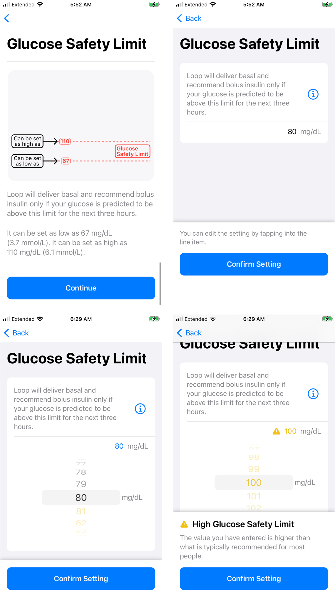
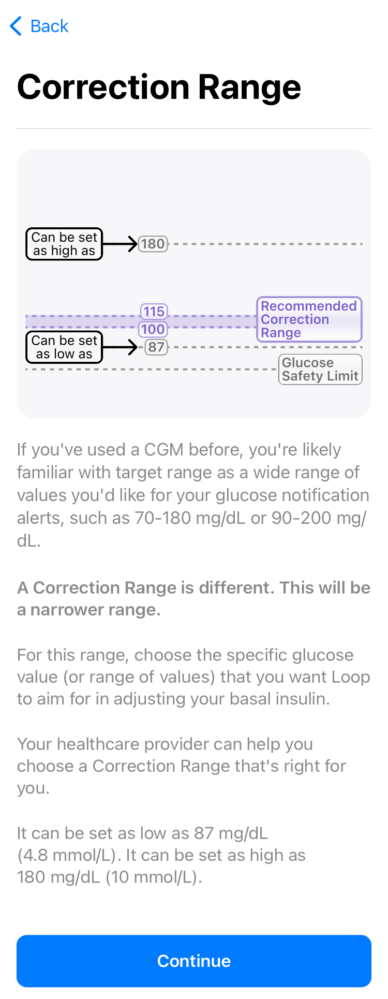

# Therapy Settings

During [Onboarding](onboarding.md#therapy-settings-onboarding), all your therapy settings were entered. 

After onboarding, the Therapy Settings screen is reached by going through the Loop Settings screen after a [pump](settings.md#add-pump-for-therapy-settings) has been added. 

This page provides more details about each Therapy Settings.

!!! danger "Work in Progress"

    This is page is not complete - expect revisions.

## Authorization Required

All the settings configured under Therapy Settings are protected by the same authorization method (FaceID, Fingerprint or Passcode) used to enable the app to issue a manual bolus.

## Details for Therapy Settings

Loop 3 has Guardrails for each of the Therapy Settings. These are found in the [Guardrails for Settings](#guardrails-for-settings) section of this page.

!!! tip "New Loopers"
    New Loopers may prefer settings that show up outside the "typical" range. 

    * These show yellow font on the picker dial and you must acknowledge a warning message that the selected value is lower, higher or outside "typical".
    * It is always fine to pick a yellow or even red value when being cautious.

    For example, choosing a Correction Range that is higher than "typical" when starting to learn Loop is fine. Once you are comfortable with how the system works, the range can be adjusted if desired - entirely up to you in consulatation with your health care professional.

**Therapy Settings are used for automated insulin delivery when Loop is in Closed-Loop mode.**

* If your Therapy Settings are not "dialed-in" before you enable closed loop, you may experience too much or too little automated insulin delivery
* Please spend the time to thoroughly understand the effect of each therapy setting

#### Screens Displayed

!!! abstract ""
    The screens displayed on this page were acquired during [Onboarding](onboarding.md#therapy-settings-onboarding) and show the full information screens available in the app with the `Continue` button.
    
    When you return to the Therapy Settings after you have onboarded and added a pump, the information screens are shown when you touch the information icon, &#9432;, on the upper right.

### Glucose Safety Limit

Loop will deliver basal and recommend bolus insulin only if your glucose is predicted to be above the Glucose Safety Limit for the next three hours.

{width="600"}
{align="center"}

The graphic above shows the default Glucose Safety Limit of 80 mg/dL bottom left and a Glucose Safety Limit of 100 mg/dL bottom right. If you feel more comfortable with a higher limit, then start there - do not let the yellow font influence you. Once you've used Loop for a while, you can revisit this setting.  

!!! note "Note"
    The value you select for Glucose Safety Limit will dictate the lowest value on the glucose picker that is available for Correction Range and Pre-Meal Range. Those cannot be lower than the Glucose Safety Limit.

[Guardrails for Glucose Safety Limit](#guardrails-for-glucose-safety-limit)

### Correction Range

Your Correction Range is the glucose value (or range of values) that you want Loop to aim for in adjusting your basal insulin and helping you calculate your boluses.

{width="600"}
{align="center"}

The graphic above shows the default Correction Range of 100 to 120 mg/dL. Do not let the yellow font discourage you if you want to have a "higher than typical" range to start with. Once you've used Loop for a while, you can revisit this setting.  

[Guardrails for Correction Range](#guardrails-for-correction-range)

### Pre-Meal Range

Your Pre-Meal Range is used to temporarily lower your glucose target before a meal to impact post-meal glucose spikes.

{width="600"}
{align="center"}

The graphic above shows the default Pre-Meal Range as empty.  This is the only Therapy Setting that is optional. You can enter a value or range of values during onboarding if you choose. This setting can be edited or deleted later. Once you've used Loop for a while, you can revisit using this option.

!!! note "Note"
    * If you do not add an entry, the pre-meal icon on the toolbar is disabled.
    * If you add an entry, the pre-meal icon is activated for 1 hour or until carbs are entered or until the user cancels it.

[Guardrails for Pre-Meal Range](#guardrails-for-pre-meal-range)

### Basal Rates

Your Basal Rate of insulin is the number of units per hour that you want to use to cover your background insulin needs.

* Loop supports 1 to 48 rates per day.
* The schedule starts at midnight and cannot contain a rate of 0 U/hr (as the only entry)

[Guardrails for Basal Rates](#guardrails-for-basal-rates)

### Delivery Limits

Delivery Limits are safety guardrails for your insulin delivery.

* Click on one of the limits on this screen, Maximum Basal Rate or Maximum Bolus, to display the picker wheel for that limit
* You must first move the picker off the current value before saving
    * When onboarding, you can restore the picker to the original level once it has been moved
    * When adjusting settings later, one of the two limits must be changed to make the `Save` button active
* You may need to put your finger on part of the screen away from the picker wheel and scroll up and down to see the other setting
* Make sure both Maximum Basal Rate and Maximum Bolus have the desired value before hitting `Save`

### Maximum Basal Rate

Maximum Basal Rate is the maximum automatically adjusted basal rate that Loop is allowed to enact to help reach your correction range. Some users choose a value 2, 3, or 4 times their highest scheduled basal rate. Work with your healthcare provider to choose a value that is higher than your highest scheduled basal rate, but as conservative or aggressive as you feel comfortable.

[Guardrails for Maximum Basal Rate](#guardrails-for-maximum-basal-rate)

### Maximum Bolus

Maximum Bolus is the highest bolus amount that you will allow Loop to recommend at one time to cover carbs or bring down high glucose.

If you manually enter a value in the Bolus screen that is greater than the Maximum Bolus setting, Loop will show a warning message and refuse to bolus that amount.

For safety, don't set a maximum bolus limit any higher than your typical large meal bolus. Many people like to set a value less than 10 U, for example, 9 or 9.9 U, to avoid accidentally typing in a bolus of 10 instead of 1.0 U.

[Guardrails for Maximum Bolus](#guardrails-for-maximum-bolus)

### Insulin Model 

Loop selects a specific insulin action model based on your entry here and when you add a [pump](add-pump.md#insulin-type).

This setting must be entered during onboarding regardless of the type of insulin you will use in your pump.

* The Loop models used for "rapid acting" insulins, e.g., Novolog, Humalog or Apidra, do not distinguish between brands.  However, a different model is available for Adult or Child. 
* The Loop models for "ultra rapid" insulins such as Fiasp or Lyumjev, each have their own model.
    * There is no differentiation between Adult and Child, at this time.
    * The Therapy Settings Insulin selection is not used for "ultra rapid" insulins.

### Carb Ratios

Your Carb Ratio is the number of grams of carbohydrates covered by one unit of insulin.

* At least one carb ratio must be entered
* A daily schedule with varying carb ratio at different times of day can be entered using the &plus; sign

[Guardrails for Carb Ratios](#guardrails-for-carb-ratios)

### Insulin Sensitivities

Your Insulin Sensitivities refer to the drop in glucose expected from one unit of insulin over the full duration of the insulin action time.

* At least one insulin sensitivity must be entered
* A daily schedule with varying insulin sensitivities at different times of day can be entered using the &plus; sign

[Guardrails for Insulin Sensitivities](#guardrails-for-insulin-sensitivities)

## Guardrails for Settings

Loop has guardrails for Therapy Settings, provided for reference below.

!!! tip "Experienced Loopers"
    The guardrails for each therapy setting used by Loop can be modified with [Code Customization](../build/code_customization.md).

The font color in the value picker has the following meaning:

* **black**: value is within the range "recommended by Loop"
* **yellow**: value is outside the range "typical" for Loopers
    * It is fine to choose yellow values - sometimes that's a good choice for a new Looper
* **red**: value is minimum or maximum limit of the range "allowed by Loop"

When a table is provided for guardrails, it lists from left to right: the lower limit, min recommended, max recommended and upper limit values for that guardrail.

!!! question "Mobile Device"
    * On a mobile device, you may need to scroll the table left to right to see all four values.
    * Try landscape mode to see the entire table width without scrolling.

#### Guardrails for Glucose Safety Limit

|  Units |  limit | min |  max | limit |
|--|--:|--:|--:|--:|
| mg/dL | 67 | 74 | 80 | 110 |
| mmol/L | 3.7 | 4.2 | 4.4 | 6.0 |

* Top value available on the picker can be limited by code constraint, your Correction Range and your Pre-Meal Range

#### Guardrails for Correction Range

|  Units |  limit | min |  max | limit |
|--|--:|--:|--:|--:|
| mg/dL | 87 | 100 | 115 | 180 |
| mmol/L | 4.8 | 5.6 | 6.3 | 10.0 |

* Bottom value available on the picker can be limited by code constraint AND your selected Glucose Safety Limit

#### Guardrails for Pre-Meal Range

|  Units |  limit | min |  max | limit |
|--|--:|--:|--:|--:|
| mg/dL | n/a | safety | 106 | 130 |
| mmol/L | n/a | safety | 5.9 | 7.2 |

* Bottom value available on the picker is limited by your selected Glucose Safety Limit (safety) in the table above.

#### Guardrails for Basal Rates

* Limited by your selected pump (or if no pump selected, then generic pump limits apply)
    * Generic Pump rates from 0.05 U/hr to 30 U/hr in steps of 0.05
* Top value available on the picker is your Maximum Basal Rate (once that is set)

#### Guardrails for Maximum Basal Rate

* Top value available on the picker is 6.4 times the highest basal rate in your scheduled basal rates

#### Guardrails for Maximum Bolus

The maximum bolus is limited by your pump, but it is a good idea to limit it to the maximum you use for a common "big" meal. This only limits the bolus for a single dose.

#### Guardrails for Carb Ratios

|  Units |  limit | min |  max | limit |
|--|--:|--:|--:|--:|
| g/U | 2.0 | 4.0 | 28.0 | 150.0 |

#### Guardrails for Insulin Sensitivities

|  Units |  limit | min |  max | limit |
|--|--:|--:|--:|--:|
| mg/dL/U | 10 | 16 | 399 | 500 |
| mmol/L/U | 0.6 | 0.9 | 22.1 | 27.8 |

