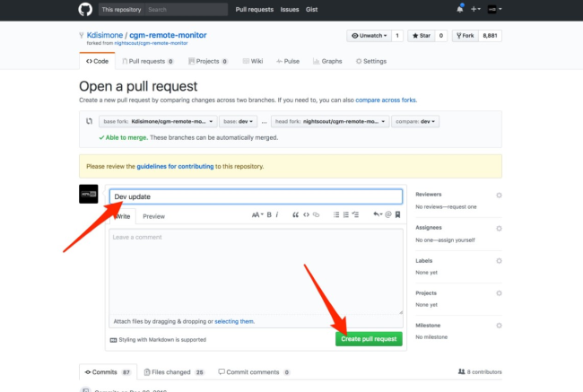
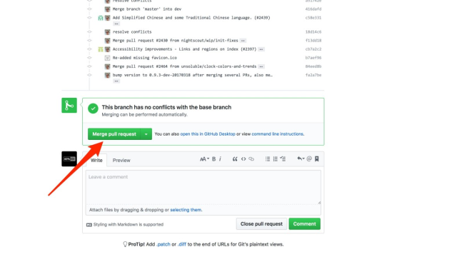
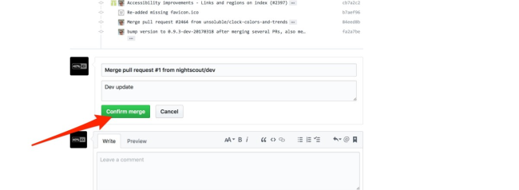
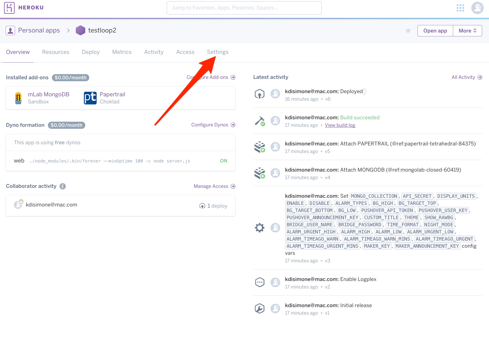
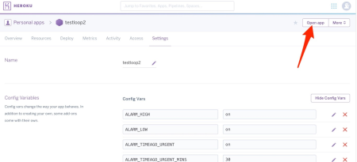
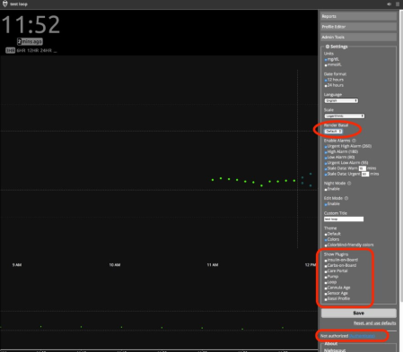

# Migrating from Azure to Heroku

If you are a current Azure user who wants to move to Heroku, but not loose all your old NS data, you will do the following steps:

* update your repository in GitHub
* create a new heroku nightscout site
* migrate your mLab database to new site

## Updating your repository in GitHub

1.  Copy, paste, and goto the one of the following links depending on which branch of cgm-remote-monitor you want to use for your Nightscout site. If you are unsure, use the master branch. (replace "yourgithubname" with your actual GitHub user name)

For dev branch deployments:

https://github.com/yourgithubname/cgm-remote-monitor/compare/dev...nightscout:dev

 or for master branch deployments:

https://github.com/yourgithubname/cgm-remote-monitor/compare/master...nightscout:master

2. Click the big green "create pull request" button. Another screen will appear, fill in a title and click button to create the pull request, and then you can "Merge Pull Request", and finally "confirm merge".
 

 

 

 

3. Your cgm-remote-monitor repository is now up-to-date.  Nice work.

## Heroku Nightscout Site Setup

1.  Create an account at [Heroku](https://www.heroku.com) and choose the Primary Development Language to be Node.js when you create your account.  You’re going to use a free account, but you will still need to enter credit card information for your account setup.  Don’t forget to check your email to confirm your Heroku account.

2.  Create an account at [GitHub](https://github.com)

3.  Go to the [Nightscout cgm-remote-monitor repository](https://github.com/nightscout/cgm-remote-monitor)

4.   Click the “Fork” button in the upper right corner

5. Scroll down until you see the purple “deploy to Heroku” button.  Click that button.

6. Give your app a name, this will be the prefix of your NS site’s URL. For example, https://yourappname.herokuapp.com

7.  Fill out the information lines in the “Config Variables” Section of that page, as shown below.  Some of the lines can stay with the default entries already provided.

<dl>
<dt>API_SECRET</dt>
<dd>Create your own API_SECRET…this is like the password to your NS site.  Please write it down somewhere safe or commit it to memory, you will be using it in the future.  It needs to be at least 12 characters long and should NOT use the `@` symbol.</dd>  

<dt>DISPLAY_UNITS</dt>
<dd>enter either mg/dl or mmol</dd>

<dt>ENABLE</dt>
<dd>bridge loop pump iob cob basal careportal sage cage

(enter all of the ENABLE words, without commas.  Just a single space between each word. Make sure autocorrect does not add space between careportal)</dd>

<dt>DISABLE</dt>
<dd>Leave blank</dd>

<dt>ALARM_TYPES</dt>
<dd>simple</dd>

<dt>BG_HIGH</dt>
<dd>enter the numeric value of BG you’d like as an high urgent alarm (Red urgent alert)</dd>

<dt>BG_TARGET TOP</dt>
<dd>enter the numeric value of the top of your target BG or the value you’d like NS to start to alert you to high BG values (Yellow warning alert)</dd>

<dt>BG_TARGET_BOTTOM</dt>
<dd>enter the numeric value of the bottom of your target BG or the value you’d like NS to start to alert you to low BG values (Yellow warning alert)</dd>

<dt>BG_LOW</dt>
<dd>enter the numeric value of the BG you’d like as an urgent low alarm (Red urgent alert)</dd>

<dt>PUSHOVER lines</dt>
<dd>Can be left blank for now.   See PUSHOVER section if you want to integrate PUSHOVER notifications with NS later.</dd>

<dt>CUSTOM_TITLE</dt>
<dd>This will be the text displayed in the upper left part of the NS website</dd>

<dt>THEME</dt>
<dd>change the them from default to colors</dd>

<dt>BRIDGE_USER_NAME</dt>
<dd>Enter your Dexcom Share Account login name.  This should be the same account name that the t1d's Share2 app is using in the account settings tab on the Share2 app.</dd>

<dt>BRIDGE_PASSWORD</dt>
<dd>Enter your Dexcom Share Account password</dd>

<dt>The remaining variables can be left at their default values.<dt>
</dl>

8.   Click the purple Deploy button at the bottom of screen

9.  Wait a little bit while Heroku builds your NS app.  You’ll see some text scroll by in the Build App box, and then finally, you will have a message that the NS app was successfully deployed.

10.  You can verify your site’s successful build by clicking View (you should see black site with a profile warning).  You will be redirected to a profile set-up page.  (If it doesn't redirect automatically, refresh your webpage).  

You do not have to enter all the information in the Profile if you are using Loop (since Loop will be providing the information for IOB and COB rather than letting NS calculate them), but you do have to fill out the Basal Profile and TimeZone at a minimum in order to have your temp basals properly display.  Click Save when you have entered the information.  You will be prompted to “authenticate”, if it is the first time you’ve used the device to make changes in your profile.  Click on the Authenticate link at the bottom of the site, and enter your API_SECRET to complete the authentication.

11.  Assuming your previous browser tab is still open for "Create a new App | Heroku", let's go back to that tab.  This time instead of choosing the "View app" option, we are going to select the "Manage App" button. Then, select the “settings” tab near the top of the screen on your Heroku app.

12.  Click on “Reveal Config  Vars”.  Scroll down the bottom of the Config Vars lines until you find the last blank one.  You are going to add several additional lines of config vars for Loop use; the DEVICESTATUS_ADVANCED is a required line, the others just make Nightscout more useful when Looping.

<dl>
<dt>DEVICESTATUS_ADVANCED</dt>
<dd>true</dd>

<dt>PUMP_RETRO_FIELDS</dt>
<dd>battery reservoir clock status</dd>

<dt>PUMP_FIELDS</dt>
<dd>battery reservoir clock status</dd>

<dt>SHOW_FORECAST</dt>
<dd>loop</dd>

<dt>SHOW_PLUGINS</dt>
<dd>loop pump cob iob sage cage careportal</dd>

<dt>PUMP_ENABLE_ALERTS</dt>
<dd>true</dd>

<dt>PUMP_URGENT_BATT_U</dt>
<dd>30</dd>
(this is the pump battery percentage that will trigger a red, urgent alert in NS)

<dt>PUMP_URGENT_BATT_V</dt>
<dd>1.25</dd>
(this is the pump battery voltage that will trigger a red, urgent alert in NS)

<dt>PUMP_URGENT_RES</dt>
<dd>10</dd>
(this is the reservoir volume that will trigger a red, urgent alert in NS)

<dt>PUMP_URGENT_CLOCK</dt>
<dd>30

<dt>LOOP_ENABLE_ALERTS</dt>
<dd>true</dd>

<dt>LOOP_WARN</dt>
<dd>20</dd>
(this is the minutes since Loop last successfully looped, the t1d will have a similar notification at this time through the Loop app.  this will be a yellow alert in NS.)

<dt>LOOP_URGENT</dt>
<dd>60</dd>
(same as the alert above, but will be red in color and have a shorter snooze option)
</dl>

13. Click on “Open App” in the top right corner of your Heroku site.

14.  Click on the settings (those three horizontal lines in upper right corner).  Now check  that your basal render is selected to either default or icicle (personal preference for how the temp basals show as blue lines in NS site), check the boxes that you’d like pills showing for info on your NS site in the SHOW PLUGINS (usually all of them), and then press save.

Your new Nightscout site is all set-up.  Congrats!

## Migrate mLab database

Ff you’d like to seamlessly keep all your old Azure NS data showing in your new Heroku NS site, you’ll need to copy and paste your old MONGODB string from your Azure site.  Find it in either Application Settings or Connection strings in your Azure control panel and then go to Heroku’s MONGODB_URI line.  Replace the content with your copied string from Azure.  Double check that your Azure collection used the “entries” name…if it doesn’t, then you will need to update that variable in Heroku to match as well.

## EVENT HISTORY

Don't forget to keep you Loop App's Preferred Source set to "Event History" if you want your NS site to smoothly integrate.  Preferred Source set to "Reservoir Volumes" will result in carbs not being uploaded and temp basals not being displayed.

