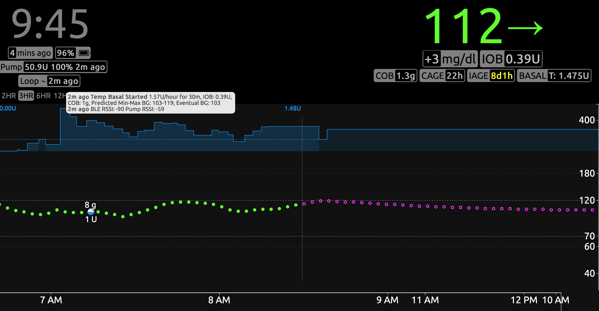

## Overview

*Nightscout* is an excellent tool for remotely viewing *Loop* actions. *Nightscout* can act as a stand-alone tool or be integrated with *Loop*. (*Nightscout* also integrates with other open-source hybrid closed loop systems such as *OpenAPS*, *AndroidAPS* and *Trio*. *LoopDocs* focuses on *Loop*.)

When integrated with *Loop*, *Nightscout* provides monitoring of *Loop* activities such as viewing history of glucose, carbs, boluses, temp basals and overrides; troubleshooting *Loop* errors; and provides extensive reports for analyzing data trends and patterns. These reports assist when *Loop* Therapy Settings need to be adjusted.

For caregivers, *Nightscout* enables remote monitoring and even the ability to issue remote commands through *Nightscout* when both *Loop* and *Nightscout* are properly configured. There are several pages starting at [*LoopDocs*: Remote Overview](remote-overview.md) that provide documentation on this feature. If you are a caregiver, this summary of remote capabilities may encourage you to look into *Nightscout*.

!!! info "Remote Commands"
    * *Loop 2.2.x*
        * Overrides can be enabled and disabled
    * *Loop 3*
        * Overrides can be enabled and disabled
        * Carbs can be entered
        * Boluses can be commanded
        * *LoopCaregiver* app (under development, iOS only) enables the following from the caregiver's phone
            * monitor *Loop*
            * issue remote commands for carbs, bolus, and overrides

    If you plan to use remote commanding with *Nightscout*, please read these links with additional information:

    * [Set Up Remote for *Nightscout*](../nightscout/remote-config.md#set-up-remote-for-nightscout)
        * [Paid Providers and Remote Configuration](../nightscout/remote-config.md#paid-providers-and-remote-configuration)

*Nightscout* is useful for many who use *Loop*. Adults who take care of themselves find the reports and analysis methods from *Nightscout* provide effective tools to monitor their settings and provide reports for their health care provider. It also stores *Loop* configurations so they can be reviewed. With *Loop 3*, the saved *Nightscout* profiles can be downloaded to a new *Loop* installation or a new phone for quick onboarding, should you ever need to start fresh.

Setting up a *Nightscout* site is described in a separate web site: [*Nightscout*: Documentation](https://nightscout.github.io){: target="_blank" }.

There are *Nightscout* apps in your iPhone App Store that allow you to view the *Nightscout* site after you've configured it, or you can use a web browser to view the data. The app alone is not enough - you need to follow the steps to configure your own *Nightscout* site and obtain your specific *Nightscout* URL.

* *Nightscout* is highly recommended for *Loop* users, especially for caregivers helping someone use *Loop*
* *Nightscout* displays are often the easiest way to troubleshoot *Loop* settings if you are having problems and seeking input from others
* *Nightscout* provides reporting features for longer-term review and preparing information for your physician

## *Nightscout* Documentation

There used to be a lot of *Nightscout* information found only in *LoopDocs*, but that was transferred and subsequently updated in [*Nightscout*: Documentation](https://nightscout.github.io){: target="_blank" }. The information that remains in *LoopDocs* about *Nightscout* is *Loop* specific. So you may be jumping back and forth between the two sets of documents.

!!! info ""

    * If you see the *Nightscout* Owl logo in upper left you are in the *Nightscout* website
    * If you see the *LoopDocs* green-loop logo in upper left you are in the *LoopDocs* website
    * While in the *Nightscout* tab of *LoopDocs*, most links have a *Nightscout* or *LoopDocs* in the link name
    * Suggestion: open the [*Nightscout*: Documentation](https://nightscout.github.io){: target="_blank" } in a separate tab or window of your browser for easy access to both websites

## *Nightscout* with *Loop*

This page provides a general discussion about the *Nightscout* display, as well as some *Loop*-specific display information. Over time, interactions between *Loop* and *Nightscout* were improved. The information on this page has been updated for *Loop 3* and *Nightscout* version 14.2.6 (or later). Older versions may exhibit some differences in the display of *Loop* information on the *Nightscout* site.

### *Loop* Uploads to *Nightscout*

The *Nightscout* display updates when the *Loop* phone is connected to the internet via WiFi or cellular service. When the uploads stop, the *Loop* *pill* becomes "stale" (cannot open it) after 15 minutes.

*Pills* are the little information boxes. They are [*Nightscout*: Plugins](https://nightscout.github.io/nightscout/setup_variables/#plugins){: target="_blank" } that must be enabled with configuration variables and then the display for each *pill* can be turned on or off within your *Nightscout* site.

If upload to *Nightscout* is interrupted, *Loop 3* stores up to 7 days of *Nightscout* information in a local buffer on the phone, and will attempt to upload later when access is restored. Once access is restored, a stale *Loop* Pill may require 15 minutes before it will open to display additional *Loop* information.

The Carb *pill* on the *Nightscout* site is populated by *Loop* when *Loop* is actively uploading to *Nightscout* - but it may lag the value displayed in the *Loop* *pill* by one loop cycle and it will display 0 COB within 5 to 10 minutes if the upload is interrupted. In other words, if the COB *pill* shows 0 unexpectedly and *Loop* *pill* is active, you can believe the value shown in the *Loop* *pill*.

### *Loop 2* Red *Loop* Warning

With *Loop 2.2.9* and earlier versions, when a *Nightscout* site is selected in *Loop* Services **and** is unable to upload messages to that site, *Loop* keeps trying to upload the buffer of stored messages. This could lead to sluggish behavior in *Loop* or even cause a &nbsp;Red Loop. This can happen if the *Nightscout* site is not accessible (no WiFi or cellular coverage) or if the database is full and not accepting messages.

Step 1: Remove *Nightscout* URL from *Loop* Services

Step 2: Figure out why the *Nightscout* site is not accepting uploads from *Loop* and fix that problem.

* [*Nightscout*: Troubleshooting](https://nightscout.github.io/troubleshoot/troubleshoot){: target="_blank" }
* [*Nightscout*: Database Management](https://nightscout.github.io/nightscout/admin_tools/#database-maintenance){: target="_blank" }

Step 3: Add *Nightscout* URL to *Loop* Services

Note - the method used by *Loop 3* is not subject to this same problem.

??? tip "Do you want to know more? (Click to open)"
    For those who want to know more:

    There is a big architectural change between *Loop 2* and *Loop 3* for remote data services like *Nightscout*.

    It used to be that Loop would keep trying to upload data to *Nightscout*. If a site could not be reached or would not accept data, that could cause large backlogs. *Loop* 2 could slow down by trying to keep uploading the backlog. The new system does not allow for this. Uploaders individually keep track of where they are in the upload stream via a lightweight “query handle”, and if the data in *Loop* data store expires before upload, that data will be missing in *Nightscout*.

    *Loop 3* saves 7 days of information in the data store.

## *Nightscout* Dashboard

{width="600"}
{align="center"}

### Blood Glucose

Glucose readings from the CGM are shown in green, yellow, or red in the main Dashboard of *Nightscout*. (The graphic above was generated with Colors enabled in *Nightscout*; there are other display options.) You can adjust your high and low glucose alarm thresholds in *Nightscout* by modifying configuration variables. This is optional - defaults are provided if you do not set them. The alarm thresholds affect the color of the displayed CGM data points and, if enabled, determine when an audible and visible alarm sounds. The *Nightscout* alarm thresholds will not affect *Loop* performance. *Loop* only uses the glucose correction ranges in the *Loop* app settings.

The main dashboard (upper section) for *Nightscout* displays the time duration you have selected (in the example above, 12 hours). The bottom of the screen shows the last 48-hours of glucose trends. You can scan backward by dragging the bottom timeline to the left, if you want to review specific *Loop* actions or data in the last two days.

### SAGE, CAGE, BAGE

The SAGE, CAGE, and BAGE *pills* are for Sensor Age, Cannula Age, and (pump) Battery Age. These optional *pills* track the time since your CGM sensor, Pump site, and Pump battery were last changed. You can set up custom alerts to remind you when it is time to change the devices, or simply use the visuals to keep track of your particular timing for site/sensor changes. When these items do not auto-upload, you can use the *Nightscout* Careportal to input the changes.

* *Loop 3.3.0 or newer*: The SAGE and CAGE fields are automatically uploaded
* *Loop 3.2.x or older*: None of the fields are automatically uploaded

### Carbs

Carbs are automatically uploaded to *Nightscout* by the *Loop* app. The amount of carbs on board (active carbs or COB) can be seen by clicking the *Loop* *pill*. The size of a white carb dot on the graph is proportional to the amount of carbs entered...bigger meals get bigger dots. *Loop* does not read carbs from *Nightscout* for use in looping calculations, it only uploads carbs to *Nightscout* that have been entered in the *Loop* app.

### Boluses

Insulin boluses are automatically uploaded to *Nightscout* by the *Loop* app. The bolus is shown as a filled-in blue lower-half of the dot, and the specific amount of the bolus is also shown. There may be a separation between the bolus and the carb entry, especially if the user preboluses a meal.

The bolus is uploaded to *Nightscout* as soon as it starts and Insulin on board (active insulin or IOB) is updated in the *Loop* *pill*. Should the bolus be interrupted, the *Nightscout* information is updated when the *Loop* information updates (assuming internet access is active).

### Temp Basals

Your current basal profile is automatically updated to *Nightscout* whenever it is changed by *Loop*. The dashed blue line represents the scheduled basal profile. The solid blue lines indicate the actual basal amounts set for a given time...so as *Loop* sets temp basals higher or lower than your scheduled basal rate. If the graph and *Loop* *pill* do not agree, you should believe the *Loop* *pill*.

### Predicted Glucose

The purple line to the right of the glucose is *Loop* predicted glucose. Watching the behavior of that purple line can help you understand why *Loop* is making decisions regarding high or low temps. You can read more on that topic in the [*LoopDocs*: Algorithm](../operation/algorithm/overview.md) section of these docs. If you don't see the prediction (and all other *Nightscout* and *Loop* settings are configured), tap on the 3 dots to the right of the 24 to reveal the choice to display AR2 prediction or *Loop* prediction. Adjust the check boxes to show just the *Loop* prediction.

### *Loop* *Pill*

The *Loop* *pill* is the little display box which, when hovered over or clicked, will provide additional information about recent *Loop* activities and status. Information included is the last time *Loop* ran, the temp basal set, IOB, and COB. Looking at the *Loop* *pill* is a quick method for assessing if your loop is currently active, as well.

!!! info "*Loop* Pill status indicator symbols"

    X 
    Error in *Loop*

    ϕ 
    Recommending basal or bolus, but not enacting (open loop or pump suspended)

    ⌁ 
    Enacted a new temp basal

    ↻ 
    *Loop* is continuing with last temp basal, no change

    ⚠ 
    Warning indicating *Loop* is either red or has failed to upload to *Nightscout* for a longer period of time.

Mouse over or touch the *Loop* *pill* to view a tooltip containing one or more of the latest status messages. The most up-to-date *Nightscout* also includes information in the *Loop* *pill* for the minimum and maximum predicted glucose, eventual and predicted glucose.

{width="750"}
{align="center"}
