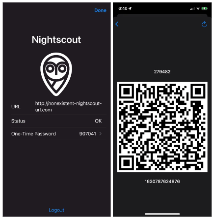
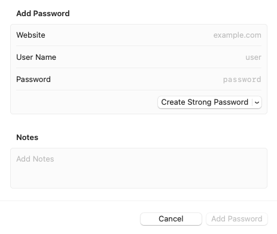
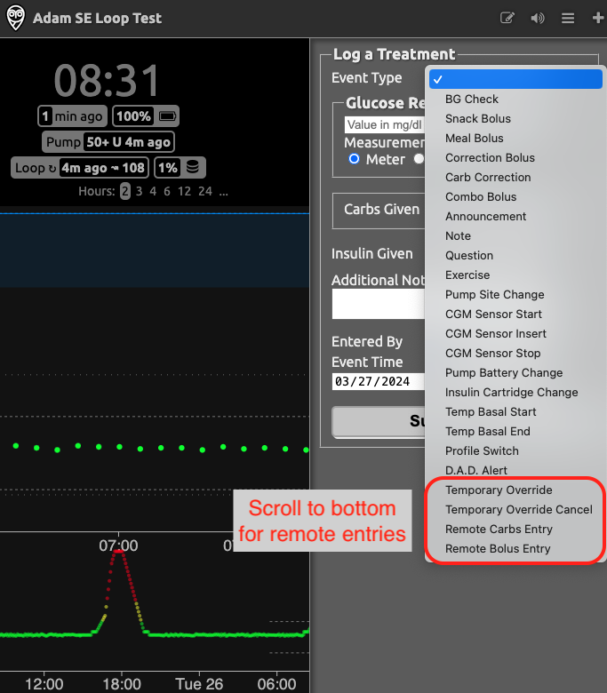
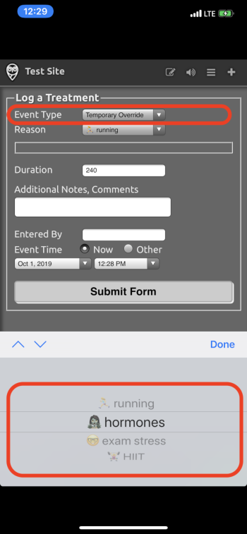
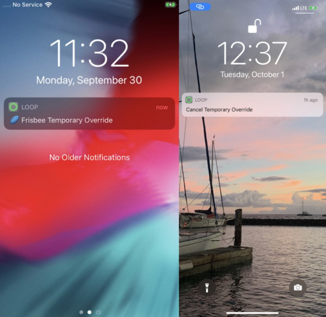

## Requirements

All remote commands require the configuration steps from [Remote Configuration](remote-config.md).

* A new One-Time Password (OTP) is required for each remote command that issues a bolus or adds a carb entry
    * The OTP updates every 30 seconds
    * Both the sending device and the Loop phone must have automatic time enabled
* Remote Overrides do not require a One-Time Password (OTP)
    * There are some versions of *Nightscout* that provide a row for entry of an OTP for Temporary Override in the *Nightscout* Careportal
    * Leave that row blank

!!! question "Do I have to use *LoopCaregiver* ?"
    There are a number of methods for using remote commands.

    Things everyone needs to know are covered on this page, so you should read it regardless of how you plan to issue remote commands.
    
    If you decide on *LoopCaregiver* , review both this page and &nbsp;[*LoopCaregiver*](loop-caregiver.md) page.

## QR Code

On the&nbsp;_Loop_&nbsp;phone, *Nightscout* must be included under the `Loop` -> Settings -> Services section. Navigate to Services and select *Nightscout*. Tap on the One-Time Password row to view the QR code.

When you need to configure your authentication method, you can either use a saved QR screenshot or scan the QR on the&nbsp;_Loop_&nbsp;phone.

Options:

* Have your Looper (or at least their phone) available
* Save a screenshot of their QR code
    * Keep this secure
    * Do not share the QR screenshot when asking for help

{width="650"}
{align="center"}

While you are on the *Loop* Settings -> Services -> NightScout screen, notice that the 6-digit number on the One-Time Password row updates every 30 seconds.

## Set up an Authentication App

You need to set up an authentication app to generate one-time-passwords for remote bolus and carbs.

One of the nice features of *LoopCaregiver* is that it handles the one-time password (OTP) requirements for you.

But even if you choose to use *LoopCaregiver* , you should configure an authentication app for cases where you don't have access to your *LoopCaregiver* phone.

There are several authentication apps that support one-time passwords.

### Apple Keychain

If you are using an iPhone or a Mac to issue remote commands through a browser or *Nightscout* app, you can use the &nbsp;Apple Keychain&nbsp; which has native support to store passwords and generate one-time passwords. 

To set up your *Nightscout* credentials in &nbsp;Apple Keychain:

On the Caregivers device (iPhone or Mac):

* The first step depends on iOS version
    * For iOS 17 and earlier, use iOS Settings, Passwords
    * For iOS 18 and newer, use the *Apple* [Password app](https://support.apple.com/en-us/104955)

* Tap the + Button up top to add a new Password

    {width="500"}
    {align="center"}

* You will enter your *Nightscout* credentials
    * Website: Enter a portion of the *Nightscout* URL, without the leading “https://”
    * Username: Enter the full *Nightscout* URL including the leading “https://” part
    * Password: Enter the API_SECRET for the Looper's *Nightscout* site
    * Tap Done
* Next, you are offered a screen that allows you to set up a `Verification Code`
    * If you need to come back later, you can find that screen again
        * For iOS 17 and earlier, use iPhone Settings -> Passwords
        * For iOS 18 and newer, use the *Apple* [Password app](https://support.apple.com/en-us/104955)
    * -> Tap the row with your *Nightscout* URL
* Tap “Setup Verification Code”
    * This is where you can scan your QR code from the&nbsp;_Loop_&nbsp;phone or the saved QR screenshot
    * As soon as the camera reads the QR code, an OTP will begin to appear
    * If the&nbsp;_Loop_&nbsp;phone is handy, wait a cycle or two and ensure the 6-digit OTP on the password screen matches that on the&nbsp;_Loop_&nbsp;phone and they update at the same time
    * Click Passwords on the upper left to return to the previous screen
* Select Passwords Options
    * Enable the `Autofill Passwords` and check `Keychain`

### Using Safari

* When you use Safari to view your Looper's *Nightscout* site and choose the Careportal (:material-plus-thick:)
    * Choose a remote command from the Event Type dropdown menu (remote commands are at the bottom of the list)
    * The OTP will be offered to you for every row - ignore it when entering Carb amount or Absorption Time, or Bolus Amount
    * Select it for the OTP row
    * Note that OTP is not required for Remote Overrides - leave that row blank

### Other Authentication Apps

There are other Authentication apps available. Here are a few options that you can download from your phone’s app store:

* *1Password*
* *Authenticator*
* *Authy*

## FAQs for all Remote Commands

1. **If I have multiple *Nightscout* sites because I support multiple people with T1D looping, do I need multiple APNs Keys?**  
   **Answer**: No. If you support multiple people, you can use the one APNs key in each of their *Nightscout* sites.

1. **How can I tell if it worked?**  
   **Answer**: You should see your override pill in *Nightscout*, with the **NEXT**&nbsp;_Loop_&nbsp;cycle, reflecting that the desired remote action took place. If you are near the&nbsp;_Loop_&nbsp;phone, you should see the new override within less than 30 seconds or so.

## FAQs on Remote Overrides

Don't forget to read [*Loopdocs*: Overrides](../operation/features/overrides.md). 

For remote overrides in particular:

1. **Can I set a different override in *Nighscout* than I have programmed into&nbsp;_Loop_&nbsp;app?**  
   **Answer**: No. You will only be able to enact override presets already programmed into the Loop app.

1. **If I didn't start the override in *Nightscout* (it was started in&nbsp;_Loop_&nbsp;itself), can I still use *Nightscout* to cancel it?**  
   **Answer**: Yes. You can cancel an override set in&nbsp;_Loop_&nbsp;with a Nightscout-set cancel "temporary override" command in the careportal.

1. **Can I replace an override set in&nbsp;_Loop_&nbsp;with an override set in *Nightscout*?**  
   **Answer**: Yes.

1. **Can I see on *Nightscout* when a temporary override has been set using the looper’s phone?**  
   **Answer**: Yes. There will be a grey bar with the name of the override noted and the *Loop pill* will display the targets and duration. Remember, there is a KNOWN issue with the grey bars, so use the *pill* as your best guide.

1. **Can a looper cancel a remote override**?  
   **Answer**: Yes. They can tap the heart icon :fontawesome-solid-heart-pulse: in&nbsp;_Loop_&nbsp;so that it is no longer highlighted. This turns off the override, regardless of where it was initiated.

1. **I set a remote override in *Nightscout* but the Looper tapped the heart symbol :fontawesome-solid-heart-pulse: in the *Loop* app, so the override turned off. Will the override get reinstated  the next time&nbsp;_Loop_&nbsp;completes with internet access?**  
   **Answer**: No. The *APN* is only sent once. You can set the remote override again if need be.

1. **Can I schedule a remote override ahead of time using Nightscout?**    
   **Answer**: No. When you set a remote override in *Nightscout*, it starts immediately and lasts for the duration programmed for that override in the *Loop* app. You can only set an override in advance using the *Loop* app.

## Remote Commands

Remote Commands to deliver a bolus or add a carb entry **require** a &nbsp;One Time Passcode&nbsp; (OTP).

!!! important "Minimum Versions: Loop 3&nbsp; and &nbsp;**Nightscout 14.2.6**"
    If your Nightscout version does not meet that minimum requirement, remote commands **might** be accepted but if they are, the time for the commands is always the current time. In other words, Carbs in the Past or Future might be accepted, but would be entered at the current time on the&nbsp;_loop_&nbsp;phone.

### Warnings on Remote Commands

!!! danger "**Duplicate Delivery Risk**"
    We want to highlight a very important risk before you get started.

    For safety, always assume a previous remote carbs/bolus was delivered. For motivation think of the following example:
    
    * You send a 5-unit remote bolus.
    * The bolus is delivered to the Looper.
    * *Nightscout* is having a temporary technical issue and doesn't show the bolus was received.
    * You are watching *Nightscout* and you don’t see a delivery so you assume it failed.
    * You send another remote 5-unit bolus.
    * The second 5-unit bolus is delivered to the Looper (10 Units total).

You can see the danger of sending duplicate bolus/carbs so be careful. If a remote bolus/carb entry doesn’t show in *Nightscout*, use your own judgment on whether enough time has passed to try again.

### Remote Bolus, Then Remote Carb

!!! warning "If sending both, choose Bolus then Carbs"
    If you plan to send a carb command remotely and later decide to issue a bolus command - STOP and consider.

    There are 2 scenarios of concern that could lead to too much insulin:
    
    * Dosing Strategy is **Temp Basal Only** (temporary basal)
        * _Loop_&nbsp;will initiate a max Temp Basal when it receives the carbs remote command
        * Your bolus is accepted next and takes place in addition to the high temporary basal
    * Dosing Strategy is **Automatic Bolus** 
        * _Loop_&nbsp;will initiate a percentage of the recommended dose when it receives the carbs remote command
        * Your bolus will be accepted and take place in addition to an automatic boluses or be rejected because a bolus is already in progress
    
    Typically, sending a remote carb entry alone is sufficient for&nbsp;_Loop_&nbsp;to know about the carbs and begin to dose for them.
    
    If you really want to both bolus for carbs and enter carbs, then do it in that order.
    
    1. The bolus, when accepted, may start a zero Temp Basal (temporary basal) (which is "safer")
    2. The carbs, when accepted, will cause the app to respond to the carbs
    3. In this case, the prediction includes both carbs and bolus
    
    ❗️ Remember - you should pause at least 60 seconds between remote commands or the One-Time-Password (OTP) will be rejected as having already been used.

### Use Unique Times for Remote Carbohydrate Entries

!!! warning "Use unique times for remote carbohydrate entries"
    Instead of adding a second remote carbohydrate entry at an identical time, add one minute to the second entry.

    This ensures that *Nightscout* keeps both entries.

Any Caregiver entering remote carbohydrates needs to be aware of how Nightscout decides what carbohydrates treatments are unique. If two entries have the same hour:minute:second time, Nightscout keeps only one of the entries.

* It does not affect how the *Loop* app handles the remote carbohydrate entries it receives
    * The *Loop* app assigns a unique identifier to each entry; it doesn't depend just on the timestamp
* It will affect *Nightscout* and thus *LoopCaregiver* displays
    * This might lead to the Caregiver thinking they need to send the remote carbohydrate again
    * But Loop has both entries

One example scenario:

* A caregiver enters 10 g for lunch with a timestamp of 11:30, then waits for child to eat and glucose to start rising
* They then want to "edit" that entry to 15 g, but that is not possible with remote carbohydrates
    * Instead they can add a new 5 g entry
    * They should enter the second entry at 11:31

Second example scenario:

* A caregiver wants to enter two different absorption times using remote carbohydrates
    * The first entry eating time is at 11:30 for 10 g with 2 hour absorption
    * The second entry eating time is at 11:31 for 15 g wtih 4 hour absorption

The *LoopCaregiver* app was recently modified to use the seconds from when the new entry was created, instead of using hour:minute:00. This change makes it less likely that two entries with the same timestamp will collide. (One chance in 60.)

Any remote carbohydrate entry from the *Nightscout* careportal using the same hour:minute time, however, will be entered with 0 seconds.

* If a second entry is made from the *Nightscout* careportal with the same hour:minute selection:
    * The *Loop* app accepts the second entry and treats it as a unique event
    * When the entry is reported to *Nightscout* from the *Loop* app as a carbohydrate event, the new event replaces the previous event in the *Nightscout* record

For more information, see:

* [Carb treatments disappearing in Nightscout](https://github.com/nightscout/cgm-remote-monitor/issues/8185)

## Using Remote Commands

There are four ways you can trigger your commands remotely; [*LoopCaregiver*](loop-caregiver.md){: target="_blank" }, [*Nightscout* Careportal](#nightscout-careportal), [Shortcuts](#shortcuts), and [IFTTT](#ifttt).

### [*LoopCaregiver*](loop-caregiver.md){: target="_blank" }

Click the link above to read more about *LoopCaregiver* .

### *Nightscout* Careportal

To use remote commands in the &nbsp;Careportal, you must configure your *Nightscout* site according to the directions [here](update-user.md){: target="_blank" } in&nbsp;Loopdocs&nbsp;in addition to setting up the [Remote Configuration](remote-config.md){: target="_blank" }. 

* Pay particular attention to these entries in the `ENABLE` line: `override` `careportal` `Loop`
    * The order of the words in the `ENABLE` line is not important
* If you changed your Loop build method (between Mac Build and Browser Build) - don't forget the extra [Config Var](remote-config.md#remote-build-config-var-requirement){: target="_blank" }
* You [site must be authenticated](update-user.md#authenticate-site){: target="_blank" } so that your &nbsp;Careportal&nbsp;is active to send remote overrides from the website

Once authenticated by entering your `API_SECRET`, there is a plus sign (:material-plus-thick:) in the upper right corner of your site. That is your *Careportal*. Tap the *Careportal* plus sign (:material-plus-thick:) and then scroll down to the bottom of the `event type` menu. Refer to [Command Remote Bolus or Carb Entry](#command-remote-bolus-or-carb-entry) for more instructions and a graphic.

Please note that there are entries that do not say `remote` at the top of the list.

* You must go all the way to the bottom of the list to see the remote commands
* Those entries at the top of the list are for caregivers who may be recording manual treatments without access to an automated system; they are not read by the *Loop* app
* For users of systems based on *OpenAPS*, the behavior may be different - check the documentation for your particular app

#### Command Remote Bolus or Carb Entry

Open your Nightscout site in a browser or app.

* Tap the *Careportal* plus sign (:material-plus-thick:) and then scroll down in the `event type` dropdown menu to find `Remote Carb Entry` or `Remote Bolus Entry` as shown in the graphic below  

    {width="500"}
    {align="center"}

* Fill out the treatment log until you get to the OTP row
    * When using Safari, the OTP code is automatically offered - might need to tap twice
    * For other authentication apps (Authenticator, 1Password, etc)
        * Tap on the code in the authentication app and copy it to your clipboard
        * In Nightscout, paste that code into the OTP box
    * Click “Submit Form”

Note that Loop will honor both the current OTP code and the one that just expired.

If the Looper is with you, you can see the notification on their phone. You can see the entry on the&nbsp;_Loop_&nbsp;carbohydrate or the insulin displays to see if it went through.

If the Looper is not with you, you should see the result in the *Nightscout* dashboard within 5 minutes.

#### Start and End Remote Override

Starting or ending a remote override does not require a One-Time Password.

{width="300"}
{align="center"}

The Looper will see a banner notification that a remote command has been sent with details about that command and whether it succeeded (or not).

{width="300"}
{align="center"}

Canceling an override through *Nightscout careportal* is as simple as selecting the event type `Temporary Override Cancel` and submitting.

### Shortcuts

If you want to make your life SUPER AMAZING, check out using the iPhone's Shortcuts app. The Shortcuts app is for making little automations (like mini apps) that can integrate parts of your life. In this case, we've written a couple of shortcuts for you that integrate&nbsp;_Loop_&nbsp;overrides with *Nightscout*.

!!! important "Important Note"
    Before you click on the download file below...save yourself some trouble.
    
    1. Download the Shortcuts app if you don't have it yet
    2. Choose to run any shortcut from the Gallery. It can be the laundry timer...I don't care, **just pick one shortcut and run it**.  
    3. THEN, go to download the shortcut of your choice below.  
       ℹ️ The shortcuts that aren't run through the Gallery option are called "untrusted". And you need a slider in your iPhone to trust the "untrusted" shortcuts you would be downloading here.  
       But...in a lovely iOS glitch...that slider doesn't appear unless you've run a trusted shortcut first.  So, run one now.
    4. Then, this slider will now be visible in the iPhone Settings app under the Shortcuts app menu.
    5. When you will see the message "This shortcut cannot be opened because your Shortcuts security system settings don't allow untrusted shortcuts"
    6. Open iPhone Settings and scroll down the list and tap the Shortcuts menu to turn on "Allow Untrusted Shortcuts".

Click these links on your iPhone and you'll be prompted to download the premade shortcuts (assuming you open the links in Safari browser on iPhone):

[Comprehensive&nbsp;_Loop_&nbsp;Shortcut](https://github.com/LoopKit/Loop/raw/4699417/Shortcuts/Loop.shortcut)
 *includes Set Remote Override, Cancel Override, Loop Troubleshooting Tips, Quick Text options, Manual BG entry, Bookmarks to websites, etc.*

And if you want to save one click to get to these one functions more directly: these shortcuts are simplified to offer only one function:

[Set Remote Override only shortcut](https://github.com/LoopKit/Loop/raw/4699417/Shortcuts/Loop Remote Overrides.shortcut)

[Cancel Override&nbsp; only shortcut](https://github.com/LoopKit/Loop/raw/4699417/Shortcuts/Cancel Override.shortcut)

!!! note "A couple notes about these shortcuts:"
    You need to open those links in the *Safari* browser on your iPhone. A confirmation will show to initiate the download.
    
    After the download finishes, tap the button marked `AA` near your *Safari* address bar and tap `Downloads` (downloads)  to find and open the downloaded Shortcut.
    
    Wait a bit, and the shortcut's inner guts will be there...scroll ALL the way down to the bottom to click the button to save the untrusted shortcut
3. When you enter your *Nightscout* URL in &nbsp;the `URL` field&nbsp; of the&nbsp;_Loop_&nbsp;shortcut setup, make sure you don't include a &nbsp;trailing `/`, or the API calls to *Heroku* will error out.
4. When a remote override is set properly, you'll see an `ok` message displayed. If there is an error, you'll see an error message. Most errors will be that you have an `API_SECRET` wrong (make sure there isn't a space at the end of your `API_SECRET` that you don't see) or you failed to do the steps to setup *Nightscout* and update your&nbsp;_Loop_&nbsp;app as described in steps 1-3 above.
5. You can absolutely customize these bits and pieces within the shortcut. Change the text messages, and change the links... It is totally up to you.

### *IFTTT*

If you want to walk uphill both ways in the snow carrying bags of uneven groceries, you can also set overrides remotely by using If This, Then That (IFTTT) integration. By using IFTTT, you can have single button presses on your phone that will set an override, log a cannula change, log a sensor change and much more.

* Please see
    * [Nightscout: Configurations: IFTTT Maker](https://nightscout.github.io/nightscout/setup_variables/#ifttt-maker)
    * [Nightscout: IFTTT](https://nightscout.github.io/nightscout/ifttt/)

